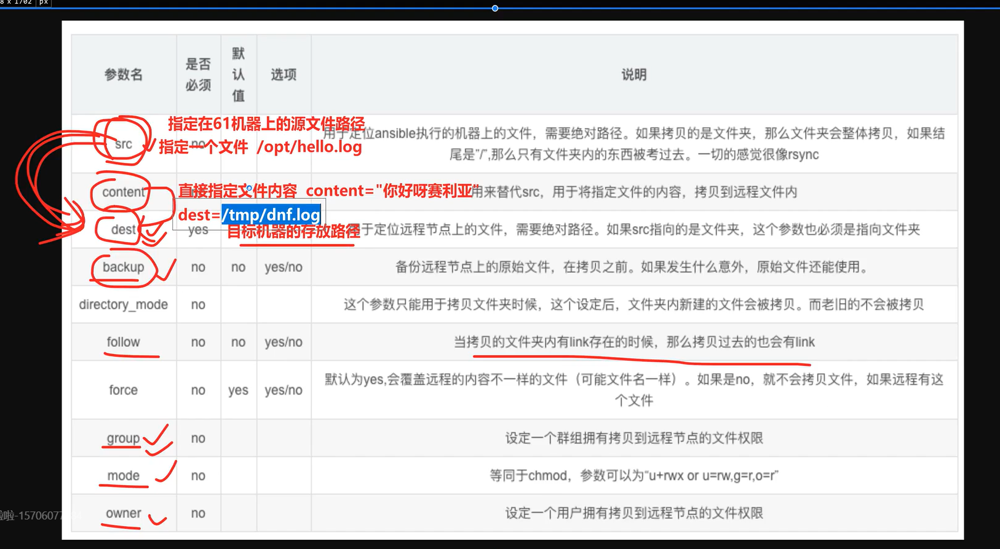
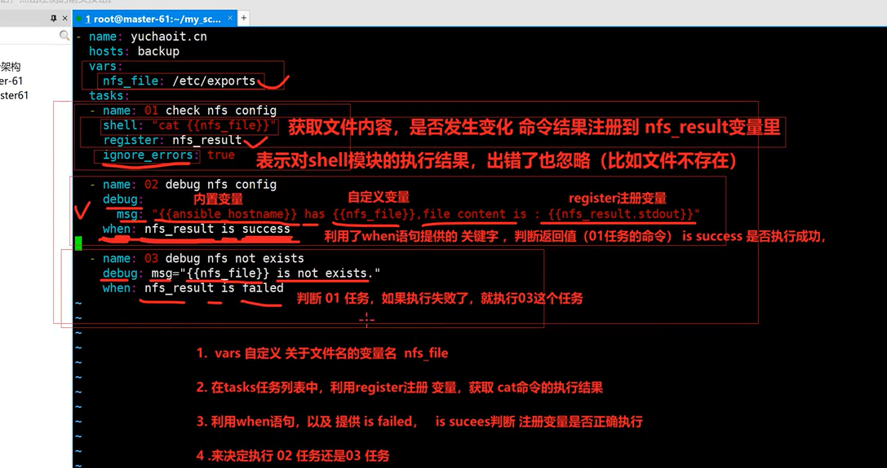

# 网站集群架构

## 01-淘宝十年架构

### 单机架构


***

### 应用服务和数据库分离


***

### 引入本地缓存和分布式缓存


***

### 引入反向代理，负载均衡（集群）


***

### 数据库读写分离


***

### 负载均衡升级


***


## 02-综合架构环境准备

### 简化网卡配置文件

```shell
1.进入内核选择界面时，按上下方向键，取消自动选择
2.输入tab键，复制粘贴进去如下代码

net.ifnames=0 biosdevname=0

3.输入回车，启动

4.请注意，必须是英文，以后再也别用中文了，因为你要看日志

5.只需要修改亚洲上海时区,其他全部默认

6.网络设置、修改静态ip地址、设置主机名

模板机，主机名 yuchao-template-100
ip，10.0.0.100
网关，10.0.0.254
```


```shell
1.删除网卡配置文件中关于ipv4、ipv6的行
[root@yuchao-template-100 ~]# sed -i '/ipv[46]/Id' /etc/sysconfig/network-scripts/ifcfg-eth0 

2.再删除如下四行
proxy_method
browser_only
defroute
uuid

sed -r -i   '/(proxy_method|browser_only|uuid|defroute)/Id' /etc/sysconfig/network-scripts/ifcfg-eth0 

3.上述俩语句，你也可以一行搞定
确保最终的配置如下，和我一样即可

[root@yuchao-template-100 network-scripts]# sed -ri  '/(proxy_method|browser_only|uuid|defroute)/Id' /etc/sysconfig/network-scripts/ifcfg-eth0 

[root@yuchao-template-100 network-scripts]# 
[root@yuchao-template-100 network-scripts]# cat > ifcfg-eth0 << "EOF"
TYPE=Ethernet
BOOTPROTO=none
NAME=eth0
DEVICE=eth0
ONBOOT=yes
IPADDR=10.0.0.100
PREFIX=24
GATEWAY=10.0.0.254
DNS1=223.5.5.5
EOF


4.如果你不这么做，你后续克隆虚拟机，会导致无法上网，必须要删除网卡配置文件的uuid
而且如果你对sed理解不够，你可以直接复制于超老师的这个网卡信息（你能对自己这么低的要求吗？不能！）
```


```shell
[root@yuchao-template-100 network-scripts]# sed -r -e 's#eth0#eth1#g' -e 's#10.0.0.100#172.16.1.100#g' -e 's#10.0.0.254#172.16.1.254#g' ifcfg-eth0 >ifcfg-eth1
[root@yuchao-template-100 network-scripts]# cat > ifcfg-eth1 << "EOF"
TYPE=Ethernet
BOOTPROTO=none
NAME=eth1
DEVICE=eth1
ONBOOT=yes
IPADDR=172.16.1.100
PREFIX=24
EOF

如果sed用的不熟，实在不行，vim去手动改也一样


systemctl restart network

```


### 系统初始化优化

#### 关闭防火墙，selinux

```shell
selinux，内置防护墙
firewalld，iptables，通过程序安装在linux上的软件防火墙


查看selinux状态
getenforce
临时关闭selinux
setenforce 0

永久关闭需要改配置文件
/etc/selinux/config

vim去修改
需要reboot重启

关闭防火墙firewalld，以及清空防火墙规则

清空防火墙规则
iptables -F

关闭firewalld服务，推到所有防火墙大门。所有的链
systemctl stop firewalld
systemctl disable firewalld


```


#### 加速ssh连接

默认ssh连接时，可能比较慢，因为它默认进行了dns解析，关闭这个功能

```shell
修改如下两个参数
grep -Ei '^(usedns|gssapiauth)' /etc/ssh/sshd_config 
GSSAPIAuthentication no
UseDNS no

systemctl restart sshd.service

```


#### 优化PS1变量

```shell
让命令提示符显示的更友好些
export PS1="[\[\e[34;1m\]\u@\[\e[0m\]\[\e[32;1m\]\H\[\e[0m\] \[\e[31;1m\]\w\[\e[0m\]]\\$"

让每一个用户登录该机器都可以使用这个PS1变量
写入
/etc/profile

echo 'export PS1="[\[\e[34;1m\]\u@\[\e[0m\]\[\e[32;1m\]\H\[\e[0m\] \[\e[31;1m\]\w\[\e[0m\]]\\$"' >> /etc/profile

```


#### yum源的优化

```shell
一个新机器无法安装各种软件，，因此配置阿里云的默认仓库，以及epel仓库，可以安装绝大数软件

1.备份旧的默认repo
cd /etc/yum.repos.d/
mkdir bakrepo
mv *.repo bakrepo/

2.下载新的repo，wget在线下载资源
wget -O /etc/yum.repos.d/CentOS-Base.repo https://mirrors.aliyun.com/repo/Centos-7.repo

wget -O /etc/yum.repos.d/epel.repo http://mirrors.aliyun.com/repo/epel-7.repo

wget用不了，因为被cp到bakrepo了
1.用旧的repo文件，先下载wget命令

2.使用本地光盘挂载形式，安装wget命令

3.获取wget的rpm包安装命令

4.linux内置了curl命令，也是发起http请求的命令

curl https://mirrors.aliyun.com/repo/Centos-7.repo > /etc/yum.repos.d/centos-base.repo

curl -o /etc/yum.repos.d/CentOS-Base.repo https://mirrors.aliyun.com/repo/Centos-7.repo


curl -o /etc/yum.repos.d/epel.repo http://mirrors.aliyun.com/repo/epel-7.repo


清楚旧的yum缓存，生成新的缓存
yum clean all && yum makecache

```


#### 安装基础软件

```shell
因为是最小化安装，所以缺少很多基础软件依赖
yum install -y tree wget bash-completion bash-completion-extras lrzsz net-tools sysstat iotop iftop htop unzip telnet ntpdate lsof

```


#### 关闭邮件告警

```shell
你所有的操作，都会被linux内置的邮件服务器记录，不断的写入/var/log的日志文件中，可能会占用磁盘

echo 'unset mailcheck' >> /etc/profile
source /etc/profile
```


#### 配置hosts主机名解析，通过主机名访问不同的机器

```shell
linux机器之间的通信，最底层肯定是ip
还可以通过主机名通信

ip地址    主机名


ping主机名(如果想指定解析到某个IP，得hosts文件里写死)

需要修改hosts文件

cat > /etc/hosts <<EOF
# 外网地址   内网地址     主机名
10.0.0.61  172.16.1.61  master-61
10.0.0.5   172.16.1.5   slb-5
10.0.0.6   172.16.1.6   slb-6
10.0.0.7   172.16.1.7   web-7
10.0.0.8   172.16.1.8   web-8
10.0.0.9   172.16.1.9   web-9
10.0.0.31  172.16.1.31  nfs-31
10.0.0.41  172.16.1.41  rsync-41
10.0.0.51  172.16.1.51  db-51
10.0.0.88  172.16.1.88  gitlab-88
10.0.0.89  172.16.1.89  jenkins-89
EOF

```

```shell

练习下wak

管理机                master-61            10.0.0.61        172.16.1.61          Ansible/zabbix/jumpserver/openvpn        
负载均衡服务器        slb-5                10.0.0.5        172.16.1.5            nginx/keepalived
负载均衡服务器        slb-6                10.0.0.6        172.16.1.6             nginx/keepalived

web服务器            web-7                10.0.0.7        172.16.1.7             nginx/php
web服务器            web-8                10.0.0.8        172.16.1.8            nginx/tomcat
web服务器            web-9                10.0.0.9        172.16.1.9            nginx/php

存储服务器            nfs-31                 10.0.0.31        172.16.1.31         nfs/rsyncd/lsyncd
备份服务器            rsync-41             10.0.0.41        172.16.1.41            nfs/rsyncd/lsyncd

数据库服务器            db-51                10.0.0.51        172.16.1.51            mysql/redis

vim hosts.ip

awk -F ' ' 'BEGIN{print "内网ip","外网IP","主机名","机器作用","机器需要安装哪些软件"}{print $4,$3,$2,$1,$NF}'  hosts.ip | column -t

```


#### 配置时间同步定时任务，确保时间机器正确

```shell
你刚装好的机器，时间是错的

1.检查crontab服务是否运行
systemctl status crond

2.写入定时任务语句
crontab -e

* * * * * /usr/sbin/ntpdate time1.aliyun.com > /dev/null 2>&1

crontab -l

删除
crontab -r

cat /var/spool/cron/root

```


#### 关闭swap

```shell
取消swap功能，不使用从磁盘获取而来的部分内存容量，因为效率太差
swapoff -a

需要关闭swap文件系统开机挂载
cat /etc/fstab
vim /etc/fstab

注释掉就可以
```


### 开发修改IP脚本（克隆操作）

克隆新机器，修改其ip地址

```shell
克隆后的机器ip需要变化
1.eth0和eth1 手动修改网卡配置

2.写脚本，把重复的操作记录为sh脚本，执行该脚本，输入需要变化的部分即可
cat change_nework.sh

read -p "请输入IP主机位：" my_ip
read -p "请输入主机名："  host_name
echo '正在修改网卡配置文件eth0'
sed -i "/IPADDR/s#100#${my_ip}#g"  /etc/sysconfig/network-scripts/ifcfg-eth0
echo '正在修改网卡配置文件eth1'
sed -i "/IPADDR/s#100#${my_ip}#g"  /etc/sysconfig/network-scripts/ifcfg-eth1
echo '网卡配置文件修改完毕'

echo '正在修改主机名'
hostnamectl set-hostname ${host_name}

echo "============================================="
echo "此时的eth0的配置时：" `cat /etc/sysconfig/network-scripts/ifcfg-eth0`

echo "============================================="
echo "此时的eth0的配置时："  `cat /etc/sysconfig/network-scripts/ifcfg-eth1`

echo "当前的主机名是："  `hostname`


```


### 拍摄快照


### 克隆新的虚拟机

克隆好后

bash change_network.sh

reboot

ip a

测试是否可以上网

做好首次快照


### 准备机器

```bash
# 安装界面先按tab，后边输入下边
net.ifnames=0 biosdevname=0

# 修改网卡配置文件
cat > /etc/sysconfig/network-scripts/ifcfg-eth0 << "EOF"
TYPE=Ethernet
BOOTPROTO=none
NAME=eth0
DEVICE=eth0
ONBOOT=yes
IPADDR=10.0.0.101
PREFIX=24
GATEWAY=10.0.0.254
DNS1=223.5.5.5
EOF

cat > /etc/sysconfig/network-scripts/ifcfg-eth1 << "EOF"
TYPE=Ethernet
BOOTPROTO=none
NAME=eth1
DEVICE=eth1
ONBOOT=yes
IPADDR=172.16.1.101
PREFIX=24
EOF

# 关防火墙
vim /etc/selinux/config
SELINUX=disabled

setenforce 0

reboot

iptables -F
systemctl stop firewalld
systemctl disable firewalld

# ssh连接
grep -Ei '^(usedns|gssapiauth)' /etc/ssh/sshd_config 
GSSAPIAuthentication no
UseDNS no

systemctl restart sshd.service

# 修改PS1变量
echo 'export PS1="[\[\e[34;1m\]\u@\[\e[0m\]\[\e[32;1m\]\H\[\e[0m\] \[\e[31;1m\]\w\[\e[0m\]]\\$"' >> /etc/profile

# yum源的优化
curl -o /etc/yum.repos.d/CentOS-Base.repo https://mirrors.aliyun.com/repo/Centos-7.repo
curl -o /etc/yum.repos.d/epel.repo http://mirrors.aliyun.com/repo/epel-7.repo

清楚旧的yum缓存，生成新的缓存
yum clean all && yum makecache

# 安装基础软件
yum install -y tree wget bash-completion bash-completion-extras lrzsz net-tools sysstat iotop iftop htop unzip telnet ntpdate lsof vim

# 关闭邮件告警
echo 'unset mailcheck' >> /etc/profile
source /etc/profile


```


***


## 03-文件共享服务之FTP

***

文件共享服务方案有很多，了解即可

- ftp（简单文件传输服务）
  - 提供用户认证机制
  - 可以输入账号密码
- python -m SimpleHTTPServer
- nginx也提供了文件下载的功能
  - 提供用户认证机制
  - 反向代理，负载均衡
  - web服务器，静态文件服务器的作用
  - 如ftp服务器的作用
- samba(linux和windows之间共享数据)
  - 提供用户认证机制
- nfs（主要用这个）


```
重点学习，工作里用的是
nfs

nginx

平时，简易的快速进行文件下载，下载服务器上的资料
python -m SimpleHTTPServer
```


#### 搭建ftp服务

```shell
1.需要安装vsftpd服务

yum install vsftpd -y

2.修改ftp配置文件，设置账号密码，登录ftp服务器，可以查看某文件夹下的数据资料（共享文件夹）

3.创建一个linux的用户（ftp使用linux的用户信息，不靠谱）
useradd ops01
设置该用户密码
echo '123456' | passwd --stdin ops01

4.修改ftp配置文件，设置用于共享的目录
rpm -ql vsftpd |grep '.conf$'
/etc/vsftpd/vsftpd.conf

4.1 关闭所有的匿名用户功能，不安全
找出和匿名用户相关的配置参数
vim修改
grep '^anonymous'  /etc/vsftpd/vsftpd.conf
anonymous_enable=NO

4.2添加自定义的共享文件夹配置参数，笔记的解释，别写入linux中，写笔记上，否则可能会导致编码不识别，程序出错

直接在文件最低下，添加如下配置
# 配置解释
# local_root=/test_ftp/  指定本地用户的默认数据根目录 
# chroot_local_user=YES 禁锢本地用户的默认数据目录（禁止用户切换到其他目录）
# allow_writeable_chroot=YES 允许ftp用户登录后，可以创建数据

你只需要修改如下三个参数即可
# ftp用户，ops01登录ftp之后，只能看到/test_ftp这个文件夹下的数据
## by myself
local_root=/test_ftp/
chroot_local_user=YES
allow_writeable_chroot=YES


5.创建用于共享的文件夹
mkdir /test_ftp/
touch /test_ftp/lala.png

别忘记修改文件夹的权限，否则无法读取了，修改为刚才自定义的用户

chown -R ops01:ops01 /test_ftp/


6.此时可以重启vsftpd服务
systemctl restart vsftpd
ps -ef|grep vsftpd


```


#### 使用客户端验证ftp的登录，数据查看

```shell
你可以用另一台机器，安装ftp程序，登录vsftpd服务端

yum install ftp -y


登录ftp设备的命令
ftp 机器的ip地址
如

ftp 172.16.1.31
输入账号密码 ops01 123456
进入之后，输入? 查看ftp提供的命令帮助
ftp> pwd  查看当前的ftp目录位置
257 "/"

ftp提供的上传下载
下载功能
ftp> get 
(remote-file) 文杰.png
(local-file) 文杰1.png
local: 文杰1.png remote: 文杰.png
227 Entering Passive Mode (10,0,0,31,149,223).
150 Opening BINARY mode data connection for 文杰.png (0 bytes).
226 Transfer complete.
ftp> 


上传功能
ftp> 
ftp> put
(local-file) /opt/4111111.jpg
(remote-file) 4444444.jpg
local: /opt/4111111.jpg remote: 4444444.jpg
227 Entering Passive Mode (10,0,0,31,185,67).
150 Ok to send data.
226 Transfer complete.

```


## 04-文件共享服务之Samba

### samba服务端的部署

client、server软件的使用，部署流程

```shell
1.安装samba软件
 yum install samba -y
 
2.修改配置文件,依然是设置一个共享文件夹
samba的软件配置文件在
ls /etc/samba/
lmhosts  smb.conf  smb.conf.example

修改 /etc/samba/smb.conf
添加自定义的，共享文件夹的配置

[root@nfs-31 /opt]#tail -7 /etc/samba/smb.conf

[smb_share]
    comment=myself share dir
    path = /my_smb/
    guest ok=no
    public = no
    writable = yes


3.创建共享文件夹
mkdir /my_smb/


4.samba也有用户认证机制，需要通过pdbedit命令设置samba的用户信息
4.1 pdbedit命令是给linux以及存在的用户，设置一个密码
useradd  samba01

4.2 使用pdbedit命令，给samba的用户设置密码
-a 添加smb用户
-u 指定用户名

# 123456
[root@nfs-31 /opt]#pdbedit -a -u samba01
new password:
retype new password:

5.修改smb共享文件夹的权限
chown -R samba01:samba01   /my_smb/

6.给该目录下创建些数据
touch 大胆妖孽-大威天龙.png

7.启动samba服务
systemctl start smb


8.后续你的确需要部署samba服务，如何使用samba？
做哪些后续的学习呢？
说白了，就是学samba的配置文件，里面的参数，是什么功能，就有什么作用
samba是一个软件，所有的功能，都被以配置文件形式定义好了
配置文件是最重要的，控制软件功能的一个文件
程序启动会去读取配置文件中的参数，以打开、关闭不同的功能


9.验证进程、端口
netstat -tunlp|grep smb

ps -ef|grep smb


```


### samb客户端认证

```shell
linux客户端
需要安装工具
yum install samba-client -y


2.使用该命令，连接samba机器即可

smbclient //10.0.0.31/smb_share   -U samba01
# 输入samba01的密码即可
#进入后，输入 ? 查看samba提供的命令，也就是作用


windowos也有客户端
配置比较繁琐
参考图片
http://apecome.com:9494/03%E7%B3%BB%E7%BB%9F%E6%9C%8D%E5%8A%A1%E7%AF%87/pic/151645101550_.pic.jpg

使用 windows的win快捷键+ r，打开运行窗口
访问samba的协议是

\\10.0.0.31\smb_share

此时输入账号密码
samba01
123456


```


## 05-备份工具rsync

### 第1章 Rsync本地模式和远程模式

#### 1.命令说明

纯通过rsync的命令，来实现，数据目录A  拷贝到数据目录B

也就是模拟cp的用法 很简单


```shell
rsync  [选项]  源数据   目的数据

1.安装
yum install rsync -y


2.命令语法，分几个模式


- 本地模式

rsync 参数   源路径  目标路径

rsync  -xxxxx    /var/log    /tmp


- 远程模式，推送方式，把自己的数据推送到另一台机器上（上传）
语法1 ，rsync默认走ssh协议
rsync 参数  源路径  user@ip:目标路径

rsync  -avzP  /var/log/      root@10.0.0.31:/tmp/


语法2
rsync 参数 源路径  user@ip::目标路径


- 远程模式，拉取方式，拉取别人机器的数据到自己的机器上（下载）
rsync  参数   user@ip:源路径   目标路径
rsync  参数   user@ip::源路径目标路径


rsync -avzP  root@10.0.0.31:/var/log/   /tmp/


参数解释
    -v        详细模式输出
    -a        归档模式，递归的方式传输文件，并保持文件的属性，等同于 -rlptgoD
    -r        递归拷贝目录
    -l        保留软链接
    -p        保留原有权限
    -t         保留原有时间（修改）
    -g        保留属组权限
    -o         保留属主权限
    -D        等于--devices  --specials    表示支持b,c,s,p类型的文件
    -R        保留相对路径
    -H        保留硬链接
    -A        保留ACL策略
    -e         指定要执行的远程shell命令
    -E         保留可执行权限
    -X         保留扩展属性信息  a属性


 比较常用的组合参数
 rsync -avzP
-a    保持文件原有属性
-v    显示传输细节情况
-z    对传输数据压缩传输
-P    显示文件传输的进度信息


你在命令行里，执行命令，喜欢看到命令的执行过程 
-avzP

脚本里面？
bash xxx.sh
rsync -az  


```


#### 2.本地模式

```shell
对文件同步
yum install rsync -y
把本地的的/var/log/messages 文件 拷贝到/opt下

拷贝单个文件
rsync -avzP /var/log/messages /opt


拷贝单个大文件，拷贝大文件时，要注意限速，否则占用磁盘IO太多
--bwlimit=10

先生成一个5G文件
dd bs=100M count=50 if=/dev/zero  of=/var/log/my_self.log

rsync -avzP /var/log/my_self.log  /opt

iotop查看磁盘的读写IO情况

限制单个大文件的传输，速度只给他20M每秒

rsync -avzP --bwlimit=20   /var/log/my_self.log  /opt


对目录同步（注意语法的区别）

拷贝后的数据，是否携带该目录本身
rsync -avzP /var/log    /opt

不拷贝该目录本身，拷贝目录下的数据
rsync -avzP /var/log/    /opt

测试文件夹的增量拷贝
[root@rsync-41 ~]#rsync -avzP /test1/   /test2
sending incremental file list

sent 118 bytes  received 12 bytes  260.00 bytes/sec
total size is 0  speedup is 0.00
[root@rsync-41 ~]#
[root@rsync-41 ~]#
[root@rsync-41 ~]#
[root@rsync-41 ~]#echo "123" >/test1/1.png 
[root@rsync-41 ~]#
[root@rsync-41 ~]#rsync -avzP /test1/   /test2
sending incremental file list
1.png
              4 100%    0.00kB/s    0:00:00 (xfr#1, to-chk=4/6)

sent 175 bytes  received 35 bytes  420.00 bytes/sec
total size is 4  speedup is 0.02
[root@rsync-41 ~]#


无差异化拷贝
使用--delete参数 将目标目录的数据清空，保证完全和源目录的数据一致

rsync -azvP --delete  /test1/   /test2/

[root@rsync-41 /test2]#rsync -azvP --delete  /test1/   /test2/
sending incremental file list
deleting 行者孙.png
./
白龙马.png
              0 100%    0.00kB/s    0:00:00 (xfr#1, to-chk=0/12)

sent 269 bytes  received 55 bytes  648.00 bytes/sec
total size is 4  speedup is 0.01
[root@rsync-41 /test2]#
[root@rsync-41 /test2]#
[root@rsync-41 /test2]#ls /test1/
1.png  2.png  3.png  4.png  5.png  孙悟空1  孙悟空2  孙悟空3  孙悟空4  孙悟空5  白龙马.png
[root@rsync-41 /test2]#ls /test2
1.png  2.png  3.png  4.png  5.png  孙悟空1  孙悟空2  孙悟空3  孙悟空4  孙悟空5  白龙马.png


# rsync拷贝文件夹,携带目录本身
# 吧test1目录本身，连带着数据，都拷贝到test2下
rsync -avzP /test1    /test2/
最终会生成
/test2/test1/ 该文件夹的数据，和源数据目录 /test1是一样的


对rsync限速，因为rsync在传输数据时，会占用大量的磁盘IO，以及如果是网络传输的话，占用网络带宽，会导致其他程序受影响

所以rsync这样的备份服务，都是在夜里，凌晨操作，被影响其他程序


--bwlimit


[root@rsync-41 /test2]## 实现 /root  和/tmp 完全一样
[root@rsync-41 /test2]#
[root@rsync-41 /test2]#
[root@rsync-41 /test2]#
[root@rsync-41 /test2]#ls /root  /tmp
/root:
anaconda-ks.cfg  change_network.sh  hello-100.log  hosts.ip  i_am_template-100.log

/tmp:
anaconda-ks.cfg  change_network.sh  hello-100.log  hosts.ip  i_am_template-100.log
[root@rsync-41 /test2]#rsync -avzP --delete  /root/    /tmp/
```


```shell
linux机器本身，数据来回发送

# 以后cp可以放一旁了，用rsync当cp使就行


# /var/log/50G 

cp /var/log/   /tmp/
touch /var/log/new1.file
cp /var/log/   /tmp/


# 用rsync，支持增量备份
# /var/log/50G 

rsync  -avzP /var/log/   /tmp/ 
touch /var/log/new1.file
rsync  -avzP /var/log/   /tmp/ 


```


#### 3.远程模式

把/root下的数据，拷贝到 /tmp下

```shell
把rsync-41   /root下的数据

拷贝到 nfs-31   /tmp下

```


实现如scp的作用


```shell
#PUSH 推送模式，上传模式

把rsync-41   /root下的数据，拷贝到 nfs-31   /tmp下

登录rsync41
用ip形式、再用主机名形式
添加无差异化参数，该参数，慎用！搞清楚了你在做什么！

rsync -avzP  --delete  /root/    root@172.16.1.31:/tmp/
rsync -avzP  --delete  /root/    root@nfs-31:/tmp/
```


​	
​	
​	
​	

```shell
#PULL 拉取模式（你要琢磨，数据最终放在了哪）
# 把rsync-41   /root下的数据，拷贝到 nfs-31   /tmp下

rsync -avzP   root@172.16.1.41:/root/    /tmp/
```


​	

```shell
# 拉取rsync41的/etc/passwd文件到 nfs-31的/opt下，使用主机名通信

rsync -avzP root@rsync-41:/etc/passwd    /opt/
```


​	
​	

	#传输目录注意


​	

```shell
#传输整个目录,包含目录本身

rsync -avzP   root@172.16.1.41:/root    /tmp/
```


​	

```shell
#只传输目录下的文件,不包含目录本身
rsync -avzP   root@172.16.1.41:/root/    /tmp/
```


​	

```shell
#不同主机之间同步数据 --delete
rsync -avzP --delete   root@172.16.1.41:/root    /tmp/

#坑:如果/和一个空目录进行完全同步,那么效果和删根一样
```


​	

```shell
#坑:传输过程不限速导致带宽被占满 ,--bwlimit=50

远程传输 nfs-31下的 /tmp/2G.log   备份到  rsync-41的/opt下

rsync -avzP   /tmp/2G.log   root@172.16.1.41:/opt
```


​	

	-a   保持文件原有属性
	-v   显示传输过程
	-z   压缩传输数据
	-P   显示传输进度


​	

	远程备份文件，且改名
	[root@nfs-31 /tmp]#rsync -avzP   /tmp/2G.log   root@172.16.1.41:/opt/2G.logggggggggggggggggggggg


​	

	远程传输 nfs-31下的 /tmp/2G.log   备份到  rsync-41的/opt下，且是无差异化备份
	等于清空原有/opt下的数据
	
	rsync -avzP --delete   /tmp/2G.log   root@172.16.1.41:/opt/2G.log


### 第2章 Rsync服务模式-服务端配置

#### 0.为什么需要服务模式

​	Rsync 借助 SSH 协议同步数据存在的缺陷:
​	1.使用系统用户（不安全） /etc/passwd
​	2.使用普通用户（会导致权限不足情况）
​	3.守护进程传输方式: rsync 自身非常重要的功能(不使用系统用户，更加安全)

#### 1.安装rsync

```shell
yum install rsync -y
```


#### 2.修改配置文件


复制粘贴如下代码即可

```
cat > /etc/rsyncd.conf << 'EOF'
uid = www 
gid = www 
port = 873
fake super = yes
use chroot = no
max connections = 200
timeout = 600
ignore errors
read only = false
list = false
auth users = rsync_backup
secrets file = /etc/rsync.passwd 
log file = /var/log/rsyncd.log
#####################################
[backup]
comment = yuchaoit.cn about rsync
path = /backup

[data]
comment = this is secord backup dir,to website data..
path = /data
EOF
```


#### 3.创建用户以及数据目录

```shell
根据你的配置文件中定义的信息，创建对应的用户，备份的目录
该无法登录的用户，只是用于运行进程的账户
useradd -u 1000 -M -s /sbin/nologin www

创建配置文件中定义的2个备份目录
mkdir -p /data/   /backup

修改备份目录的权限
chown -R www:www /data/
chown -R www:www /backup/

ll -d /data /backup/
drwxr-xr-x 2 www www 6 Apr 20 11:34 /backup/
drwxr-xr-x 2 www www 6 Apr 20 11:34 /data

```


#### 4.创建rsync专用的账户密码（这一步很重要，有错基本也是来这排查）

````shell
1.创建密码文件，写入账户和密码，用于和客户端连接时候的认证
vim /etc/rsync.passwd

2.写入账户密码
cat /etc/rsync.passwd 
rsync_backup:lalala123

3.待会客户端向rsync服务器推送数据，就得用这个账号密码！！！！


4.这一步，非常重要，rsync要求降低密码文件的权限，且必须是600

chmod 600 /etc/rsync.passwd 

ll /etc/rsync.passwd 
-rw------- 1 root root 23 Apr 20 11:36 /etc/rsync.passwd


````


#### 5.加入开机自启动

```shell
设置rsyncd服务，运行，且开机自启

systemctl start rsyncd


检查rsyncd服务是否运行，以及该服务的运行日志 

[root@rsync-41 ~]#cp /etc/rsyncd.conf.bak /etc/rsyncd.conf
[root@rsync-41 ~]#
[root@rsync-41 ~]#
[root@rsync-41 ~]#systemctl restart rsyncd
[root@rsync-41 ~]#
[root@rsync-41 ~]#systemctl status rsyncd
● rsyncd.service - fast remote file copy program daemon
   Loaded: loaded (/usr/lib/systemd/system/rsyncd.service; disabled; vendor preset: disabled)
   Active: active (running) since Wed 2022-04-20 11:46:57 CST; 4s ago
 Main PID: 6078 (rsync)
   CGroup: /system.slice/rsyncd.service
           └─6078 /usr/bin/rsync --daemon --no-detach

Apr 20 11:46:57 rsync-41 systemd[1]: Started fast remote file copy program daemon.
Apr 20 11:46:57 rsync-41 systemd[1]: Starting fast remote file copy program daemon...
Apr 20 11:46:57 rsync-41 rsyncd[6078]: params.c:Parameter() - Ignoring badly formed line in config file: ignore errors
Apr 20 11:46:57 rsync-41 rsyncd[6078]: rsyncd version 3.1.2 starting, listening on port 873
[root@rsync-41 ~]#
[root@rsync-41 ~]#


systemctl start vsftpd
xxxxxxxxxxxxxxxxxxxxx
xxxxxxxxxxxxxxxxxxxxx

然后该怎么办？看日志
看日志
看日志
看日志
看日志
看日志
如何看？
如何看？
如何看？

思路1，看vsftpd服务指定的日志文件在哪
思路2， 检查是否运行了，以及它的运行日志部分信息
systemctl status vsftpd

检查是否开机运行
systemctl is-enabled vsftpd

```


#### 6.检查服务是否运行

```shell
systemctl status rsyncd


# 无论是学习期间还是上班了，都养成好习惯
# 给别人启动了某程序后，给自己启动某程序
务必去检查，验证是否正确

ps -ef|grep 'rsync' | grep -v 'grep'

root       6078      1  0 11:46 ?        00:00:00 /usr/bin/rsync --daemon --no-detach


netstat -tunlp|grep rsync

tcp        0      0 0.0.0.0:873             0.0.0.0:*               LISTEN      6078/rsync          
tcp6       0      0 :::873                  :::*                    LISTEN      6078/rsync     


```


### 第3章 Rsync服务模式-客户端配置

#### 1.安装rsync

```
yum install rsync -y
```


#### 2.配置密码文件及授权

```
此时rsync客户端，需要把数据推送到rsync服务端
但是需要账户认证，这个账户密码，是服务端指定好的
回头去看笔记
rsync_backup
lalala123

客户端需要做的操作有2个，提供密码认证

1. 生成密码文件，每次连接都指定这个密码文件

2. 生成密码变量，让当前系统中存在叫做 RSYNC_PASSWORD 这个变量，以及变量的值，是配置文件中的密码即可


```

##### 进行客户端数据发送

下载，服务端rsync-41的数据


rsync_backup
lalala123


推送，备份，发送nfs-31的数据发给rsync-41

```shell
把客户端的数据，发送给服务端的backup备份模块下

语法，不一样了，注意语法的写法！！！

生成200M文件
dd bs=100M count=2 if=/dev/zero of=/tmp/200M.log

把客户端的 /tmp/200M.log 备份，发送到rsync-41机器上的 backup模块下

rsync -avzP   /tmp/200M.log  账户@主机名::模块名

# 默认无密码变量，也无密码文件，需要你自己输入该rsync_backup虚拟用户的密码
# 需要交互式的输入密码，无法再脚本中使用rsync同步命令
# rsync基本都是和脚本结合使用
rsync -avzP   /tmp/200M.log  rsync_backup@rsync-41::backup


非交互式密码的操作，如下2个方法
1. 生成密码文件，每次连接都指定这个密码文件（在客户端生成）

echo 'lalala123'  > /etc/my_rsync.pwd
还必须降低密码文件的权限才行，必须是600
chmod 600 /etc/my_rsync.pwd

此时可以传输数据了，往data模块下传输
rsync -avzP  --password-file=/etc/my_rsync.pwd   /tmp/200M.log  rsync_backup@rsync-41::data

如果是脚本中的话，去掉vP显示过程的参数去掉
rsync -az  --password-file=/etc/my_rsync.pwd   /tmp/200M.log  rsync_backup@rsync-41::data


2. 生成密码变量，让当前系统中存在叫做 RSYNC_PASSWORD 这个变量，以及变量的值，是配置文件中的密码即可
export RSYNC_PASSWORD='lalala123'


rsync -avzP    /tmp/200M.log  rsync_backup@rsync-41::backup

```

##### 下载备份服务器的数据

```shell
rsync -avzP rsync_backup@rsync-41::backup   /tmp/

要输入密码
1.的确没指定密码文件
2.是否有密码变量呢？

如何需要输入密码呢？
撤销这个密码变量
unset RSYNC_PASSWORD
或者重新登录，只要密码变量失效，就必须得输入密码了，或者使用密码文件


rsync -avzP rsync_backup@rsync-41::backup   /tmp/

非交互式的密码认证方式
1，使用密码变量
export RSYNC_PASSWORD='chaoge666'

2.指定密码文件

rsync -avzP --password-file=/etc/my_rsync.pwd  rsync_backup@rsync-41::backup   /tmp/


rsync -avzP password-file=/etc/my_rsync.pwd  rsync_backup@rsync-41::backup/222222222.log   /tmp/
```


##### 关于rsync的常见错误

rsync由于配置步骤比较细节，比较坑比较多，你可能会遇见各种错误

遇见错误如何排查？

###### Rsync服务端排错思路

1. 检查rsync服务端的配置文件路径是否正确：`/etc/rsyncd.conf`
2. 查看配置文件的`host allow`,`host deny`允许的ip网段是否允许客户端访问
3. 查看配置文件中的path参数路径是否存在，权限是否正确（和配置文件的UUID参数对应）
4. 查看rsync服务是否启动，端口、进程是否存活
5. 查看iptables防火墙、selinux是否允许rsync服务通过，或是关闭
6. 查看服务端rsync配置文件的密码文件，权限是否600，格式，语法是否正确，且和配置文件的`secrect files`参数对应
7. 如果是推送数据，要查看配置rsyncd.conf中的用户对该`rsync模块`下的文件是否可以读取

###### Rsync客户端排错

1. 查看rsync客户端配置的密码文件权限是否600，密码文件格式是否正确，是否和服务端的密码一致
2. 尝试telnet连接rsync服务端的`873`端口，检测服务是否可以连接
3. 客户端执行命令语法要检查，细心


## 06-备份任务实战

### 客户端需求

```
客户端需求：
1.客户端每天凌晨1点在服务器本地打包备份(/etc目录和/var/log目录) 
2.客户端备份的数据必须存放至以 "主机名_ip地址_当前时间" 命名的目录中 
3.客户端最后通过rsync推送本地已经打包好的备份文件至backup服务器 
4.客户端服务器本地保留最近7天的数据，避免浪费磁盘空间
```


### 服务端需求

```
服务端需求：
1.服务端部署rsync,用于接收客户端推送过来的备份数据 
2.服务端需要每天校验客户端推送过来的数据是否完整 
3.服务端需要每天校验的结果通知给管理员 
4.服务端仅保留6个月的备份数据,其余的全部删除 

```


注意:所有服务器的备份目录必须都为/momo


### 客户端需求拆解

先把大需求，拆分为每一个小需求，思考出解决办法，然后再综合操作，也可以写成脚本，最后定时任务，可以执行该脚本，完成这一系列的需求要求的操作


#### 1.打包备份

客户端每天凌晨1点在服务器本地打包备份(/etc目录和/var/log目录)

以后见到需求，某任务，要写入定时任务

- 把其他所有的事全搞定了，最后再去写入定时任务


```shell
- 注意tar命令打包，尽量以相对路径去打包
- /etc目录是为了备份系统配置文件、应用配置文件
- /var/log是为了备份所有应用程序的日志


1.需求是创建/backup目录
mkdir -p /backup

/etc
/var/log


cd / && tar -zcf /backup/etc.tgz  etc
cd / && tar -zcf /backup/log.tgz  var/log

ls /backup/ -lh
total 11M
-rw-r--r-- 1 root root 9.4M Apr 21 12:03 etc.tgz
-rw-r--r-- 1 root root 698K Apr 21 12:04 log.tgz
```


#### 2.文件夹命名要求

客户端备份的数据必须存放至以`"主机名_ip地址_当前时间"`命名的目录中

期望的结果是，如`nfs-31_10.0.0.31_2024-04-22`


```shell
1.提取主机名
$(hostname)
`hostname`

2.提取ip地址

$(ifconfig eth0 | awk 'NR==2{print $2}')

3.时间设置
$(date "+%F")


4.拼接在一起，文件夹命名的命令如下
mkdir -p /backup/$(hostname)_$(ifconfig eth0 | awk 'NR==2{print $2}')_$(date "+%F")


5.创建文件夹，你也可以用内网ip操作
要求，在备份目录下，创建以格式要求的文件夹

mkdir -p /backup/$(hostname)_$(ifconfig eth0 | awk 'NR==2{print $2}')_$(date "+%F")

6.检查最终的客户端备份目录

ls /backup

7.备份的etc和log数据，得在这个目录中
cd / && tar -zcf /backup/$(hostname)_$(ifconfig eth0 | awk 'NR==2{print $2}')_$(date "+%F")/etc.tgz  etc


cd / && tar -zcf /backup/$(hostname)_$(ifconfig eth0 | awk 'NR==2{print $2}')_$(date "+%F")/log.tgz  var/log

```


#### 3.文件传输

3.客户端最后通过rsync命令推送本地已经打包好的备份文件至rsyncd服务器

```shell
需求，把/backup目录下的数据，发给备份服务器
# 去看rsync服务端提供的账户密码
cat /etc/rsyncd.conf 

# 客户端还得添加密码
export RSYNC_PASSWORD=momo666


rsync  -avzP   /backup/     momo01@10.0.0.41::momo_data


```

#### 4.删除过期文件

客户端服务器本地保留最近7天的数据，避免浪费磁盘空间

```
find  /backup  -type f -mtime +7 -delete
```

#### 5.整合脚本

把客户端的所有部署操作，写成脚本，待会交给定时任务执行即可


把上述拆解的过程，写成一个脚本、批量执行。

当然这个脚本还可以有多的优化

```shell
#!/bin/bash

# 主动在脚本中，定义path变量，防止命令无法执行
PATH=/usr/local/sbin:/usr/local/bin:/usr/sbin:/usr/bin:/root/bin

# 1.创建目录，注意目录名字规则
mkdir -p /backup/$(hostname)_$(ifconfig eth0 | awk 'NR==2{print $2}')_$(date "+%F")

# 2.打包备份数据
cd / && tar -zcf /backup/$(hostname)_$(ifconfig eth0 | awk 'NR==2{print $2}')_$(date "+%F")/etc.tgz  etc

cd / && tar -zcf /backup/$(hostname)_$(ifconfig eth0 | awk 'NR==2{print $2}')_$(date "+%F")/log.tgz  var/log


# 2.1 对数据进行校验，生成校验值的文件
md5sum /backup/$(hostname)_$(ifconfig eth0 | awk 'NR==2{print $2}')_$(date "+%F")/*.tgz > /backup/$(hostname)_$(ifconfig eth0 | awk 'NR==2{print $2}')_$(date "+%F")/all_data_md5.txt


# 3.传输客户端备份数据到，rsync备份服务器上，别忘记是如何验证密码的
export RSYNC_PASSWORD=momo666
rsync  -avzP   /backup/     momo01@10.0.0.41::momo_data


# 4.删除过期文件
find  /backup  -type f -mtime +7 -delete


```

#### 6.调试脚本

只显示执行过程，而不会真的执行，发生修改，用于调试程序 -x参数

shell提供了-x参数，能让你看到脚本执行过程，用于调试脚本，不会真的产生数据变动，只会看到执行的过程日志

```
bash -x my_rsync.sh
```

#### 7.定时任务

```shell
1.确保crond是否运行
systemctl status crond

2.写定时任务语句
crontab -e 

* *  * * * /bin/bash /my_rsync.sh 

3.定时任务，最后再去执行


```


***


### 服务端需求拆解

#### 1.脚本化部署rsyncd服务端

服务端部署rsyncd服务用于接收客户端推送过来的备份数据

```shell
配置rsyncd服务端的的全流程，也可以写成脚本，一键安装了

# 1.安装rsync服务
yum install rsync -y

# 2.写配置文件
cat > /etc/rsyncd.conf <<EOF
uid = www 
gid = www 
port = 873
fake super = yes
use chroot = no
max connections = 200
timeout = 600
ignore errors
read only = false
list = false
auth users = momo01
secrets file = /etc/rsync.momo 
log file = /var/log/rsyncd.log
#####################################
[momo_data]
comment = yuchaoit.cn about rsync
path = /momo/

[momo_data2]
comment = this is secord backup dir,to website data..
path = /momo2

EOF

# 3.创建配置文件定义的信息
mkdir -p /{momo,momo2}
chown -R www.www  /momo
chown -R www.www  /momo2

touch /etc/rsync.momo 
chmod 600 /etc/rsync.momo 

# 4.创建用于连接的账户密码
echo "momo01:momo666" > /etc/rsync.momo 


# 5. 重启服务
systemctl restart rsyncd

```

##### 1.1 修改服务端的rsync安装为脚本

```shell
install_rsync.sh

#!/bin/bash
# 1.安装rsync服务
yum install rsync -y

# 2.写配置文件
cat > /etc/rsyncd.conf <<EOF
uid = www 
gid = www 
port = 873
fake super = yes
use chroot = no
max connections = 200
timeout = 600
ignore errors
read only = false
list = false
auth users = momo01
secrets file = /etc/rsync.momo 
log file = /var/log/rsyncd.log
#####################################
[momo_data]
comment = yuchaoit.cn about rsync
path = /momo/

[momo_data2]
comment = this is secord backup dir,to website data..
path = /momo2

EOF

# 3.创建配置文件定义的信息
mkdir -p /{momo,momo2}
chown -R www.www  /momo
chown -R www.www  /momo2

touch /etc/rsync.momo 
chmod 600 /etc/rsync.momo 

# 4.创建用于连接的账户密码
echo "momo01:momo666" > /etc/rsync.momo 


# 5. 重启服务
systemctl restart rsyncd

```

给脚本添加执行权限

```shell
chmod u+x install_rsync.sh

./install_rsync.sh

```


#### 2.校验数据完整性

服务端需要每天校验客户端推送过来的数据是否完整

```shell
客户端先生成校验信息,回头改脚本

md5sum -c /momo/nfs-31_10.0.0.31_2024-04-22/all_data_md5.txt
```


#### 3.邮件通知

让脚本执行的结果，告诉运维，它正确的执行了，数据备份也是没问题的

如果有问题，运维看到邮件也会立即去处理了

运维在公司里，每天第一件事就打开邮箱，看看其他组的同事是否发来的故障邮件，然后根据邮件解决问题，回复邮件。


服务端需要每天校验的结果通知给管理员

这里你就照抄就好，固定步骤而已，更换为你自己的qq邮箱即可

然后需要打开qq邮箱的smtp服务器的授权码，自己去获取

注意授权码别泄露给别人


```shell
#1.安装配置mailx：
yum install mailx -y

#2.邮箱配置文件，给你的自己的信息
利用的邮箱的smtp协议，需要打开你的qq，163邮箱的smtp功能即可
如下的信息，改为你自己的即可
邮箱的授权码，需要自己去获取


cat > /etc/mail.rc << 'EOF' 
set from=2366993844@qq.com
set smtp=smtps://smtp.qq.com:465
set smtp-auth-user=2366993844@qq.com
set smtp-auth-password=cbdyiplucxxqeadd
set smtp-auth=login
set ssl-verify=ignore
set nss-config-dir=/etc/pki/nssdb/
EOF


#3.服务端生成备份数据的校验结果文件，吧这些信息发个邮件发给运维的邮箱
md5sum -c /momo/nfs-31_10.0.0.31_2024-04-22/all_data_md5.txt > /momo/nfs-31_10.0.0.31_2024-04-22/check_md5_result.txt


#4.校验发送命令，把校验结果，发给于超老师的qq邮箱
# 语法 mail -s "邮件主题" 邮箱 < 邮件正文


mail -s "check-rsync-$(date +%F)" 2366993844@qq.com < /momo/nfs-31_10.0.0.31_2024-04-22/check_md5_result.txt

```


#### 4.过期文件删除

服务端仅保留6个月的备份数据,其余的全部删除

```shell
find /momo -type f -mtime +180 -delete
```


### 客户端的调整操作

```
# 决定修改客户端的备份数据目录 得修改脚本吧
sed -i 's#backup#momo#g'  my_rsync.sh 

执行脚本，看是否正确

#bash /my_rsync.sh 
```

### 服务端调整操作

```
数据校验
md5sum -c /momo/nfs-31_10.0.0.31_2024-04-22/all_data_md5.txt 

/momo/nfs-31_10.0.0.31_2022-04-21/etc.tgz: OK
/momo/nfs-31_10.0.0.31_2022-04-21/log.tgz: OK


```


### 整合服务端，客户端的脚本，写入定时任务

注意先后顺序

先客户端

再服务端


#### 客户端

写入定时任务

```shell
每分钟，执行脚本，进行数据备份，传输给rsync服务器

* * * * *  /bash /root/my_rsync.sh
```


#### 服务端

```shell
vim   my_rsync_server.sh

#!/bin/bash
# 1. 对备份的数据校验，生成校验文件
md5sum -c /momo/nfs-31_10.0.0.31_$(date "+%F")/all_data_md5.txt  > /momo/nfs-31_10.0.0.31_$(date "+%F")/check_md5_result.txt

# 2.发邮件
mail -s "check-rsync-$(date +%F)" 2366993844@qq.com < /momo/nfs-31_10.0.0.31_$(date "+%F")/check_md5_result.txt

#3.删除旧资料
find /momo -type f -mtime +180 -delete

```

写入定时任务

```
* * * * * /bin/bash  /root/my_rsync_server.sh
```


## 07-共享存储服务NFS

### 机器准备

```shell
nfs服务端   nfs-31


多个nfs客户端    web-7

最终完成效果

让web-7 可以读写 nfs共享的静态文件数据
```


### NFS服务段部署


```shell
默认配置文件路径是/etc/exports

exports配置文件语法

NFS共享目录  NFS客户端地址(参数1、参数2...) 客户点地址2（参数1、参数2...）

例如
/        hostname1(rw)  hostname2(rw,no_root_squash)
/pub   *(rw)
/home/chao   123.206.16.61(ro)

参数解释
1.NFS共享目录：为NFS服务器要共享的实际目录，必须绝对路径，注意目录的本地权限，如果要读写共享，要让本地目录可以被NFS客户端的(nfsnobody)读写

2.NFS客户端地址，也就是NFS服务器端授权可以访问共享目录的客户端地址，详见下表

3.权限参数，对授权的NFS客户端访问权限设置，见下表
```

| 客户端地址         | 具体地址         | 说明                                                         |
| ------------------ | ---------------- | ------------------------------------------------------------ |
| 单一客户端         | 192.168.178.142  | 用的少                                                       |
| 整个网段           | 192.168.178.0/24 | 24表示子网掩码255.255.255.0，指定网段，用的较多192.168.178.1~ 192.168.178.254   张老三 192.168.178.54 |
| 授权域名客户端     | nfs.yuchaoit.cn  | 弃用                                                         |
| 授权整个域名客户端 | *.yuchaoit.cn    | 弃用                                                         |


```shell
1.准备好nfs服务端机器

2.安装nfs工具包
yum install nfs-utils rpcbind -y


3.修改配置文件，填写为你需要的共享参数即可
先学学该软件的配置文件语法，每一个软件的配置文件语法，可能都不相同

cat /etc/exports

需要你填入如下配置，定义共享文件，以及限定访问的ip主机，以及共享的参数，权限设置

4. 设置一个共享 /nfs-data文件夹，运行172.16.1.0局域网内的用户可以访问，权限是只读

mkdir  /nfs-data

vim /etc/exports
这里需要添加参数，让挂载后的客户端，身份改为匿名用户，降低权限，以及设置对应的读写权限

/nfs-data  172.16.1.0/24(rw,sync,)


5.注意要先启动rpcbind服务
确保如下2个进程都运行，rpc服务才正常，如果想停止rpc服务，也是关闭这俩进程

rpcbind.service
rpcbind.socket


systemctl start rpcbind.service
systemctl start rpcbind.socket


6.运行nfs服务 ，每次重启nfs，nfs端口号，不断变化中
systemctl start nfs


7.检查nfs共享的情况
showmount -e 172.16.1.31

Export list for 172.16.1.31:
/nfs-data 172.16.1.0/24

创建测试数据
touch /nfs-data/你好啊赛利亚

8.客户端可以去挂载使用了


9.修改服务端的nfs配置文件，允许读写操作
root_squash 这个参数，就是将客户端机器在nfs中创建的数据，用于改为nfsnobody

cat /etc/exports

/nfs-data  172.16.1.0/24(rw,root_squash)


还需要修改该共享文件夹的权限
chown -R nfsnobody:nfsnobody  /nfs-data

10.nfs配置文件修改或，无需重启，使用重新加载，方式NFS端口号再次变化
方法1
systemctl reload  nfs

方法2，更新nfs的配置文件设置
exportfs -r

```


#### 关于nfs挂载参数所有解释

```shell
ro 只读
rw 读写
root_squash 当nfs客户端以root访问时，它的权限映射为NFS服务端的匿名用户，它的用户ID/GID会变成nfsnobody
no_root_squash 同上，但映射客户端的root为服务器的root，不安全，避免使用
all_squash 所有nfs客户端用户映射为匿名用户，生产常用参数，降低用户权限，增大安全性。
sync 数据同步写入到内存与硬盘，优点数据安全，缺点性能较差
async 数据写入到内存，再写入硬盘，效率高，但可能内存数据会丢


/etc/exports  man 5 exports

共享目录        共享选项
/nfs/share      *(ro,sync)

共享主机：
*   ：代表所有主机
192.168.0.0/24：代表共享给某个网段
192.168.0.0/24(rw) 192.168.1.0/24(ro) :代表共享给不同网段
192.168.0.254：共享给某个IP
*.yuchaoit.cn:代表共享给某个域下的所有主机

共享选项：
ro：只读，不常用
rw：读写
sync：实时同步，直接写入磁盘
async：异步，先缓存在内存再同步磁盘
anonuid：设置访问nfs服务的用户的uid，uid需要在/etc/passwd中存在
anongid：设置访问nfs服务的用户的gid
root_squash ：默认选项 root用户创建的文件的属主和属组都变成nfsnobody,其他人nfs-server端是它自己，client端是nobody。
no_root_squash：root用户创建的文件属主和属组还是root，其他人server端是它自己uid，client端是nobody。
all_squash： 不管是root还是其他普通用户创建的文件的属主和属组都是nfsnobody

说明：
请用如下的参数，即可，生产环境用这个

anonuid和anongid参数和all_squash一起使用。

all_squash表示不管是root还是其他普通用户从客户端所创建的文件在服务器端的拥有者和所属组都是nfsnobody；服务端为了对文件做相应管理，可以设置anonuid和anongid进而指定文件的拥有者和所属组


```


### NFS客户端部署

```shell
yum install nfs-utils rpcbind -y

1.查看机器的挂载情况
mount -l

2. 查看磁盘分区挂载情况
df -h


3.挂载nfs，查看nfs

mkdir /test-nfs

mount -t nfs  172.16.1.31:/nfs-data  /test-nfs

df -h

4.尝试读写数据
ls /test-nfs

touch /test-nfs/hello.log  # 发现没有权限


5.更新nfs服务端的读写权限后，再次测试数据操作


[root@web-7 ~]#
[root@web-7 ~]#touch /test-nfs/可以了吗
[root@web-7 ~]#
[root@web-7 ~]#ll /test-nfs/ 
total 0
-rw-r--r-- 1 nfsnobody nfsnobody 0 Apr 22 10:58 你好啊赛利亚
-rw-r--r-- 1 nfsnobody nfsnobody 0 Apr 22 11:12 可以了吗
[root@web-7 ~]#
[root@web-7 ~]#
[root@web-7 ~]#echo "今天又是氪金的一天" >> /test-nfs/你好啊赛利亚 
[root@web-7 ~]#
[root@web-7 ~]#
[root@web-7 ~]#cat /test-nfs/你好啊赛利亚 
今天又是氪金的一天
[root@web-7 ~]#cat /test-nfs/你好啊赛利亚 
今天又是氪金的一天
冲他个十万吧 勇士


```


### NFS练习

##### 服务端

```shell
#!/bin/bash

# 1. 下载软件
yum install nfs-utils rpcbind -y

# 2. 创建共享目录，修改配置文件

mkdir /ops_data
mkdir /dev_data

cat >> /etc/exports << EOF
/ops_data   172.16.1.0/24(rw,root_squash)
/dev_data   172.16.1.0/24(ro,root_squash)
EOF


chown -R nfsnobody:nfsnobody  /ops-data
chown -R nfsnobody:nfsnobody  /dev-data

# 3. 需要先启动rpc服务
systemctl start rpcbind.service
systemctl start rpcbind.socket

# 4. 在启动nfs服务
systemctl start nfs


```

记得检查NFS是否正常共享

```shell
showmount -e 172.16.1.31
```


##### 客户端

```shell
# 1. 创建本地目录，并挂载nfs共享目录

mkdir /test_ops
mkdir /test_dev

mount -t nfs 172.16.1.31:/dev_data /test_dev

mount -t nfs 172.16.1.31:/ops_data /test_ops

测试


```


### NFS结合nginx实现共享存储

- 安装部署nfs服务端

- 生产环境下的参数rw,sync,all_squash,anonuid,anongid

````
rw,sync,


all_squash ,将web-7的任意用户root,bob01,，在该共享目录下的操作，全部改为nfsnobody以实现权限控制

web-7   /test-nfs   172.16.1.31:/nfs-data  

无论是root去读写 /test-nfs
还是bob01读写 /test-nfs

创建的数据，都会被改为user，group都是 默认的nfsnobody


anonuid=id号


anongid=

集合这俩参数，就可以限制在 该nfs共享目录下的所有用户操作，统一被限制为了某个指定的用户


````


#### 图解这个需求


#### 客户端

```shell

# 1. 添加指定用户
useradd  www -u 1500 -M -s /sbin/nologin

# 2. 下载nginx
yum install nginx -y

# 2.1 修改配置文件修改nginx配置文件，指定是www用户运行
vim /etc/nginx/nginx.conf
修改如下
user www;

# 2.2 启动nginx
systemctl start nginx

# 2.3 查看nginx进程
ps -ef | grep nginx

# 3. 挂载nginx目录
mount -t nfs 172.16.1.31:/nfs-nginx  /usr/share/nginx/html

# 4. 编写测试数据
下载图片
wget -O  /usr/share/nginx/html/liyunlong.jpg  https://inews.gtimg.com/newsapp_bt/0/8823765779/1000


vim /usr/share/nginx/html/index.html

<meta charset=utf-8>
把我李云龙的意大利炮拿来


测试成功

```


#### 服务端

```shell
# 1. 添加用户及共享目录
useradd  www -u 1500 -M -s /sbin/nologin

mkdir /nfs-nginx

chown -R www:www /nfs-nginx

# 2. 修改nfs配置文件
vim /etc/exports

/nfs-nginx 172.16.1.7(rw,sync,all_squash,anonuid=1500,anongid=1500)

# 3. 重新加载nfs服务
systemctl reload nfs

exportfs -r

回客户端挂载#3开始

```


#### 课程写法

```shell
任务需求
1.nginx的启动用户必须是www，uid是 1500，不允许登录

useradd  www -u 1500 -M -s /sbin/nologin

1.0 安装nginx
yum install nginx -y

1.1 修改nginx配置文件，指定是www用户运行
vim /etc/nginx/nginx.conf
修改如下
user www;


1.2 启动nginx
systemctl start nginx 

1.3 检查nginx进程
[root@web-7 ~]#ps -ef|grep nginx
root       5038      1  0 12:07 ?        00:00:00 nginx: master process /usr/sbin/nginx
www        5040   5038  0 12:07 ?        00:00:00 nginx: worker process


2.nfs共享存储用户也是www，uid是 1500，不允许登录，允许读写

修改nfs配置文件如下，限定客户端在该目录中的操作，权限都被转化为www用户

限制nginx机器才能访问

[root@nfs-31 ~]#mkdir /nfs-nginx
[root@nfs-31 ~]#useradd  www -u 1500 -M -s /sbin/nologin

修改配置文件
[root@nfs-31 ~]#cat /etc/exports
/nfs-data *(rw,all_squash)


/nfs-nginx     172.16.1.7(rw,sync,all_squash,anonuid=1500,anongid=1500)

3.重新加载nfs（reload是针对已经有进程在运行了，重新读取配置文件）
你是新安装的机器nfs，还能reload吗？

systemctl reload nfs

4.修改共享目录的属主、属组为www
[root@nfs-31 /nfs-nginx]#chown -R www.www /nfs-nginx/
[root@nfs-31 /nfs-nginx]#ll -d /nfs-nginx/
drwxr-xr-x 2 www www 6 Apr 22 12:09 /nfs-nginx/


3.nginx网站可以正常读写共享存储资料
先挂载nfs
mount -t nfs 172.16.1.31:/nfs-nginx /usr/share/nginx/html/

[root@web-7 ~]#df -h |grep nginx
172.16.1.31:/nfs-nginx    17G  1.6G   16G  10% /usr/share/nginx/html


客户端生成网页，和图片等静态资源，查看是否写入到NFS服务端
[root@web-7 ~]#vim /usr/share/nginx/html/index.html


模拟用普通用户，到该nginx目录下，生成一个数据图片
[client01@web-7 /usr/share/nginx/html]$wget -O  /usr/share/nginx/html/liyunlong.jpg  https://inews.gtimg.com/newsapp_bt/0/8823765779/1000

4.修改nginx网页，加载该用户自己创建的图片信息吗
[client01@web-7 /usr/share/nginx/html]$cat index.html 
<meta charset=utf-8>
把我李云龙的意大利炮拿来


5.模拟用户访问该nginx网站
http://10.0.0.7/


```


#### NFS故障案例

1.客户端未挂载NFS

```shell
[root@web-7 ~]#
[root@web-7 ~]#umount /usr/share/nginx/html
[root@web-7 ~]#


重新挂载
mount -t nfs 172.16.1.31:/nfs-nginx /usr/share/nginx/html/

```

2.服务端出问题，。nfs挂了

导致nginx页面卡死，nginx网页目录操作也都卡死

此时明确了共享存储出问题了

去共享存储NFS服务器上找原因 

```shell
发现nfs挂了，重启即可
systemctl restart nfs
```

3.nfs修复后，客户端的挂载可以恢复


4.如果真的nfs死机了，且暂时无法恢复，你还得快速恢复网站的业务，可以强制取消挂载

```shell
使用强制卸载参数
，先看看挂载了什么

mount -l |grep nfs

umount -fl 挂载点  # 取消挂载即可

然后最终还是要以恢复NFS为主

```


####  查看服务端nfs共享文件夹权限

```shell
cat /var/lib/nfs/etab
```


nfs权限讲解


```shell
服务端验证客户端的读写，执行操作权限

# 1. 配置文件的权限
/etc/exports

ro,rw

# 2. 共享目录的权限
比如 /test_nfs   权限700   属主和属组 leo:leo
这样的话对于客户端来说，root和bob01其实都属于other用户
是没有任何操作权限的


```


## 08-实时同步数据


### nginx+nfs+rsync+shell

咱们接下来一整套的练习 都会围绕着nfs nginx rsync备份架构，不断升级

从手动部署

到shell一键部署

到基于ssh免密登录远程部署

到ansible批量自动化部署

因此你必须从手动部署这一环节就下功夫，务必搞懂，否则紧接而来的升级玩法，你可不能掉队

#### 练习题

完成练习（能做多少是多少）

- inotify + rsync实时同步
- sersync + rsync实时同步 
- lsyncd + rsync实时同步 

#### 实战小项目

三台机器

- web-7  （1.web-7的网页根目录数据来自于nfs共享目录/nfs-nginx-data/ ，要求该目录下的所有用户映射为www（uid=11111），允许读写）
- nfs-31 （2.在web-7的nginx网站根目录下创建首页文件后，触发实时同步，备份到rsync-41机器上）
- rsync-41 （3.数据备份服务器）


### 先准备部署rsyncd服务环境

#### Backup服务器（rsync服务端）

```shell
#!/bin/bash

yum install rsync -y

cat > /etc/rsyncd.conf <<EOF
uid = www 
gid = www 
port = 873
fake super = yes
use chroot = no
max connections = 200
timeout = 600
ignore errors
read only = false
list = false
auth users = rsync_backup
secrets file = /etc/rsync.passwd 
log file = /var/log/rsyncd.log
#####################################
[backup]
comment = leo rsync backup
path = /backup
EOF

useradd -u 1000 -M -s /sbin/nologin www

mkdir -p /backup
chown -R www.www  /backup

touch /etc/rsync.passwd
chmod 600 /etc/rsync.passwd

echo "rsync_backup:leo666" > /etc/rsync.passwd 

systemctl restart rsyncd

```


#### dev服务器部署（rsync客户端）

```shell
密码配置文件或密码变量

export RSYNC_PASSWORD='leo666'
```


### 准备部署inotify-tools软件（nfs-31机器）


#### **内核检查**

```shell
uname -r


还有内核参数检查，
本质上是linux支持inotify机制
在性能还可以优化，支持更高的文件并发数
#检测多少个文件 ，文件内容大量的发生变化，inotify机制能同时检测多少文件 
这个参数的优化，就是调整linux的几个文件
ls -l /proc/sys/fs/inotify/

-rw-r--r-- 1 root root 0 Apr 20 20:08 max_queued_events
-rw-r--r-- 1 root root 0 Apr 20 20:08 max_user_instances
-rw-r--r-- 1 root root 0 Apr 20 20:08 max_user_watches

系统文件解释
max_user_watches:    设置inotifywait或inotifywatch命令可以监视的文件数量（单进程）
默认只能监控8192个文件

max_user_instances:    设置每个用户可以运行的inotifywait或inotifywatch命令的进程数
默认每个用户可以开启inotify服务128个进程

max_queued_events:    设置inotify实例事件（event）队列可容纳的事件数量
默认监控事件队列长度为16384


inotify-tools 系统自带的比较low的工具

sersync 金山云的运维通过c++开发的工具

lsyncd三个工具  最新的，目前有人在用，适用于大规模服务器环境的工具
这些工具就3件事
1.优化，调整了这3文件的参数
2.检测某个目录
3.触发rsync命令

```


#### **安装inotify-tools工具**

```shell
yum install inotify-tools -y


rpm -ql inotify-tools |head -2

/usr/bin/inotifywait
/usr/bin/inotifywatch

```


#### Inotifywait详解

上述操作我们安装好了Inotify-tools软件，生成2个重要的命令

inotifywait：在被监控的目录等待特定文件系统事件（open、close、delete等事件），执行后处于阻塞状态，适合在Shell脚本中使用，是实现监控的关键
Inotifywatch：收集被监控的文件系统使用的统计数据（文件系统事件发生的次数统计）


#### inotifywait实践


所有事件，任意的linux命令，只要对该目录的数据，对文件发生了修改动作，都会被检测到

```shell
mkdir /nfs-data

inotifywait -mrq --timefmt '%T' --format "%T----%w------%f 捕获到的事件是：%e" /nfs-data

```


```shell
命令用法
inotifywait -mrq   --timefmt "%d/%m/%y %H:%M" --format "%T %w %f" /yuchao-data


-m： 即“–monitor” 表示始终保持事件监听状态。
-r： 即“–recursive” 表示递归查询目录
-q： 即“–quiet” 表示打印出监控事件
-e： 即“–event”， 通过此参数可以指定要监控的事件，常见的事件有modify、delete、create、close_write、move、close、unmount和attrib等


--timefmt：指定时间格式
%m 　月份(以01-12来表示)。
%d 　日期(以01-31来表示)。
%y 　年份(以00-99来表示)。
%F  

%w：表示发生事件的目录
%f：表示发生事件的文件
%T：使用由-timefmt定义的时间格式
%e：表示发生的事件
```


##### 需要指定检测事件的名字

```shell
Events    含义
access    文件或目录被读取
modify    文件或目录内容被修改
attrib    文件或目录属性被改变
close    文件或目录封闭，无论读/写模式
open    文件或目录被打开
moved_to    文件或目录被移动至另外一个目录
move    文件或目录被移动到另一个目录或从另一个目录移动至当前目录
create    文件或目录被创建在当前目录
delete    文件或目录被删除
umount    文件系统被卸载
```


##### create,delete

```shell
-e  events 事件名

inotifywait -mrq --timefmt '%T' --format "%T----%w------%f 捕获到的事件是：%e" -e delete,create /nfs-data

20:52:36----/nfs-data/------hehe.log 捕获到的事件是：CREATE
20:53:31----/nfs-data/------hehe.log 捕获到的事件是：DELETE

```


### 基于sersync工具同步（了解）


```shell
# 1. 下载安装
cd /opt && wget https://storage.googleapis.com/google-code-archive-downloads/v2/code.google.com/sersync/sersync2.5.4_64bit_binary_stable_final.tar.gz


cd /opt && wget http://down.whsir.com/downloads/sersync2.5.4_64bit_binary_stable_final.tar.gz


tar -zxvf sersync2.5.4_64bit_binary_stable_final.tar.gz 

mv GNU-Linux-x86/   sersync254

# 2. 修改配置文件
找到需要检测的目录配置段，修改为你的机器环境即可

检测nfs-31  /nfs-data目录

修改如下部分配置
 23     <sersync>
 24         <localpath watch="/nfs-data">
 25             <remote ip="172.16.1.41" name="backup"/>
 26         </localpath>
 27         <rsync>
 28             <commonParams params="-az"/>
 29             <auth start="true" users="rsync_backup" passwordfile="/etc/rsync.pwd"/>


# 3. 启动服务
查看帮助
./sersync2 -h

/opt/sersync254/sersync2  -rdo  /opt/sersync254/confxml.xml

# 3.1 发现报错了，如何看日志，解决问题，咱们当前得问题是
1.没有密码文件
2.密码文件权限不对

echo "leo666"  > /etc/rsync.pwd
chmod 600 /etc/rsync.pwd

# 4. 使用工具
必须先确认sersync帮你生成的rsync命令，能正确的执行


# 5. 查看sersync是否帮你做了同步
你必须确保，rsync可以手动，sersync才能帮你同步！！！
排查错误的经验所在
```


### lsyncd工具（推荐使用）


```shell
# 0. 干掉sersync工具

# 1. 下载安装
yum install lsyncd -y

vim /etc/rsync.passwd
lalala123

chmod 600 /etc/rsync.passwd

# 2. 修改配置文件

cat > /etc/lsyncd.conf<<EOF
settings {
    logfile      ="/var/log/lsyncd/lsyncd.log",
    statusFile   ="/var/log/lsyncd/lsyncd.status",
    inotifyMode  = "CloseWrite",
    maxProcesses = 8,
    }

sync {
    default.rsync,
    source    = "/nfs-data",
    target    = "rsync_backup@172.16.1.41::backup",
    delete= true,
    exclude = {".*"},
    delay=1,
    rsync     = {
        binary    = "/usr/bin/rsync",
        archive   = true,
        compress  = true,
        verbose   = true,
        password_file="/etc/rsync.passwd",
        _extra={"--bwlimit=200"}
        }
    }
EOF
 

# 3. 启动服务

systemctl start lsyncd

# 4. 使用工具

测试数据
for i in {1..100};do echo ${i} > ${i}.log;sleep 0.1;done

ls /backup


```


## 09-SSH安全登录


```shell
# 1. 下载软件

yum install openssh openssh-server -y


# 2. 修改配置文件，禁止root登录
先创建好普通用户
useradd bob01
echo 'bob01' | passwd --stdin bob01


vim /etc/ssh/sshd_config

Port 22999
PermitRootLogin no

grep -Ei '^(permitRootlogin|port)'  /etc/ssh/sshd_config

# 3. 把配置文件修改回去用sed
grep -Ei '^(permitRootlogin|port)'  /etc/ssh/sshd_config

先看到参数
sed -e '/^permitRootlogin/Ip' -e '/^port/Ip' /etc/ssh/sshd_config -n

整体修改
sed -i.ori   -e '/^permitRootLogin/Ic PermitRootLogin yes'   -e '/^port/Ic Port 22'  /etc/ssh/sshd_config 

sed -i.bak  -e 's#PermitRootLogin no#PermitRootLogin yes#' -e 's#Port 22999#Port 22#' /etc/ssh/sshd_config 
```


### 基于公私钥的认证（免密码登录）


```shell
# 1. 客户端生成公私钥
客户端的~/.ssh 这个目录，就存放了客户端机器的公私钥文件
ssh-keygen

# 2. 发给服务端
客户端的公私钥对以及有了，把客户端的公钥，发给服务端（~/.ssh/）
通过命令，吧客户端的公钥，写入到服务端的authorized_keys文件中
ssh-copy-id root@10.0.0.7

# 3. 检查服务端的 信任主机公钥文件 
这里存放了 客户端的公钥字符串
cat  ~/.ssh/authorized_keys 

```


### master-61  免密登录 web-7

```shell
# 1.在61机器生成公私钥对儿
ssh-keygen 

# 2.检查公私钥
ls ~/.ssh/

# 3.发送master-61的公钥，给web-7
为了免密登录
ssh-copy-id root@10.0.0.7

master-61检查
cat ~/.ssh/id_rsa.pub 

web-7检查
cat ~/.ssh/authorized_keys 


web-7 会去自己的 ~/.ssh/authorized_keys 是否有master-61的公钥 
# 4. 免密登录

ssh root@10.0.0.7

```


限制主机登录条件、设定iptables规则，只允许跳板机的流量(172.16.1.61)登录，其他机器的流量全部禁止。（只限定ssh的服务，限制22999的流量）


```shell
iptables -A INPUT ! -s 172.16.1.61 -p tcp --dport 22999 -j DROP

```


### 作业练习

#### 一

##### master-61管理机

```
1.修改ssh端口为22999
2.关闭密码登录
3.开启通过公私钥登录
```

##### 被管理机(web-7 ,web-8,nfs-31,rsync-41)

```
1.修改ssh端口为22999
2.关闭密码登录
3.开启通过公私钥登录
```

##### 要求部署效果

```
1.master-61机器只能通过公私钥登录，禁止用户密码连接
2.所有主机的ssh端口全都是22999
3.被管理的机器只能通过内网、且使用公私钥连接。
```


```shell
# 1. master61机器创建公私钥
ssh-keygen

# 2. 分发给web-7服务端
ssh-copy-id 10.0.0.7

# 3. 登录web-7服务器


```


### 根据要求完成部署

根据如下要求，完成部署过程


1.恢复7、8、9、31、41所有机器的快照

```
7 8 9     web服务  nginx

172.16.1.xx


nfs-31  提供共享文件存储


rsync-41 提供数据备份的机器


```


2.在61机器，远程一键脚本化，部署这5台机器

```
master-61机器远程的，操作目标机器，让它安装好对应的服务

web-7  
1.安装软件

2.修改配置文件

3.启动服务

4.挂载nfs


根据服务相关性，需要有先后的部署关系
rsync-41
1.安装软件

2.修改配置文件

3.创建rsync对应的数据目录，配置文件，授权

4.启动服务


nfs-31   +  lrsync实时同步
1.安装软件

2.修改配置文件

3.创建nfs相关的数据目录，授权

3.启动服务

4.安装lsync

5.修改lsync配置文件

6.启动服务


```


3.检查整体应用可用性

```
1.从nginx作为入口，nginx默认的网页根目录 
/usr/share/nginx/html 写入数据

2.同步到nfs机器上


3.同步到rsync机器上


```


学习方法建议

>1.理解部署架构
>
>2.手敲部署过程，别复制粘贴，(1.复制粘贴可能会出现各种语法错误)
>
>否则你永远搞不清其中每一个命令的语


### 阶段1：手工部署

备份项目综合架构要求

把你要部署的1,2,3,4,5流程，捋清楚了，脚本自然也就出来了


#### 完成需求思路

```
1.确认连接方式
2.连接后开始部署


阶段1


阶段2


阶段3


```


#### Master-61建议登录的别名

```shell
alias sshweb7='ssh root@172.16.1.7 -p 22999'
alias sshweb8='ssh root@172.16.1.8 -p 22999'
alias sshnfs31='ssh root@172.16.1.31 -p 22999'
alias sshrsync41='ssh root@172.16.1.41 -p 22999'


写入/etc/profile

source /etc/profile
```


#### windows部分

```shell
让windows可以免密登录master-61机器

1. windows创建公私钥，默认会存放在什么路径下
~/.ssh/id_rsa
~/.ssh/id_rsa.pub

ssh-keygen 

在windows中下载一个支持使用linux命令的工具
git-bash工具
 
known_hosts(存放目标机器的指纹公钥，意义在于？当你下次连接该目标机器的时候，就无序再确认机器的指纹了)

生成公私钥对儿
ssh-keygen -t rsa


发送windows的公钥，给需要免密登录的机器上，目标机器 git-bash执行

ssh-copy-id （这个命令，等于把本地的公钥，写入到目标机器的~/.ssh/）

ssh-copy-id  root@10.0.0.61


分别检查，客户端，服务端的，密钥文件信息

windows客户端的，目标机器的公钥

cat known_hosts


linux服务端，可以看到windows机器的，公钥信息

cat ~/.ssh/authorized_keys 

这个信息就和windows的 id_rsa.pub

cat ~/.ssh/id_rsa.pub

```


#### master-61管理机

```
1.修改ssh端口为22999
2.关闭用户名密码登录
3.开启通过公私钥登录
```

#### 被管理机

```
1.修改ssh端口为22999
2.关闭用户名密码登录
3.开启通过公私钥登录
4.指定监听内网地址，172.16.1.xx
```

#### 要求部署效果

```
1.master-61机器只能通过公私钥登录，禁止用户密码连接
2.所有主机的ssh端口全都是22999
3.被管理的机器只能通过内网、且使用公私钥连接。
```


### 阶段2：脚本部署ssh


阶段1的ssh环境部署，是手动操作；

现在需要实现脚本一键部署；

```
1.管理机自动创建公私钥
2.管理机自动分发公钥到备管理机
3.远程修改被管理机的ssh连接端口为22999，监听地址是172.16.1.xx
4.远程修改被管理机不允许密码登录，只能是密钥登录
5.修改完毕后，验证是否生效，远程查看所有被管理主机的主机名
```

#### 参考写法

- 思路不唯一
- 可优化还很多
- 脚本是一个工艺品，不断打磨，不断完善

#### 批量修改配置文件

友情提醒

- 客户端机器需要安装sshpass命令

- ```shell
  这个sshpass命令只存在master-61机器上即可
  
  实现了公钥面交互分发的命令如下
  在master-61机器上执行 
  ssh-copy-id命令，分发公钥，但是默认需要输入远程机器的密码
  使用 sshpass即可面交互输入密码
  以及面指纹确认的参数 -o StrictHostKeyChecking=no
  
  
  sshpass -p '123123' ssh-copy-id 172.16.1.${ip} -o StrictHostKeyChecking=no > /tmp/create_ssh.log 2>&1
  
  
  
  
  
  ```

- 

- 客户端机器是否允许公钥登录

- ```
  检查目标机器是否允许了公钥登录，一般情况下默认允许的
  
  
  ```

- 

- 目标机器的sshd配置文件是初始化的

#### lalala

```shell
#1.管理机自动创建公私钥
echo "正在创建公私钥..."
if [ -f /root/.ssh/id_rsa ]
then
  echo "密钥对已经存在,请检查！"
else
  ssh-keygen -f /root/.ssh/id_rsa -N '' > /tmp/create_ssh.log 2>&1
fi

echo '====================分割线=============================='
#2.管理机自动分发公钥到备管理机
echo "正在分发公钥中...分发的机器列表是{7,8,31,41}"
for ip in {7,8,31,41}
do
  sshpass -p '123123' ssh-copy-id 172.16.1.${ip} -o StrictHostKeyChecking=no > /tmp/create_ssh.log 2>&1
  echo "正在验证免密登录结果中...."
  echo "远程获取到主机名: $(ssh 172.16.1.${ip} hostname)"
done
echo '====================分割线=============================='

#3.远程修改被管理机的ssh连接端口为22999，监听地址是172.16.1.xx
for ip in {7,8,9,31,41}
do
    echo "修改172.16.1.${ip}的ssh端口中..."
    ssh root@172.16.1.${ip} "sed -i '/Port 22/c Port 22999' /etc/ssh/sshd_config"
done


echo '====================分割线=============================='

#4.远程修改被管理机不允许密码登录，只能是密钥登录
for ip in {7,8,9,31,41}
do
    echo "禁止密码登录参数修改中...当前操作的机器是172.16.1.${ip}"
    ssh root@172.16.1.${ip} "sed -i '/^PasswordAuthentication/c PasswordAuthentication no' /etc/ssh/sshd_config"
    echo "允许公钥登录参数修改中...当前操作的机器是172.16.1.${ip}"
    ssh root@172.16.1.${ip}  "sed -i  '/PubkeyAuthentication/c PubkeyAuthentication yes'  /etc/ssh/sshd_config"
done
echo '====================分割线=============================='
# 5.修改监听内网地址
for ip in {7,8,9,31,41}
do
    echo "修改监听地址中...当前操作的机器是172.16.1.${ip}"
    ssh root@172.16.1.${ip} "sed -i '/ListenAddress 0.0.0.0/c ListenAddress 172.16.1.${ip}' /etc/ssh/sshd_config"
done

echo '====================分割线=============================='

# 6.批量验证ssh修改情况
for ip in {7,8,9,31,41}
do
	echo "当前查看的机器是172.16.1.${ip}"
	ssh root@172.16.1.${ip} "grep -E '^(Port|PasswordAuthentication|PubkeyAuthentication|ListenAddress)' /etc/ssh/sshd_config"
done

echo '====================脚本执行完毕=============================='
```


#### 当前完成到了这个里

````
master-61可以免密操作  
7 8 9 31 41这几个机器了

````

还缺少远程的批量重启sshd服务，让sshd_config配置生效


#### 批量重启ssh服务验证结果

```
创建验证脚本如下


```


1.批量重启sshd服务

重启服务，单独拆分为了一个脚本，作用就是重启服务

```shell
for ip in {7,8,31,41}
do
    echo "重启sshd服务中，当前操作的机器是172.16.1.${ip}"
    ssh root@172.16.1.${ip} "systemctl restart sshd"
    echo "==========================================="
done
```

重启完毕了服务，验证下修改的结果是否正确，远程查看配置文件信息


2.远程查看主机信息

这个脚本，作用就是远程查看主机的配置文件信息


```shell
[root@master-61 ~]#cat show_config.sh 
for ip in {7,8,9,31,41}
do
    echo "远程获取主机名中，当前操作的机器是172.16.1.${ip}"
    ssh -p 22999 root@172.16.1.${ip}  "hostname"
    echo "远程获取主机sshd配置信息，当前操作的机器是172.16.1.${ip}"
    ssh -p 22999 root@172.16.1.${ip} "grep -E '^(Port|PasswordAuthentication|PubkeyAuthentication|ListenAddress)' /etc/ssh/sshd_config"
    echo "远程查看sshd端口情况，当前操作的机器是172.16.1.${ip}"
    ssh -p 22999 root@172.16.1.${ip}  "netstat -tunlp|grep sshd|grep -v grep"
    echo "========================分割线============================="
done

```

#### 此时还剩下master-61机器未修改了

```shell
web-7
web-8
web-9

nfs-31
rsync-41

全部完成了 sshd的配置文件修改，修改了
端口
监听地址
禁止密码登录
允许公钥登录


下一步就是该master-61机器的安全性，
禁止密码登录
允许公钥登录即可


```


此时，master-61，以及所有的目标机器以及全部配置好了ssh环境，可以进行服务安装 了

吧你以前部署操作，整理为一个健康的脚本，执行即可


### 手写阶段2

#### 免密登录脚本

install_ssh.sh

```shell
#!/bin/bash
# 1.管理机自动创建公私钥
echo "正在创建公私钥..."
if [ -f /root/.ssh/id_rsa ]
then
  echo "密钥对已存在，请重新检查"
else
  ssh-keygen -f /root/.ssh/id_rsa -N '' > /tmp/create_ssh.log 2>&1
fi
echo '========================分割线========================='

# 2.管理机自动分发公钥到被管理机
echo "正在分发密钥中...分发的机器列表是{7,8,31,41}"
for ip in {7,8,31,41}
do
	sshpass -p '123123' ssh-copy-id 172.16.1.${ip} -o StrictHostKeyChecking=no > /tmp/create_ssh.log 2>&1
	echo "正在验证勉强登录结果中..."
	echo "远程获取主机名：$(ssh 172.16.1.${ip} hostname)"
done
echo '========================分割线========================='

# 3.远程修改被管理机的ssh远程连接端口为22999
for ip in {7,8,31,41}
do
	echo "修改172.16.1.${ip}的ssh端口中..."
	ssh root@172.16.1.${ip} "sed -i '/Port 22/c Port 22999' /etc/ssh/sshd_config"
done
echo '========================分割线========================='

# 4.远程修改被管理机不允许密码登录，只能是密钥登录
for ip in {7,8,31,41}
do
	echo "禁止密码登录参数修改中...当前操作的机器是172.16.1.${ip}"
	ssh root@172.16.1.${ip} "sed -i '/^PasswordAuthentication/c PasswordAuthentication no' /etc/ssh/sshd_config"
	echo "允许公钥登录参数修改中...当前操作的机器是172.16.1.${ip}"
	ssh root@172.16.1.${ip} "sed -i '/PubkeyAuthentication/c PubkeyAuthentication yes' /etc/ssh/sshd_config"
done
echo '========================分割线========================='

# 5.修改监听内网地址
for ip in {7,8,31,41}
do
	echo "修改监听地址中...当前操作的机器是172.16.1.${ip}"
	ssh root@172.16.1.${ip} "sed -i '/ListenAddress 0.0.0.0/c ListenAddress 172.16.1.${ip}' /etc/ssh/sshd_config"
done
echo '========================分割线========================='

# 6.批量验证ssh修改情况
for ip in {7,8,31,41}
do
	echo "当前查看的机器是172.16.1.${ip}"
	ssh root@172.16.1.${ip} "grep -E '^(Port|PasswordAuthentication|PubkeyAuthentication|ListenAddress)' /etc/ssh/sshd_config"
done
echo '====================脚本执行完毕=============================='

```


#### 重启服务脚本

restart_ssh.sh

```shell
#!/bin/bash
for ip in {7,8,31,41}
do
    echo "重启sshd服务中，当前操作的机器是172.16.1.${ip}"
    ssh root@172.16.1.${ip} "systemctl restart sshd"
    echo "==========================================="
done
```


#### 查看主机信息脚本

show_config.sh

```shell
#!/bin/bash
for ip in {7,8,9,31,41}
do
    echo "远程获取主机名中，当前操作的机器是172.16.1.${ip}"
    ssh -p 22999 root@172.16.1.${ip}  "hostname"
    echo "远程获取主机sshd配置信息，当前操作的机器是172.16.1.${ip}"
    ssh -p 22999 root@172.16.1.${ip} "grep -E '^(Port|PasswordAuthentication|PubkeyAuthentication|ListenAddress)' /etc/ssh/sshd_config"
    echo "远程查看sshd端口情况，当前操作的机器是172.16.1.${ip}"
    ssh -p 22999 root@172.16.1.${ip}  "netstat -tunlp|grep sshd|grep -v grep"
    echo "========================分割线============================="
done

```


### 阶段3：远程一键安装综合备份架构

- 上述的阶段2，一键搭建好了sshd的安全连接环境
- 只要编写一键安装服务的脚本即可
- 注意服务的启动顺序


#### rsync服务

根据刚才的画图理解流程，判断出先部署rsync服务


```shell
# 1.安装
yum install rsync -y

# 2.配置文件
cat > /etc/rsyncd.conf << 'EOF'
uid = www 
gid = www 
port = 873
fake super = yes
use chroot = no
max connections = 200
timeout = 600
ignore errors
read only = false
list = false
auth users = rsync_backup
secrets file = /etc/rsync.passwd
log file = /var/log/rsyncd.log
#####################################
[backup]
comment = yuchaoit.cn about rsync
path = /backup
EOF

# 3.创建用户
groupadd www -g 666
useradd www -g 666 -u 666 -M -s /sbin/nologin

# 4.创建目录,授权
mkdir -p /backup
chown -R www.www /backup

# 5.创建密码文件，授权
echo 'rsync_backup:yuchao666' > /etc/rsync.passwd
chmod 600 /etc/rsync.passwd

# 6.启动服务
systemctl start rsyncd
systemctl enable rsyncd

# 7.检查服务
netstat -tunlp|grep rsync
```

远程拷贝、远程安装

```shell
[root@master-61 ~]#scp -P 22999 install_rsync.sh root@172.16.1.41:/opt/
[root@master-61 ~]#ssh -p 22999 root@172.16.1.41 "bash /opt/install_rsync.sh"


远程检查rsync部署操作
[root@master-61 /0224_scripts]#sshrsync41   "cat /etc/rsync.passwd;ls -ld /backup;id www"
rsync_backup:yuchao666
drwxr-xr-x 2 www www 6 Apr 28 10:39 /backup
uid=666(www) gid=666(www) groups=666(www)

```


#### nfs服务(nfs-31)

```shell
# 0. yum源阿里云yum配置


# 1.安装服务
yum install nfs-utils rpcbind -y

# 2.创建nfs限定的用户、组
groupadd www -g 666
useradd www -g 666 -u 666 -M -s /sbin/nologin

# 3.创建共享目录，修改权限
mkdir /nfs-yuchao-nginx 
chown -R www.www /nfs-yuchao-nginx 

# 4.创建配置文件
cat > /etc/exports <<EOF
/nfs-yuchao-nginx 172.16.1.0/24(rw,sync,all_squash,anonuid=666,anongid=666)
EOF

# 5.启动服务
systemctl start nfs

# 6.检查服务
showmount -e 127.0.0.1
```

远程安装

```shell
1.远程发送配置文件
[root@master-61 ~]#scp -P 22999  install_nfs.sh root@172.16.1.31:/opt/
install_nfs.sh 

2.远程执行
[root@master-61 ~]#ssh -p 22999 root@172.16.1.31 "bash /opt/install_nfs.sh"


```


#### nfs+lsyncd服务

```shell
# 1.安装服务
yum install lsyncd -y

# 2.生成配置文件
cat >/etc/lsyncd.conf <<EOF
settings {
    logfile      ="/var/log/lsyncd/lsyncd.log",
    statusFile   ="/var/log/lsyncd/lsyncd.status",
    inotifyMode  = "CloseWrite",
    maxProcesses = 8,
    }

sync {
    default.rsync,
    source    = "/nfs-yuchao-nginx",
    target    = "rsync_backup@172.16.1.41::backup",
    delete= true,
    exclude = {".*"},
    delay=1,
    rsync     = {
        binary    = "/usr/bin/rsync",
        archive   = true,
        compress  = true,
        verbose   = true,
        password_file="/etc/rsync.passwd",
        _extra={"--bwlimit=200"}
        }
    }
EOF

# 3.创建密码文件
echo "yuchao666" > /etc/rsync.passwd
chmod 600 /etc/rsync.passwd

# 4.启动
systemctl start lsyncd

# 5.检查服务
ps -ef|grep lsyncd |grep -v grep


```

远程安装lsyncd

```shell
1.远程发送配置文件
[root@master-61 ~]#scp -P 22999  install_lsyncd.sh root@172.16.1.31:/opt/install_lsyncd.sh 

2.远程执行
[root@master-61 ~]#ssh -p 22999 root@172.16.1.31 "bash /opt/install_lsyncd.sh"


```

#### 测试rsync+nfs

```shell
[root@master-61 ~]#ssh -p 22999 root@172.16.1.31 "touch /nfs-yuchao-nginx/超哥666.png"
[root@master-61 ~]#
[root@master-61 ~]#ssh -p 22999 root@172.16.1.41 "ls /backup"
超哥666.log
超哥666.png

```


#### Web7/8/9机器

```shell
# 1.安装服务
yum install nginx -y

# 2.创建配置文件
cat >/etc/nginx/nginx.conf <<EOF
worker_processes auto;
error_log /var/log/nginx/error.log;
pid /run/nginx.pid;

# Load dynamic modules. See /usr/share/doc/nginx/README.dynamic.
include /usr/share/nginx/modules/*.conf;

events {
    worker_connections 1024;
}
http {
    log_format  main  '$remote_addr - $remote_user [$time_local] "$request" '
                      '$status $body_bytes_sent "$http_referer" '
                      '"$http_user_agent" "$http_x_forwarded_for"';

    access_log  /var/log/nginx/access.log  main;
    sendfile            on;
    tcp_nopush          on;
    tcp_nodelay         on;
    keepalive_timeout   65;
    types_hash_max_size 4096;
    include             /etc/nginx/mime.types;
    default_type        application/octet-stream;


server {
  listen 81;
  server_name localhost;
  location / {
   	root html;
   	index index.html;
 						 }
			}

}
EOF

# 3.启动服务
systemctl start nginx

# 4.检查服务
netstat -tunlp|grep nginx

# 5.挂载目录
yum install nfs-utils -y
mount -t nfs 172.16.1.31:/nfs-yuchao-nginx /usr/share/nginx/html


```

远程部署

```shell
[root@master-61 ~]#scp -P 22999 install_nginx.sh  root@172.16.1.7:/opt
[root@master-61 ~]#ssh -p 22999 root@172.16.1.7 "bash /opt/install_nginx.sh"


for server in {7,8,9}
do
	scp -P 22999 install_nginx.sh  root@172.16.1.${server}:/opt
	ssh -p 22999 root@172.16.1.${server} "bash /opt/install_nginx.sh"
done

```

#### 最终测试

```shell
1.在共享存储中，创建网页数据文件，提供给所有web机器使用
cat >index.html<<EOF
<meta charset=utf8>
我是大傻逼

别看了，你也是
EOF


scp -P 22999 index.html root@172.16.1.31:/nfs-yuchao-nginx/


2.检查数据备份情况
ssh -p 22999 root@172.16.1.41 "ls -l /backup"


3.检查网站情况
for web in {7,8,9}
do
	curl 172.16.1.${web}:81
done


4. 浏览器访问
http://10.0.0.7:81/
http://10.0.0.8:81/
http://10.0.0.9:81/

5.再次修改页面，查看数据
cat >index.html<<EOF
<meta charset=utf8>
心若在、梦就在。
于超老师带你学linux，加油吧少年。
EOF
scp -P 22999 index.html root@172.16.1.31:/nfs-yuchao-nginx/

[root@master-61 ~]#ssh -p 22999 root@172.16.1.41 "cat /backup/index.html"
<meta charset=utf8>
心若在、梦就在。
于超老师带你学linux，加油吧少年。

```


#### 目的拆分


### 手写阶段3

#### rsync服务部署

install_rsync.sh

```shell
#!/bin/bash

# 1.安装软件
yum install rsync -y

# 2.修改配置文件
cat > /etc/rsyncd.conf <<EOF
uid = www 
gid = www 
port = 873
fake super = yes
use chroot = no
max connections = 200
timeout = 600
ignore errors
read only = false
list = false
auth users = rsync_leo
secrets file = /etc/rsync.passwd
log file = /var/log/rsyncd.log
#####################################
[backup_leo]
comment = leo rsync backup
path = /backup
EOF

# 3.创建对应用户，数据目录，密码文件及授权等
groupadd www -g 666
useradd -u 666 -g 666 -M -s /sbin/nolgoin www

mkdir -p /backup
chown -R www:www /backup

touch /etc/rsync.passwd
chmod 600 /etc/rsync.passwd

echo 'rsync_leo:leo666' > /etc/rsync.passwd

# 4.启动服务
systemctl start rsyncd
systemctl enable rsyncd

# 5.检查服务
netstat -tunlp | grep rsync


```


远程拷贝，远程安装

```shell
scp -P 22999 /whz_scripts/install_rsync.sh root@172.16.1.41:/opt/

ssh -p 22999 172.16.1.41 "bash /opt/install_rsync.sh"
```

删除user和group

```shell
userdel -rf www
```


#### nfs服务部署

install_nfs.sh

```shell
#!/bin/bash

# 1.安装软件
yum install nfs-utils rpcbind -y

# 2.创建nfs限定的用户，组
groupadd www -g 666
useradd -u 666 -g 666 -M -s /sbin/nolgoin www

# 3.创建共享目录，修改权限
mkdir -p /nfs-leo-nginx
chown -R www:www /nfs-leo-nginx

# 4.创建配置文件
cat > /etc/exports <<EOF
/nfs-leo-nginx 172.16.1.0/24(rw,sync,all_squash,anonuid=666,anongid=666)
EOF

# 5。启动服务
systemctl start rpcbind.service
systemctl start rpcbind.socket

systemctl start nfs

# 6.检查服务
showmount -e 127.0.0.1


```


发送脚本，远程执行

```shell
scp -P 22999 install_nfs.sh root@172.16.1.31:/opt/

ssh -p 22999 172.16.1.31 "bash /opt/install_nfs.sh"
```


#### nfs+lsyncd服务

install_lsyncd.sh

```shell
#!/bin/bash

# 1.安装软件
yum install lsyncd -y

# 2.修改配置文件
cat > /etc/lsyncd.conf <<EOF
settings {
    logfile      ="/var/log/lsyncd/lsyncd.log",
    statusFile   ="/var/log/lsyncd/lsyncd.status",
    inotifyMode  = "CloseWrite",
    maxProcesses = 8,
    }

sync {
    default.rsync,
    source    = "/nfs-leo-nginx",
    target    = "rsync_leo@172.16.1.41::backup_leo",
    delete= true,
    exclude = {".*"},
    delay=1,
    rsync     = {
        binary    = "/usr/bin/rsync",
        archive   = true,
        compress  = true,
        verbose   = true,
        password_file="/etc/rsync.passwd",
        _extra={"--bwlimit=200"}
        }
    }
EOF

# 3.创建密码文件
echo "leo666" > /etc/rsync.passwd
chmod 600 /etc/rsync.passwd

# 4.启动服务
systemctl start lsyncd

# 5.检查服务
ps -ef | grep lsyncd | grep -v grep

```

远程安装，远程执行

```shell
scp -P 22999 install_lsyncd.sh root@172.16.1.31:/opt/

ssh -p 22999 172.16.1.31 "bash /opt/install_lsyncd.sh"
```


### 自己写的三个阶段

#### 阶段1：手动部署

win可以免密登录master-61

```shell
ssh-keygen

ssh-copy-id root@10.0.0.61

win下检查
C:\Users\leo\.ssh\id_rsa

master-61检查
~/.ssh/authorized_keys


```


#### 阶段2：脚本部署ssh


```shell
mkdir -p /whz_scripts
```


##### ssh安装

install_ssh.sh

```shell
#!/bin/bash

yum install sshpass -y

# 1.管理机自动创建公私钥
echo "正在创建公私钥..."
if [ -f /root/.ssh/id_rsa ]
then
	echo "密钥对已存在，请重新检查"
else
	ssh-keygen -f /root/.ssh/id_rsa -N '' > /tmp/create_ssh.log 2>&1
fi
echo '=========================分割线============================='

# 2.操作脚本

for ip in {7,8,31,41}
do
#自动分发公钥到被管理机
	echo "正在分发公钥中...分发的机器是172.16.1.${ip}"
	sshpass -p '123123' ssh-copy-id 172.16.1.${ip} -o StrictHostKeyChecking=no > /tmp/create_ssh.log 2>&1
	echo "正在验证免密登录结果..."
	echo "远程获取到主机名: $(ssh 172.16.1.${ip} hostname)"
	echo '-------------------------------------------------'
#远程修改被管理机连接端口为22999
	echo "修改172.16.1.${ip}的ssh端口中..."
	ssh root@172.16.1.${ip} "sed -i '/Port 22/c Port 22999' /etc/ssh/sshd_config"
	echo '-------------------------------------------------'
#远程修改被管理机不允许密码登录，只能是密钥登录
	echo "禁止密码登录参数修改中...当前操作的机器是172.16.1.${ip}"
    ssh root@172.16.1.${ip} "sed -i '/^PasswordAuthentication/c PasswordAuthentication no' /etc/ssh/sshd_config"
	echo "允许公钥登录参数修改中...当前操作的机器是172.16.1.${ip}"
    ssh root@172.16.1.${ip}  "sed -i  '/PubkeyAuthentication/c PubkeyAuthentication yes'  /etc/ssh/sshd_config"
    echo '-------------------------------------------------'
#修改监听内网地址
	echo "修改监听地址中...当前操作的机器是172.16.1.${ip}"
	ssh root@172.16.1.${ip} "sed -i '/ListenAddress 0.0.0.0/c ListenAddress 172.16.1.${ip}' /etc/ssh/sshd_config"
	echo '-------------------------------------------------'
#验证ssh修改情况
	echo "当前查看的机器是172.16.1.${ip}"
	ssh root@172.16.1.${ip} "grep -E '^(Port|PasswordAuthentication|PubkeyAuthentication|ListenAddress)' /etc/ssh/sshd_config"
	echo '====================脚本执行完毕=============================='
done

```


##### 批量重启服务

restart_ssh.sh

```shell
#!/bin/bash
for ip in {7,8,31,41}
do
    echo "重启sshd服务中，当前操作的机器是172.16.1.${ip}"
    ssh root@172.16.1.${ip} "systemctl restart sshd"
    echo "==========================================="
done
```


##### 查看主机信息脚本

show_config.sh

```shell
#!/bin/bash
for ip in {7,8,31,41}
do
    echo "远程获取主机名中，当前操作的机器是172.16.1.${ip}"
    ssh -p 22999 root@172.16.1.${ip}  "hostname"
    echo "远程获取主机sshd配置信息，当前操作的机器是172.16.1.${ip}"
    ssh -p 22999 root@172.16.1.${ip} "grep -E '^(Port|PasswordAuthentication|PubkeyAuthentication|ListenAddress)' /etc/ssh/sshd_config"
    echo "远程查看sshd端口情况，当前操作的机器是172.16.1.${ip}"
    ssh -p 22999 root@172.16.1.${ip}  "netstat -tunlp|grep sshd|grep -v grep"
    echo "========================分割线============================="
done

```


```shell
alias sshweb7='ssh root@172.16.1.7 -p 22999'
alias sshweb8='ssh root@172.16.1.8 -p 22999'
alias sshnfs31='ssh root@172.16.1.31 -p 22999'
alias sshrsync41='ssh root@172.16.1.41 -p 22999'


写入/etc/profile

source /etc/profile
```


#### 阶段3：远程一键安装部署

##### rsync服务部署

install_rsync.sh

```shell
#!/bin/bash

# 1.安装软件
yum install rsync -y

# 2.修改配置文件
cat > /etc/rsyncd.conf <<EOF
uid = www 
gid = www 
port = 873
fake super = yes
use chroot = no
max connections = 200
timeout = 600
ignore errors
read only = false
list = false
auth users = rsync_leo
secrets file = /etc/rsync.passwd
log file = /var/log/rsyncd.log
#####################################
[backup_leo]
comment = leo rsync backup
path = /backup
EOF

# 3.创建对应用户，数据目录，密码文件及授权等
groupadd www -g 666
useradd -u 666 -g 666 -M -s /sbin/nolgoin www

mkdir -p /backup
chown -R www:www /backup

touch /etc/rsync.passwd
chmod 600 /etc/rsync.passwd

echo 'rsync_leo:leo666' > /etc/rsync.passwd

# 4.启动服务
systemctl start rsyncd
systemctl enable rsyncd

# 5.检查服务
netstat -tunlp | grep rsync


```


远程拷贝，远程安装

```shell
scp -P 22999 /whz_scripts/install_rsync.sh root@172.16.1.41:/opt/

ssh -p 22999 172.16.1.41 "bash /opt/install_rsync.sh"
```

删除user和group

```shell
userdel -rf www
```


##### nfs服务部署

install_nfs.sh

```shell
#!/bin/bash

# 1.安装软件
yum install nfs-utils rpcbind -y

# 2.创建nfs限定的用户，组
groupadd www -g 666
useradd -u 666 -g 666 -M -s /sbin/nolgoin www

# 3.创建共享目录，修改权限
mkdir -p /nfs-leo-nginx
chown -R www:www /nfs-leo-nginx

# 4.创建配置文件
cat > /etc/exports <<EOF
/nfs-leo-nginx 172.16.1.0/24(rw,sync,all_squash,anonuid=666,anongid=666)
EOF

# 5。启动服务
systemctl start rpcbind.service
systemctl start rpcbind.socket

systemctl start nfs

# 6.检查服务
showmount -e 127.0.0.1

```

发送脚本，远程执行

```shell
scp -P 22999 install_nfs.sh root@172.16.1.31:/opt/

ssh -p 22999 172.16.1.31 "bash /opt/install_nfs.sh"
```


##### nfs+lsyncd服务

install_lsyncd.sh

```shell
#!/bin/bash

# 1.安装软件
yum install lsyncd -y


# 2.修改配置文件
cat > /etc/lsyncd.conf <<EOF
settings {
    logfile      ="/var/log/lsyncd/lsyncd.log",
    statusFile   ="/var/log/lsyncd/lsyncd.status",
    inotifyMode  = "CloseWrite",
    maxProcesses = 8,
    }

sync {
    default.rsync,
    source    = "/nfs-leo-nginx",
    target    = "rsync_leo@172.16.1.41::backup_leo",
    delete= true,
    exclude = {".*"},
    delay=1,
    rsync     = {
        binary    = "/usr/bin/rsync",
        archive   = true,
        compress  = true,
        verbose   = true,
        password_file="/etc/rsync.passwd",
        _extra={"--bwlimit=200"}
        }
    }
EOF

# 3.创建密码文件
echo "leo666" > /etc/rsync.passwd
chmod 600 /etc/rsync.passwd


# 4.启动服务
systemctl start lsyncd

# 5.检查服务
ps -ef | grep lsyncd | grep -v grep

```

远程安装，远程执行

```shell
scp -P 22999 install_lsyncd.sh root@172.16.1.31:/opt/

ssh -p 22999 172.16.1.31 "bash /opt/install_lsyncd.sh"
```


##### 查log

```shell
tail -f /var/log/rsyncd.log 

```


##### Web7/8机器

```shell
#!/bin/bash

# 1.安装服务
yum install nginx -y

# 2.创建配置文件
cat >/etc/nginx/nginx.conf <<EOF
worker_processes auto;
error_log /var/log/nginx/error.log;
pid /run/nginx.pid;

# Load dynamic modules. See /usr/share/doc/nginx/README.dynamic.
include /usr/share/nginx/modules/*.conf;

events {
    worker_connections 1024;
}
http {
    log_format  main  '$remote_addr - $remote_user [$time_local] "$request" '
                      '$status $body_bytes_sent "$http_referer" '
                      '"$http_user_agent" "$http_x_forwarded_for"';

    access_log  /var/log/nginx/access.log  main;
    sendfile            on;
    tcp_nopush          on;
    tcp_nodelay         on;
    keepalive_timeout   65;
    types_hash_max_size 4096;
    include             /etc/nginx/mime.types;
    default_type        application/octet-stream;


server {
  listen 81;
  server_name localhost;
  location / {
   	root html;
   	index index.html;
 						 }
			}

}
EOF

# 3.启动服务
systemctl start nginx

# 4.检查服务
netstat -tunlp|grep nginx

# 5.挂载目录
yum install nfs-utils -y
mount -t nfs 172.16.1.31:/nfs-leo-nginx /usr/share/nginx/html


```


远程发送，远程安装

```shell
for web_ip in {7,8};do scp -P 22999 install_web.sh root@172.16.1.${web_ip}:/opt/ ; done

for web_ip in {7,8};do ssh -p 22999 root@172.16.1.${web_ip} "bash /opt/install_web.sh"; done


```


## 10-运维自动化Ansible

ansibe命令语法


### ansible安装部署


#### 在master-61管理机上安装

```shell
yum install epel-release ansible libselinux-python -y

ansible --version

```


#### 主机清单文件（主机分组）

```shell
/etc/ansible/hosts 

[web]
172.16.1.7
172.16.1.8

[nfs]
172.16.1.31

[backup]
172.16.1.41

```


主机分组后，执行命令测试，批量管理一组机器


管理所有的机器，使用特殊主机组，all

```
让所有的主机，远程执行hostname，返回主机名信息
ansible all -m shell -a "hostname"

但是默认没配置认证方式，权限被拒绝

```


#### **ansible主机登录认证**


##### 基于公私钥认证

1.将master61机器的公钥，分发给想免密登录的机器

2.后续在对该机器操作，就直接进行ssh的公钥认证了，可以免密码，直接远程执行

```shell
1.配置好master-61免密登录31机器

2.后续可以免密执行ansible的各种模块了

ansible nfs -m command -a "hostname"


# 创建公钥并分发脚本
ssh-keygen -f /root/.ssh/id_rsa -N '' > /tmp/create_ssh.log 2>&1

for ip in {7,8,31,41}
do
# 自动分发公钥到被管理机
	echo "正在分发公钥中...分发的机器是172.16.1.${ip}"
	sshpass -p '123123' ssh-copy-id 172.16.1.${ip} -o StrictHostKeyChecking=no > /tmp/create_ssh.log 2>&1
done


你可以配置所有机器的公钥一键分发，就可以实现all所有主机的远程命令执行
ansible all -m shell "hostname" # 返回结果给master-61机器

```


##### 基于密码认证

| 参数             | 参数类型 | 参数说明                  |
| ---------------- | -------- | ------------------------- |
| ansible_host     | 主机地址 | 远程主机ip                |
| ansible_port     | 主机端口 | 设置SSH连接端口，默认22   |
| ansible_user     | 主机用户 | 默认SSH远程连接的用户身份 |
| ansible_password | 用户密码 | 指定SSH远程主机密码       |


```shell
1.给rsync机器，添加密码，端口等信息

[backup]
172.16.1.41  ansible_port=22  ansible_password='123123'  

2.如果目标机器的ssh信息都被改了，这里也得改
[backup]
172.16.1.41  ansible_port=22999  ansible_password='123456'  

```


```shell
换种写法就是这样

[web:vars]
ansible_port=22
ansible_password='123123'

[web]
172.16.1.7
172.16.1.8

[nfs]
172.16.1.31  ansible_port=22 ansible_password='123123'

[backup]
172.16.1.41  ansible_port=22 ansible_password='123123'

```


##### 关于ansible连接指纹确认的问题

```shell
1.master-61需要确认目标机器的指纹，记录到本地known_hosts文件
ls ~/.ssh/known_hosts文件中 这里就存放了目标机器的指纹信息

可以进行认证方式，密码，还是公钥


2.首次远程连接，需要指纹确认，可以忽略该指纹
ssh的连接参数，忽略指纹的确认
ansible的配置文件中也有一个参数忽略指纹的确认


一般用法是
总之ansible就是以ssh连接标准来


1.指纹确认 yes/no

2.密码认证/公钥认证

关于ansible如何初始化的使用，有三个方案


方案1
已经基于ssh完成了指纹确认，认证方式
ansible直接用就可以
你可以先一键分发公钥，实现批量免密登录，再ansible免密远程执行命令

方案2
ssh root@172.16.1.7
手动确认yes，写入到本地的known_hosts

你可以手动ssh连接，确认指纹后，再ansible去远程操作，选择认证方式就行


方案3,
你可以直接忽略指纹确认，在主机清单文件中定义好ssh连接配置参数

这个是最简单的，修改ansible配置文件，打开忽略指纹确认的参数即可
/etc/ansible/ansible.cfg

修改如下参数即可
 72 # uncomment this to disable SSH key host checking
 73 host_key_checking = False
 
后续就进入了认证方式阶段，选择密码，还是公钥，
常见错误
- 端口错了
-  密码错了
- 用户错了

如果出错
1.找ansible的/etc/ansible/hosts中语法是否出错
2.看目标机器，到底提供了什么样的ssh连接形式（sshd_config）


```


### ansible命令执行方式


### 查看命令帮助

```shell
ansible-doc --help

查看command模块的具体信息
ansible-doc -s command

ansible-doc -s xxx（模块名）
```


### ansible核心内容（模块学习）


#### 1. ping测试连通性

```shell
ansible all -m ping
```


#### 2. command简单命令模块


##### 远程查看主机名

```shell
ansible web -m command -a "hostname"

ansible web -a "hostname"
```


##### 查看远程主机内存

```shell
ansible web -a "free -m"
```


##### 远程获取机器负载

```shell
ansible web -a "uptime"
```


##### 忽略警告

```shell
ansible web -m command -a "touch /opt/我爱抽烟.log  warn=false"
```


##### 使用command提供的专有命令

这些命令用于编写ansible-playbook，完成服务器部署的各种复杂条件限定。

| 选项参数          | 选项说明                                                     |
| ----------------- | ------------------------------------------------------------ |
| chdir             | 在执行命令执行，通过cd命令进入指定目录                       |
| creates           | 定义一个文件是否存在，若不存在，则运行相应命令；存在则跳过   |
| free_form（必须） | 参数信息中可以输入任何系统命令，实现远程管理                 |
| removes           | 定义一个文件是否存在，如果存在，则运行相应命令；如果不存在则跳过 |


**备份/var/log日志目录，需要先进入根目录**

备份/var/log日志目录，需要先进入根目录

`cd / && tar -zcvf /opt/log.tgz   /var/log`

注意你备份文件存放的文件夹是否存在

```shell
ansible web -m command -a "tar -zcf /opt/log.tgz   /var/log   chdir=/"

ansible web -a "ls -l /opt"
```


**在/opt下创建leo666.log**

```shell
2个写法

ansible  web -a "touch /opt/leo666.log"

ansible web -a "touch leo666.log  chdir=/opt"

```


#### 3. shell(万能模块)


##### 远程过滤ssh进程信息

```shell
ansible all -m shell -a "ps -ef|grep ssh"
```


##### 使用重定向符号，创建文件

```shell
>>
>


# 远程获取时间信息，且写入到文件中
command

command不认识重定向
ansible web -m command -a "date > /tmp/date.log"


ansible web -m shell -a "date '+%F %T' > /tmp/date.log"

```


##### 远程执行复杂linux命令

这个命令就无法在command中执行

通过一条命令，做如下事情

- 创建文件夹
- 生成sh脚本文件(查看主机名)
- 赋予脚本可执行权限
- 执行脚本
- 忽略warning信息

```shell
ansible web -m shell -a "mkdir /leo/;echo 'hostname' > /leo/hostname.sh;chmod +x /leo/hostname.sh;/leo/hostname.sh; warn=false"
```


#### 4. copy模块

copy模块是远程推送数据模块，只能把数据推送给远程主机节点，无法拉取数据到本地。

既然是文件拷贝，可用参数也就是围绕文件属性。




##### 简单发送文件

```shell
ansible web -m copy -a "src=/tmp/61-dnf.log  dest=/tmp/web-dnf.log"
```


##### 发送文件且指定文件属性

```shell
61
↓
web机器组（属性变化，www，600）


创建www用户
ansible web -m shell -a "useradd www"

ansible web -m copy -a "src=/tmp/61-dnf.log  dest=/opt/web-dnf.log  group=www  owner=www  mode=600"

远程查看
ansible web -m shell -a "ls -l /opt/web-dnf.log"
```


##### 发送文件且先做好备份

使用backup参数，防止覆盖远程文件，丢失备份，提前备份该目标机器的数据

```shell
# 1. 检查目标文件
ansible web -m shell -a "cat /opt/web-dnf.log"

# 2. 远程拷贝，做好备份
ansible web -m copy -a "src=/tmp/61-dnf.log  dest=/opt/web-dnf.log  backup=yes"

# 3.检查备份文件
ansible web -m shell -a "ls -l /opt/web*"

```


##### 指定数据写入到远程文件中

```shell
ansible web -m copy -a "content='你爱大咪咪'  dest=/opt/web-dnf.log backup=yes"

查看结果
ansible web -m shell -a "cat /opt/web-dnf.log"
```


##### 复制文件夹，注意结尾斜杠

```shell

远程拷贝/opt/ 下的所有内容到目标机器
ansible web -m copy -a "src=/opt/  dest=/tmp/"


远程拷贝/opt  整个目录到目标机器
ansible web -m copy -a "src=/opt  dest=/tmp/"

```


#### 5. File模块

file模块主要用于创建文件、目录数据，以及对现有的文件、目录权限进行修改

对文件属性各种操作的


##### 请看官网

https://docs.ansible.com/ansible/latest/modules/file_module.html#file-module

直接看examples示例用法即可

```shell
或者看命令帮助
ansible-doc -s file
```


##### 远程创建文件

ansible每次命令的执行，都会记录下当前的状态

state参数、path参数

```shell
远程在web服务器组中，创建一个文本，  hello_ansible.log

ansible web -m file -a "path=/opt/hello_ansible.log  state=touch"
```


##### 创建文件夹

```shell
ansible web -m file -a "path=/opt/hello_ansible  state=directory"
```


##### 创建文件并设定权限

state参数、path参数、owner参数、group参数

```shell
ansible web -m file -a "path=/opt/hello-linux.log  state=touch  owner=www  group=www"
```


##### 修改文件属性

```shell
ansible web -m file -a "path=/opt/hello-linux.log  state=touch  owner=www  group=www mode=777"
```


##### 创建软连接文件

软连接，也就是在目标机器上，指定源文件，创建软连接

src、dest、state

给web服务器组的 /etc/hosts文件，添加软连接到/opt/hosts文件

```shell
ansible web -m file -a "src=/etc/hosts  dest=/opt/hosts  state=link"
```


##### 修改已存在文件/文件夹的属性

```shell
修改文件 Path,mode,owner,group
ansible web -m file -a "path=/opt/hello-linux.log  owner=www  group=www mode=777"

修改文件夹 Path,owner,group
ansible web -m file -a "path=/opt/hello_ansible  owner=www  group=www"

```


#### 6. Script脚本模块

##### 远程执行脚本

```shell
远程安装nginx脚本

cat install_nginx.sh 

yum install nginx -y
echo "ansible很重要，是你挣钱的工具"


ansible nfs -m script -a "/root/install_nginx.sh"
```


#### 7. Cron定时任务模块


##### 添加ntpdate定时任务

```shell
每五分钟时间同步阿里云

*/5  * * * *            ntpdate -u ntp.aliyun.com
```


```shell
ansible nfs -m cron -a "name='ntp aliyun'  minute=*/5  job='ntpdate -u ntp.aliyun.com'"
```


##### 删除定时任务

```shell
先检查远程定时任务
ansible nfs -m shell -a "crontab -l"

删除任务
ansible nfs -m cron -a "name='ntp aliyun'  state=absent"

```


##### 创建每分钟执行的定时任务

```shell
ansible nfs -m cron -a "name='一句话'  job='echo "人定胜天" >>/tmp/hello.log'"
```


##### 修改指定名称的定时任务

```shell
改为每晚十一点半执行

ansible nfs -m cron -a "name='一句话'  minute=30  hour=23  job='echo "人定胜天" >>/tmp/hello.log'"
```


#### 8. group模块

**语法**

```shell
模块参数    参数描述
name    创建指定的组名
gid        组的GID
state        absent，移除远程主机的组
             present，创建远端主机的组
```


**创建组**

```shell
ansible nfs -m group -a "name=leo666  gid=1234"
```

**删除组**

```shell
ansible nfs -m group -a "name=leo666  gid=1234  state=absent"
```


#### 9. user用户模块

##### 语法参数

```
实例用法
https://docs.ansible.com/ansible/latest/collections/ansible/builtin/user_module.html#examples
```

| 模块参数    | 参数描述                                    |
| ----------- | ------------------------------------------- |
| create_home | 创建家目录，设置no则不创建家目录            |
| group       | 创建用户组                                  |
| name        | 创建用户的名字                              |
| password    | 创建用户的密码                              |
| uid         | 创建用户的UID                               |
| shell       | 用户登录解释器                              |
| state       | Absent（删除用户）present（默认参数，创建） |
| expires     | 账户过期时间                                |
|             |                                             |

##### 创建用户

```shell
创建用户leo666，uid=6666
ansible nfs -m user -a "name=leo666  uid=6666"


创建用户bob01，uid和gid都为1777，并且没有家目录，不允许登录
注意该用户组是否存在，否则报错
ansible nfs -m group -a "name=bob01  gid=1777"

ansible nfs -m user -a "name=bob01  uid=1777  group=1777  create_home=no  shell=/sbin/nologin"

```


#### 10. yum安装软件模块

**安装net-tools最新版本**

```shell
ansible all -m yum -a "name=net-tools  state=latest"

ansible all -m yum -a "name=net-tools  state=installed"
```


**卸载net-tools软件**

```shell
ansible all -m yum -a "name=net-tools  state=removed"
```


**卸载rsync服务**

```shell
ansible backup -m yum -a "name=rsync  state=removed"

ansible backup -m yum -a "name=rsync  state=absent"
```


**安装rsync服务**

```shell
ansible backup -m yum -a "name=rsync  state=installed"

ansible backup -m yum -a "name=rsync  state=present"

ansible backup -m yum -a "name=rsync  state=latest"
```


#### 11. service/systemd模块


##### systemd模块参数

```
如果使用systemctl 管理程序的话，可以使用systemd模块，systemctl 可以 控制程序启/停，reload，开机启动，观察程序状态（status）等，掌握使用后管理就更方便了

主要参数
daemon_reload：在执行任何其他操作之前运行守护进程重新加载，以确保systemd已经读取其他更改
enabled：服务是否开机自动启动yes|no。enabled和state至少要有一个被定义
masked：是否将服务设置为masked状态，被mask的服务是无法启动的
name：必选项，服务名称
no_block(2.3后新增)：不要同步等待操作请求完成
state：对当前服务执行启动，停止、重启、重新加载等操作（started,stopped,restarted,reloaded）
user：使用服务的调用者运行systemctl，而不是系统的服务管理者
```


##### nginx操作

```shell
1.安装nginx服务

ansible web -m yum -a "name=nginx  state=installed"

2.启动服务

ansible web -m systemd -a "name=nginx  state=started"

3.查询状态，这里ansible未直接提供status参数，你可以借助command模块即可

ansible web -m shell -a "systemctl status nginx"

ansible web -m shell -a "ps -ef | grep nginx"

ansible web -m shell -a "netstat -tunlp | grep nginx"

4.停止nginx服务

ansible web -m systemd -a "name=nginx  state=stopped"

5.设置nginx开机自启
设置了开机自启，并立即启动

ansible web -m systemd -a "name=nginx  state=started  enabled=yes"

6.检查nginx状态

ansible web -a "systemctl is-enabled nginx"

ansible web -a "systemctl status nginx"

7.关闭开机自启、且停止服务

ansible web -m systemd -a "name=nginx  state=started  enabled=no"

8.再次检查状态

```


#### 12. mount挂载模块


##### 总结参数

```shell
mounted 挂载设备且写入fstab
present 仅写入fstab 不挂载
absent  卸载且删除fstab记录
umounted 只卸载不删除fstab记录
```


**给web-7机器挂载nfs目录（只写入/etc/fstab而不挂载）**

```shell
ansible 172.16.1.7 -m mount -a "src='172.16.1.31:/nfs-data'  path='/test-nfs'  fstype=nfs  state=present"
```


**给web-7机器挂载nfs目录（立即挂载且写入/etc/fstab）**

```shell
ansible 172.16.1.7 -m mount -a "src='172.16.1.31:/nfs-data'  path='/test-nfs'  fstype=nfs  state=mounted"
```


**取消挂载，以及删除fstab记录**

```shell
ansible 172.16.1.7 -m mount -a "src='172.16.1.31:/nfs-data'  path='/test-nfs'  fstype=nfs  state=absent"
```


**取消挂载，不删除fstab记录**

```shell
ansible 172.16.1.7 -m mount -a "src='172.16.1.31:/nfs-data'  path='/test-nfs'  fstype=nfs  state=unmounted"
```


#### 13. archive压缩模块


**支持压缩类型**

```shell
bz2

gz ← (default)

tar

xz

zip 

用法文档
https://docs.ansible.com/ansible/latest/collections/community/general/archive_module.html#examples
指定format即可
```


**压缩/etc配置文件到指定路径**

```shell
ansible backup -m archive -a "path=/etc  dest=/tmp/all_etc.tar.gz"
```


**压缩/var/log为zip类型到指定路径**

```shell
ansible backup -m archive -a "path=/var/log  dest=/tmp/all_log.zip  format=zip"
```


#### 14. unarchive解压缩模块

**实例文档**

```shell
https://docs.ansible.com/ansible/latest/collections/ansible/builtin/unarchive_module.html#examples
```


**解压缩etc.tgz到指定目录（远程解压）**

```shell
解压到/test-etc

ansible backup -m unarchive -a "src=/tmp/all_etc.tar.gz  dest=/test-etc  remote_src=yes"
```


**将管理机的压缩包，解压到远程机器上**

```shell
将master-61的压缩文件，解压到web-7机器上

touch 好好学习{1..10}.png
tar -zcvf all_png.tgz  ./*


ansible backup -m unarchive -a "src=/opt/all_png.tgz  dest=/test-etc"
```


## 11-Ansible-playbook剧本


### 修改ansible的输出结果为json

```shell
json 数据转换格式，专有的语法

可以在网络中传输

发给后端 python （python的数据类型，去解析json的数据格式，处理）


也可以发给前端 （js， js解析json的数据格式，然后处理）


运维怎么处理json，jq命令，（获取到json数据后，提取json的数据）


# 1.修改ansible的配置文件，让它输出的结果是一个json
vim /etc/ansible/ansible.cfg 

[defaults]
stdout_callback = json
bin_ansible_callbacks = True


json的作用就是
定义了一堆 键值对的数据格式

根据key就可以拿到value

{ "key": "value"  } 读作字典形式


可以看到，此时ansible的命令输出结果，全部变为了json的格式


devops 运维开发
python


都是开发工程师做的
这些json数据，就可以发给后端，去处理，再最终发给前端

```


### yaml学习


拿安装nginx的yaml举例

```shell
1.先写好yaml
# cat install_nginx.yml

---
- name: 安装nginx的剧本
  hosts: nfs
  tasks: 
  - name: 01 安装nginx
    yum: 
      name: nginx
      state: installed
  - name: 02 启动nginx
    systemd: 
      name: nginx
      state: started


2.可以去验证yaml语法是否正确

方法1，用ansible-playbook命令
ansible-playbook  -C  install_nginx.yml 


```


#### playbook组成规范

```shell
hosts: 需要执行的机器
tasks: 需要执行的任务
name: 任务名称
```


#### yaml中定义hosts的信息语法

```
# 方式一：定义所管理的主机IP地址
- hosts: 192.168.178.111
  tasks: 
    动作...

# 方式二：定义所管理主机的名字
- hosts: backup01
  tasks:
    动作...

# 方式三：定义管理主机
- hosts: 192.168.178.111, rsync01
  tasks:
    动作...

# 方式四：管理所有主机
- hosts: all
  tasks:
    动作...
```


#### 关于剧本的tasks任务部分

- tasks任务部分，就是决定用什么模块，做什么事，以及模块对应的参数的风格


字典风格的模块参数

```shell
cat install_nginx.yml 

---
- name: 这是一个安装nginx的剧本
  hosts: 172.16.1.7,172.16.1.8,nfs
  tasks: 
  - name: 01 安装nginx
    yum: 
      name: nginx
      state: installed
  - name: 02 启动nginx
    systemd:
      name: nginx
      state: started

```


变量风格的模块参数

```shell
cat vars_install_nginx.yml 

---
- name: 安装nginx的剧本
  hosts: nfs
  tasks: 
  - name: 01 安装nginx
    yum: name=nginx state=installed 
  - name: 02 启动nginx
    systemd: name=nginx state=started
  - name: 03 设置开机自启nginx
    systemd: name=nginx enabled=yes

```


#### yaml支持的数据类型

**yaml中字典**

```shell
key : value类型

字典键值对使用冒号结构表示 key: value，冒号后面要加一个空格。

支持字典嵌套

```


**yaml中列表**

```shell
以 - 短横线开头，表示构成一个列表

python

[ 1,2,3,"汉字","你好"  ,["我是嵌套的列表，第一个元素"]  ]


shell中也支持列表，（数组）
```


**yaml中纯变量**

```shell
表示单纯的变量，支持数据类型有

- 字符串
- 布尔值
- 整数
- 浮点数
- Null
- 时间
- 日期

```


**纠错（关于yaml的短横线定义列表）**

```
短横线用于定义列表

多个短横线，同一个缩进下的元素，表示一个列表中的多个元素
- xxx
- ooo
- ddd
- ccc

"xxx", "ooo","ddd","ccc"
识别为，同一个列表下的多个元素


一个短横线，同一个缩进下的元素，表示是一个整体，大字符串

- xxx
  ooo
  ddd
  ccc
  
其实处理的数据是 "xxx ooo ddd ccc"


  
```

拿yaml转json测试，查看效果

```
https://www.bejson.com/json/json2yaml/
```


### json学习


#### **jq命令学习**

```shell
1. 安装jq命令

yum install jq -y

2. 简单的json数据提取

echo '{"name":"老王","price":8888}' | jq

echo '{"name":"老王","price":8888}' | jq '.name'

echo '{"name":"老王","price":8888}' | jq '.name,.price'

3. 复杂数据的提取

echo '{"students":[{"name":"于超","age":18},{"name":"狗蛋","female":true},{"name":"三胖","address":"朝鲜"}]}' | jq

echo '{"students":[{"name":"于超","age":18},{"name":"狗蛋","female":true},{"name":"三胖","address":"朝鲜"}]}' | jq '.students'

echo '{"students":[{"name":"于超","age":18},{"name":"狗蛋","female":true},{"name":"三胖","address":"朝鲜"}]}' | jq '.students | .[]'

echo '{"students":[{"name":"于超","age":18},{"name":"狗蛋","female":true},{"name":"三胖","address":"朝鲜"}]}' | jq '.students | .[2] | .name'


# 自己瞎写的，但是结果是对的

# echo '{"students":[{"name":"于超","age":18},{"name":"狗蛋","female":true},{"name":"三胖","address":"朝鲜"}]}' | jq '.students[]'

# echo '{"students":[{"name":"于超","age":18},{"name":"狗蛋","female":true},{"name":"三胖","address":"朝鲜"}]}' | jq '.students[1]'

# echo '{"students":[{"name":"于超","age":18},{"name":"狗蛋","female":true},{"name":"三胖","address":"朝鲜"}]}' | jq '.students[1].name'

# echo '{"students":[{"name":"于超","age":18},{"name":"狗蛋","female":true},{"name":"三胖","address":"朝鲜"}]}' | jq '.students[0,2].name'

# echo '{"students":[{"name":"于超","age":18},{"name":"狗蛋","female":true},{"name":"三胖","address":"朝鲜"}]}' | jq '.students[0:2]'

```


**yaml**

```yaml
- "0224": 
    "老师": "于超"
    "学生们": 
      - "黄彦": 
          - "年龄": 23
            "地址": "深圳"
        "陈亮亮": 
          - "年龄": 24
            "地址": "广州"
        "罗兴林": 
          - "年龄": 26
            "地址": "贵州"
```

**json**

```json
[
    {
        "0224": {
            "老师": "于超",
            "学生们": [
                {
                    "黄彦": [
                        {
                            "年龄": 23,
                            "地址": "深圳"
                        }
                    ],
                    "陈亮亮": [
                        {
                            "年龄": 24,
                            "地址": "广州"
                        }
                    ],
                    "罗兴林": [
                        {
                            "年龄": 26,
                            "地址": "贵州"
                        }
                    ]
                }
            ]
        }
    }
]
```


### 一键部署rsync/nfs/nginx/lsyncd

#### **拆解剧本部署任务思路**


```she
1.先想好ad-hoc命令模式该怎么写
- 因为简单，便于快速的思考出用什么内置模块去解决运维部署的需求
- 以及ad-hoc命令模式写好了
- 主机组
- 模块名
- 模块参数名
全都出来了

如部署nfs，nginx，rsync，lsync等任意服务，都可以参考如下的步骤套路

1.安装软件
2.修改配置文件
3.创建配置文件所需数据
4.启动服务
5.后续动作...

针对每一个需求，思考对应要用什么ansible内置模块，即可把问题解决

2.转变为playbook，只是写yaml，以及遵循yaml的规范即可

```


#### rsync部署方式


##### **提前准备好文件**

```shell
mkdir  /script/

cat > /script/rsyncd.conf <<EOF
uid = www 
gid = www 
port = 873
fake super = yes
use chroot = no
max connections = 200
timeout = 600
ignore errors
read only = false
list = false
auth users = rsync_leo
secrets file = /etc/rsync.passwd
log file = /var/log/rsyncd.log
#####################################
[backup]
comment = leo rsync backup
path = /backup
EOF


echo 'rsync_leo:leo666' > /script/rsync.passwd

```


##### ad-hoc命令模式

```shell
# 1.安装rsync
ansible backup -m yum -a "name=rsync  state=installed"


# 2.发送配置文件,及密码文件
ansible backup -m copy -a "src=/scrpit/rsyncd.conf  dest=/etc/rsyncd.conf"

ansible backup -m copy -a "src=/scrpit/rsync.passwd dest=/etc/rsync.passwd mode=600"


# 3.创建用户，组信息
ansible backup -m group -a "name=www gid=1000"

ansible backup -m user -a "name=www uid=1000 group=www create_home=no shell=/sbin/nologin"


# 4.备份目录的创建与授权
ansible backup -m file -a "path=/backup owner=www group=www mode=755 state=directory"


# 5.启动服务，并设置开机自启
ansible backup -m systemd -a "name=rsyncd state=started enabled=yes"

```


##### 剧本模式

install_rsync.yml

```yaml
- hosts: backup
  tasks: 
  - name: 01 安装rsync
    yum: 
      name: rsync
      state: installed
  - name: 02 发送配置文件
    copy: 
      src: /script/rsyncd.conf
      dest: /etc/rsyncd.conf
  - name: 03 发送密码文件
    copy: 
      src: /script/rsync.passwd
      dest: /etc/rsync.passwd
      mode: '600'
  - name: 04 创建www用户组
    group: 
      name: www
      gid: 1000
  - name: 05 创建www用户
    user: 
      name: www
      uid: 1000
      group: www
      create_home: no
      shell: /sbin/nologin
  - name: 06 备份目录的创建和授权
    file: 
      path: /backup
      owner: www
      group: www
      mode: '755'
      state: directory
  - name : 07 启动服务，并设置开机自启
    systemd: 
      name: rsyncd
      state: started
      enabled: yes
    
```


#### nfs部署方式


##### **提前准备好文件**

```shell
mkdir  /script/

cat > /script/exports <<EOF
/nfs-data 172.16.1.0/24(rw,sync,all_squash,anonuid=1000,anongid=1000)
EOF

```


##### ad-hoc命令模式

```shell
# 1.安装nfs
ansible nfs -m yum -a "name=nfs-utils  state=installed"
ansible nfs -m yum -a "name=rpcbind  state=installed"


# 2.发送配置文件
ansible nfs -m copy -a "src=/script/exports  dest=/etc/exports"


# 3.创建用户和用户组
ansible backup -m group -a "name=www gid=1000"

ansible backup -m user -a "name=www uid=1000 group=www create_home=no shell=/sbin/nologin"


# 4.共享目录的创建及授权
ansible nfs -m file -a "path=/nfs-data owner=www group=www mode=755 state=directory"


# 5.启动服务
ansible nfs -m systemd -a "name=nfs state=started enabled=yes"

```


##### 剧本模式

install_nfs.yml

```yaml
- hosts: nfs
  tasks: 
  - name: 01 安装nfs
    yum: 
      name: nfs-utils
      state: installed
  - name: 02 安装rpcbind
    yum: 
      name: rpcbind
      state: installed
  - name: 03 发送配置文件
    copy: 
      src: /script/exports
      dest: /etc/exports
  - name: 04 创建用户组
    group:
      name: www
      gid: 1000
  - name: 05 创建用户
    user:
      name: www
      uid: 1000      
      group: www
      create_home: no
      shell: /sbin/nologin
  - name: 06 共享目录的创建及授权
    file: 
      path: /nfs-data
      owner: www
      group: www
      mode: '755'
      state: directory
  - name: 07 启动服务
    systemd: 
      name: nfs
      state: started
      enable: yes

```


#### lsyncd部署方式


##### 提前准备好的文件

```shell
cat > /script/lsyncd.conf <<EOF
settings {
    logfile      ="/var/log/lsyncd/lsyncd.log",
    statusFile   ="/var/log/lsyncd/lsyncd.status",
    inotifyMode  = "CloseWrite",
    maxProcesses = 8,
    }

sync {
    default.rsync,
    source    = "/nfs-data",
    target    = "rsync_leo@172.16.1.41::backup",
    delete= true,
    exclude = {".*"},
    delay=1,
    rsync     = {
        binary    = "/usr/bin/rsync",
        archive   = true,
        compress  = true,
        verbose   = true,
        password_file="/etc/rsync.passwd",
        _extra={"--bwlimit=200"}
        }
    }
EOF


echo "leo666" > /script/rsync.passwd

```


##### ad-hoc命令模式

```shell
# 1.安装lsyncd
ansible nfs -m yum -a "name=lsyncd  state=installed"


# 2.发送配置文件及密码文件
ansible nfs -m copy -a "src=/script/lsyncd.conf dest=/etc/lsyncd.conf"

ansible nfs -m copy -a "src=/script/rsync.passwd dest=/etc/rsync.passwd mode=600"


# 3.启动服务
ansible nfs -m systemd -a "name=lsyncd state=started enabled=yes"

```


##### 剧本方式

install_lsyncd.yml

```yaml
- hosts: nfs
  tasks: 
  - name: 01 安装lsyncd
    yum:
      name: lsyncd
      state: installed
  - name: 02 发送配置文件
    copy: 
      src: /script/lsyncd.conf
      dest: /etc/lsyncd.conf
  - name: 03 发送密码文件
    copy: 
      src: /script/rsync.passwd
      dest: /etc/rsync.passwd
      mode: '600'
  - name: 04 启动服务
    systemd:
      name: lsyncd
      state: started
      enabled: yes
```


#### nginx部署方式


##### 提前准备好的文件

```shell
cat >/script/nginx.conf <<EOF
worker_processes auto;
error_log /var/log/nginx/error.log;
pid /run/nginx.pid;

# Load dynamic modules. See /usr/share/doc/nginx/README.dynamic.
include /usr/share/nginx/modules/*.conf;

events {
    worker_connections 1024;
}
http {
    log_format  main  '$remote_addr - $remote_user [$time_local] "$request" '
                      '$status $body_bytes_sent "$http_referer" '
                      '"$http_user_agent" "$http_x_forwarded_for"';

    access_log  /var/log/nginx/access.log  main;
    sendfile            on;
    tcp_nopush          on;
    tcp_nodelay         on;
    keepalive_timeout   65;
    types_hash_max_size 4096;
    include             /etc/nginx/mime.types;
    default_type        application/octet-stream;

server {
  listen 81;
  server_name localhost;
  location / {
   	root html;
   	index index.html;
 						 }
			}
}
EOF
```


##### ad-hoc命令模式

```shell
# 1.下载nginx,nfs-utils
ansible web -m yum -a "name=nginx  state=installed"

ansible web -m yum -a "name=nfs-utils  state=installed"


# 2.修改配置文件
ansible web -m copy -a "src=/script/nginx.conf dest=/etc/nginx/nginx.conf"


# 3.启动服务
ansible web -m systemd -a "name=nginx state=started enabled=yes"


# 4.挂载目录
ansible web -m mount -a "src='172.16.1.31:/nfs-data' path='/usr/share/nginx/html' fstype=nfs state=mounted"


```


##### 剧本方式

```yaml
- hosts: web
  tasks: 
  - name: 01 安装nginx
    yum: 
      name: nginx
      state: installed
  - name: 02 安装nfs-utils
    yum: 
      name: nfs-utils
      state: installed
  - name: 03 发送配置文件
    copy: 
      src: /script/nginx.conf
      dest: /etc/nginx/nginx.conf
  - name: 04 启动服务
    systemd:
      name: nginx
      state: started
      enabled: yes
  - name: 05 挂载目录
    mount: 
      src: 172.16.1.31:/nfs-data
      path: /usr/share/nginx/html
      fstype: nfs
      state: mounted
      
```


#### 梳理剧本的操作全过程

```shell
1. 写好ad-hoc命令模式，便于转变剧本

2. 写ansible-playbook剧本，遵循正确的yaml，以及剧本规范

3. 创建剧本中使用到的对应的数据文件
  - name: 02 发送配置文件模板
    copy:
      src: /script/rsyncd.conf
      dest: /etc/rsyncd.conf

mkdir  /script/
touch /script/rsyncd.conf
vim /script/rsyncd.conf


4. 才是测试剧本运行

ansible-playbook   -C  install_rsync.yml 

5. 正确安装剧本

ansible-playbook  install_rsync.yml 

6. 验证rsync是否可用

master61数据同步

7. 确认
install_rsync.yml 的确一键部署，安装好了rsync服务端

8. 其他服务，按照这个思路来操作就，重复操作即可

===============================================
关于ansible-palybook的编写思路，语法，yaml语法，rsync实践过程，是否理解了。

```


***

## 12-Ansible-playbook剧本进阶


### 循环


#### 创建多个用户

```yaml
---
- name: create test1-5
  hosts: backup
  tasks: 
    - name: create test1-5
      user: 
        name: "{{ item }}"
        state: present
      loop: 
        - test1
        - test2
        - test3
        - test4
        - test5
    - name: set password      
      shell: echo 'leo666' | passwd --stdin "{{ item }}"
      loop: 
        - test1
        - test2
        - test3
        - test4
        - test5       
```


#### 删除多个用户

```yaml
---
- name: delete test1-5
  hosts: backup
  tasks: 
    - name: delete test1-5
      user: 
        name: "{{ item }}"
        state: absent
      loop: 
        - test1
        - test2
        - test3
        - test4
        - test5
```


#### 循环创建用户并设置密码

```yaml
---
- name: create user
  hosts: backup
  vars: 
    users_list: 
      - test1
      - test2
      - test3
  tasks: 
    - name: create user
      user: 
        name: 
          "{{ item }}"
        state: present
      loop: 
        "{{ users_list }}"
    - name: set password      
      shell: echo 'leo666' | passwd --stdin "{{ item }}"
      loop: "{{ users_list }}"
    
```


#### 使用loop和vars创建用户,并提取字典的值

```yaml
---
- name: create user
  hosts: backup
  vars: 
    users_info: 
      - {user: 'a1', uid: '3001'}
      - {user: 'a2', uid: '3002'}
      - {user: 'a3', uid: '3003'}
      - {user: 'a4', uid: '3004'}
  
  tasks: 
    - name: create user and uid
      user: 
        name: "{{ item.user }}"
        uid: "{{ item.uid }}"
      loop: "{{ users_info }}"
```


#### 例如rsync创建备份文件夹

```
比如部署nfs、rsync、nginx的综合剧本；
1.要安装多个软件  nfs-utils   rpcbind  nginx  wget  net-tools vim 
（定义为列表，循环去提取列表中的值，）
loop循环的知识用在 yum安装多个软件


2.创建多个目录rsynd.conf设置了多个备份目录，
ad-hoc临时命令模式
file 创建文件夹
file 创建文件夹
file 创建文件夹

loop循环的知识用在 file创建多个文件

3.复制多个目录
loop循环的知识用在 copy拷贝多个文件


4.每个文件的权限都不一样
```


### 变量

```shell
官网文档
讲解了 register模块的用法

https://docs.ansible.com/ansible/latest/user_guide/playbooks_variables.html#registering-variables

查看示例用法


关于命令执行结果的返回值信息提取
关于ansible中的返回值提供了哪些参数
比如解释了 msg: "{{ about_ip_log.stdout_lines }}" 这个stdout_lines提取返回值的结果的用法

https://docs.ansible.com/ansible/latest/reference_appendices/common_return_values.html

```


```yaml
- name: yuchaoit.cn
  hosts: backup
  tasks:
  - name: 01 get ip
    shell: "echo {{ ansible_default_ipv4.address }} > /tmp/ip.log"

  - name: 02 get hostname
    shell: "echo {{ ansible_hostname }} > /tmp/hostname.log"

  - name: 03 echo hostname
    shell: "cat /tmp/hostname.log"
    register: hostname_log

  - name: 04 echo ip
    shell: "cat /tmp/ip.log"
    register: ip_log

  - name: 05 show mount info
    shell: "showmount -e 172.16.1.31"
    register: showmount_log

  - debug:
      msg: "{{item}}"

    loop:
      - "{{ showmount_log.stdout_lines}}"
      - "{{ ip_log.stdout_lines}}"
      - "{{ hostname_log.stdout_lines}}"
```


```shell
register注册变量
1. 获取命令的执行结果（返回值）
2. 这个返回值被注册为变量之后，可以交给后续的任务去使用
3. 这个注册变量（命令的返回值），还提供了很多的功能去使用
3.1 获取返回值的文本信息
my_log.stdout_lines


写一个示例
copy:  src='xxx'   dest='/etc/rsyncd.conf'
shell:  "cat  /etc/rsyncd.conf" 
register: my_config

my_config.changed   # 判断这个返回值，如果有更改，说明


4.想知道关于注册变量的返回值，可以用哪些方法，看这个官网即可


https://docs.ansible.com/ansible/latest/reference_appendices/common_return_values.html
关于命令的返回结果，可以使用的所有方法

```


**判断当配置文件变化后，就重启服务（register+when)**

yaml作用是判断配置文件变化后，就重启服务

```shell
register和when都是针对tasks任务列表下，某一个任务设置的
- name:  01  修改配置文件
  register

- name: 02 重启服务


作用分别是
1.获取某任务的命令执行结果（返回值） register
 
2.利用when条件判断，针对返回值的不同状态（决定做什么事） ，ansible进阶篇，都是在大量使用编程语言的特性，以及语法了
```


我们重启配置服务的标准是，修改了配置文件，否则无须重启

例如，判断rsyncd.conf文件状态发生变化后，就重启服务。

```yaml
- name: xuexi
  hosts: backup
  tasks:
  - name: 01 copy rsyncd.conf
    copy: src=/script/rsyncd.conf dest=/etc/
    register: conf_status

  - name: 02 start rsyncd.service
    systemd: name=rsyncd state=started enabled=yes


  - name: 03 restart rsyncd.service
    systemd:
      name: rsyncd
      state: restarted
    when: conf_status.changed
```


### when条件语句



```yaml
- name: yuchaoit.cn
  hosts: backup
  vars:
    nfs_file: /etc/exports
  tasks:
  - name: 01 check nfs config
    shell: "cat {{nfs_file}}"
    register: nfs_result
    ignore_errors: true

  - name: 02 debug nfs config
    debug:
      msg: "{{ansible_hostname}} has {{nfs_file}},file content is : {{nfs_result.stdout}}"
    when: nfs_result is success

  - name: 03 debug nfs not exists
    debug: msg="{{nfs_file}} is not exists."
    when: nfs_result is failed
```


### handler特性

```shell
1.  剧本提供的handler特性，是专门用于实现，任务触发的模块，机制 
- 当你改了配置文件，是必须得重启服务
- /etc/exports           systemctl restart nfs
- /etc/nginx/nginx.conf    systemctl restart nginx

文件变化，则重启
文化不变化，则无序重启


利用了register+when 这俩结合，实现了 判断文件变化，才重启程序

2.其实ansible还提供了更专业的 handler机制

官网文档
https://docs.ansible.com/ansible/latest/user_guide/playbooks_handlers.html

```


具体的yaml

解读handler和notify的机制

```yaml
解释
  handlers:
  - name: restart rsyncd.service
    systemd:
      name: rsyncd
      state: restarted
  - name: restart nginx
    systemd:
      name: nginx
      state: restarted
      
      
      
1. handler关键字必须写在剧本结尾

2. handler是定义事件列表，可以定义多个要执行的事件，给每一个事件起好名字

如何调用这个事件，通过notify关键字。notify是写在tasks任务列表里的
（当某一个任务，的确执行了，发生了change更改状态，就会触发notify的执行，执行notify指定的名称的 handler事件）

- name: yuchaoit.cn
  hosts: backup
  remote_user: root
  tasks:
  - name: 01 copy rsyncd.conf
    copy:
      src=/script/rsyncd.conf
      dest=/etc/
    notify:
      - restart rsyncd.service
      - restart nginx
      
```


当配置文件变化，就重启rsync

handler+ notify 这两个关键字，来组合定义一个


```yaml
- name: yuchaoit.cn
  hosts: backup
  remote_user: root
  tasks:
  - name: 01 copy rsyncd.conf
    copy:
      src=/script/rsyncd.conf
      dest=/etc/
    notify:
      - restart rsyncd.service

  handlers:
  - name: restart rsyncd.service
    systemd:
      name: rsyncd
      state: restarted
```


### tag标签

tag调试和选择性执行某个任务

#### 给部署nfs-server的任务添加标签

```yaml
- name: yuchaoit.cn
  hosts: nfs
  tasks:
  - name: 01 安装nfs-utils 服务
    yum: name=nfs-utils state=installed
    tags: 01_install_nfs_service

  - name: 02 安装rpcbind 服务
    yum: name=rpcbind state=installed
    tags: 02_install_rpcbind_service

  - name: 03 创建组
    group: name=www gid=666
    tags: 03_add_group

  - name: 04 创建用户
    user: name=www uid=666 group=www create_home=no shell=/sbin/nologin
    tags: 04_add_user

  - name: 05 创建共享目录
    file: path=/data owner=www group=www state=directory
    tags: 05_create_data_dir

  - name: 06 拷贝配置文件
    copy: src=/script/exports dest=/etc/exports
    tags: 06_copy_nfs_exports

  - name: 07 创建关于rsync密码文件
    copy: content='yuchao666' dest=/etc/rsync.passwd mode=600
    tags: 07_create_rsync_passwd

  - name: 08 启动rpcbind
    service: name=rpcbind state=started enabled=yes
    tags: 08_start_rpcbind

  - name:  09 启动nfs
    systemd: name=nfs state=started enabled=yes
    tags: 09_start_nfs
```


#### 列出所有标签

```shell
ansible-playbook --list-tags install_nfs.yaml
```


#### 选择运行某个标签

```shell
ansible-playbook -t  01_install_nfs_service  install_nfs.yaml 
```


#### 跳过某些个标签

```shell
ansible-playbook --skip-tags 05_create_data_dir,06_copy_nfs_exports,07_create_rsync_passwd  install_nfs.yaml 
```


#### 指定从哪个tasks开始运行

```shell
 --list-tasks          list all tasks that would be executed
查看有多少个任务需要执行，以及该任务是否有tag标签

ansible-playbook --list-tasks  install_nfs.yaml 

playbook: install_nfs.yaml

  play #1 (backup): yuchaoit.cn	TAGS: []
    tasks:
      01 安装nfs-utils 服务	TAGS: [01_install_nfs_service]
      02 安装rpcbind 服务	TAGS: [02_install_rpcbind_service]
      03 创建组	TAGS: [03_add_group]
      04 创建用户	TAGS: [04_add_user]
      05 创建共享目录	TAGS: [05_create_data_dir]
      06 拷贝配置文件	TAGS: [06_copy_nfs_exports]
      07 创建关于rsync密码文件	TAGS: [07_create_rsync_passwd]
      08 启动rpcbind	TAGS: [08_start_rpcbind]
      09 启动nfs	TAGS: [09_start_nfs]

```


#### 指定从那个task开始执行

```shell
--start-at-task  START_AT_TASK
 
ansible-playbook --start-at-task  "07 创建关于rsync密码文件"  install_nfs.yaml
```


***

## 13-Ansible-role角色

### 官方文档

```shell

https://docs.ansible.com/ansible/latest/user_guide/playbooks_reuse_roles.html

```


### 具体role的用法


```shell
1.难度会大大降低
role理念就是把你以前部署的playbook进行拆分，拆成固定的目录格式


2. 你来了新任务，直接基于role去部署


等于
ad-hoc 临时命令
再去写成palybook

```


### 课堂rsyncd服务部署

#### 先明确，创建好role的规范目录

```shell
/etc/ansible

2. 创建role的固定目录
# yuchaoit.cn  ansible-role
site.yml                    # role入口
nfs_servers.yml             # role
rsync_servers.yml           # role
roles/                      # role规范目录结构
    nfs_servers/            # role具体名字
        tasks/              # 剧本任务
        handlers/           # 剧本里存放的handlers
        files/              # 如压缩文件，如需要拷贝的文件
        templates/          # 存放配置文件
        vars/               # 存放变量文件
    rsync_servers/
        tasks/
        handlers/
        files/
        templates/
        vars/
        
3. 创建如上的目录结构

mkdir -p /etc/ansible/roles
# 这里定义的文件名，必须和roles目录下的每一个任务目录同名
touch /etc/ansible/{site.yml,nfs_servers.yml,rsync_servers.yml}

4. 创建关于rsync_servers的目录
mkdir -p /etc/ansible/roles/nfs_servers/{tasks,handlers,files,templates,vars}

mkdir -p /etc/ansible/roles/rsync_servers/{tasks,handlers,files,templates,vars}

5.检查创建好的目录结构
[root@master-61 /etc/ansible]#tree /etc/ansible/
/etc/ansible/
├── ansible.cfg
├── hosts
├── nfs_servers.yml
├── roles
│   ├── nfs_servers
│   │   ├── files
│   │   ├── handlers
│   │   ├── tasks
│   │   ├── templates
│   │   └── vars
│   └── rsync_servers
│       ├── files
│       ├── handlers
│       ├── tasks
│       ├── templates
│       └── vars
├── rsync_servers.yml
└── site.yml

```


#### 写好纯playbook形式

```shell
- hosts: backup
  vars:
    user_id: '666'
    rsync_user: 'www'
  tasks:
  # 1.创建www用户和组
  - name: 01_create_group
    group:
      name: "{{ rsync_user }}"
      gid: "{{ user_id }}"

  # 2.创建www用户
  - name: 02_create_user
    user:
      name: "{{ rsync_user }}"
      gid: "{{ user_id }}"
      group: "{{ rsync_user}}"
      create_home: no
      shell: /sbin/nologin

  # 3.创建数据目录且授权
  - name: 03_createUdata
    file:
      path: "{{ item }}"
      state: direcotry
      owner: "{{ rsync_user }}"
      group: "{{ rsync_user}}"
      mode: "755"
    loop:
      - /data
      - /backup
  # 4.安装rsync软件
  - name: 04_install_rsync
    yum:
      name: rsync
      state: latest
  # 5.复制配置文件与密码文件
  - name: 05_copy_config
    copy:
      src: "{{ item.src }}"
      dest: /etc/
      mode: "{{ item.mode }}"
    notify:
      - restart_rsyncd
    loop:
      - { src:/script/rsyncd.conf,mode:'644'}
      - { src:/script/rsync.passwd,mode:'600'}

  # 6.启动服务
  - name: 06_start_rsync
    systemd:
      name: rsyncd
      state: started
      enabled: yes
  # 7.重启服务
  handlers:
    - name: restart_rsyncd
      systemd:
        name: rsyncd
        state: restarted
```


#### 如何把剧本拆成role形式

##### 拆最多的tasks任务

```yaml
1.创建tasks/main.yml

touch /etc/ansible/roles/rsync_servers/tasks/main.yml


# 1.创建www组
- name: 01_create_group
  group:
    name: "{{rsync_user}}"
    gid: "{{user_id}}"

# 2.创建www用户
- name: 02_create_user
  user:
    name: "{{rsync_user}}"
    uid: "{{user_id}}"
    group: "{{rsync_user}}"
    create_home: no
    shell: /sbin/nologin

# 3.创建数据目录并更改授权
- name: 03_create_data
  file:
    path: "{{item}}"
    state: directory
    owner: "{{rsync_user}}"
    group: "{{rsync_user}}"
    mode: '755'
  loop:
    - /data
    - /backup/


# 4.安装rsync软件
- name: 04_install_rsync
  yum:
    name: rsync
    state: latest

# 5.复制文件
- name: 05-copy config
  copy:
    src: "{{item.src}}"
    dest: /etc
    mode: "{{item.mode}}"

  notify:
    - restart_rsyncd
  loop:
    - {src: rsyncd.conf,mode: '644'}
    - {src: rsync.passwd,mode: '600'}

# 6. 启动服务
- name: start service
  systemd:
    name: rsyncd
    state: started
    enabled: yes

```


##### 拆vars/main.yml

```yaml
user_id: '666'
rsync_user: 'www'
```


##### 拆配置文件

```yaml
找到原本的配置文件，复制过来即可
echo 'rsync_leo:leo666' > /script/rsync.passwd

cp /script/rsyn*  /etc/ansible/roles/rsync_servers/files/

tree

```


##### 拆handlers文件

```yaml
- name: restart_rsyncd
  systemd:
    name: rsyncd
    state: restarted
```


##### 创建启动文件

```yaml
注意点，该启动文件，入口在 和 roles这个目录，平级的地方

写入需要操作的主机组，以及定义角色的名字（和角色文件夹对应即可）

cat /etc/ansible/rsync_servers.yml 

- hosts: backup
  roles:
    - rsync_servers
```


### 创建启动文件

```shell
# 1.创建roles目录
mkdir -p /etc/ansible/roles

# 2.创建启动文件
touch /etc/ansible/{site.yml,nfs_server.yml,rsync_server.yml,lsyncd_server.yml,nginx_server.yml}

# 3.创建具体role目录
mkdir -p /etc/ansible/roles/nfs_server/{vars,tasks,files,handlers,templates}

mkdir -p /etc/ansible/roles/rsync_server/{vars,tasks,files,handlers,templates}

mkdir -p /etc/ansible/roles/lsyncd_server/{vars,tasks,files,handlers,templates}

mkdir -p /etc/ansible/roles/nginx_server/{vars,tasks,files,handlers,templates}
```


### 部署rsyncd服务

***


#### 0. 思路

```shell
1.写好剧本
2.创建角色的目录结构
3.拷贝需要操作的文件对应的结构目录下
4.拆分剧本
```


#### 1. rsync剧本

```yaml
- hosts: backup
  tasks: 
  - name: 01 安装rsync
    yum: 
      name: rsync
      state: installed
  - name: 02 发送配置文件
    copy: 
      src: /script/rsyncd.conf
      dest: /etc/rsyncd.conf
  - name: 03 发送密码文件
    copy: 
      src: /script/rsync.passwd
      dest: /etc/rsync.passwd
      mode: '600'
  - name: 04 创建www用户组
    group: 
      name: www
      gid: 666
  - name: 05 创建www用户
    user: 
      name: www
      uid: 666
      group: www
      create_home: no
      shell: /sbin/nologin
  - name: 06 备份目录的创建和授权
    file: 
      path: /backup
      owner: www
      group: www
      mode: '755'
      state: directory
  - name : 07 启动服务，并设置开机自启
    systemd: 
      name: rsyncd
      state: started
      enabled: yes
```


#### 2. 创建role结构目录

```shell
mkdir -p /etc/ansible/roles/rsync_server/{vars,tasks,files,handlers,templates}
```


#### 3. 创建playbook到tasks目录

tasks/main.yml

```yaml
- name: 01 install rsync
  yum: 
    name: rsync
    state: installed

- name: 02 copy config files
  copy: 
    src: "{{ item.src }}"
    dest: /etc/
    mode: "{{ item.mode }}"
  
  loop: 
    - {src: rsyncd.conf,mode: '644'}
    - {src: rsync.passwd,mode: '600'}
  notify: 
    - restart_rsync
    
- name: 03 create group
  group: 
    name: "{{ rsync_name }}"
    gid: "{{ rsync_id }}"

- name: 04 create user
  user:
    name: "{{ rsync_name }}"
    uid: "{{ rsync_id }}"
    group: "{{ rsync_name }}"
    
- name: 05 create data
  file: 
    path: "{{ item }}"
    state: directory
    owner: "{{ rsync_name }}"
    group: "{{ rsync_name }}"
    mode: '755'
    
  loop:
    - /data
    - /backup
    
- name: 06 start service
  systemd: 
    name: rsyncd
    state: started
    enabled: yes
```


#### 4. 配置文件放入到files目录

files/

```shell
cp /script/rsy* /etc/ansible/roles/rsync_server/files/
```


#### 5. 拆分handlers

handlers/main.yml

```yaml
- name: restart_rsync
  systemd: 
    name: rsyncd
    state: restarted
```


#### 6. 拆分vars

vars/main.yml

```yaml
rsync_id: '666'
rsync_name: 'www'
```


#### 7. 编写启动文件

ansible/rsync_server.yml

```yaml
- hosts: backup
  roles: 
    - rsync_server
```


#### 8. 检查roles文件

```shell
tree /etc/ansible/roles/rsync_server/
```


### 部署nfs服务

***

 

#### 0. 思路

```shell
1.拷贝nfs服务端配置文件，生成templates目录下的j2模板文件，用于变量替换配置文件信息
2.编写handlers
3.编写tasks
4.编写vars
5.编写role启动文件
```


#### 1. nfs剧本

```yaml
- hosts: nfs
  tasks: 
  - name: 01 安装nfs
    yum: 
      name: nfs-utils
      state: installed
  - name: 02 安装rpcbind
    yum: 
      name: rpcbind
      state: installed
  - name: 03 发送配置文件
    copy: 
      src: /script/exports
      dest: /etc/exports
  - name: 04 创建用户组
    group:
      name: www
      gid: 666
  - name: 05 创建用户
    user:
      name: www
      uid: 666      
      group: www
      create_home: no
      shell: /sbin/nologin
  - name: 06 共享目录的创建及授权
    file: 
      path: /nfs-data
      owner: www
      group: www
      mode: '755'
      state: directory
  - name: 07 启动服务
    systemd: 
      name: nfs
      state: started
      enabled: yes
```


#### 1. 创建role结构目录

```shell
mkdir -p /etc/ansible/roles/nfs_server/{vars,tasks,files,handlers,templates}
```


#### 2. 创建jinja模板文件

templates/

```shell
cat > nfs_server/templates/exports.j2 <<EOF
/nfs-data {{ server_ip }}(rw,sync,all_squash,anonuid=666,anongid=666)
EOF
```


#### 3. 编写task文件

tasks/main.yml

```yaml
- name: 01 install nfs-utils,rpcbind
  yum: 
    name: "{{ item }}"
    state: installed
    
  loop: 
    - nfs-utils
    - rpcbind
    
- name: 02 copy config files
  template: 
    src: exports.j2
    dest: /etc/exports
    mode: '644'
  
  notify: 
    - restart_nfs
    
- name: 03 create group
  group: 
    name: "{{ nfs_name }}"
    gid: "{{ nfs_id }}"
    
- name: 04 create user
  user: 
    name: "{{ nfs_name }}"
    uid: "{{ nfs_id }}"
    group: "{{ nfs_name }}"
    create_home: no
    shell: /sbin/nologin
    
- name: 05 create data
  file: 
    path: /nfs-data
    state: directory
    owner: "{{ nfs_name }}"
    group: "{{ nfs_name }}"
    mode: '755'
 
- name: 06 start nfs-utils
  systemd: 
    name: "{{ item }}"
    state: started
    enabled: yes
    
  loop: 
    - rpcbind
    - nfs
```


#### 4. 编写handlers文件

handlers/main.yml

```yaml
- name: restart_nfs
  systemd: 
    name: nfs
    state: restarted
```


#### 5. 创建vars文件

vars/main.yml

```yaml
server_ip: '172.16.1.0/24'
nfs_id: '666'
nfs_name: 'www'
```


#### 6. 编写启动文件

ansible/nfs_server.yml

```yaml
- hosts: nfs
  roles: 
    - nfs_server
```


#### 7. 检查roles文件

```shell
tree /etc/ansible/roles/nfs_server/
```


### 部署lsyncd服务

***

#### 1. lsyncd剧本

```yaml
- hosts: nfs
  tasks: 
  - name: 01 安装lsyncd
    yum:
      name: lsyncd
      state: installed
  - name: 02 发送配置文件
    copy: 
      src: /script/lsyncd.conf
      dest: /etc/lsyncd.conf
  - name: 03 发送密码文件
    copy: 
      src: /script/rsync.passwd
      dest: /etc/rsync.passwd
      mode: '600'
  - name: 04 启动服务
    systemd:
      name: lsyncd
      state: started
      enabled: yes
```


#### 2. 创建role结构目录

```shell
mkdir -p /etc/ansible/roles/lsyncd_server/{vars,tasks,files,handlers,templates}
```


#### 3. 创建task文件

tasks/main.yml

```yaml
- name: 01 install lsyncd
  yum: 
    name: lsyncd
    state: installed
    
- name: 02 copy config
  copy: 
    src: lsyncd.conf
    dest: /etc/lsyncd.conf
    mode: '644'
    
  notify: restart_lsyncd
     
- name: 03 copy passwd file
  copy: 
    content: 'leo666'
    dest: /etc/rsync.passwd
    mode: '600'

- name: 04 start server
  systemd:
    name: lsyncd
    state: started
    enabled: yes
```


#### 4. 配置文件放入到files目录

```shell
cp /script/lsyncd.conf /etc/ansible/roles/lsyncd_server/files/
```


#### 5. 创建handlers文件

handlers/main.yml

```yaml
- name: restart_lsyncd
  systemd: 
    name: lsyncd
    state: restarted
```


#### 6. 创建启动文件

ansible/lsyncd_server.yml

```yaml
- hosts: nfs
  roles: 
    - lsyncd_server
```


#### 7. 检查roles文件

```shell
tree /etc/ansible/roles/lsyncd_server/
```


### 部署nginx服务

#### 1. nginx剧本

```yaml
- hosts: web
  tasks: 
  - name: 01 安装nginx
    yum: 
      name: nginx
      state: installed
  - name: 02 安装nfs-utils
    yum: 
      name: nfs-utils
      state: installed
  - name: 03 发送配置文件
    copy: 
      src: /script/nginx.conf
      dest: /etc/nginx/nginx.conf
  - name: 04 启动服务
    systemd:
      name: nginx
      state: started
      enabled: yes
  - name: 05 挂载目录
    mount: 
      src: 172.16.1.31:/nfs-data
      path: /usr/share/nginx/html
      fstype: nfs
      state: mounted
      
```


#### 2. 创建role结构目录

```shell
mkdir -p /etc/ansible/roles/nginx_server/{vars,tasks,files,handlers,templates}
```


#### 3.创建task文件

tasks/main.yml

```yaml
- name: install nginx,nfs-utils
  yum: 
    name: "{{ item }}"
    state: installed
 
  loop: 
    - nginx
    - nfs-utils
  
- name: copy config
  copy: 
    src: nginx.conf
    dest: /etc/nginx/nginx.conf
    mode: '644'
    
  notify: restart_nginx
 
- name: start service
  systemd: 
    name: nginx
    state: started
    enabled: yes
 
- name: mount directory
  mount: 
    src: 172.16.1.31:/nfs-data
    path: /usr/share/nginx/html
    fstype: nfs
    state: mounted
```


#### 4. 配置文件放到files目录下

```shell
cp /script/nginx.conf /etc/ansible/roles/nginx_server/files/
```


#### 5. 创建handlers文件

handlers/main.yml

```yaml
- name: restart_nginx
  systemd: 
    name: nginx
    state: restarted
```


#### 6. 创建启动文件

ansible/nginx_server.yml

```yaml
- hosts: web
  roles: 
    - nginx_server
```


#### 7. 检查roles文件

```shell
tree /etc/ansible/roles/nginx_server/
```


***


## 14-nginx基础

***

**在线自动生成nginx配置文件**

https://www.digitalocean.com/community/tools/nginx?global.app.lang=zhCN


### nginx的安装形式

#### yum安装

```shell
# 1. 配置官网yum源，一键安装即可

cat > /etc/yum.repos.d/nginx.repo << 'EOF'
[nginx-stable]
name=nginx stable repo
baseurl=http://nginx.org/packages/centos/$releasever/$basearch/
gpgcheck=1
enabled=1
gpgkey=https://nginx.org/keys/nginx_signing.key
EOF

# 2.清空yum源，安装最新版nginx

yum clean all

yum install nginx -y

# 3.查看PATH变量

which nginx

ll /usr/sbin/nginx

nginx -V
```


#### 编译安装

```shell

```


### nginx配置文件

#### 重要文件

```shell
rpm -ql nginx

/etc/logrotate.d/nginx        # nginx日志切割配置文件
/etc/nginx/conf.d   # 子配置文件目录
/etc/nginx/conf.d/default.conf    # 默认配置文件模板
/etc/nginx/fastcgi_params         # 翻译nginx的变量为php可识别的变量
/etc/nginx/mime.types        # 支持的媒体文件类型
/etc/nginx/nginx.conf        # nginx主配置文件
/etc/nginx/uwsgi_params    # 翻译nginx变量为python可识别的变量
/usr/lib/systemd/system/nginx.service  # systemctl管理nginx的脚本
/usr/sbin/nginx        # nginx命令
/usr/share/nginx/html        # 网站根目录
/var/log/nginx            # nginx默认日志目录
```


#### 通过官网yum仓库默认安装的nginx.conf

```shell
user  nginx;
worker_processes  auto;

error_log  /var/log/nginx/error.log notice;
pid        /var/run/nginx.pid;


events {
    worker_connections  1024;
}


http {
    include       /etc/nginx/mime.types;
    default_type  application/octet-stream;

    log_format  main  '$remote_addr - $remote_user [$time_local] "$request" '
                      '$status $body_bytes_sent "$http_referer" '
                      '"$http_user_agent" "$http_x_forwarded_for"';

    access_log  /var/log/nginx/access.log  main;

    sendfile        on;
    #tcp_nopush     on;

    keepalive_timeout  65;

    #gzip  on;

    include /etc/nginx/conf.d/*.conf;
}
 
```


### nginx配置网站


#### 多端口的虚拟主机

```shell
vim /etc/nginx/conf.d/port.conf

server {

	listen 10.0.0.9:81;
	server_name _;
	charset utf-8;
  
	location / {
		root /www/data81/;
		index index.html;
  
  }
  
}

server {

	listen 10.0.0.9:82;
	server_name _;
	charset utf-8;
  
	location / {
		root /www/data82/;
		index index.html;
  
  }
  
}


# 创建测试数据

mkdir -p /www/{data81,data82}

cd /www/data81 ; echo '我是81，你是老六' > /www/data81/index.html
cd /www/data82 ; echo '我是82，你是老八' > /www/data82/index.html
```


#### 多域名虚拟主机

```shell
dnf.linux.cc	/www/dnf/index.html

lol.linux.cc	/www/lol/index.html

俩域名分配俩配置文件更合理，表示是两个人站点

touch /ect/nginx/conf.d/dnf.linux.conf

server {

	listen 80;
	server_name dnf.linux.cc;
	charset utf-8;
	location / {
		root /www/dnf/;
		index index.html;
	}
}


touch /ect/nginx/conf.d/lol.linux.conf

server {

	listen 80;
	server_name lol.linux.cc;
	charset utf-8;
	location / {
		root /www/lol/;
		index index.html;
	}
}


# 创建测试数据
mkdir -p /www/{dnf,lol}

cd /www/dnf ; echo '我是赛利亚，你是大傻逼' > /www/dnf/index.html

cd /www/lol ; echo '我是盖伦，你是大傻逼' > /www/lol/index.html

# 重启nginx，查看各自网站,还要在客户端域名解析

/c/Windows/System32/drivers/etc/hosts

systemctl restart nginx

```


#### nginx常用命令

```shell
nginx -s 信号 #  stop, quit, reopen, reload

nginx -t  # 仅仅测试配置文件语法

nginx -c nginx.conf的路径 #指定用哪个配置文件
```


#### 安装nginx

```shell
部署两个版本的nginx，1.从官方yum下载的nginx  2.淘宝nginx的编译安装
	
	1. 编译安装tengine最新版，安装到 /opt/ngx/
	
	2. yum官网仓库也安装一个nginx
	
	3. 你要学会如何管理这多个版本的nginx
		yum安装的nginx /usr/sbin/nginx
		编译安装，默认不会给你这个二进制命令，加入到PATH变量
		
	4.（各自版本的nginx配置文件路径，PATH设置，数据目录）
		yum装的
			/etc/nginx/nginx.conf
			/var/log/nginx/access.log
			/usr/share/nginx/html/index.html
			/usr/sbin/nginx
			
		编译安装的，通过编译安装的软件，conf，html，log全都放在了一起
			/opt/ngx/conf/nginx.conf
			/opt/ngx/logs/access.log
			/opt/ngx/html/index.html
			/opt/ngx/sbin/nginx


	5. 当前机器运行的是哪个安装形式的nginx
		
	会用lsof查看进程打开文件的 
	
ps -ef | grep nginx
找到进程id
lsof -p xxxx
	
```


### nginx访客日志

#### 日志变量格式


```shell
https://nginx.org/en/docs/http/ngx_http_log_module.html
```


```shell
nginx.conf中有关访客日志定义如下
 #a
log_format  main  '$remote_addr - $remote_user [$time_local] "$request" '
                      '$status $body_bytes_sent "$http_referer" '
                    '"$http_user_agent" "$http_x_forwarded_for"';

 access_log  logs/access.log  main;

参数解释 
# 看到这个请求是从什么IP发来的。 remote_addr
$remote_addr ：记录访问网站的客户端IP地址
$remote_user ：记录远程客户端用户名称
$time_local ：记录访问时间与时区
$request ：记录用户的 http 请求起始行信息（请求方法，http协议）
$status ：记录 http 状态码，即请求返回的状态，例如 200 、404 、502 等
$body_bytes_sent ：记录服务器发送给客户端的响应 body 字节数
$http_referer ：记录此次请求是从哪个链接访问过来的，可以根据 referer 进行防盗链设置
$http_user_agent ：记录客户端访问信息，如浏览器、手机客户端等
$http_x_forwarded_for ：当前端有代理服务器时，设置 Web 节点记录客户端地址的配置，此参数生效的前提是代理服务器上也进行了相关的 x_forwarded_for 设置

备注
$remote_addr 可能拿到的是反向代理IP地址
$http_x_forwarded_for 可以获取客户端真实IP地址
```


#### 开启关闭日志功能

```shell
cat /etc/nginx/nginx.conf

user  nginx;
worker_processes  auto;

error_log  /var/log/nginx/error.log notice;
pid        /var/run/nginx.pid;


events {
    worker_connections  1024;
}


http {
    include       /etc/nginx/mime.types;
    default_type  application/octet-stream;

    log_format  main  '$remote_addr - $remote_user [$time_local] "$request" '
                      '$status $body_bytes_sent "$http_referer" '
                      '"$http_user_agent" "$http_x_forwarded_for"';

    access_log  /var/log/nginx/access.log  main;

    sendfile        on;
    #tcp_nopush     on;

    keepalive_timeout  65;

    #gzip  on;

    include /etc/nginx/conf.d/*.conf;
}


```


#### 检测日志

```shell
tail —f /var/log/nginx/access.log
```


#### **关闭日志**

```shell
cat /etc/nginx/nginx.conf

#access_log  /var/log/nginx/access.log  main;
access_log off;
```


#### 单个的虚拟主机，记录日志

```shell
语法就是，将日志格式的配置参数，别写在http{}花括号中，而是写在各自的server{}虚拟主机中即可。
# 语法要求，log_format 格式化的日志的名字，还不得重复

# 1.去掉nginx.conf中的配置

http {
    include       /etc/nginx/mime.types;
    default_type  application/octet-stream;
    sendfile        on;
    #tcp_nopush     on;
    keepalive_timeout  65;
    #gzip  on;
    include /etc/nginx/conf.d/*.conf;
}
   

# 2.针对每一个虚拟主机，添加日志格式参数，主要的是，分别写入到不同的日志文件中

ls /etc/nginx/conf.d

cat dnf.linux.conf


log_format  main  '$remote_addr - $remote_user [$time_local] "$request" '
                      '$status $body_bytes_sent "$http_referer" '
                      '"$http_user_agent" "$http_x_forwarded_for"';

server {
        access_log  /var/log/nginx/dnf.linux.cc.access.log  main;

	listen 80;
	server_name dnf.linux.cc;
	charset utf-8;
	location / {
		root /www/dnf/;
		index index.html;
	}
}

# 3.注意，开启access_log日志的参数，可以写在server{}区域里，但是日志格式化的参数，只能写在http{}区域中
```


### nginx错误日志


```shell
记录用户访问记录的 ，access_log

记录nginx运行错误的日志  error_log

关于该参数的官网文档，以及具体的用法
https://nginx.org/en/docs/ngx_core_module.html#error_log

和access_log用法一样去以及
http{}
server{} 区域里面

Syntax:	error_log file [level];
Default:	
error_log logs/error.log error;
Context:	main, http, mail, stream, server, location


具体的level是指，日志记录的详细程度
有这些值让你填写
debug, info, notice, warn, error, crit, alert

从左到右，详细程度分别是 从 大  >>> 小

debug 会记录超级详细的信息，没必要，占用大量的磁盘空间
crit 表示nginx以及出现严重错误，以及崩溃了，才记录日志。。记录的内容太少
一般用的，以及默认的就是error日志级别，能够记录基本的，常见错误。

```


#### 错误日志

```shell
1. 如何开启error级别的错误日志。
# 单独给的lol虚拟主机网址，设置错误日志，eroor级别 ，配置如下
# 支持写入http{}  server{}

cat /etc/nginx/conf.d/lol.linux.conf

server {

    error_log /var/log/nginx/lol-error.log error;

	listen 80;
	server_name lol.linux.cc;
	charset utf-8;
	location / {
		root /www/lol/;
		index index.html;
	}
}


```


#### 404页面优化


http://nginx.org/cn/docs/http/ngx_http_core_module.html


**语法**

```shell
# error_page  响应状态码    相对路径的html文件/ 填入url ; 

error_page 404             /404.html;
error_page 500 502 503 504 /50x.html;
```


**优化错误页面，指向本地的html文件**

```shell
针对lol的虚拟主机设置

server {

        error_log /var/log/nginx/lol-error.log error;
        #访问例如如下url，lol.linux.cc/my404.html
        #所以这个错误页面的文件得写在网页根目录下      
        # 当404错误时，返回当前机器上的my404.html
        # 当403错误时，跳转到淘宝这个错误页面上
        error_page 404 /my404.html;
        error_page 403 /my403.html;
          
	listen 80;
	server_name lol.linux.cc;
	charset utf-8;
	location / {
		root /www/lol/;
		index index.html;
	}
}


# 创建错误页面
echo "我是美丽的404错误页面，你访问的资源不存在该服务器上！！！请检查你的URL"  > /www/lol/my404.html
```


***


## 15-nginx高级篇

### 日志切割

#### 手动切割

```shell
1. 给nginx进程发送信号，让nginx重新生成一个新日志文件，这就是一个日志切割根本


/var/log/nginx/access.log.bak   # 1.备份原本日志文件
nginx  reload  reopen信号
# 配置文件中定义的日志文件名，是这个
2. /var/log/nginx/access.log  	# 重新生成新日志文件，让新日志往这里去写


# 手动切割，修改日志
#1.准备好旧的日志文件，测试写入大量的日志记录，先用第一种办法，for循环
for num in {1..10000};do curl 10.0.0.9 ; done

#2.使用支持多进程，并发写入的工具，如ab命令  apache提供的性能压测命令，给网站发送支持并发的大量的http请求。
yum install httpd-tools -y

# 发送10000个http请求，且招来100个人同时发请求
ab -c 100 -n 10000  http://10.0.0.9/


# 3.让你有一个已经记录了大量日志的文件，得进行日志切割了

切割思路就是，1.先重命名，等于备份()  2. 重新记录nginx日志 (/var/log/nginx/access.log) 按天记录日志 （每天夜里的 整点分进行日志备份，日志）
按天，生成一个新的日志文件

# 备份旧日志（模拟是前一天的旧日志）
cd /var/log/nginx && mv access.log access.log.$(date '+%F')

# 还得生成新日志，得继续记录
给nginx进程发送reopen信号，重新生成新日志
# 用这种方式，可以最精确的提取进程id号。

kill -USR1 $(ps -ef|grep nginx |grep master | awk '{print $2}')

#再次执行，日志就会写进新的日志记录里了
ab -c 100 -n 10000 http://10.0.0.9/
```


#### shell脚本切割

```shell
#!/bin/bash

# 源日志目录
logs_path='/var/log/nginx'

# 备份日志目录
back_logs_path="${logs_path}/$(date -d 'yesterday' +'%F')"

# 创建备份目录，以日期命名
mkdir -p ${back_logs_path}

# 重命名旧日志文件
cd ${logs_path} && find . -type f | xargs -i mv {} {}.$(date -d 'yesterday' +'%F')

# 移动旧日志到备份日志目录下
cd ${logs_path} && find . -type f | xargs -i mv {} ${back_logs_path}

# 生成新的日志
kill -USR1 `ps -ef| grep nginx| grep master| awk '{print $2}'`

```


脚本完成该测试一下

```shell
crontab -e
0 0 * * *	/bin/bash	/my_shell/back_nginx.sh

# 访问日志
ab -c 100 -n 50000 http://10.0.0.9/

# 时间同步
ntpdate -u ntp.aliyun.com
```


#### logrotate工具切割

```shell
cat /etc/logrotate.d/nginx 

/var/log/nginx/*.log {
        daily                            # 每天切割
        missingok                    # 忽略错误
        rotate 52                    # 最多保留多少个存档    
        compress                    # 切割后且压缩
        delaycompress            # 延迟压缩动作在下一次切割
        notifempty                # 日志为空就不切割
        create 640 nginx adm        # 切割的文件权限
        sharedscripts                # 共享脚本，结果为空
        postrotate                    # 收尾动作，重新生成nginx日志
                if [ -f /var/run/nginx.pid ]; then
                        kill -USR1 `cat /var/run/nginx.pid`
                fi
        endscript                        # 结束动作
}


测试logrotate工具是否实现日志切割
# 1.先清除日志文件
# 2.删除shell脚本的切割，crontab
# 3.生成日志记录

手动实现日志切割，执行该工具
logrotate -f /etc/logrotate.d/nginx


crontab -l

00 00 * * *  logrotate -f /etc/logrotate.d/nginx
```


### 目录索引，下载服务

```shell
1. 准备一个 rpm包的 目录

2. 提供该rpm包目录的展示
mkdir /0618rpms

yum install python3 python3-devel --downloadonly --downloaddir=/0618rpms

3.创建nginx的虚拟主机
cat > /etc/nginx/conf.d/autoindex.conf<<EOF

server {
	listen 11111;
	server_name _;
	location / {
		autoindex on;
        autoindex_localtime on;
        autoindex_exact_size off;
		root /0618rpms;
	}
}
EOF	

4.重启nginx实现该目录索引功能
systemctl reload nginx
如何明确，该虚拟主机是否可用
netstat -tunlp |grep 11111

5.测试访问即可
此时这个虚拟主机就提供了基于http请求的文件下载功能


6.利用wget下载
wget http://10.0.0.8:11111/python3-3.6.8-18.el7.x86_64.rpm

```


### 连接数监控

```shell
创建nginx的虚拟主机文件，单独的去测试这个statsu状态功能即可

如果你的nginx默认不支持这个status功能，
重新编译nginx二进制命令，吧这个模块添加进去

# 创建虚拟主机文件，查看status功能
cat  status.conf

server{
    listen 9999;
    server_name _;
  	stub_status on;
  	access_log off; # 因为它不是一个基于http请求响应的网站，仅仅是展示连接的信息，都不需要写location。
}
```


### 基于ip地址的访问限制

```shell
# 官网
http://nginx.org/en/docs/http/ngx_http_access_module.html
```


####  配置语法

```shell
句法：    allow address | CIDR | unix: | all;
默认：    —
语境：    http, server, location,limit_except
允许访问指定的网络或地址。如果指定了特殊值unix:(1.5.1)，则允许访问所有 UNIX 域套接字。

句法：    deny address | CIDR | unix: | all;
默认：    —
语境：    http, server, location,limit_except
拒绝对指定网络或地址的访问。如果指定了特殊值unix:(1.5.1)，则拒绝所有 UNIX 域套接字的访问。
```

#### 第一题

```shell
第一题
限制只允许10.0.0.0~10.0.0.255范围的IP访问（禁止其他网段的访问）

创建虚拟主机
cat /etc/nginx/conf.d/deny-allow.conf

server {
	
	listen 22334;
	server_name _;
	
	location / {
		allow 10.0.0.0/24;
		deny all;
		root /www/deny-allow;
		index index.html;
	}

}


创建测试数据，查看访问情况
mkdir -p /www/deny-allow

echo 'I am web-9  , test  deny  and  allow !!!!!!!!'  > /www/deny-allow/index.html

systemctl restart nginx

netstat -tunlp | grep 22334

1. 用win去访问，可以吗？  可以的
http://10.0.0.8:22334/

2. 用61机器去访问，
# 网卡的流量，网段是对应起来的 
eth0   10.0.0.61
eth1    172.16.1.61
curl 10.0.0.8:22334        # 从61机器的10.0.0.61发出
curl 172.16.1.8:22334	  # 从61机器的172.16.1.61发出

```


#### 第二题

```shell
限制只允许172.16.1.0 ~ 172.16.1.255 范围的IP访问，禁止其他任意的地址访问。
cat /etc/nginx/conf.d/deny-allow.conf

server {
	
	listen 22334;
	server_name _;
	
	location / {
		#allow 10.0.0.0/24;
		allow 172.16.1.0/24;
		deny all; # 拒绝客户端访问该网页根目录下的资源，返回403权限不足
		root /www/deny-allow;
		index index.html;
	}

}


```


#### 第三题

```shell
只允许windows访问，禁止其他机器访问，比如任意的 10.0.0.61  任意的172.16.1.51）

cat /etc/nginx/conf.d/deny-allow.conf

server {
	
	listen 22334;
	server_name _;
	
	location / {
		#allow 10.0.0.0/24;
		#allow 172.16.1.0/24;
		allow 10.0.0.1;
		deny all; # 拒绝客户端访问该网页根目录下的资源，返回403权限不足
		root /www/deny-allow;
		index index.html;
	}

}

```


#### 第四题

```shell
- 限制拒绝10.0.0.0~10.0.0.255范围的IP访问（得允许其他网段访问）
(这个ip限制规则，自上而下的匹配，匹配到规则后，就不会继续向后匹配了)


cat /etc/nginx/conf.d/deny-allow.conf

server {
	
	listen 22334;
	server_name _;
	
	location / {
		deny 10.0.0.0/24;
		root /www/deny-allow;
		index index.html;
	}

}

```


#### 第五题

```shell
限制只拒绝windows访问。其他人都允许访问

cat /etc/nginx/conf.d/deny-allow.conf

server {
	
	listen 22334;
	server_name _;
	
	location / {
		deny 10.0.0.1
		root /www/deny-allow;
		index index.html;
	}

}
```


### 基于用户认证的访问限制

```shell
# 语法

https://nginx.org/en/docs/http/ngx_http_auth_basic_module.html

句法：    auth_basic string | off;
默认：    
auth_basic 关闭；
语境：    http, server, location,limit_except
启用使用“HTTP 基本身份验证”协议验证用户名和密码。
指定的参数用作realm. 参数值可以包含变量（1.3.10、1.2.7）。
特殊值off取消了auth_basic从先前配置级别继承的指令的效果。

句法：    auth_basic_user_file file;
默认：    —
语境：    http, server, location,limit_except
```


```shell
给虚拟主机，加上密码验证

1. 创建密码，密码不是一个简单的纯文本文件，得基于密码数据库的存储
有工具帮你完成htpasswd这个工具去创建密码文件
yum -y install httpd-tools

创建密码文件
# -b 免交互，输入账号密码即可
# -c 设置密码写入到什么文件

htpasswd -b -c /etc/nginx/auth_passwd leo01 leo666

2. 让nginx 的虚拟主机，支持该功能，并且由于是内网文档，让他只在内网下可访问
cat auth_basic.conf

server {
	listen 10.0.0.9:33334;
	charset utf-8;
	server_name _;
	location / {
		auth_basic "please input your account password";
		auth_basic_user_file /etc/nginx/auth_passwd;
		root /www/auth-html;
		index index.html;		
	}
}


3.创建测试数据
mkdir -p /www/auth-html

echo '我是用于验证账户密码的，你不输入密码，别想看到我！！！' > /www/auth-html/index.html


4.启动测试访问


```


### 内置变量

```shell
官网
https://nginx.org/en/docs/varindex.html


$args                    #请求中的参数值
$query_string            #同 $args
$arg_NAME                #GET请求中NAME的值
$is_args                 #如果请求中有参数，值为"?"，否则为空字符串
$uri                     #请求中的当前URI(不带请求参数，参数位于$args)，可以不同于浏览器传递的$request_uri的值，它可以通过内部重定向，或者使用index指令进行修改，$uri不包含主机名，如"/foo/bar.html"。
$document_uri            #同 $uri
$document_root           #当前请求的文档根目录或别名
$host                    #优先级：HTTP请求行的主机名>"HOST"请求头字段>符合请求的服务器名
$hostname                #主机名
$https                   #如果开启了SSL安全模式，值为"on"，否则为空字符串。
$binary_remote_addr      #客户端地址的二进制形式，固定长度为4个字节
$body_bytes_sent         #传输给客户端的字节数，响应头不计算在内；这个变量和Apache的mod_log_config模块中的"%B"参数保持兼容
$bytes_sent              #传输给客户端的字节数
$connection              #TCP连接的序列号
$connection_requests     #TCP连接当前的请求数量
$content_length          #"Content-Length" 请求头字段
$content_type            #"Content-Type" 请求头字段
$cookie_name             #cookie名称
$limit_rate              #用于设置响应的速度限制
$msec                    #当前的Unix时间戳
$nginx_version           #nginx版本
$pid                     #工作进程的PID
$pipe                    #如果请求来自管道通信，值为"p"，否则为"."
$proxy_protocol_addr     #获取代理访问服务器的客户端地址，如果是直接访问，该值为空字符串
$realpath_root           #当前请求的文档根目录或别名的真实路径，会将所有符号连接转换为真实路径
$remote_addr             #客户端地址
$remote_port             #客户端端口
$remote_user             #用于HTTP基础认证服务的用户名
$request                 #代表客户端的请求地址
$request_body            #客户端的请求主体：此变量可在location中使用，将请求主体通过proxy_pass，fastcgi_pass，uwsgi_pass和scgi_pass传递给下一级的代理服务器
$request_body_file       #将客户端请求主体保存在临时文件中。文件处理结束后，此文件需删除。如果需要之一开启此功能，需要设置client_body_in_file_only。如果将次文件传递给后端的代理服务器，需要禁用request body，即设置proxy_pass_request_body off，fastcgi_pass_request_body off，uwsgi_pass_request_body off，or scgi_pass_request_body off
$request_completion      #如果请求成功，值为"OK"，如果请求未完成或者请求不是一个范围请求的最后一部分，则为空
$request_filename        #当前连接请求的文件路径，由root或alias指令与URI请求生成
$request_length          #请求的长度 (包括请求的地址，http请求头和请求主体)
$request_method          #HTTP请求方法，通常为"GET"或"POST"
$request_time            #处理客户端请求使用的时间; 从读取客户端的第一个字节开始计时
$request_uri             #这个变量等于包含一些客户端请求参数的原始URI，它无法修改，请查看$uri更改或重写URI，不包含主机名，例如："/cnphp/test.php?arg=freemouse"
$scheme                  #请求使用的Web协议，"http" 或 "https"
$server_addr             #服务器端地址，需要注意的是：为了避免访问linux系统内核，应将ip地址提前设置在配置文件中
$server_name             #服务器名
$server_port             #服务器端口
$server_protocol         #服务器的HTTP版本，通常为 "HTTP/1.0" 或 "HTTP/1.1"
$status                  #HTTP响应代码
$time_iso8601            #服务器时间的ISO 8610格式
$time_local              #服务器时间（LOG Format 格式）
$cookie_NAME             #客户端请求Header头中的cookie变量，前缀"$cookie_"加上cookie名称的变量，该变量的值即为cookie名称的值
$http_NAME               #匹配任意请求头字段；变量名中的后半部分NAME可以替换成任意请求头字段，如在配置文件中需要获取http请求头："Accept-Language"，$http_accept_language即可
$http_cookie
$http_post
$http_referer
$http_user_agent
$http_x_forwarded_for
$sent_http_NAME          #可以设置任意http响应头字段；变量名中的后半部分NAME可以替换成任意响应头字段，如需要设置响应头Content-length，$sent_http_content_length即可
$sent_http_cache_control
$sent_http_connection
$sent_http_content_type
$sent_http_keep_alive
$sent_http_last_modified
$sent_http_location
$sent_http_transfer_encoding
```


### nginx添加第三方模块

```shell
nginx除了支持内置模块，还支持第三方模块，但是第三方模块需要重新编译进nginx。
（重新生成nginx二进制命令）

1.如你的nginx默认不支持https
2.给你的nginx添加echo模块，用于打印nginx的变量。
```

**编译安装nginx，添加第三方模块**

```shell
# 1.重新下载安装nginx，设置新的 nginx命令

yum -y install gcc-c++ 

yum -y install pcre pcre-devel
yum -y install zlib zlib-devel
yum -y install openssl openssl-devel  


# 3.准备好nginx编译环境
yum install pcre pcre-devel openssl openssl-devel  zlib zlib-devel gzip  gcc gcc-c++ make wget httpd-tools vim -y


# 降低nginx运行时的权限，但是也要注意，你的网页根目录，是否给该用户设置了读写权限。
groupadd www -g 666
useradd www -u 666 -g 666 -M -s /sbin/nologin

# 4.开始下载echo模块源码，然后编译且安装，添加给nginx

# 下载源码nginx，进行编译，添加第三方模块的代码即可
cd /opt/
wget http://nginx.org/download/nginx-1.19.0.tar.gz
tar -zxf nginx-1.19.0.tar.gz 

# 下载echo模块的源代码
# 通过个git命令，去下载github代码仓库中的源码目录
yum install git -y
cd /opt/

git clone https://github.com/openresty/echo-nginx-module.git
git clone https://gitee.com/yaowenqiang/echo-nginx-module.git

# 5.此时可以编译安装这个nginx了，重点就在这
#通过编译参数 --add-module添加第三方的模块，给nginx
编译三部曲，第一曲，设置编译参数

cd /opt/nginx-1.19.0

./configure \
--user=www \
--group=www \
--prefix=/opt/nginx-1-19-0 \
--with-http_stub_status_module \
--with-http_ssl_module \
--with-pcre \
--add-module=/opt/echo-nginx-module

# 第二曲，第三曲
make && make install 

# 你必须吧上面的linux基础编译依赖环境给装好，否则这里可能会出错。。

# 编译结束后，查看生成的二进制命令，是否支持了echo模块
# 编译结束后，nginx的源码目录就可以删除了。 

# 查看最终的nginx安装目录

./sbin/nginx -v
./sbin/nginx -V

```

**使用该echo模块，可以打印，调试nginx的变量等信息**

```shell
创建虚拟主机了，给你编译的nginx创建配置文件了。。

优化默认的配置文件，去除无用的内容
利用include语法，导入自定义的配置文件
grep -Ev '(^$|#)' nginx.conf

cat /opt/nginx-1-19-0/conf/nginx.conf

worker_processes  1;
events {
    worker_connections  1024;
}
http {
    include       mime.types;
    default_type  application/octet-stream;
    sendfile        on;
    keepalive_timeout  65;

    # 自定义配置文件优化
    include /opt/nginx-1-19-0/conf/extra/*.conf;
}

# 创建子配置文件
cd /opt/nginx-1-19-0/conf
mkdir extra
cd extra/
cat test-echo.conf

server {
    listen       11444;
    server_name  localhost;
    charset utf-8;
    location / 
       echo "yuchaoit.cn welcome you!";
       echo $uri;
       echo $document_uri;
       echo $remote_addr;
       echo $remote_port;
       echo $http_user_agent;
    }
}

# 验证配置是否正确，启动nginx
/opt/nginx-1-19-0/sbin/nginx -t
pt/nginx-1-19-0/sbin/nginx
netstat -tunlp|grep 11444


```


### location实战

```shell
location是nginx的核心重要功能，可以设置网站的访问路径，一个web server会有多个路径，那么location就得设置多个。

Nginx的locaiton作用是根据用户请求的URI不同，来执行不同的应用。

针对用户请求的网站URL进行匹配，匹配成功后进行对应的操作。

官网文档
https://nginx.org/en/docs/http/ngx_http_core_module.html#location
```


```shell
官网用法

location = / {
    [ configuration A ]
}

location / {
    [ configuration B ]
}

location /documents/ {
    [ configuration C ]
}

location ^~ /images/ {
    [ configuration D ]
}

location ~* \.(gif|jpg|jpeg)$ {
    [ configuration E ]
}

测试用法，如果定义了如上的5个location，则

http://yuchaoit.cn/                                匹配A

http://yuchaoit.cn/hello                           匹配B

http://yuchaoit.cn/documents/hello                 匹配C

http://yuchaoit.cn/images/葫芦娃.gif                匹配D

http://yuchaoit.cn/documents/德玛西亚.gif           匹配E

```

#### location语法优先级

优先级从高到低

> 有符号的，才有优先级，
>
> 否则都往后排

| 匹配符 | 匹配规则                                            | 优先级 |
| ------ | --------------------------------------------------- | ------ |
| =      | 定义 URI 和位置的精确匹配。                         | 1      |
| ^~     | 以某个字符串开头，不检查正则(，区分大小写)          | 2      |
| ~      | 区分大小写的正则匹配 （认识正则，区分url大小写）    | 3      |
| ~*     | 不区分大小写的正则匹配（认识正则，不区分url大小写） | 4      |

#### 生成具体location的匹配规则

```shell
# 配置文件如下
server {
    listen 22333;
    server_name _;

    # 最低级匹配，不符合其他locaiton就来这
    # 属于通用url规则
    location / {
        return 200 "location /  \n";
    }


    # 优先级最高，等于号后面可以指定url
    location = / {
        return 200 "location = /  \n";
    }


    #以/documents/开头的url，来这里，如符合其他locaiton，则以其他优先
    location /documents/ {
        return 200 "location /documents/ \n";
    }

    #匹配任何以/images/开头的请求，不匹配正则
    location ^~ /images/ {
        return 200 "location ^~ /images/  \n";
    }

    #匹配任何以.gif结尾的请求，支持正则
    location ~* \.(gif|jpg|jpeg)$ {
        return 200  "location ~* \.(gif|jpg|jpeg) \n";
    }

    access_log off;

}
```


#### 进行url的设置访问，查看结果

```shell
[root@master-61 ~]#
# 精确匹配
[root@master-61 ~]#clear
[root@master-61 ~]#curl 10.0.0.9:22333
location = /  
[root@master-61 ~]#curl 10.0.0.9:22333/
location = /  

# 最低级匹配，没有location能匹配上，就找location / {}
[root@master-61 ~]#curl 10.0.0.9:22333/jahjsdjkh
location / 
[root@master-61 ~]#curl 10.0.0.9:22333/xxxxxx
location /

# 指定url匹配，指定以/documents/开头的url
[root@master-61 ~]#curl 10.0.0.9:22333/documents
location /  
[root@master-61 ~]#curl 10.0.0.9:22333/documents/
location /documents/ 
[root@master-61 ~]#curl 10.0.0.9:22333/documents/xxxxx
location /documents/

# 匹配，第二优先级的 location  ^~ 匹配指定的url是 /images
[root@master-61 ~]#curl 10.0.0.9:22333/images/
location ^~ /images/  
[root@master-61 ~]#curl 10.0.0.9:22333/IMAGES/
location /  
[root@master-61 ~]#curl 10.0.0.9:22333/images/xixihahaxiao
location ^~ /images/ 
# 证明优先级高
[root@master-61 ~]#curl 10.0.0.9:22333/images/两年半的练习生.jpg
location ^~ /images/

# 测试不区分大小写，且以.gif,,jpg,.jpeg结尾的url，优先级排第四
[root@master-61 ~]#curl 10.0.0.9:22333/aasdk/dfgkg/小鸟伏特加.jpg
location ~* \.(gif|jpg|jpeg) 
[root@master-61 ~]#curl 10.0.0.9:22333/aasdk/dfgkg/小鸟伏特加.jpG
location ~* \.(gif|jpg|jpeg) 

```


#### location中的root和alias实战

```shell
nginx的location路径匹配功能
1.匹配用户的url
2.匹配到之后决定动作，代理转发，或者设置网页根目录，提供静态数据。


静态页面的设置，就得设置linux中的文件路径，nginx提供了2个参数
root和alias

语法：
1.root是定义最上层目录，目录路径结尾的斜线可有可无；
2.alias是定义目录别名，结尾必须以 "/" 结束，否则找不到文件。


1.明确了location是根据用户访问的具体url来决定做什么事。

2. 要做的事是 返回一些静态数据给用户看
（问题在于，你通过什么语句，把nginx机器上的数据，返回给用户）


已知的语法是
server {
	listen 33555;
	server_name _;
	
	# 你现在需要设置
	# 需要访问 10.0.0.9:33555/static/caixukun.jpg
	#  你有什么写法，可以返回这个数据，给用户看到呢？
	# 当前有一个代码目录，叫做 /huya/ 要求静态数据放在这个目录下
	# 已知有一个静态图片，放在如下的目录中 /huya/static/caixukun.jpg 
	# 要求，要进行静态请求匹配，匹配/static/ url开头
	# 到这还看懂扣1 不懂 3
	# 等于匹配用户访问的url形式是  10.0.0.8:33555/static/caixukun.jpg
	location ^~ /static/ {
		# 两种写法第一个，写root，root特点是会将该url(/static/)填充到网页根目录下，认为它也是一个目录
		# 测一测是否能让你访问到 caixukun.jpg	
		# 结尾斜线可有可无
		root  /huya;	
		# 第二种写法，alias别名用法		
	}
}

```

**正确写法（root参数）**

```shell
1.你还是必须要明确，用户要访问的url，是如下
http://10.0.0.9:33555/static/caixukun.jpg


2. 正确的配置文件应该是如下
cat /opt/nginx-1-19-0/conf/extra/test-root-alias.conf 

server {
	listen 33555;
	server_name _;
	
	# 你现在需要设置
	# 需要访问 10.0.0.8:33555/static/caixukun.jpg
	#  你有什么写法，可以返回这个数据，给用户看到呢？
	# 当前有一个代码目录，叫做 /huya/ 要求静态数据放在这个目录下
	# 已知有一个静态图片，放在如下的目录中 /huya/static/caixukun.jpg 
	# 要求，要进行静态请求匹配，匹配/static/ url开头
	# 到这还看懂扣1 不懂 3
	# 等于匹配用户访问的url形式是  10.0.0.8:33555/static/caixukun.jpg
	location ^~ /static/ {
		# 两种写法第一个，写root，root特点是会将该url(/static/)填充到网页根目录下，认为它也是一个目录
        # 应该正确写法如下
        # 结尾斜线可有可无
		root  /huya;		
		# 第二种写法，alias别名用法		
	}
}

重启服务

```


**alias参数用法**

```shell
server {
	listen 33555;
	server_name _;
	
	# 你现在需要设置
	# 需要访问 10.0.0.8:33555/static/caixukun.jpg
	#  你有什么写法，可以返回这个数据，给用户看到呢？
	
		# 第二种写法，alias别名用法
		# alias的作用是，别名，将该location匹配的 url($uri 变量提取的字符串信息)替换为如下alias设置的目录
		location ^~ /static/ {
		# 结尾必须有斜线，否则报错，因为这是一个url替换的过程
		alias /huya/static/;
		}
}
```


### nginx-rewrite技术

```shell
官网
https://nginx.org/en/docs/http/ngx_http_rewrite_module.html

该ngx_http_rewrite_module模块用于使用 PCRE 正则表达式更改请求 URI、返回重定向和条件选择配置。

url重写技术
更改请求的url
http://www.yuchaoit.cn/
自动跳转到
new.yuchaoit.cn


比如早期的京东官网，域名叫做 
360buy.com

企业就进行域名修改。
jd.com

老用户他又不知道你改名了，
360buy.com 看到网页无响应，以为京东挂了。。不用这个网站了，京东跑路了，以后用拼多多吧。。

京东就是用rewrite技术，实现，让旧域名的请求，自动重定向（永久重定向）
到新域名

老客户浏览器发出请求 www.360buy.com 浏览器自动的又发出一个新请求，跳转到新请求域名上 www.jd.com（会发现浏览器的url，也自动更换为了新的域名）


rewrite还有哪些功能，
实现URL的永久重定向
（1.整个域名的全部替换 2.比如给http跳转到https）


该模块提供了多个指令功能

break 			# 中断配置
if       	    # 请求判断
set   			# 设置变量
return  		# 返回值
rewrite  		# 对用户请求URL重写
```


#### if指令

```shell
1.if语句，用于条件判断，根据判断结果的不同，执行不同的动作，if写在server{}或者location{}标签里。


# 比如针对用户的请求客户端判断，或者针对用户的ip地址判断
# 基于nginx的内置变量就可以提取出这些信息。。
# true执行括号里动作
# false执行括号外动作
if (匹配条件) {
    执行动作
}

匹配条件
	- nginx内置变量
	- 使用nginx的if提供的条件判断符号，等于不等于，....


```

**条件符号**

| 符号 | 作用                                                  |
| ---- | ----------------------------------------------------- |
| =    | 比较变量、字符串是否相等，相等为true、不等则为false   |
| !=   | 比较变量、字符串是否不相等，不相等为true、相等为false |
| ~    | 区分大小写的正则匹配，匹配上为true，否则为false       |
| !~   | 区分大小写的正则匹配，不匹配上为true，否则为false     |
| ~*   | 不区分大小写的正则匹配，匹配上为true，否则为false     |
| !~*  | 不区分大小写的正则匹配，不匹配上为true，否则为false   |

**条件参数**

| 符号      | 作用                             |
| --------- | :------------------------------- |
| -f 和 !-f | 请求的文件是否存在               |
| -d 和 !-d | 判断的目录是否存在               |
| -e 和 !-e | 判断的文件、目录、软连接是否存在 |
| -x 和 !-x | 判断的请求文件是否有有执行权限   |


##### **添加环境变量**

```shell
cat /etc/profile
export PATH=$PATH:/opt/nginx-1-19-0/sbin

source /etc/profile
echo $PATH

```

##### 实际用法

```shell
cat /opt/nginx-1-19-0/conf/extra/if.conf

server {

    # 客户端完全匹配到
    listen 22555;
    server_name localhost;
    root html;
    charset utf-8;

    location  /test-if {

        # 客户端类型完全匹配到 huawei
        if ($http_user_agent = huawei){

            echo "agent is huawei";
        }

        # 客户端类型区分大小写
        # 你这里的正则符号，就是一个完全的字符 ，区分大小写的字符串
        # Iphone ，你只能传入 Iphone才行
        # 基于正则匹配，你得写入正则符号。
        if ($http_user_agent ~ Iphone) {
            echo "agent is Iphone";
        }

        # 客户端类型不区分大小写
        if ($http_user_agent ~* Chrome) {
            echo "agent is Chrome";
        }

        # 如果请求方法不是GET就提示 ”只能用GET方法，你这个烂玩家“
        if ($request_method != GET) {
            echo "必须是GET方法，你这个烂玩家";
        }

        # 如果是IE浏览器，直接提示 "不支持IE，请下载Chrome浏览器"
        # 不区分大小写的正则匹配
        if ($http_user_agent ~* IE){
            echo "不支持IE，请下载Chrome浏览器";
        }

        # 如果上面没有任何匹配，执行如下语句
        echo  "if规则没有匹配到";
        echo "agent is  >>>>>>     $http_user_agent";
        echo "request_method is  >>>>>>>>  $request_method";
    }

}
```

##### 测试实际用法

默认访问，没有匹配到规则

```shell
[root@master-61 ~]#curl 10.0.0.9:22555/test-if
if规则没有匹配到
agent is  >>>>>>     curl/7.29.0
request_method is  >>>>>>>>  GET
```

测试完全匹配

```shell
# curl —A 表示传输user-agent的字符串信息

[root@master-61 ~]#curl -A 'huawei' 10.0.0.9:22555/test-if
agent is huawei
```

测试区分大小写的正则匹配

```shell
[root@master-61 ~]#curl -A 'Iphone' 10.0.0.9:22555/test-if
agent is Iphone
[root@master-61 ~]#curl -A 'iphone' 10.0.0.9:22555/test-if
if规则没有匹配到
agent is  >>>>>>     iphone
request_method is  >>>>>>>>  GET
[root@master-61 ~]#curl -A 'aaaaaaiphone' 10.0.0.9:22555/test-if
if规则没有匹配到
agent is  >>>>>>     aaaaaaiphone
request_method is  >>>>>>>>  GET
[root@master-61 ~]#curl -A 'aaaaaaIphone' 10.0.0.9:22555/test-if
agent is Iphone
[root@master-61 ~]#curl -A 'aaaaaaIphonebbbbbbbb' 10.0.0.9:22555/test-if
agent is Iphone

```

测试不区分大小写的正则匹配

```shell
[root@master-61 ~]#curl -A 'windows chrome xxxx' 10.0.0.9:22555/test-if
agent is Chrome
[root@master-61 ~]#curl -A 'windows ChromE xxxx' 10.0.0.9:22555/test-if
agent is Chrome
[root@master-61 ~]#curl -A 'windows ChraaamE xxxx' 10.0.0.9:22555/test-if
if规则没有匹配到
agent is  >>>>>>     windows ChraaamE xxxx
request_method is  >>>>>>>>  GET

```

测试请求方法POST

```shell
[root@master-61 ~]#curl -X POST 10.0.0.9:22555/test-if
必须是GET方法，你这个烂玩家
[root@master-61 ~]#curl -X PUT 10.0.0.9:22555/test-if
必须是GET方法，你这个烂玩家
```


#### return指令

```shell
return 可以用于 server {} ；  location {} ； if {}；

return code [text];

return code url;

return url;
```

##### 配置文件

```shell
cat /opt/nginx-1-19-0/conf/extra/return.conf


server {

    listen 22666;
    server_name _;
    root html;

    # 精确匹配，客户端只访问了网页根目录
    location  = / {
        echo "welcome to chaoge linux course.";
    }

    location /test-return {

            # 客户端完全匹配
            if ($http_user_agent = huawei){
              return 200 "agent is  $http_user_agent \n";
            }

            # 限制必须是GET方法
            if ($request_method != GET){

              return 405 "必须是GET方法！其他方法不允许\n";
            }

            # 如果是IE浏览器，就重定向
            if ($http_user_agent ~* IE){
              return 301 http://yuchaoit.cn/cai.jpg;
            }

                        # 没有if条件匹配到
            return 404 "sorry, nothing ....\n";
     }

        # 默认匹配，如果没有匹配到任意内容，跳转到首页 jd.com就是这个做法
        location / {
      return 301 http://yuchaoit.cn/cai.jpg;
        }

        location /ji {
            return 500 "鸡你太美\n";
        }

}
```


#### set指令

```shell
用于在nginx中设置变量，然后可以在配置文件中调用该变量


# 测试用法如下

server {

    listen 22777;
    server_name _;
    root html;
    
    set $my_url http://yuchaoit.cn/data/cai.jpg;

    location /test-set {
        return 301 $my_url;
    }

}
```


#### break命令

```shell
break是专门用于终止，rewrite的其他指令的执行的

rewrite这个url重写模块，支持如下几个关键字
break, if, return, rewrite, and set
这些关键字都可以在server{} location中定义

break的作用是，nginx的代码，执行到break之后，就会停止后续的

if, return, rewrite,  set指令的执行。。

结合rewrite实际用法，来看break的其他用法
```

**测试文件**

```shell
server {

        listen 22888;
        server_name _;
        root html;

        location / {

                set $my_website yuchaoit.cn;
                echo "welcome to my website:" $my_website;
                break;

                set $my_name yuchao;
                echo "my name is" $my_name;

        }

}
```


#### rewrite指令

```shell
官网
https://nginx.org/en/docs/http/ngx_http_rewrite_module.html#rewrite

句法：    rewrite regex replacement [flag];
默认：    —
语境：    server, location,if


rewrite  目的就是为了提取出url后面的参数  新的域名  [参数，301永久跳转，302临时跳转]


1. rewrite指令可以基于用户的请求url，再通过正则表达式的匹配情况，进行地址重写；
2. rewrite指令可以写多条，按照顺序依次执行；
3. rewrite指令可以根据flag标记进行进一步处理（last、break、redirect、permanent）


可选flag参数可以是以下之一：

last
停止处理当前的 ngx_http_rewrite_module指令集，向下匹配新的locaiton URI规则；

break
ngx_http_rewrite_module与break指令一样， 停止处理当前的指令集 ；

redirect（公司的域名临时更换）
返回带有 302 代码的临时重定向；
如果替换字符串不以“ http://”、“ https://”或“ $scheme”开头，则使用该字符串；
浏览器将显示跳转后的url地址，且浏览器不会做dns缓存记录；

permanent（公司域名永久更换，老域名还在运行）
返回带有 301 代码的永久重定向。
浏览器会记录跳转后的dns缓存，浏览器显示跳转后的url。

```

[TOC]

[TOC]

