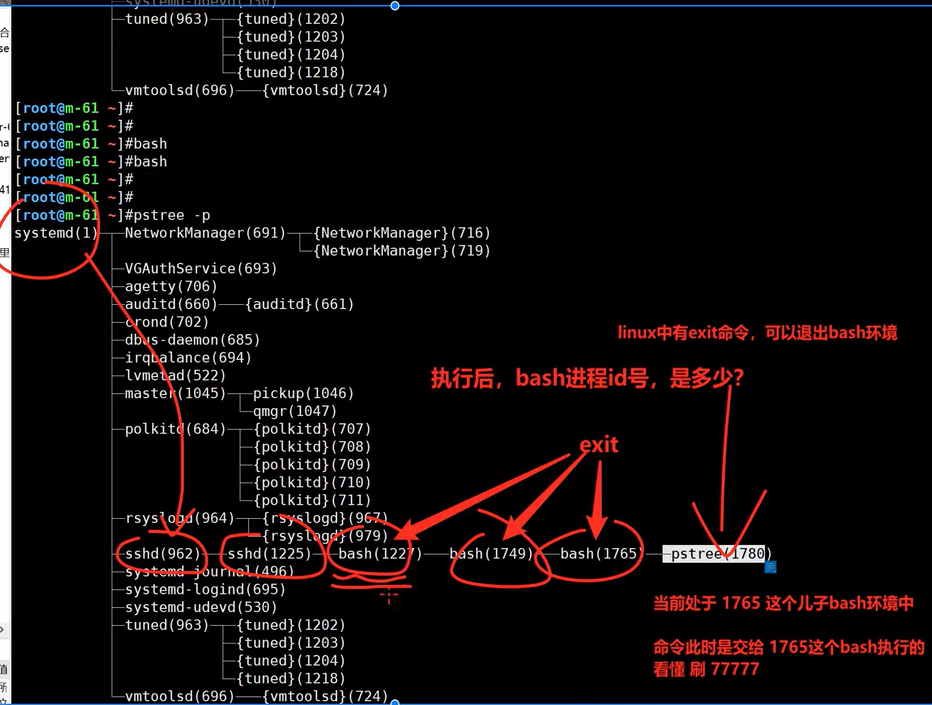

# shell编程


## 01-shell入门基础

### 三种语言的代码运行方式

- 解释型语言角度
  - shell
  - python
- 编译型语言角度
  - golang


#### shell脚本的运行方式

```shell
# 1.第一步都是开发，纯文本类型的的代码。这种代码， 在运行后，才有实际意义，才转为了计算机的数据。
# 学名叫做 shebang #!的意思。
mkdir part3

cat > shell.sh << 'EOF'
#!/bin/bash
echo '开始学编程，好刺激！！！'
EOF

# 运行

两种，
1. 不强制用哪种解释器，但是你得 1.加执行权限  2.代码中进行解释器声明。
添加执行权限，直接运行脚本路径
chmod u+x shell.sh
./shell.sh

2. 无须执行权限，以解释器强制性去运行，明确指定了，用什么解释器去执行，也有多种方式，请看
# bash运行
bash shell.sh

# sh运行
sh shell.sh

# 点运行.  但是要求脚本第一行，必须有解释器声明
. shell.sh

# source运行
source shell.sh


[root@master-61 ~/part3]#sh shell.sh 
开始学编程，好刺激！！！
[root@master-61 ~/part3]#. shell.sh 
开始学编程，好刺激！！！
[root@master-61 ~/part3]#source shell.sh
开始学编程，好刺激！！！


代码里有解释器，然后强制用解释器执行，以外边强制用的为主

```


#### python运行方式

```shell
# python的运行方式如下
# 必须是如下写法，才不会加载特殊变量，识别为普通文本 'EOF'
# 第一行意思是，在当前的系统env环境变量中，找到一个python的解释器
# 在当前的env环境变量中，找到PATH变量，找到python解释器

env
查看当前环境里的变量信息


# 代码如下
cat > hello.py <<'EOF'
#!/usr/bin/env python
#coding:utf-8
print "python牛波一的很啊"
EOF

#写法等同于
#!/usr/bin/python

# 运行方式，前提是机器上有python

依然是两种方式

1. 添加执行权限，直接运行，前提是代码中有第一行的解释器声明，否则会报错。
默认权限不足。
chmod u+x hello.py
./hello.py

2. 直接指定解释器去运行，必然正确
python hello.py

3. 在代码中有了声明，又强制用解释器去跑,谁优先级高
# 在外部的解释器，执行优先级更高
[root@master-61 ~/part3]#cat hello.py 
#!/usr/bin/env python
#coding:utf-8
print "python牛波一的很啊"

[root@master-61 ~/part3]#bash hello.py 
hello.py: line 3: print: command not found

```


#### golang的运行方式

```shell
# 编译型语言的特点，
yum install epel-release golang -y

# 查看golang编译器的版本
go version


# 2.编写golang的纯文本类型的代码
# 编译型语言，安全性够高，但是语法比较多，限制比较多，因此小白适合从解释型语言学起
# 编译型语言，如golang如c，c++，定义一个变量，都要限制该变量的数据类型，是数字类型，还是字符串类型。。
# 不同的语言，有不同的语法规则，如英语，法语，需要你去学一学的。。。

cat > jiayou.go <<'EOF'
package main

import "fmt"

func main() {
    fmt.Println("每天都有太阳，每天都可以学习，体验新知识，掌握新技能的快感，非常nice！！")
}
EOF


# 直接运行（先解释，再编译，底层理念）
go run jiayou.go

# 直接编译（直接生成二进制，一次编译，任意运行）
go build -o jiayou-linux jiayou.go

file jiayou-linux
# 查看架构
uname -a

scp jiayou-linux root@172.16.1.9:/tmp/

cd /tmp/
./jiayou-linux
```


### shell脚本编写语法规范

#### vim脚本开发插件

这个脚本作用是，vim自动判断，

*.sh

*.php

*.py

分别提供该语言的语法高亮支持，一些功能支持。


```shell
1. 打开vim配置文件，写入你自己的插件语法
[root@m-61 ~]#vim ~/.vimrc

2. 复制粘贴语法即可

syntax on
set nocompatible
"set number
"filetype on
"set history=1000
"set background=dark
""set autoindent
"set smartindent
"set tabstop=4
"set shiftwidth=4
"set showmatch
"set guioptions-=T
"set ruler
"set nohls
"set incsearch
""set fileencodings=utf-8

if &term=="xterm"
    set t_Co=8
    set t_Sb=^[[4%dm
    set t_Sf=^[[3%dm
endif
function AddFileInformation_php()
      let infor = "<?php\n"
      \." ***************************************************************************\n"
      \." * \n"
      \." * Copyright (c) 2014 \n"
      \." *  \n"
      \." **************************************************************************/ \n"
      \." \n"
      \." \n"
      \." \n"
      \."/** \n"
      \." * @file:".expand("%")." \n"
      \." * @author your name(leo) \n"
      \." * @date ".strftime("%Y-%m-%d %H:%M")." \n"
      \." * @version 1.0  \n"
      \." **/ \n"
      \." \n"
      \." \n"
      \." \n"
      \." \n"
      \." \n"
      \." \n"
      \."?>"
      silent  put! =infor
endfunction
autocmd BufNewFile *.php call AddFileInformation_php()

function AddFileInformation_sh()
      let infor = "#!/bin/bash\n"
      \."\n"
      \."# ***************************************************************************\n"
      \."# * \n"
      \."# * @file:".expand("%")." \n"
      \."# * @author:leo \n"
      \."# * @date:".strftime("%Y-%m-%d %H:%M")." \n"
      \."# * @version 1.0  \n"
      \."# * @description: Shell script \n"
      \."# * @Copyright (c)  all right reserved \n"
      \."#* \n"
      \."#**************************************************************************/ \n"
      \."\n"
      \."\n"
      \."\n"
      \."\n"
      \."exit 0"
      silent  put! =infor
endfunction
autocmd BufNewFile *.sh call AddFileInformation_sh()

function AddFileInformation_py()
      let infor = "#!/usr/bin/env python\n"
      \."# -*- coding: utf-8 -*-\n"
      \."# ************************************************************************ \n"
      \."# * \n"
      \."# * @file:".expand("%")." \n"
      \."# * @author:leo \n"
      \."# * @date:".strftime("%Y-%m-%d %H:%M")." \n"
      \."# * @version 1.0  \n"
      \."# * @description: Python Script \n"
      \."# * @Copyright (c)  all right reserved \n"
      \."# * \n"
      \."#************************************************************************* \n"
      \."\n"
      \."import os,sys"
      \."\n"
      \."print u'''中文'''\n"
      \."\n"
      \."exit()"
      silent  put! =infor
endfunction
autocmd BufNewFile *.py call AddFileInformation_py()
```


***


## 02-shell变量

### 1. 变量的分类

```shell
# 查看进程树
pstree -p

```

#### 全局变量、局部变量和父子bash的关系

```shell
环境变量（全局变量） 系统中全局生效的变量；
普通变量（局部变量）只对局部环境，如当前某一个login.sh脚本生效；

变量生命周期
1. 永久变量，写入文件，反复读取，加载，让其永久生效，如/etc/profile的PATH修改；
2. 临时变量，如命令行export定义一个变量存储数据，关闭shell会话后失效；
```


#### 什么是父子bash

```shell
1. 先知道一个概念，只要你ssh连接上一个linux，登录之后，自动加载 /bin/bash作为解释器，解释你所有输入的linux命令

每一个人的机器都不一样，你得看懂pid和ppid的关系即可。

第一，你的机器，得运行sshd守护进,962，等待用户的连接, ps命令可以看到结果
root        962      1  0 08:54 ?        00:00:00 /usr/sbin/sshd -D

第二，这是你ssh连接进来的会话,当前这个会话的pid是 1225，
root       1225    962  0 08:54 ?        00:00:00 sshd: root@pts/0

第三，你现在所有的操作，是基于这个1225进程id的会话操作的
登录了linux之后，自动加载一个父bash进程，你所有的操作，交给这个bash去解释执行。
# 当前第一个父bash 进程id号是 1227
root       1227   1225  0 08:54 pts/0    00:00:00 -bash

第四，后续的命令，都作为儿子进程，由父bash创建出的进程，如ps命令
root       1705   1227  0 10:00 pts/0    00:00:00 ps -ef

```

##### 演示创建父子bash



```shell
总结

1. 执行一次bash，就单独开辟一个子bash环境

2. 执行一次exit就退出一个bash环境

3. linux中提供了多种运行脚本的方式，区别在于，父子shell的创建
```

##### 开启子bash的执行方式

```shell
#明确当前的第一个，父亲bash 是 37308
# 打印当前的进程id号玩法

cat ~/test-bash-pid.sh

echo "当前脚本执行的进程id是 $$"

# bash命令

[root@master-61 ~]#bash test-bash-pid.sh 
当前脚本执行的进程id是 37569

```

##### 不开启子bash的执行方式

```shell
# source命令和.命令

#明确当前的第一个，父亲bash 是 37308

[root@master-61 ~]#source test-bash-pid.sh 
当前脚本执行的进程id是 37308
Connection closing...Socket close.

Connection closed by foreign host.

Disconnected from remote host(master-61) at 01:33:28.

Type `help' to learn how to use Xshell prompt.

```

```shell
# 总结
直接使用bash命令运行脚本，会额外创建一个子bash去运行脚本

用source和.点的运行，都是不开启子bash，直接在当前bash中运行程序
```

#### export命令

```shell
临时变量，是否添加export的区别

总结是
定义变量，是否添加export的区别

1. 不加export，只对当前shell生效，子shell看不到；

[root@master-61 ~]#name="我是临时的，子bash看不见的"
[root@master-61 ~]#echo ${name}
我是临时的，子bash看不见的
[root@master-61 ~]#bash
[root@master-61 ~]#echo ${name}

[root@master-61 ~]#


2. 加export，当前shell会话进程，父子shell都可以用；
[root@master-61 ~]#export name="这次是应该父子都可以看见"
[root@master-61 ~]#echo ${name}
这次是应该父子都可以看见
[root@master-61 ~]#bash
[root@master-61 ~]#echo ${name}
这次是应该父子都可以看见

```

##### 加载环境变量的顺序

```shell
1. 登录ssh会话后，要加载/etc/profile
2. 执行用户家目录中的环境变量文件配置文件 ~/.bash_profile
3. 执行 ~/.bashrc
4. 执行/etc/bashrc
```


### 2. 变量的实际使用

#### 字符串类型

shell的变量的值，都会被当做字符串去处理，但是你在写的时候，可以用不同的写法

底层都是作为字符串去处理了。

写法可以不同，纯字符串的值形式

关于定义字符串的细节

- 单引号，所见即所得
- 双引号，识别特殊符号，
- 反引号，用于执行linux命令时，用这个写法
- 不加引号（不建议这么用，用于写连续的字符串时，才可以这么写）

```shell
[root@master-61 ~]#my_name=lalala666
[root@master-61 ~]#echo ${my_name}
lalala666

[root@master-61 ~]#your_name="liuyi fei"
[root@master-61 ~]#echo ${your_name}
liuyi fei

[root@master-61 ~]#my_love="leo+${your_name}"
[root@master-61 ~]#echo ${my_love}
leo+liuyi fei

[root@master-61 ~]#time_now=`date +%F-%T`
[root@master-61 ~]#echo "当前时间是${time_now}"
当前时间是2024-07-08-22:34:29

[root@master-61 ~]#today="今天是$(date +%F-%T)"
[root@master-61 ~]#echo ${today}
今天是2024-07-08-22:36:19

# 如果要在字符串中，获取命令的执行结果，可以用 反引号和$(命令)，这2个用法
```

#### 命令定义变量

```shell
[root@master-61 ~]#my_hostname="当前主机名是：$(hostname)"
[root@master-61 ~]#my_ip="当前主机ip：$(hostname -I)"
[root@master-61 ~]#

# echo -e 参数可以识别字符串中的特殊符号，如换行符玩法

[root@master-61 ~]#echo -e "主机名：${my_hostname}\n主机ip：${my_ip}"
主机名：当前主机名是：master-61
主机ip：当前主机ip：10.0.0.61 172.16.1.61 

```

#### 修改删除变量

```shell
# 1.修改
就直接重新赋值

# 2.删除
unset命令

name="leoshuaia"
name1="leocool"

unset name name1
```

### 3. 变量传递，参数传递

```shell
变量除了在命令行直接调用、存、取值。

还经常用在脚本传递的参数中，但是脚本接收的参数，这个特殊变量，是shell内置固定的语法规则。

具体的用法
这些位置参数特殊变量，你会发现，需要结合如 if，case条件判断语句再去玩

# 执行脚本，获取传入的位置参数，如 ./vars.sh leo1 leo2 leo3 leo4 leo5
# 通过$n 获取第n个位置的参数值，从10开始，必须使用${n}不得简写
# shell变量的花式玩法

cat > vars.sh <<'EOF'
#!/usr/bin/env bash
echo "当前shell脚本文件名：$0"
echo "第1个传入位置参数：$1"
echo "第2个传入位置参数：$2"
echo "第3个传入位置参数：$3"
echo "第4个传入位置参数：$4"
echo "第5个传入位置参数：$5"
echo "第6个传入位置参数：$6"
echo "第7个传入位置参数：$7"
echo "第8个传入位置参数：$8"
echo "第9个传入位置参数：$9"
echo "第10个传入位置参数：${10}"
echo "第11个传入位置参数：${11}"
echo "第12个传入位置参数：${12}"
echo "提取所有的位置参数，使用\$*提取：$*"
echo "提取所有的位置参数，使用\$@提取：$@"
echo "位置参数总个数是：$#"
echo "当前shell脚本执行的pid是：$$"
echo "上一个命令的执行返回结果是：$?"
EOF
```

#### **实战**

##### 1. 编写脚本

- 通过`位置参数`形式
- 免交互的创建linux用户与密码。

```shell
拿到需求

先分析需求，看清楚要求，再开始写代码。

user.sh   $1  $2 $3 

拆解，分析需求，然后考虑用什么命令去做。

1.接收位置参数，传来的账户，密码

2.在系统中，创建对应的useradd用户，密码（echo "密码" | passwd --stdin username）

需求分析到这，就结束了下一步，产出代码，你也会这么去需求分析理解  66666


# 产出代码
cat > user_pwd.sh <<"EOF"

#!/bin/bash
# 1. 接收位置参数的数据
username="${1}"
pwd="${2}"


# 2. 数据已经被写入变量， 可以调用变量，创建对应用户信息了
useradd "${username}"

# 创建密码
echo "${pwd}" | passwd --stdin "${username}"
EOF

```

##### 2. 编写通过位置参数，自动修改主机名的脚本。

```shell
master-61


cat > change_hostname.sh <<"EOF"

#!/bin/bash
# 接收新的主机名
new_hostname=$1

# 设置修改主机名
hostnamectl set-hostname ${new_hostname}

# 查看新的主机名
# 写在 $() 里面的，就是linux的命令了，而不是普通的字符串。
echo "当前新的主机名是 ：$(hostname)"
EOF
```


### 4. 交互式参数传递(read)

```shell
利用read命令，接收用户输入，从键盘读取标准输入。


语法
read -p "提示信息" 变量名

```

#### 用户信息接收

```shell
1. 程序和用户进行交互，需要用户输入，账户，密码2个数据
2. 程序简单的打印用数据，练习read的用法

# -s 不显示输入的内容，用于输入密码会用，保护密码
# -n 指定字符个数
# -t 输入超时时间

cat > user_info_input.sh <<"EOF"

#!/bin/bash

# 接收账号数据
read -p "请输入你的账户："  user

# 接收密码数据，密码，建议隐藏显示，更安全
read -s -p "请输入你的密码："   my_pwd

# 打印输入的结果

echo "您的账户是：$user"

echo "您的密码是：$my_pwd"
EOF

```

#### 备份目录小脚本

```shell
# 1. 让用户输入要备份的目录 路径
# 2. 程序自动创建备份目录，且复制数据，实现备份

cat > read-backup.sh <<"EOF" 

#!/bin/bash

# 1. 让用户输入要备份的目录 路径
read -p "请输入要备份的目录的绝对路径：" src_dir
# 2. 程序自动创建备份目录，且复制数据，实现备份
read -p "请输入要备份的目的地的绝对路径：" dest_dir

# 3.创建备份目录，且把数据拷贝过来，实现备份
mkdir -p ${dest_dir} && cp -a ${src_dir} ${dest_dir}
# 4. 脚本查看备份的数据目录信息
echo -e "备份的数据如下：\n$(ls ${dest_dir})"
EOF
```

#### 用户输入综合小练习(实践)

需求

`接收用户输入  read `的数据，创建系统用户；（账户，密码）

且将用户输入保存到文件`/tmp/user_info.log`，保存格式为`username:pwd 键值对形式`

**风格1，交互式让用户输入数据**

```shell
# vim read_user.sh

# 接收账户
read -p "please input your account：" your_user

# 接收密码
read -p "please input your password：" your_password

# 创建用户且设置密码
useradd ${your_user}

echo "${your_password}" | passwd --stdin ${your_user} > /dev/null 2>&1

# 打印数据，写入到文件里
echo "${your_user}:${your_password}" >> /tmp/user_info.log


#验证
[root@master-61 ~/part3]#bash read_user.sh 
please input your account：cc01
please input your password：cc666
[root@master-61 ~/part3]#cat /tmp/user_info.log 
cc01:cc666

```

**风格2，接收位置参数的数据 $1 $2**

```shell
# vim read_user1.sh

# 接收账户
your_user1=$1

# 接收密码
your_password1=$2

# 创建用户且设置密码
useradd ${your_user1}
# useradd ${1}

echo "${your_password1}" | passwd --stdin ${your_user1} > /dev/null 2>&1
# echo "${2}" | passwd --stdin ${1} > /dev/null 2>&1
# echo "${1}:${2}" | chpasswd

# 打印数据，写入到文件里
echo "${your_user1}:${your_password1}" >> /tmp/user_info.log
# echo "${1}:${2}" >> /tmp/user_info.log

#验证
[root@master-61 ~/part3]#bash read_user1.sh cc02 cc666
[root@master-61 ~/part3]#cat /tmp/user_info.log 
cc01:cc666
cc02:cc666

```

#### 修改主机IP、主机名脚本(实践)

- 交互式脚本修改，read接收用户输入的ip和主机名
- 非交互式脚本修改（位置参数）给脚本直接传入 ip和主机名，但是要注意参数顺序了。

```shell
#!/bin/bash
# 代码是自上而下加载的。

# 替换主机名
read -p "请输入新的主机名："  new_hostname
hostnamectl set-hostname ${new_hostname}


# 替换ip
read -p "请输入新的ip地址："  new_ip
sed -i "/IPADDR=/c IPADDR=${new_ip}" /etc/sysconfig/network-scripts/ifcfg-eth0

# 显示替换结果
echo -e "当前主机名是：\n$(hostname)"
echo -e "当前的网卡配置文件是：\n$(cat /etc/sysconfig/network-scripts/ifcfg-eth0 )"

# 重启network服务
echo "重启网络服务中。。。。"
systemctl restart network


# 统一的修改
# 修改配置文件，重启network服务
# 方案1，直接用 sed的c命令，整行替换数据
# 方案2，用sed的s命令，替换整个ip
# 方案3，用sed的s命令，只替换ip最后一个的主机位地址。
```

#### 定时任务脚本

需求：

通过交互式脚本，创建新的定时任务规则，要求

每十分钟和阿里云时间服务器同步。

**方案一，写法简单粗暴的，直接输入完整的语句**

```shell
# 通过交互式脚本，创建新的定时任务规则，要求
# crontab -e 这种是交互式输入，脚本,思考，
# 定时任务具体是写入到了什么文件里？

read -p "请输入您要插入的新定时任务完整规则："  new_crontab

echo "${new_crontab}" >> /var/spool/cron/root

echo "当前的计划任务规则列表是："
echo "$(crontab -l)"

# 每十分钟和阿里云时间服务器同步。  */10 * * * * ntpdate -u ntp.aliyun.com


# 测试
[root@master-61 ~/part3]#vim new_crontab.sh
[root@master-61 ~/part3]#bash new_crontab.sh 
请输入您要插入的新定时任务完整规则：*/10 * * * * ntpdate -u ntp.aliyun.com
当前的计划任务规则列表是：
* * * * * /usr/sbin/ntpdate time1.aliyun.com > /dev/null 2>&1
*/10 * * * * ntpdate -u ntp.aliyun.com

```

**方案二，规则和命令分开写**

```shell
#!/bin/bash

read -p "请输入crontab的时间频率：" cron_time
read -p "请输入crontab的具体命令：" cron_job

# 让用户输入生效
echo "$(date +%F)" >> /var/spool/cron/root
echo "$cron_time $cron_job" >> /var/spool/cron/root

echo -e "当前最新的计划任务是：\n$(crontab -l)"

# 每五分钟和阿里云时间服务器同步。
*/5 * * * *
ntpdate -u ntp.aliyun.com


# 测试
[root@master-61 ~/part3]#vim new_crontab1.sh
[root@master-61 ~/part3]#bash new_crontab1.sh 
请输入crontab的时间频率：*/5 * * * *
请输入crontab的具体命令：ntpdate -u ntp.aliyun.com
当前最新的计划任务是：
* * * * * /usr/sbin/ntpdate time1.aliyun.com > /dev/null 2>&1
*/10 * * * * ntpdate -u ntp.aliyun.com
2024-07-11
*/5 * * * * ntpdate -u ntp.aliyun.com

```

### 5. 预定义变量(脚本的位置参数，位置变量)

```shell
几个特殊的位置参数变量

$* 接收所有位置参数

$@ 接收所有位置参数

$# 参数个数

$$ 获取当前进程的PID

$? 上一个命令的返回值，0是正确，其他都错误（指的是你脚本上，查看$?的上一条命令）
```

#### 探测主机是否存活脚本（练习$?的玩法）

```shell
# 完成脚本开发

#!/bin/bash

# 传入位置参数的玩法
ping -c 1 ${1} &>/dev/null  2>&1

if [ "$?" == "0" ];then
	echo "该机器${1}正在运行中！！"
else
	echo "该机器${1}挂了！！"
fi


# 测试
[root@master-61 ~/part3]#vim check_host.sh
[root@master-61 ~/part3]#bash check_host.sh 172.16.1.9
该机器172.16.1.9正在运行中！！
[root@master-61 ~/part3]#bash check_host.sh 172.16.1.88
该机器172.16.1.88挂了！！

```

#### 获取所有位置参数(难点，是练习$@ 和$*的玩法)

当我们想从脚本运行，传入的参数中获取具体的参数，可以用${n}

但是如果用户传入的参数不固定，你知道到底用 ${数字写多少合适?}

因此这时候，$* 和 $@ 的威力就来了，可以获取所有的位置参数（除了$0）

但是这俩变量虽说都是提取所有参数，但是提取之后的数据构造不一样

**场景一，不加引号**

```shell
1.当用户传入多个参数，都是以空格作为分隔符，获取每一个元素，此时$*和$@无区别。
2.注意此时，$*和$@ 这俩特殊变量，都没添加引号
```

**场景二，加引号**

```shell
echo "----------------测试\$*，给变量添加了引号用法--------------"
echo
echo
echo "通过\$*提取，构造的所有元素是$*"

for v in "$*"
do
echo "\$*传入的位置参数，分别是${v}"
done

echo
echo

echo "-----------------测试\$@，添加了引号用法-----------------"
echo
echo
echo "通过\$@提取，构造的所有元素是$@"

for v in "$@"
do
echo "\$@传入的位置参数，分别是${v}"
done


#测试
[root@master-61 ~/part3]#vim test-vars.sh
[root@master-61 ~/part3]#bash test-vars.sh "cc01 cc01" "lala" "bob01 bob02 bob03" "jack01 jack02 jack03 jack04"
----------------测试$*，给变量添加了引号用法--------------


通过$*提取，构造的所有元素是cc01 cc01 lala bob01 bob02 bob03 jack01 jack02 jack03 jack04
$*传入的位置参数，分别是cc01 cc01 lala bob01 bob02 bob03 jack01 jack02 jack03 jack04
-----------------测试$@，添加了引号用法-----------------


通过$@提取，构造的所有元素是cc01 cc01 lala bob01 bob02 bob03 jack01 jack02 jack03 jack04
$@传入的位置参数，分别是cc01 cc01
$@传入的位置参数，分别是lala
$@传入的位置参数，分别是bob01 bob02 bob03
$@传入的位置参数，分别是jack01 jack02 jack03 jack04

```

### 6. 变量计算

```shell
expr 				# 只支持整数运算
$(( )) 				# 双括号运算，只支持整数运算，效率更高
$[]					# 整数运算，语法简洁
bc					# 支持整数，小数点运算
awk					# 支持整数，小数点运算
%					# 取余运算
```

#### **具体用法**

```shell
[root@master-61 ~]#num1=10
[root@master-61 ~]#num2=2

# expr
[root@master-61 ~]#expr num1 + num2
[root@master-61 ~]#expr ${num1} + ${num2}
12

# $(())
[root@master-61 ~]#echo $(( ${num1} + ${num2} ))
12
[root@master-61 ~]#echo $(( num1 + num2 ))
12

# $[]
[root@master-61 ~]#echo $[ $num1 + $num2]
12

# let
[root@master-61 ~]#let result=$num1+$num2
[root@master-61 ~]#echo $result
12

# bc
[root@master-61 ~]#echo "$num1 + $num2" | bc

```

#### **变量计算练习题**

##### **根据系统当前时间，判断还有多少个星期**

```shell
# 计算今年还有多少天，在除于7

[root@master-61 ~]#echo "今年还剩下$[ (365 - $(date +%j)) / 7 ]个星期"
今年还剩下24个星期

```

##### **采集主机信息**

```shell
# 写脚本，提取当前机器的静态属性，包括如下，写入文件/tmp/server_info.log

# 系统版本
cat /etc/redhat-release 

cat /etc/os-release 
grep -i '^pretty' /etc/os-release | awk -F '"' '{print $2}' 

# 内核版本
uname -r

# 主机名
hostname

# eth0网卡ip
ifconfig eth0 | awk 'NR==2{print $2}'

# eth1网卡ip
ifconfig eth0 | awk 'NR==2{print $2}'

# 当前主机的公网ip
curl -s ifconfig.me

# 内存使用率
free -m | awk 'NR==2{print $3/$2*100"%"}'

# 磁盘使用率
df -h | awk 'NR==2{print $5}'
df -h | awk '/\/$/{print $5}'

# CPU使用率
mpstat | awk 'NR==4{print 100-$NF"%"}'
sar -u 1 1 | awk '/Average/{print 100-$NF"%"}'


# 脚本整合

当前主机的系统版本是：$(grep -i '^pretty' /etc/os-release | awk -F '"' '{print $2}')

当前主机的内核版本是：$(uname -r)

当前主机的主机名是：$(hostname)

当前主机的eth0网卡ip是：$(ifconfig eth0 | awk 'NR==2{print $2}')

当前主机的eth1网卡ip是：$(ifconfig eth1 | awk 'NR==2{print $2}')

当前主机的公网ip是：$(curl -s ifconfig.me)

当前主机的内存使用率是：$(free -m | awk 'NR==2{print $3/$2*100"%"}')

当前主机的磁盘使用率是：$(df -h | awk '/\/$/{print $5}')

当前主机的cpu使用率是：$(mpstat | awk 'NR==4{print 100-$NF"%"}')

```

### 7. shell子串

```shell
${变量}                        返回变量值
${#变量}                       返回变量长度，字符长度
${变量:start}                  返回变量Offset数值之后的字符
${变量:start:length}  		 提取offset之后的length限制的字符 
${变量#word}                   从变量开头删除最短匹配的word子串
${变量##word}                  从变量开头，删除最长匹配的word
${变量%word}                   从变量结尾删除最短的word
${变量%%word}                  从变量结尾开始删除最长匹配的word
${变量/pattern/string}  		 用string代替第一个匹配的pattern
${变量//pattern/string} 		 用string代替所有的pattern
```


***


## 03-条件判断

### 1. 基于文件进行条件判断

#### 常用参数

| 参数 | 解释                             | 举例            |
| ---- | -------------------------------- | --------------- |
| -e   | 文件或目录存在就是true           | [ -e filepath ] |
| -s   | 文件存在且只要有一个字母就是true | [ -s filepath ] |
| -f   | 文件存在且是普通文件类型就是true | [ -f filepath ] |
| -d   | 文件存在且是目录类型就是true     | [ -d filepath ] |
| -r   | 文件存在且有read权限就是true     | [ -r filepath ] |
| -w   | 文件存在且有write权限就是true    | [ -w filepath ] |
| -x   | 文件存在且有x权限就是true        | [ -x filepath ] |

#### 更多参数

```sehll
test 命令最短的定义可能是评估一个表达式；如果条件为真，则返回一个 0 值。如果表达式不为真，则返回一个大于 0 的值 — 也可以将其称为假值。检查最后所执行命令的状态的最简便方法是使用 $? 值。

参数：

1. 关于某个文件名的『类型』侦测(存在与否)，如 test -e filename 

-e 该『文件名』是否存在？(常用) 
-f 该『文件名』是否为文件(file)？(常用) 
-d 该『文件名』是否为目录(directory)？(常用) 
-b 该『文件名』是否为一个 block device 装置？ 
-c 该『文件名』是否为一个 character device 装置？ 
-S 该『文件名』是否为一个 Socket 文件？ 
-p 该『文件名』是否为一个 FIFO (pipe) 文件？ 
-L 该『文件名』是否为一个连结档？ 

2. 关于文件的权限侦测，如 test -r filename 

-r 侦测该文件名是否具有『可读』的属性？ 
-w 侦测该文件名是否具有『可写』的属性？ 
-x 侦测该文件名是否具有『可执行』的属性？ 
-u 侦测该文件名是否具有『SUID』的属性？ 
-g 侦测该文件名是否具有『SGID』的属性？ 
-k 侦测该文件名是否具有『Sticky bit』的属性？ 
-s 侦测该文件名是否为『非空白文件』？ 

3. 两个文件之间的比较，如： test file1 -nt file2 

-nt (newer than)判断 file1 是否比 file2 新 
-ot (older than)判断 file1 是否比 file2 旧 
-ef 判断 file1 与 file2 是否为同一文件，可用在判断 hard link 的判定上。 主要意义在判定，两个文件是否均指向同一个 inode 哩！ 

4. 关于两个整数之间的判定，例如 test n1 -eq n2 

-eq 两数值相等 (equal) 
-ne 两数值不等 (not equal) 
-gt n1 大于 n2 (greater than) 
-lt n1 小于 n2 (less than) 
-ge n1 大于等于 n2 (greater than or equal) 
-le n1 小于等于 n2 (less than or equal) 

5. 判定字符串的数据 

test -z string 判定字符串是否为 0 ？若 string 为空字符串，则为 true 
test -n string 判定字符串是否非为 0 ？若 string 为空字符串，则为 false。
注： -n 亦可省略 
test str1 = str2 判定 str1 是否等于 str2 ，若相等，则回传 true 
test str1 != str2 判定 str1 是否不等于 str2 ，若相等，则回传 false 

6. 多重条件判定，例如： test -r filename -a -x filename 

-a (and)两状况同时成立！例如 test -r file -a -x file，则 file 同时具有 r 与 x 权限时，才回传 true。 
-o (or)两状况任何一个成立！例如 test -r file -o -x file，则 file 具有 r 或 x 权限时，就可回传 true。 
! 反相状态，如 test ! -x file ，当 file 不具有 x 时，回传 true
```

#### 结合test命令

```shell
条件判断的用法，有俩语法形式

1.   中括号
# 前面是条件判断语句，得到true 或false的结果，后面可以加上具体的命令操作
[ -f /etc/hosts  ] && cat /etc/hosts

2. test命令
test  -f /etc/hosts && cat /etc/hosts
```


### 2. 基于整数判断

```shell
-eq 两数值相等 (equal) 
-ne 两数值不等 (not equal) 
-gt n1 大于 n2 (greater than) 
-lt n1 小于 n2 (less than) 
-ge n1 大于等于 n2 (greater than or equal) 
-le n1 小于等于 n2 (less than or equal)
```

#### 猜数字

```shell
cat > guess_num.sh <<"EOF"

read -p "please input your num:" num

result=66
# 猜大了
if [ $num -gt $result ];then
	echo "猜大了~~~"
# 猜小了
elif [ $num -lt $result ];then
	echo "猜小了~~~"
# 猜对了
else
	echo "猜对了~~~"
fi
EOF


# 测试
[root@master-61 ~/part3]#bash guess_num.sh
please input your num:10
猜小了~~~
[root@master-61 ~/part3]#bash guess_num.sh
please input your num:66
猜对了~~~
[root@master-61 ~/part3]#bash guess_num.sh
please input your num:88
猜大了~~~


```

#### 比较数字大小，美化结果

```shell
# 结果美化
# 加载系统的，提供颜色结果的函数库。
# Source function library.
. /etc/init.d/functions
# 语法是 
# action "你的字符串" /bin/true
# action "你的字符串" /bin/false

result=66

# 用户输入数据
read -p "please input your num:" num

# 猜大了
if [ $num -gt $result ];then
	action "猜大了！！" /bin/false
# 猜小了
elif [ $num -lt $result ];then
	action "猜小了！！" /bin/false
# 猜对了
else
	action "恭喜你，猜对了~~~~" /bin/true
fi


```

#### 对输入数字进行检验

```shell
# 加载系统的，提供颜色结果的函数库。
. /etc/init.d/functions

result=66

# 用户输入数据
read -p "please input your num:" num

# 对输入数字进行校验，只有纯数字，正整数才符合
if [ -z "$(echo $num | sed -rn '/^[0-9]+$/p')" ];then
	echo "请输入纯数字正整数~，程序结束" && exit
fi

# 猜大了
if [ $num -gt $result ];then
	action "猜大了！！" /bin/false
# 猜小了
elif [ $num -lt $result ];then
	action "猜小了！！" /bin/false
# 猜对了
else
	action "恭喜你，猜对了~~~~" /bin/true
fi

```

#### 判断位置参数个数

```shell
# 加载系统的，提供颜色结果的函数库。
. /etc/init.d/functions

result=66

# 对特殊变量 $# 可以统计位置参数个数
[ $# -ne 0 ] && echo "不得传入位置参数" && exit

# 用户输入数据
read -p "please input your num:" num

# 对输入数字进行校验，只有纯数字，正整数才符合
if [ -z "$(echo $num | sed -rn '/^[0-9]+$/p')" ];then
	echo "请输入纯数字正整数~，程序结束" && exit
fi

# 猜大了
if [ $num -gt $result ];then
	action "猜大了！！" /bin/false
# 猜小了
elif [ $num -lt $result ];then
	action "猜小了！！" /bin/false
# 猜对了
else
	action "恭喜你，猜对了~~~~" /bin/true
fi
```

#### 判断用户的密码是否符合6位

```shell
#!/bin/bash
echo "您输入的二级密码是：$1"

# 方案1，利用wc -L 参数
len_vars=$(echo $1|wc -L)

# 如果不等于6 就报错
[ $len_vars -ne 6 ] && echo "密码必须是6位！！重新输入" && exit

# 后续的逻辑就不该执行了
echo "只有你输入正确的6位密码，才能看到我"

=============================================================

# 方案2，利用变量子串功能，统计变量值的长度
# 语法是 ${#变量名}

#!/bin/bash
echo "您输入的二级密码是：$1"

# 方案2，利用变量子串统计字符个数
[ ${#1} -ne 6 ] && echo "密码必须是6位！！重新输入" && exit

# 后续的逻辑就不该执行了
echo "~~~~~~只有你输入正确的6位密码，才能看到我~~~~"

```


### 3. 基于字符串判断

| 参数 | 解释                   | 案例             |
| ---- | ---------------------- | ---------------- |
| ==   | 两边值相等为true       | [ "$a" == "$b" ] |
| !=   | 两边值不等为true       | [ "$a" != "$b" ] |
| -z   | 字符串为空时为true     | [ -z "$a" ]      |
| -n   | 字符串内容不为空为true | [ -n "$a" ]      |
| =    | 同 == 作用一样         | [ "$a" = "$b" ]  |

**模拟开发登陆程序**

```shell
# 简单的登录程序，你是写死的数据，和用户的输入做校验
# 考察你的字符串的条件判断用法
# v1初级版本，先完成基本功能
# v2版本可以考虑可能存在的bug隐患，不断优化


cat > user_login.sh <<'EOF'
read -p "please input username：" username
read -p "please input password：" password

#  字符串值的 == 相等判断符号
# 逻辑参数 -a  and的意思，-a 两边都true，条件测试语句都是true，否则都不成立
# 要求账户、密码，都对得上了，都是true
# 整个登录逻辑，才是true，才提示登录成功

[ $username == "laoliu01" -a $password == "laoliu666" ] && echo "登录成功" || echo "账号密码错误" 
EOF
```


***


## 04-流程控制之if

### 简易版计算器v1

```shell
cat > calc_v1.sh <<"EOF"

#!/bin/bash
num1=$1
num2=$2

# 判断是不是纯数字
all_int=$(echo ${num1}${num2} | sed -r 's#^[0-9]+$##g')

# 限定输入参数个数
if [ $# -ne 2 ];then
	echo "只能输入2个参数"
	exit 1
# 如果$all_int为空字符串，表示num1和num2都是纯数字
elif [ -z ${all_int} ];then
	echo "加法计算：$num1 + $num2 = $[ $num1 + $num2 ] "
	echo "减法计算：$num1 - $num2 = $[ $num1 - $num2 ] "
	echo "乘法计算：$num1 * $num2 = $[ $num1 * $num2 ] "
    echo "除法计算：$num1 / $num2 = $[ $num1 / $num2 ] "
else
	echo "只能输入两个纯数字"
	exit 1
fi

EOF

```

### v2版本

```shell
拿到这个计算器的开发需求

1. 计算器，至少，只能输入 的是纯数字，对数字校验可以是第一步的校验工作
2. 对数字的数量进行限制，v2版本，计算符号是写死的，让用户输入2个数据即可。数据的参数个数，校验

3. 满足，是纯数字，且正好是2个数字，即可进入下一步正确的计算器逻辑。
```

```shell
#!/bin/bash
num1=$1
num2=$2

# 1. 先校验参数个数，拿到具体的参数后，再去校验是否是数字，来的更合理


# 限定数字个数，不对也结束
if [ $# -ne 2 ];then
    echo "只能2个参数！"
    # 程序输出执行错误 ，给错误码1
    exit 1
fi

# 用于判断是否是两个纯数字 ，至少要是数字，这个要求更优先
all_int=$(echo ${num1}${num2}|sed -r 's/^[0-9]+$//g')
if [ ! -z "$all_int" ];then
        echo "只能输入纯数字"
        exit 1
fi


# 如果$all_int为空字符串，表示num1和num2都是纯数字

if [ -z $all_int ];then
        echo "加法计算：$num1 + $num2 = $[ num1 + num2 ] "
        echo "减法计算：$num1 - $num2 = $[ num1 - num2 ] "
        echo "乘法计算：$num1 * $num2 = $[ num1 * num2 ] "
        echo "除法计算：$num1 / $num2 = $[ num1 / num2 ] "
fi
```

### v3版本可以选择运算符号

```shell
1. 用read接收用户输入，更像计算器
2. 提供符号菜单选择
3. 添加if条件判断

效果如下

# 主动思考，对数据数字校验
请输入第一个数字： 8
请输入第二个数字： 2

请选择运算符：
1. +
2. - 
3. *
4. /

请输入您的选择： 1

计算结果：
8 + 2 = 10

```

```shell
#!/bin/bash

read -p "请输入第一个数字：" num1
read -p "请输入第二个数字：" num2

echo -e "请选择运算符：
1. +
2. - 
3. *
4. /"


read -p "请输入您的选择：" sign

# 计算器判断条件
if [ $sign == 1 ];then
        echo "$num1 + $num2 = $[ $num1 + $num2 ]"
elif [ $sign == 2 ];then
        echo "$num1 - $num2 = $[ $num1 - $num2 ]"
elif [ $sign == 3 ];then
        echo "$num1 * $num2 = $[ $num1 * $num2 ]"
elif [ $sign == 4 ];then
        echo "$num1 / $num2 = $[ $num1 / $num2 ]"
else
    echo "只能输入1到4的选项"
fi

```

### v4版本，数据校验优化

```shell
# 完成上述3个程序的功能点

#!/bin/bash

#1. 禁止输入位置参数
[ "$#" -ne 0  ]  && echo "无需传入位置参数！！再见！" && exit 1


read -p "请输入第一个数字：" num1
# 不是纯数字就直接结束
#  -z 判断字符串如果为空，就表示是纯数字
#  加上! 表示取反，如果最终结

# 对输入1，数字校验
if [ ! -z $(echo ${num1}|sed -r 's#^[0-9]+$##g') ] || [ ! $num1 ];then
    echo "请输入纯数字整数！"
    exit 1
fi

# grep写法
if [ -z $(echo ${num1} | grep -E '^[0-9]+$') ];then
    echo "请输入纯数字整数！"
    exit 1
fi


# 对数字2，数字校验
read -p "请输入第二个数字：" num2
if [ ! -z $(echo ${num2}|sed -r 's#^[0-9]+$##g') ] || [ ! $num2 ];then
    echo "请输入纯数字整数！"
    exit 1
fi

# 打印菜单

echo -e "请选择运算符：
1. +
2. -
3. *
4. /"

# 对菜单符号进行校验

read -p "请选择运算符：" sign

if [ -z $(echo ${sign} | grep -E '^[1-4]$') ];then
    echo "只能输入1 ~ 4的序号！"
    exit 1
fi


# 计算器条件判断
# 一层层的校验，到这里，就确保输入的是2个数字，以及菜单的选择，也是对的。

if [ $sign == 1 ];then
        echo "$num1 + $num2 = $[ $num1 + $num2 ]"
elif [ $sign == 2 ];then
        echo "$num1 - $num2 = $[ $num1 - $num2 ] "
elif [ $sign == 3 ];then
        echo "$num1 * $num2 = $[ $num1 * $num2 ]"
elif [ $sign == 4 ];then
        echo "$num1 / $num2 = $[ $num1 / $num2 ]"
else
    echo "只能输入1到4的选项"
fi
```


### 备份文件

```shell
# 如果备份文件不存在自动创建

#!/bin/bash

if [ -e /backup/ ];then
    echo "目录以存在"
else
    mkdir -p "/backup"
fi
# 这里的条件判断，少了一个空格，报错了。
# 由于报错，没正确的进行条件判断
if [ -f /backup/all_log.tgz ];then
    echo "备份数据已存在"
else
    echo "备份文件中"
    # 写脚本，程序执行的日志，一般都不会再打印，要么丢弃，要么写入到文件做记录，利用重定向符号
    tar -zcf /backup/all_log.tgz /var/log/  
fi
```

```shell
# 优化
# 添加时间的备份文件记录

# 如果备份文件不存在自动创建
#!/bin/bash

# 获取当前时间戳
now=$(date +%F-%T)
# 程序中，容易变化的数据，都给封装为变量，便于维护代码
back_dir=/backup/

# 关于备份目录的判断
if [ -e $back_dir ];then
    echo "目录以存在"
else
    mkdir -p  $back_dir
fi

# 备份文件，且检查备份情况

tar -zcf ${back_dir}/all_log.tgz.${now}  /var/log/ &>/dev/null 2>&1
# 备份情况检查
if [ $? -eq 0 ];then
        echo -e "备份成功，最新的备份数据如下\n$(ls ${back_dir})"
else
        echo "备份出错了！！！"
fi

```

### 程序检查脚本

```shell
#!/bin/bash

# 限定只能检查一个服务
if [ $# -eq 1 ];then
	# 检查服务运行状态
	systemctl status $1 &>/dev/null
	# 通过命令结果判断
	if [ $? -eq 0 ];then
		echo "$1 正在运行中"
	else
		echo "$1 服务挂了"
	fi
# 否则提示用户正确参数用法	
else
	# 提示用户正确语法
	echo "usage：bash $0 service_name"
	exit
fi
	
```

### 采集服务器资源信息且判断

```shell
# server_info.sh


#!/bin/bash
# 获取当前时间，精准统计
now=$(date +%F-%T)

# 1.提取内存使用率 free -m
mem_used=$(free -m | awk '/Mem/{print $3/$2*100 }' | sed -r 's#\..*##g')
# mem_used=$(free -m | awk '/Mem/{used=$3/$2;print used*100}'|sed -r  's#\..*##g')

# 拿到内存使用率进行比较
# 判断当内存使用百分比，大于等于2%就报警
if [ $mem_used -ge 2 ];then
	# 警告信息，写入到文件中
    # root:时间:内存使用率
    echo "$USRE:$now:内存使用率:${mem_used}% 请尽快修复。" > /tmp/mem_used.log
 	# 给自己发个邮件
    # mail -s "内存警告！！！"  
fi


# 2.根目录磁盘使用率
# 这里是采集根分区的使用率
# 先统计出现有的使用率，超过85%之后，报警
disk_used=$(df -h | grep '/$' | awk '{print $5}' | sed -r 's#%##g'
)
# 条件判断
# 判断根分区磁盘使用率，超过2%就告警
if [ $disk_used -ge 2 ];then
	 echo "${USER}:${now}:磁盘使用率:${disk_used}% 请尽快修复。" >> /tmp/disk_used.log
fi


# 3.cpu使用率 
# 通过top命令 查看cpu整体情况，查看%Cpus行的信息，查看idle行，表示当前有多少百分比的空闲cpu。
cpu_used=$(mpstat | awk 'NR==4{print 100-$NF}' | sed -r  's#\..*##g' )

# cpu_used=$(sar -u 1 1 | awk '/Average/{print 100-$NF}' | sed -r  's#\..*##g' )

if [ $cpu_used -ge 2 ];then
        echo "${USER}:${now}:cpu使用率:${cpu_used}% 请尽快修复。" >> /tmp/cpu_used.log

fi
```


***


## 05-流程控制之case

### case语法，用法

```shell

# 这个变量，被设置了3个精准匹配的条件
# 如果这3个条件都匹配不上，自动进入   *) 这个默认分支，执行对应的动作
# 结尾必须再写一个 esac表示这个语句结束了
# case语句，每一个条件的代码，写完后，必须写2个 ;;分号  表示这个逻辑块结束了

# shell代码是自上而下的依此加载，以换行，或者 闭合的代码，作为结束
# if    fi
# EOF  EOF
# 所有的括号，都必须闭合 ()  []  {}
# case     esac 闭合


case 需要判断的变量 in

条件1)
    command  ;;
条件2)
    command
    ;;
条件3)
    command
    ;;
*)
    command
    ;;
esac

```


### 简易ATM

```shell
case_atm.sh


#!/bin/bash

echo -e "----------
1.取钱
2.存钱
3.查余额
----------"

read -p "请输入您的操作：" num

case "${num}" in 
1)
	echo "取了两万块"
	;;
2)
	echo "存了五万块"
	;;
3)
	echo "还有十万块"
	;;
*)
	echo "好好输入啊"
esac

```


### 利用case开发计算器(健壮性高)

```shell
需求（也是开发脚本的功能思路，在你很熟练语法之后，你看到这样的需求，心中应该理解想到，用哪些shell脚本的语法即可完成。）

1. 交互式接收用户输入的数字，计算符号
2. 判断用户输入的参数是否是3个
3. 判断用户输入的是否是纯数字整数
4. 判断用户输入的计算符号是否是 加减乘除
5. 如果用户输入错误，友好提示用户正确输入的语法
6. 如果输入错误，程序无须结束，循环重来让用户输入（循环知识点，以后做）
7. 重复性的代码，封装为函数（以后做）
```

```shell
case_calc.sh

#!/bin/bash

echo -e "------------欢迎使用计算器-----------"

# 输入第一个数字
read -p "请输入第一个计算数字：" num1
# 验证是否为纯数字
if [ -z $(echo $num1 | grep -E "^[0 -9]+$") ];then
	echo "请输入正确的数字"
	exit 1
fi

# 输入第二个数字
read -p "请输入第二个计算数字：" num2

if [ -z $(echo $num2 | grep -E "^[0 -9]+$") ];then
	echo "请输入正确的数字"
	exit 1
fi

# 输入运算符号
echo -e "
1. +
2. -
3. *
4. /
"
read -p "请输入运算符号：" sign

case $sign in
1)
	echo "$num1 + $num2 = $(( $num1 + $num2 ))"
	;;
2)
    echo "$num1 - $num2 = $(( $num1 - $num2 ))"
    ;;
3)
    echo "$num1 * $num2 = $(( $num1 * $num2 ))"
    ;;
4)
    echo "$num1 / $num2 = $(( $num1 / $num2 ))"
    ;;
*)
    echo "Usage：只能输入 1,2,3,4"
    ;;
esac

```


### case支持的正则

```shell
但是，正则太过于强大，匹配的内容太多，会导致条件表达式不精确

因此case，只支持很基本的几个语句

用法    说明

*    表示任意字符串。
？    表示单个字符
[abc]    表示 a、b、c 三个字符中的任意一个。比如，[15ZH] 表示 1、5、Z、H 四个字符中的任意一个。
[m-n]    表示从 m 到 n 的任意一个字符。比如，[0-9] 表示任意一个数字，[0-9a-zA-Z] 表示字母或数字。
|    表示多重选择，类似逻辑运算中的或运算。比如，abc | xyz 表示匹配字符串 “abc” 或者 “xyz”。

不支持其他特殊正则，否则就是去了条件匹配的意义了。

```

```shell
re_case.sh

#  case的正则条件，去判断，接收用输入数据
# 当这个判断会分几大类的时候，可以使用正则，判断是 数字、字母、特殊符号 哪一>类

#!/bin/bash

read -p "请输入字符：" key

case $key in
# 任意一个小写字母，或者一个大写字母
[a-z]|[A-Z])
    echo "是字母哦~~"
    ;;
# 任意一个数字
[0-9])
     echo "是数字哦~~~"
     ;;
leo?)
     echo "您本次输入的字符是：$key"
     ;;
?)
     echo "您输入的是任意一个字符：$key"
     ;;
*)
  	 echo "您输入的是字母、数字以外的特殊字符~~~"
 	 ;;
esac
```


### 非交互式的服务启动脚本

```shell
# 需求，使用case开发非交互的服务管理脚本，添加颜色状态功能

# 具体开发思路，可以参考systemctl是如何帮你管理程序的即可。

# 这里的脚本，等于是管理nginx的脚本，一个服务单独一个脚本即可。

# 思路
1. 如果你的脚本是调用systemctl 去start、stop、restart程序，那还好说，你的这个脚本有通用性

systemctl对每一个服务的管理，都是单个得脚本
运维  > bash  service_manager.sh  nginx > systemctl >  nginx.service
 
运维  > bash  service_manager.sh  mysql > systemctl >  mysql.service

照这个逻辑来，你要开发服务管理脚本，建议还是一个脚本，只管理一个服务

# nginx_case.sh

case $1 in 

start)
    /usr/bin/nginx -c /etc/nginx/nginx.conf 
    ;;

stop)
	kill -09 $(cat /var/run/nginx.pid)
	;;

restart)
	kill -09 $(cat /var/run/nginx.pid)
	/usr/bin/nginx
	;;
	
```

**具体实例**

```shell
nginx_case.sh


#!/bin/bash

source /etc/init.d/functions

your_service=$1
case $your_service in
start)
        echo "${your_service} 启动中"
        sleep 1
        nginx
        if [ $? -eq 0 ];then
            action "${your_service} 启动成功" /bin/true
        else
            action "${your_service} 启动失败" /bin/false
        fi
        ;;
stop)
    echo "${your_service} 停止中"
    sleep 1
    nginx -s stop
    if [ $? -eq 0 ];then
        action "${your_service} 以停止" /bin/true
    else
        action "${your_service} 停止报错！！" /bin/false
    fi
    ;;

restart)
    echo "${your_service} 重启中"
    nginx -s stop
    sleep 1
    nginx
    if [ $? -eq 0 ];then
        action "nginx 重启成功" /bin/true
    else
        action "nginx 重启失败" /bin/false
    fi
    ;;
reload)
    nginx -s reload
    if [ $? -eq 0 ];then
        action "nginx正在重新加载" /bin/true
    else
        action "nginx 重新载入失败" /bin/false
    fi
    ;;
check)
    echo "检测 ${your_service}  语法中"
    nginx -t
    ;;
status)
    echo "检查 ${your_service} 运行状态中"
    if [ ! -f "/run/nginx.pid" ];then
        echo "nginx未运行！！"
    else 
        echo "nginx运行中！进程id是$(cat /run/nginx.pid)"
    fi
;;
*)
    echo "用法错误，正确用法是：{start|stop|restart|reload|check}"
esac

```


### 多功能日志分析脚本

```shell
需求
# 按要求分析nginx的日志

# 打印功能选择菜单

1. 显示当前机器信息
2. 查询pv，uv
3. 显示访问量最高的ip，以及访问次数
4. 显示访问最频繁的业务url，最频繁的页面
5. 显示各种搜索引擎爬虫访问本站的次数
6. 显示都有哪些客户端访问了本网站

关于网站的访问量 专有名词

nginx作为优秀的网站服务器，通过日志提取用户访问行为是最合适的了

pv，page view，表示页面浏览量，点击量，用户刷新一次，就是一个pv，也就是一个请求，一次页面浏览，因此只作为网站的一个总览访问总体访问量（基于请求方法字段提取pv）

uv ，表示unique visitor，指的是同一个客户端发出的请求，只被计算一次，基于去重后的客户端ip作为独立访客。（基于remote_addr提取 uv）

```

```shell


#!/bin/bash

echo -e "------------
------日志分析系统，功能菜单------
1. 显示当前机器信息
2. 查询pv，uv
3. 显示访问量最高的10个ip，以及访问次数
4. 显示访问最频繁的10个业务url，最频繁的页面
5. 显示各种搜索引擎爬虫访问本站的次数
6. 显示都有哪些客户端访问了本网站
-------------"

read -p "请输入您的选择：" num

case $num in 
1)
    echo -e "===========当前机器信息=======
    服务器名：$(hostname)
    服务器IP: $(hostname -I)
    当前系统时间：$(date +%T-%F)
    当前登录用户：$USER
    =========="
    ;;
2)
    echo -e "=========当前机器pv、uv统计数据======
        pv页面访问总量：$(awk '{print $6}' y-awk-nginx.log | wc -l)
        ========================================================================
        uv独立访客数量：$(awk '{print $1}' y-awk-nginx.log |sort |uniq -c |wc -l)
    "
    ;;
3)
    echo -e "=========访问量最高的10个IP，访问次数==============
    $(awk '{print $1}' y-awk-nginx.log |sort |uniq -c |sort -n -r |head -10)"
    ;;

4)
    echo -e "=======访问量最高的10个业务url，最频繁的页面=====
    $(awk '{print $7}' y-awk-nginx.log | sort | uniq -c |sort -rn |head -10)"
    ;;
5)
    echo -e "======显示各种搜索引擎爬虫访问本站的次数========
    # 就是你以后可能要针对请求日志中的爬虫信息，帮公司封禁恶意流量
    # 检测如 python，java，等客户端的来源，都是恶意爬虫
    # python注明的爬虫框架，requests，scrapy，在日志中提取该关键字，然后直接决绝即可
    # 当然客户端也会做反扒如伪造代理身份，伪造user-agent
    #因此，道高一尺，魔高一丈，再从访问频率上去限制吧。
    # 这里理解日志和业务的关系，刷6666
    
    百度爬虫访问次数：$(grep -Ei 'baiduspider' y-awk-nginx.log |wc -l)
    必应爬虫访问次数：$(grep -Ei 'bingbot' y-awk-nginx.log |wc -l)
    谷歌爬虫访问次数：$(grep -Ei 'googlebot' y-awk-nginx.log |wc -l)
    搜狗爬虫访问次数：$(grep -Ei 'sogou web spider*' y-awk-nginx.log |wc -l)
    易搜爬虫访问次数：$( grep -Ei 'yisou' y-awk-nginx.log |wc -l)
    "
    ;;
6)
    echo -e "========访问本网站的客户端种前10种是：==============
    $( awk '{print $12}' y-awk-nginx.log|sort |uniq -c |sort -rn |head -10)"
    ;;

*)
    echo "请按要求输入选项！！！谢谢！"
    ;;
esac
```


***


## 06-流程控制之for

### for语句的语法

```shell
# 语法1
# shell的语句，判定代码的结束，一般是以换行符，和一些特殊的代码标识吗，作为头尾闭合


for 循环变量 in 取值列表
do
	循环要做什么事，执行什么命令
    每次循环要执行的命令
done


# 简单的打印，男儿当自强，50遍(for语句，用于有循环边界的场景，循环有结束的限制)
for  man   in  {1..50}

for man in  $(seq 1 50)

# 简单的打印，男儿当自强，50遍(for语句，用于有循环边界的场景，循环有结束的限制)

for man in  `seq 1 50`
do
	 echo "${man} 男儿当自强"
done

# for语句，如要要在shell中一行简写
# shell每一个独立的语句，要用分号隔开

for m in $(seq 50);do echo "$m 男儿当自强";done

```


### for循环的使用场景

```shell
for默认以空格，分割独立的元素
for 语句的语法是
for 循环变量  in  取值列表范围（这个取值列表，元素，for是看到一个空格，就认为是一个元素了）

# 多个单个的参数，需要被循环遍历
for cai in "红烧肉" "酱牛肉" "烤羊肉串" "烤土豆片"
do
    echo "菜品：" $cai
done

# 注意如下写法
# 总共会打印8行
for cai in 红烧肉 酱牛肉 烤羊肉串 烤土豆片 烤 茄子 烤 油饼
do
    echo "菜品：" $cai
done

# 总共会打印4行
for cai in "红烧肉" "酱牛肉" "烤羊肉串 烤油饼" "烤土豆片 烤茄子"
do
    echo "菜品：" $cai
done
```


### for从变量中取值

#### 练习一

```shell
for i in 直接填写数据

for i in {1..50}


for 循环变量  in   取值变量名


#!/bin/bash

# 场景1，定义变量，以及变量的值，是一个大字符串，是一个单个的元素

all_cai="红烧肉 五花肉 爆炒腰花 酱牛肉 酱牛毽子 烤羊肉串 烤羊宝 烤土豆片 烤菜花"

for cai in $all_cai
do 
    echo $cai
done


# for还可以如下玩法
# 和特殊变量结合，接受多个元素

# $@ 和 $*  


for v in "$@"
do
	echo $v
done
```


#### 练习二

```shell
for_2.sh

#!/bin/bash

# 方案一
#先把数值格式化成以空格为分割
new_path=$(echo $PATH | sed -r 's/:/ /g')
# new_path=$(echo $PATH | awk -F ':' '{print $1,$2,$3,$4,$5}')

echo "默认的PATH值是：$PATH"

for p in $new_path
do
	echo "PATH变量中的每一个路径是：$p"
done

##########################################################

# 方案2
count=1

#设置新的分隔符
IFS=:
for i in $PATH
do
  echo "对应路径是#$count:$i"
  count=$[ $count + 1 ]
done
	
```


#### C语言写法

```shell


for (( num=0;num<10;num++ ))
do
	echo "循环的数字是：$num"
done

# 单行代码
for (( num=0;num<10;num++ ));do echo "循环的数字是：$num";done

```


### awk和for循环

```shell
# 打印环境变量
echo $PATH | awk -F: '{ for(p=1;p<=NF;p++) print $p }'
```

**练习题**

```shell
# 练一练for和awk

1. 提取出/etc/passwd文件中，的前3行数据，以及要求打印，每一个字段（将冒号分隔符，改为空格）

head -3 /etc/passwd | awk -F: '{ for(p=1;p<=NF;p++) print $p}'

# 行号处理
awk 'NR<4{print $0}' /etc/passwd
awk 'NR<=3{print $0}' /etc/passwd

# awk支持shell条件语句，if语句
# awk本质上是一个编程语言形式了，不同于其他的命令，支持大量的逻辑判断，内置变量，内置函数等
# for  if 基本语法
awk '{ if(NR<=3) print $0}' /etc/passwd

# 循环打印每一个字段，使用awk的行号判断写法
awk -F: 'NR<=3 { for(i=1;i<=NF;i++) print $i }' /etc/passwd
# if写法
awk -F: '{ if(NR<=3) for(i=1;i<=NF;i++) print $i }' /etc/passwd

######################################################

2. 提取出系统中所有的普通用户，切打印该用户的每一个字段数据
# uid大于1000的

# awk的条件范围语法,匹配条件
awk -F: '$3>1000 { for(i=1;i<=NF;i++) print $i }' /etc/passwd

# awk的if语法
awk -F: '{ if($3>1000) for(i=1;i<=NF;i++) print $i }' /etc/passwd


```


### for循环练习题

```shell
# 如何for循环，循环读取文件内容
# for无法正确按行读取文件内容，依然是以空格判断每一个元素的个数
# shell要循环读取文本每一行，要使用while语句，是以换行来读取的

cat > shaokao.log <<'EOF'
烤羊头 烤羊肉串 烤羊宝
烤韭菜
烤土豆
EOF

#for循环读取文件

# 循环读取
for cai in $(cat shaokao.log)
do
    echo "老板,来俩: $cai"
done

```

#### 循环创建用户

```shell
for_useradd.sh

#!/bin/bash
for num in {1..10}
do
    # 创建用户
    echo "$(useradd leo${num})"
    # 创建密码
    echo "$(echo pwd${num}|passwd --stdin leo${num})"
done
```

#### 循环删除用户

```shell
for_userdel.sh

#!/bin/bash
for user in $(awk -F: '$3>=1000{print $1}' /etc/passwd)
do
	#循环删除
	userdel -rf  $user
done
```


#### 使用case开发用户创建脚本

```shell
提供菜单选项
1. useradd
2. userdel
以及输入用户名前缀，即可快速创建10个用户

case for 用户的批量操作管理
```

```shell
case_uesr.sh

#!/bin/bash

echo -e "==========用户快捷创建系统==========
1. 用户创建
2. 用户删除"

read -p "请输入您要执行的操作：" choice

case $choice in
1)
	read -p "请输入用户名前缀：" user
	read -p "请输入密码前缀：" pwd
	# 循环创建10个用户
	for num in {1..10}
	do
		useradd ${user}${num}
		echo ${pwd}${num} | passwd --stdin ${user}${num}
	done
	;;

2)
	read -p "请输入要删除的用户名前缀：" del_user
	for num in {1..10}
	do
		userdel -r ${del_user}${num}
	done
	;;
	
*)
	echo "只能支持1-2的选项奥~"
esac
```


#### for循环读取文件数据，再创建用户

```shell
cat >user_info.log<<'EOF'
user1:pass1
user2:pass2
user3:pass3
user4:pass4
user5:pass5
user6:pass6
user7:pass7
user8:pass8
user9:pass9
user10:pass10
EOF

```

```shell
file_user.sh

#!/bin/bash

for i in $(cat user_info.log)
do
	username=$(echo $i | awk -F: '{print $1}')
	useradd $username && echo "创建$username 成功~"
	
	password=$(echo $i | awk -F: '{print $2}')
	echo "$password" | passwd --stdin $username > /dev/null && echo "设置$username的密码成功，密码是$password"
done
```


### 循环遍历主机ip，且检测

```shell
需求是让你，检测某一个网段，所有得机器，是否运行中

10.0.0.0/24 

1. 先明确要检测数据，循环的范围

1~254 去检测即可，具体可用的主机号


2. 如何检测主机存活

ping 给目标机器发送数据包，有回应则表示该机器存活（ping给机器发送icmp协议的数据包，如果对方机器防火墙，禁止了icmp数据包的通过，因此你是ping不通）

机器ping不通，对方机器就挂了。。这个说法是错的
你还可以从其他的角度去测对方机器是否运行如
ip:port

ping ip

telnet ip  port 

ssh ip  22

curl ip  80

```


#### 单进程低效执

```shell
check_ip.sh

#!/bin/bash

#结果存入到文件

# 循环254次，
for i in {1..254}
do
	# 循环拼接，构造ip地址字符串，从10.0.0.1  ~  10.0.0.254
	# 先看这个命令的结果
	#-w 1 发送一个数据包
    ping -w 1 10.0.0.${i} > /dev/null 2>&1
    # 存活判断
    if [ $? == 0 ];then 	
        echo "10.0.0.${i} 运行中" >> online_ip.log
    fi
done

```


#### 多进程版命令执行

```shell
check_ip.sh

#!/bin/bash

for i in {1..254}
do
	# 利用& 后台符号，直接将这个结果，放入到后台去执行
	# 将命令结果所有的日志，写入到文件
    ping -w 1 10.0.0.${i} >> /tmp/ip_status.log     &
done

# 再循环外，去分析提取日志的结果，判断哪些ip是存活的

echo "存活主机如下:"
# 寻找有数据包返回的行就行了
# 先切割，按冒号或空格，精确提取$4的ip地址
# awk的正则匹配语法 ，只提取，存在icmp字符串的行
awk -F"[: ]" '/icmp/{print $4}' /tmp/ip_status.log 

```


### 利用shell分析网页源码

```shell
# 思路

# 步骤1.下载超哥博客园首页html，里面有相关文章的url，提取即可
# curl访问网页，吧数据写入到一个文件中，分析这个文件，即可看到html源码
# 这里拿的是第一页的博客url
curl -s https://www.cnblogs.com/pyyu -o www.yuchaoit.cn.html

# 思路1，提取出关于具体文章的url，请用多种命令提取。

awk -F'\"' '/postTitle2/{print $4}' www.yuchaoit.cn.html > all_url.log

#  精确提取，关于文章url的这一行关键字
# grep -o 只输出匹配到的数据
grep 'postTitle2' www.yuchaoit.cn.html |grep -o 'ht.*l'


grep 'postTitle2' www.yuchaoit.cn.html |sed -r 's/(^.*)="(.*)">/\2/g'
grep 'postTitle2' www.yuchaoit.cn.html |sed -r 's/.*="(.*)">/\1/g'

# 既然url拿到了，还有标题，再来分析前端html源码

# 1. url提取到了
# 2. 标题提取到了
# 3. 分别把url的结果，写入到文件
# 4. 把标题的结果写入到文件
# 5. for遍历每一行文本数据，拼接，标题和url即可


# 思路2，提取出文章的标题
sed -rn '/postTitle2/,/<\/span>/p' www.yuchaoit.cn.html |grep -Ev '[<>]' | sed 's/ //g' > all_title.log


# 思路3，拼接url和标题（paste命令）
paste all_title.log all_url.log > page1.txt
cat page1.txt | colum -t


# 思路4，shell拼接url和标题（遍历数组写法）
all_url=($(cat all_url.log))
all_title=($(cat all_title.log))
url_num=$(cat all_url.log|wc -l)
for (( i=0;i<$url_num;i++ ))
do
    echo -e "【于超老师博客】${all_url[i]} \t  ${all_title[i]}"
done


# 思路5
title_num=$(cat all_title.log|wc -l)
# 循环用sed打印每一行，拼接即可
for line_num in $(seq 1 ${title_num})
do
    each_title=$(sed -n "${line_num}"p all_title.log)
    each_url=$(sed -n "${line_num}"p all_url.log)
    echo -e "${each_title} \t ${each_url}" >> chaoge_blog.log
done

# 查看结果
cat chaoge_blog.log |column -t
```


```bash
cnblog.sh

#!/bin/bash

for i in {1..25}
do
	curl -s https://www.cnblogs.com/pyyu?page=$i -o $i.html
	# 提取url
	grep 'postTitle2' $i.html |grep -o 'ht.*l' >> all_url.log
	# 提取标题
	sed -rn '/postTitle2/,/<\/span>/p' $i.html |grep -Ev '[<>]' | sed 's/ //g' >> all_title.log
done

# 拼接数据
paste all_title.log all_url.log > 25页博客标题与url.txt
```


***

## 07-流程控制之while


### while语法

```bash
while语法

while 条件测试 # 条件成立为true后执行循环体
do
    循环体
done
```


### while循环打印文件内容

```bash
cat > data.log <<'EOF'
我是云南的 云南怒江的

爱你孤身走暗巷
爱你不跪的模样
爱你对峙过绝望
不肯哭一场
EOF
```


#### exec与重定向读取文件数据

```bash
while2.sh


#!/bin/bash

# 利用exec读取文本数据
# 常用语脚本中，导入数据到脚本里
# exec命令和 重定向写入符，吧数据导入到脚本bash环境中

exec < data.log
# 计数器，计算行号

line_num=1

# while  read  读取了上述的 exec <  data.log
# while 条件判断语句
# while  read  只要文件有数据，条件就为true
# read -p "xxxx"  num
# read 读取数据，交给txt变量
# while 条件判断，只要有数据就为true

# 循环的读取每一行的数据，交给txt变量
while read txt
do
	# 利用计数器变量，作为行号，切打印txt这每一行的数据
    echo "$line_num $txt"
    # 对这个行号，进行累加，+1
    let line_num++
done
```


#### 利用重定向写入符，导入给done语句

```bash
while3.sh


#!/bin/bash

# 计数器，计算行号
line_num=1
#read 读取数据，交给txt变量
while read txt
do
    # 循环打印，行号+ 数据
    echo "$line_num $txt"
    # 对计数器累加+1
    let line_num++
# 把data.log数据，重定向写入到 while read 语句中，实现数据导入
done < data.log
```


#### 写法三

```bash
while4.sh


#!/bin/bash

line_num=1
# 先cat读取数据，管道符，交给while read ，把每一行数据，循环交给line变量

cat data.log | while read line
do
    echo "$line_num $line"
    let line_num++
done
        
```


#### 读取/etc/passwd文件中的允许登录的用户

```bash


#!/bin/bash

exec < /etc/passwd

line_num=1
while read line
do
	# 判断允许登录awk写法
	if [ ! -z $(echo $line | awk '/bash/{print $0}') ];then
		echo "$line_num 允许登录：$line"
		let line_num++
	fi
	
	# 判断允许登录grep写法
	if [ ! -z $(echo $line | grep 'bash$') ];then
		echo "$line_num 允许登录：$line"
		let line_num++
	fi
	
	# 判断允许登录sed写法
	if [ ! -z $(echo $line | sed -n '/bash$/p') ];then
		echo "$line_num 允许登录：$line"
		let line_num++
	fi
done

```


### 循环累加1~10的偶数

```bash
# 2 + 4 + 6 + 8 + 10

#!/bin/bash

# 1+2+3+4+5 + ...100
# 2个变量  num1+num2

# 变量1
sum=0
# 如果你的count从1开始，
count=0

while [ $count -le 10 ]
do
	# 目前这个写法，等于计算 1+2+3 +..10
	# 如何计算所有的偶数呢？
	
    sum=$[$sum+$count]
	# 核心点就再count数字的计算
	# 循环进来的是1,2 3 4 5 6 
	# 2 4 6 8 让count每次循环累加的结果，就是2 ，到4 6 8 ，计算间隔是2
	echo "每次循环的count数字是： $count"
    let count=count+
    # count=$[ count + 2]
done

echo "sum总和：$sum"
```


### 循环读取文件，创建系统用户

```bash
cat > data.log <<'EOF'
yuchao01:1500:1234567:devops
bob01:1501:1234567:sre
jack01:1502:123456:dba
EOF
```


```bash
#!/bin/bash

exec < data.log
while read line 
do
	username=$(echo $line | awk -F: '{print $1}')
	uid=$(echo $line | awk -F ':' '{print $2}')
	password=$(echo $line | awk -F':' '{print $3}')
    groups=$(echo $line | awk -F':' '{print $4}')
    
    # 组判断
    grep "$groups" /etc/group &> /dev/null
    if [ $? -ne 0 ];then
    	groupadd $groups
    fi
    echo "==============================================="
    # 用户创建
    grep "$username" /etc/passwd  &> /dev/null
    if [ $? -ne 0 ];then
    	echo "该$username 不存在，创建中.."
    	useradd $username -u $uid -G $groups 
    	echo $password | passwd --stdin $username 
    fi
    
    # 用户检查
	echo "用户信息是：$(id $username)"
    
done
```


### 猜数字

```bash

```


***

## 08-循环控制

```bash
break - 结束当前循环
continue - 跳过本次循环
exit - 中断当前程序执行，当前脚本进程退出
```


```bash
#!/bin/bash

# 到11的时候结束循环
for i in {1..20}
do
    if [ $i == 6 -o $i == 16 ];then
             continue
    fi
    echo "$i"
  echo "这里代码什么时候会执行呢？"
done

echo "程序结束~"
```


## 09-shell函数


### 计算器函数版

```bash
#!/bin/bash

calc(){
	case $2 in
	+)
		echo "$1 + $3 = $[$1+$3]" ;;
	-)
		echo "$1 - $3 = $[$1-$3]" ;;
	x)
		echo "$1 * $3 = $[$1*$3]" ;;
	/)
		echo "$1 / $3 = $[$1/$3]" ;;
	*)
		echo "usage: bash $0 num1 {+|-|×|/} num2"
    esac
}

calc $1 $2 $3

```


## 10-数组

**统计/etc/passwd中登录shell字段出现次数**

```bash
count_shell.sh

#!/bin/bash

declare -A shell_count

while read line
do
	login_shell=$(echo $line | awk -F: '{print $NF}')
	
	let shell_count[$login_shell]++
	
done < /etc/passwd

echo $(set | grep shell_count)

for key in ${!shell_count[@]}
do
	echo "每一个key是：$key" 对应的出现次数是：${shell_count[$key]}
done
```


```bash
核心代码就是
let shell_count[$login_shell]++

这个写法，你可以这么去理解

作用是
1. 生成一个数组 
2. key是 登录shell的名字
3. value是利用++实现的数字累加

例如看这个代码，上述的循环操作，就等于重复执行

let   array1["/bin/bash"]++
let   array1["/sbin/nologin"]++
let   array1["/bin/bash"]++
let   array1["/bin/bash"]++
let   array1["/sbin/nologin"]++
let   array1["/sbin/nologin"]++
let   array1["/sbin/nologin"]++


这里的代码就实现了
1. 生成数组array1
2. 初始化赋值了2个key  /bin/bash   /sbin/nologin
3. 对value进行累加操作
4. 得到最终的结果统计
```


**awk计算数组**

```bash
time   awk '{ip_count[$1]++} END{for (item in ip_count) print "IP是：" item, "出现次数：" ip_count[item] }' www.yuchaoit.cn.log
```

