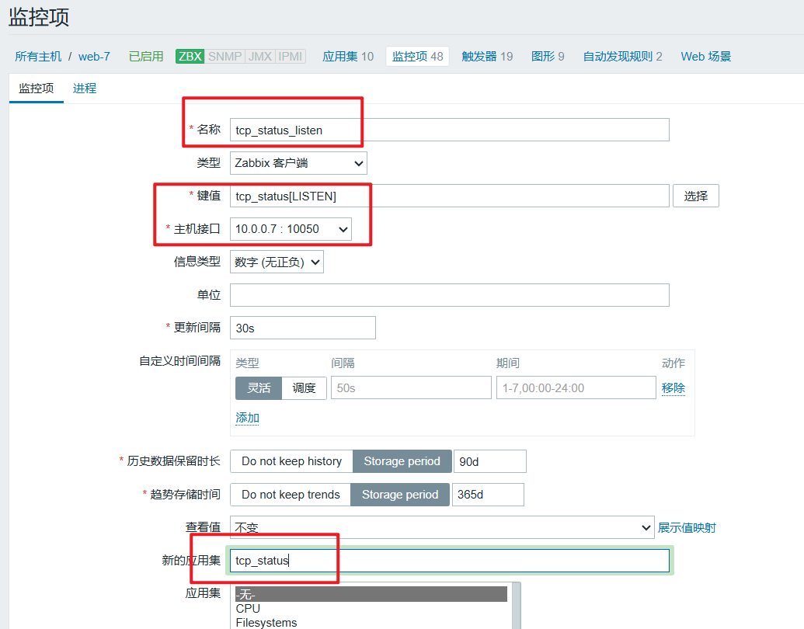
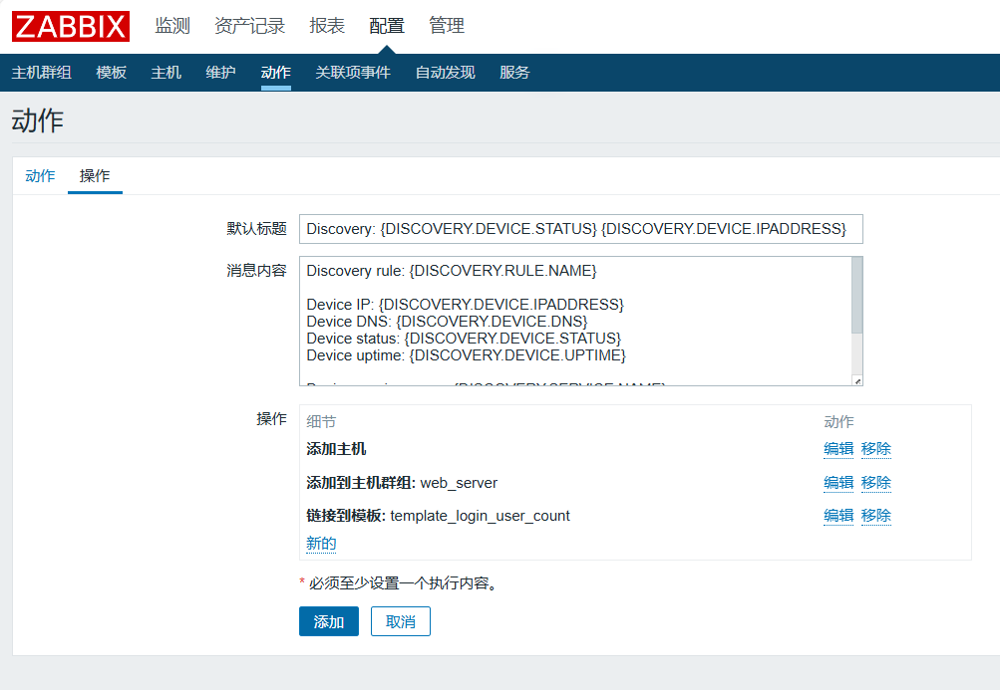

# Zabbix

```bash
# 官网
https://www.zabbix.com/
```

## zabbix部署

### 服务段部署安装

```bash
# 1.配置yum仓库

# 安装zabbix.repo仓库文件
rpm -ivh https://mirrors.aliyun.com/zabbix/zabbix/4.0/rhel/7/x86_64/zabbix-release-4.0-1.el7.noarch.rpm

# 改成阿里源
sed -i 's#repo.zabbix.com#mirrors.aliyun.com/zabbix#g' /etc/yum.repos.d/zabbix.repo

# 2.安装zabbix-server服务端，以及数据库

# zabbix-server-mysql   以mysql作为存储开发的zabbix-server服务端程序
# zabbix-web-mysql 		php核心程序，zabbix-UI页面，也是以mysql为存储版本
# zabbix-agent		   采集客户端数据的核心程序 ，自己监控自己
# mariadb-server		安装mysql服务端程序

yum install -y zabbix-server-mysql zabbix-web-mysql zabbix-agent mariadb-server

# 启动mysql，切创建用户，待会用于和zabbix链接，以及创建zabbix库，存储数据。
# 启动mariadb数据库，设置开机自启
systemctl start mariadb && systemctl enable mariadb

# 3.设置mariadb数据库，创建zabbix库，存储监控数据，且创建账号

mysqladmin password linux123
mysql -uroot -plinux123 -e 'show databases'

mysql -uroot -plinux123 -e 'create database zabbix character set utf8 collate utf8_bin;'

# 创建用户账户，zabbix 密码是 linux123
# 给与权限是，zabbix这个用户 ，对于zabbix这个库，下的所有表，都是最大权限
mysql -uroot -plinux123 -e "grant all privileges on zabbix.* to zabbix@localhost identified by 'linux123';"

# 技巧，查找命令来自于哪个软件包，便于你去安装  1111
yum provides zcat 
yum install gzip -y


# 4.导入zabbix服务端的数据库内容

# 用zcat直接读取gz压缩包的数据，切管道符交给mysql命令导入数据，往zabbix库中导入数据
zcat /usr/share/doc/zabbix-server-mysql-4.0.50/create.sql.gz | mysql -uroot -plinux123 zabbix

# 5. 修改zabbix-server服务端配置文件，指明自己的ip，便于agent去连接

cat > /etc/zabbix/zabbix_server.conf <<'EOF'
LogFile=/var/log/zabbix/zabbix_server.log
LogFileSize=0
PidFile=/var/run/zabbix/zabbix_server.pid
SocketDir=/var/run/zabbix
DBHost=localhost 
DBName=zabbix
DBUser=zabbix
DBPassword=linux123
SNMPTrapperFile=/var/log/snmptrap/snmptrap.log
Timeout=4
AlertScriptsPath=/usr/lib/zabbix/alertscripts
ExternalScripts=/usr/lib/zabbix/externalscripts
LogSlowQueries=3000
EOF

# 配置文件里面，不支持中文，因此笔记自己看就行
LogFile=/var/log/zabbix/zabbix_server.log
LogFileSize=0
PidFile=/var/run/zabbix/zabbix_server.pid
SocketDir=/var/run/zabbix
DBHost=localhost   # 指明mysql的地址 zabboix-server mysql 
DBName=zabbix   # 数据库名字
DBUser=zabbix	# 数据库的链接用户  
DBPassword=linux123  # 数据库密码
SNMPTrapperFile=/var/log/snmptrap/snmptrap.log
Timeout=4
AlertScriptsPath=/usr/lib/zabbix/alertscripts   # 存放自定义监控项脚本的目录 
ExternalScripts=/usr/lib/zabbix/externalscripts
LogSlowQueries=3000

# 6.服务端配置文件也写好了,启动zabbix服务端且设置开机自启
systemctl start zabbix-server && systemctl enable zabbix-server

# 7.检查zabbix-server的端口是否运行  10051
netstat -tunlp|grep zabbix

```


### apache配置

只需要改一个时区设置，改为中国即可，因为你得让zabbix支持中文

```bash
[root@master-61 ~]#grep -i shanghai /etc/httpd/conf.d/zabbix.conf 
        php_value date.timezone Asia/Shanghai

启动80端口的apache服务了


```


### zabbix-UI前端配置

```bash
10.0.0.61:80/zabbix   访问改url才能访问zabbix

浏览器  > httpd  >  转发给底层处理php请求的模块


默认账户密码
Admin
zabbix
```


### 修改图形的数据展示（默认字体有问题）

```bash
下载字体，修改zabbix的字体支持
# 文泉仪微黑字体
yum install wqy-microhei-fonts -y

# 拷贝字体给zabbix用，覆盖图形字体
cp /usr/share/fonts/wqy-microhei/wqy-microhei.ttc /usr/share/zabbix/assets/fonts/graphfont.ttf 
```


## zabbix添加主机去监控

### zabbix-server监控自己

```bash
给zabbix-server机器安装上agent进程，改配置，启动即可

# 友情提醒，先做好时间同步！！
ntpdate -u ntp.aliyun.com

# 1.目标机器安装zabbix-agent 
rpm -ivh https://mirrors.aliyun.com/zabbix/zabbix/4.0/rhel/7/x86_64/zabbix-agent-4.0.11-1.el7.x86_64.rpm

rpm -qa zabbix-agent

# 2.修改zabbix-agent配置文件

cat > /etc/zabbix/zabbix_agentd.conf <<"EOF"
PidFile=/var/run/zabbix/zabbix_agentd.pid 
LogFile=/var/log/zabbix/zabbix_agentd.log
LogFileSize=0
Server=10.0.0.61
Include=/etc/zabbix/zabbix_agentd.d/*.conf
EOF

# 3.启动agent
systemctl start zabbix-agent && systemctl enable zabbix-agent
```


### 在添加个机器web-9去监控

```bash
install_agent.sh


ntpdate -u ntp.aliyun.com

rpm -ivh https://mirrors.aliyun.com/zabbix/zabbix/4.0/rhel/7/x86_64/zabbix-agent-4.0.11-1.el7.x86_64.rpm

cat > /etc/zabbix/zabbix_agentd.conf <<"EOF"
PidFile=/var/run/zabbix/zabbix_agentd.pid 
LogFile=/var/log/zabbix/zabbix_agentd.log
LogFileSize=0
Server=10.0.0.61
Include=/etc/zabbix/zabbix_agentd.d/*.conf
EOF

systemctl start zabbix-agent && systemctl enable zabbix-agent

netstat -tunlp|grep zabbix
```


**去UI界面添加主机**


### 安装好zabbix-get命令后，检测是否通信

```bash
tail -f /var/log/zabbix/*

# zabbix-get命令
yum install zabbix-get -y

zabbix_get -s 10.0.0.9 -k agent.ping
zabbix_get -s 10.0.0.9 -k system.hostname
```


## 自定义监控项

### 实战案例，tcp的11个状态监控

```bash
1. 命令获取tcp的状态

linux下的socket是什么作用？

ip:port  网络套接字链接，2台机器之间建立的链接，称之为socket链接

机器A                    访问机器B的 nginx

机器A-ip:随机端口
10.0.0.7:44154     >     10.0.0.8:80

这就是一个socket链接记录，可以通过netstat看到，是谁，连接了web8这个机器

# -a 显示所有socket
# -t显示tcp协议连接
# -n 只显示ip（系统打印主机名）
netstat -ant
```


### zabbix自定义监控11种TCP状态全操作

```bash
# 1. 思考清楚，11种状态如何采集的命令

netstat -ant |grep -c 'TCP状态'

# 2. 编写zabbix-agent的配置文件，自定义key的配置文件
给了大家3种TCP状态的采集写法，作为参考

cat >/etc/zabbix/zabbix_agentd.d/tcp_status.conf <<'EOF'
UserParameter=LISTEN,netstat -ant|grep -c LISTEN
UserParameter=TIME_WAIT,netstat -ant|grep -c TIME_WAIT
UserParameter=ESTABLISHED,netstat -ant|grep -c ESTABLISHED
EOF

重启agent
systemctl restart zabbix-agent.service 

服务端zabbix_get 验证下
zabbix_get -s 10.0.0.7 -k LISTEN

建议用如下优化写法,传参形式,一个配置文件语法,即可提取11种状态的值
# zabbix配置文件，支持传参的用法
cat > /etc/zabbix/zabbix_agentd.d/tcp_status.conf <<'EOF'
UserParameter=tcp_status[*],netstat -ant|grep -c $1
EOF

```


### 图形化添加监控项




```bash
# 给web7发1000个请求试试，1000个tcp状态

ab -c 10 -n 1000 http://10.0.0.7/
```


### 触发器添加


## 报警媒介

### 邮件报警的配置


#### 配置监控登录用户数量的自定义key

```bash
判断当前机器登录的用户数量，超过3个

# 1.根据需求，使用命令采集出信息
who | wc -l

# 2.写zabbix-agent的配置文件
cat > /etc/zabbix/zabbix_agentd.d/userparameter_login_user.conf << "EOF"
UserParameter=login.user,who|wc -l
EOF

# 3.重启agent
systemctl restart zabbix-agent.service 


crontab -e 

* * * * * ntpdate -u ntp1.aliyun.com
```


#### 发件人的设置


#### 收件人的配置


#### 设置发信息动作


#### 自定义报警内容


```bash
# 官方文档

https://www.zabbix.com/documentation/4.0/zh/manual/appendix/macros/supported_by_location
```


```bash

默认标题：故障{TRIGGER.STATUS},服务器:{HOSTNAME1}发生: {TRIGGER.NAME}故障!


=======发生了如下的报警问题=================
告警主机:{HOSTNAME1} {HOST.IP}
告警时间:{EVENT.DATE} {EVENT.TIME}
告警等级:{TRIGGER.SEVERITY}
告警信息: {TRIGGER.NAME}
告警项目:{TRIGGER.KEY1}
问题详情:{ITEM.NAME}:{ITEM.VALUE}
当前状态:{TRIGGER.STATUS}:{ITEM.VALUE1}
事件ID:{EVENT.ID}　　
=========================================

```


#### 自定义恢复内容


```

恢复标题：恢复{TRIGGER.STATUS}, 服务器:{HOSTNAME1}: {TRIGGER.NAME}已恢复!

=================恢复信息==============
告警主机:{HOSTNAME1} {HOST.IP}
告警时间:{EVENT.DATE} {EVENT.TIME}
告警等级:{TRIGGER.SEVERITY}
告警信息: {TRIGGER.NAME}
告警项目:{TRIGGER.KEY1}
问题详情:{ITEM.NAME}:{ITEM.VALUE}
当前状态:{TRIGGER.STATUS}:{ITEM.VALUE1}
事件ID:{EVENT.ID}
=======================================

```


#### zabbix在UI上完成执行脚本报警动作

```bash
# 1.需要设置zabbix-server的配置文件，设置一个脚本目录，zabbix才能去这里去找到脚本且执行

cat  /etc/zabbix/zabbix_server.conf 


LogFile=/var/log/zabbix/zabbix_server.log
LogFileSize=0
PidFile=/var/run/zabbix/zabbix_server.pid
SocketDir=/var/run/zabbix
DBHost=localhost 
DBName=zabbix
DBUser=zabbix
DBPassword=linux0224
SNMPTrapperFile=/var/log/snmptrap/snmptrap.log
Timeout=4
AlertScriptsPath=/usr/lib/zabbix/alertscripts
ExternalScripts=/usr/lib/zabbix/externalscripts
LogSlowQueries=3000
# zabbix定义的一个脚本目录，到时候记得删掉注释
AlertScriptsPath=/usr/lib/zabbix/alertscripts

# 2.bash py的脚本放入该目录即可，还得注意权限
chown zabbix.zabbix weixin.sh 
chmod +x weixin.sh
```


### 钉钉报警

```bash
创建钉钉群聊
创建自定义机器人
创建报警关键词
生成webhook认证信息
开发报警脚本
填写zabbix-UI界面的配置
测试钉钉报警通知


zabbix-server 脚本存放位置

cat /etc/zabbix/zabbix_server.conf 

AlertScriptsPath=/usr/lib/zabbix/alertscripts
```


## zabbix监控核心业务

### nginx-status监控流程

```bash
1. 先开发一个web服务器的nginx，status页面的功能（nginx配置，你还是否记得）
创建nginx子配置文件

cat > /etc/nginx/conf.d/status.conf <<'EOF'
server{

    listen 80;
    server_name localhost;
    
    # 访问改url，即可定位到状态页功能， 10.0.0.7:80/nginx_status
    location /nginx_status {
    	# 开启status状态页面功能的参数
        stub_status on;
        # 关闭访问日志的记录
        access_log off;
    }
}
EOF

2. 重启nginx，查看是否可访问
nginx -t 
nginx
nginx -s reload

```


### 写脚本，采集status页面的数据

```bash
# 创建agent的自定义key配置文件

cat /etc/zabbix/zabbix_agentd.d/nginx_status.conf

UserParameter=nginx_status[*],/bin/bash /etc/zabbix/zabbix_agentd.d/nginx_status.sh $1
```


```bash
# 自定义监控内容，也就是自定义key的操作
# 脚本核心思路就是，提取status页面的数值，交给zabbix

# 1.开发监控nginx脚本

#!/bin/bash
# 接受脚本的第一个参数
# 由于nginx的status状态太多，写为一个接受参数的key
# status_nginx[*]  

NGINX_COMMAND=$1
CACHEFILE="/tmp/nginx_status.log"

CMD="/usr/bin/curl http://127.0.0.1/nginx_status"

# 判断是否有status日志文件
if [ ! -f $CACHEFILE ];then
    $CMD >$CACHEFILE 2>/dev/null
fi


# 检查status日志有效期，限定状态文件在60秒内
# 记录最后一次status日志的生成时间（秒）
STATUS_TIME=$(stat -c %Y $CACHEFILE)

# 以unix时间计算，seconds since 1970-01-01 00:00:00 UTC
# 当前系统时间减去日志时间，推算，是否超过60秒，超过就立即重新生成
TIMENOW=$(date +%s)

if [  $[ $TIMENOW - $STATUS_TIME ]  -gt 60 ];then
    rm -f $CACHEFILE
fi

if [ ! -f $CACHEFILE ];then
    $CMD > $CACHEFILE 2>/dev/null 
fi


nginx_active(){
    grep 'Active' $CACHEFILE |awk '{print $NF}'
    exit 0;
}

nginx_reading(){
    grep 'Reading' $CACHEFILE |awk '{print $2}'
    exit 0;
}

nginx_writing(){
    grep 'Writing' $CACHEFILE |awk '{print $4}'
    exit 0;
}

nginx_waiting(){
    grep 'Waiting' $CACHEFILE |awk '{print $6}'
    exit 0;
}

nginx_accepts(){
    awk NR==3 $CACHEFILE|awk '{print $2}'
    exit 0;
}

nginx_handled(){
    awk NR==3 $CACHEFILE|awk '{print $2}'
    exit 0;
}

nginx_requests(){
    awk NR==3 $CACHEFILE|awk '{print $3}'
    exit 0;
}


# 对脚本传入参数判断，需要获取什么值
# 如下参数，都是nginx的链接状态，
case $NGINX_COMMAND in 
    active)
        nginx_active ;;
    reading)
        nginx_reading;;
    writing)
        nginx_writing;;
    waiting)
        nginx_waiting;;
    accepts)
        nginx_accepts;;
    handled)
        nginx_handled;;
    requests)
        nginx_requests;;
    *)
        echo "Invalid arguments" 
        exit 2
        ;;
esac


cat /etc/zabbix/zabbix_agentd.d/nginx_status.sh
```


### 手工测试

```bash
zabbix_get -s 10.0.0.7 -k nginx_status[active]

```


### php-status监控流程

```bash
# 1.基于php-fpm进程做的实验

yum install php-fpm -y

修改配置文件，开启php，status功能即可，打开如下参数即可
要求你访问php状态页面的入口就是/php_status

grep 'status_'  /etc/php-fpm.d/www.conf 

pm.status_path = /php_status


# 2.设置nginx转发
cat /etc/nginx/conf.d/status.conf

server{

    listen 80;
    server_name localhost;

    # 访问改url，即可定位到状态页功能， 10.0.0.7:80/nginx_status
    location /nginx_status {
    # 开启status状态页面功能的参数
        stub_status on;
        # 关闭访问日志的记录
        access_log off;
    }


	location /php_status {
    	fastcgi_pass 127.0.0.1:9000;
   	 	fastcgi_index index.php;
   		fastcgi_param SCRIPT_FILENAME  		html$fastcgi_script_name;
   		include fastcgi_params;
	}

}


# 3.重启nginx，php-fpm
systemctl restart nginx php-fpm

```


### 自定义监控项套路

```bash
1.写配置文件，自定义key
2.写脚本
3.重启agent
4.添加zabbix-UI
```


### 配置文件

```bash
# 创建agent的自定义key配置文件
cat /etc/zabbix/zabbix_agentd.d/php_status.conf

UserParameter=php_status[*],/etc/zabbix/zabbix_agentd.d/php_status.sh  $1

```


### 写脚本

```bash
#!/bin/bash
# 这是一个简单的监控php-fpm状态值的脚本

comm_para=$1
PHP_URL=$2
cmd="/usr/bin/curl $url"
cachefile=/tmp/php_status.txt
port=80

file_time=`stat -c %Y $cachefile`
now_time=`date +%s`
rm_file=$(($now_time-$file_time))
if [ -z $2 ];then
    url=http://127.0.0.1:$port/php_status
else
    url=$PHP_URL
fi
cmd="/usr/bin/curl $url"

if [ ! -e $cachefile ];then
    $cmd > $cachefile 2>/dev/null
fi

if [ $rm_file -gt 60 ];then
    rm -rf $cachefile
fi

if [ ! -f $cachefile ];then
    $cmd > $cachefile 2>/dev/null
fi

start_since() {
    #运行时长
    cat $cachefile | awk '/since/{print $3}'
    exit 0;
}

accepted_conn() {
    cat $cachefile | awk '/accepted/{print $3}'
    exit 0;
}

listen_queue(){ 
        cat $cachefile | awk '{if(NR==6){print $3}}'
    exit 0;
}

max_listen_queue(){
    cat $cachefile | awk '{if(NR==7){print $4}}'
    exit 0;
}

listen_queue_len() {
    cat $cachefile | awk '{if(NR==8){print $4}}'
    exit 0;
}

idle_processes() {
    cat $cachefile | awk '/idle/{print $3}'
    exit 0;
}

active_processes() {
    cat $cachefile | awk '{if(NR==10){print $3}}'
    exit 0;
}

total_processes() {
    cat $cachefile | awk '{if(NR==11){print $3}}'
        exit 0;
}

max_active_processes() {
    cat $cachefile | awk '{if(NR==12){print $4}}'
        exit 0;
}

max_children_reached() {
    cat $cachefile | awk '{if(NR==13){print $4}}'
        exit 0;
}

slow_requests() {
    cat $cachefile | awk '{if(NR==14){print $3}}'
        exit 0;
}

check() {
        php_pro_count=`ss -tunlp|grep php-fpm|wc -l`
        echo $php_pro_count
}

case "$comm_para" in 
    start_since)
        start_since 
        ;;
    accepted_conn)
        accepted_conn
        ;;
    listen_queue)
        listen_queue
        ;;
    max_listen_queue)
        max_listen_queue
        ;;
    listen_queue_len)
        listen_queue_len
        ;;
    idle_processes)
        idle_processes
        ;;
    active_processes)
        active_processes
        ;;
    total_processes)
        total_processes
        ;;
    max_active_processes)
        max_active_processes
        ;;
    max_children_reached)
        max_children_reached
        ;;
    slow_requests)
        slow_requests
        ;;
    check)
        check
        ;;
    *)    
        echo "invalid status"
        exit 2;
esac


```


### 记得权限

```bash

chown -R zabbix.zabbix /etc/zabbix/zabbix_agentd.d/*
chmod +x /etc/zabbix/zabbix_agentd.d/*.sh

```


## zabbix工作模式

### 修改zabbix-agent为主动模式

```bash
cat > /etc/zabbix/zabbix_agentd.conf <<"EOF"

PidFile=/var/run/zabbix/zabbix_agentd.pid
LogFile=/var/log/zabbix/zabbix_agentd.log
LogFileSize=0
Server=10.0.0.61
ServerActive=10.0.0.61
Hostname=web-7
Include=/etc/zabbix/zabbix_agentd.d/*.conf

EOF


# 重启agent服务
systemctl restart zabbix-agent.service 


注意
agent的主机名一定要与UI界面主机名对上
```


### 自动发现





### 给web-8自动装

```bash
# 1.目标机器安装zabbix-agent

rpm -ivh https://mirrors.aliyun.com/zabbix/zabbix/4.0/rhel/7/x86_64/zabbix-agent-4.0.11-1.el7.x86_64.rpm


# 2.修改配置文件
cat > /etc/zabbix/zabbix_agentd.conf <<"EOF"
PidFile=/var/run/zabbix/zabbix_agentd.pid 
LogFile=/var/log/zabbix/zabbix_agentd.log
LogFileSize=0
Server=10.0.0.61
ServerActive=10.0.0.61
Hostname=web-8
Include=/etc/zabbix/zabbix_agentd.d/*.conf
EOF

# 3.启动agent
systemctl start zabbix-agent && systemctl enable zabbix-agent

netstat -tunlp | grep zabbix
```

