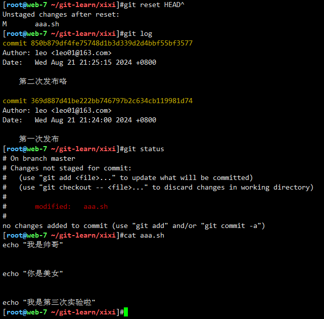
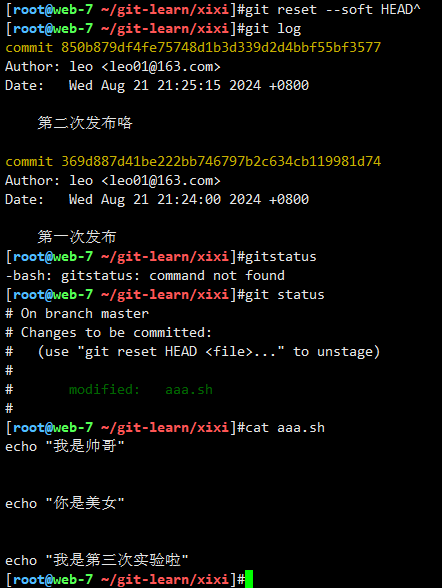
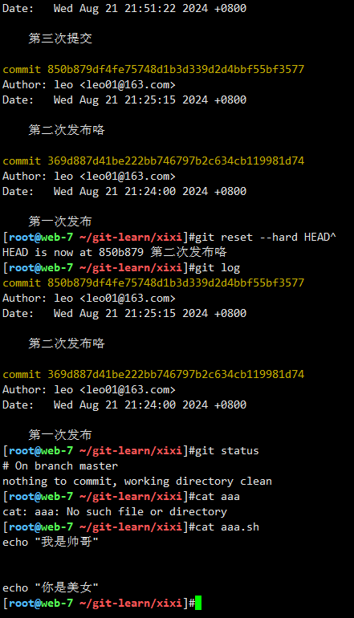

# 敏捷开发流水线


## 01-git工具

### git下载与身份设置

```bash
yum install git -y


--system
--global
--local

/etc/gitconfig 文件: 包含系统上每一个用户及他们仓库的通用配置。 如果使用带有 --system 选项的 git config 时，它会从此文件读写配置变量。(针对任意登录该linux的用户都生效)
~/.gitconfig 或 ~/.config/git/config 文件：只针对当前用户。 可以传递 --global 选项让 Git 读写此文件。(只针对当前登录系统的用户生效)
当前使用仓库的 Git 目录中的 config 文件（就是 .git/config）：针对该仓库。 --local 当前仓库配置。（只针对某一个文件夹生效，例如/learn/linux/.git/config）


# 因为git是分布式版本控制系统，因为要区分出，到底是谁进行了版本管理，也就是提交的版本记录，都是有名字，有时间的

# 因此用git之前要先设置git的身份设置

git config --global user.name "leo"
git config --global user.email "leo01@163.com"
git config --global color.ui true

列出git设置
git config --list

我们这里配置的是--global参数，因此是在用户家目录下，可以查看
cat ~/.gitconfig
```


### 三种回退

```bash
# 1. 撤销 commit、并撤销 git add . 操作、不撤销修改代码
git reset HEAD^

# 2. 撤销 commit、不撤销git add . 操作、不撤销修改代码
git reset --soft HEAD^

# 3. 撤销 commit、撤销 git add . 操作、撤销修改代码
git reset --hard HEAD^

# 查看HEAD
git reflog
```











## 02-git与gitee


### git分支

```bash
# 查看分支
git branch

# 创建分支
git branch laoliu

# 切换分支
git checkout laoliu

# 创建并切换
git checkout -b laoba


# 合并分支，首先确实回到master分支
git checkout master
git merge laoba

git status

# 删除分支
git branch -d laoliu

# 切换远程仓库
git remote -v

git remote remove origin

git remote add origin 远程仓库地址
```


## 03-gitlab私有仓库搭建

### gitlib安装

```bash
都装/opt下

# 1.安装gitlab需要的依赖包
yum install curl policycoreutils-python openssh-server postfix wget -y

# 2.安装gitlab主程序，找到安装包
https://packages.gitlab.com/gitlab/

wget https://packages.gitlab.com/gitlab/gitlab-ce/packages/el/7/gitlab-ce-12.0.3-ce.0.el7.x86_64.rpm


# 用下边的下载拖进来
https://mirrors.aliyun.com/gitlab-ce/yum/el7/?spm=a2c6h.25603864.0.0.11834850uGLFQ5

rpm -ivh gitlab-ce-10.8.3-ce.0.el7.x86_64.rpm

yum localinstall gitlab-ce-10.8.3-ce.0.el7.x86_64.rpm

```


### gitlab基础设置

```bash
配置gitlab服务，修改域名和邮箱
设置参数如下

grep -E '^[a-Z]' /etc/gitlab/gitlab.rb

external_url 'http://10.0.0.88'

gitlab_rails['gitlab_email_enabled'] = true
gitlab_rails['gitlab_email_from'] = '2366993844@qq.com'
gitlab_rails['gitlab_email_display_name'] = 'linux_learn'

gitlab_rails['smtp_enable'] = true
gitlab_rails['smtp_address'] = "smtp.qq.com"
gitlab_rails['smtp_port'] = 465
gitlab_rails['smtp_user_name'] = "2366993844@qq.com"
gitlab_rails['smtp_password'] = "tizhpfzylgdzdigg"
gitlab_rails['smtp_domain'] = "smtp.qq.com"
gitlab_rails['smtp_authentication'] = "login"
gitlab_rails['smtp_enable_starttls_auto'] = true
gitlab_rails['smtp_tls'] = true


修改了gitlab的配置，务必要重新加载gitlab配置
重新配置gitlab，首次执行会很慢

gitlab-ctl reconfigure

执行命令，测试是否可以发邮件
gitlab-rails console

执行如下命令测试发邮件即可
Notify.test_email('lalala3581018@163.com','lalala','hello linux').deliver_now

```

授权码

```bash
tdgfmtcnezjqebab
```


### gitlab命令行管理

```bash
gitlab-ctl start 启动所有服务
gitlab-ctl stop  停止 
gitlab-ctl stop postgresql  停止某个服务 
gitlab-ctl restart 
gitlab-ctl status
gitlab-ctl reconfigure   重新读取gitlab配置  
gitlab-ctl tail  查看gitlab的运行状态，所有服务状态  
gitlab-ctl tail redis 只看某个服务的状态
```


### 默认先改密码然后登录

```bash
root
自己改的密码
linux001

laowen
laowen666

laoliu
laoliu666
```


### 使用开发者profile推送代码到远程仓库

```bash
先用root创建readme文件

克隆远程仓库到本地
git clone git@10.0.0.88:linux_study/python_test.git

开发者profile创建分支，因为有master保护

git checkout -b laoliu

echo -e "lalala
woshidashuaige" > shuaige.py

git add .
git commit -m 'shuaigediyici'

git push -u origin laoliu

会生成merge的url，复制打开
http://10.0.0.88/linux_study/python_test/merge_requests/new?merge_request%5Bsource_branch%5D=laoliu
```


## 04-jenkins

### jenkins部署

```bash
都装/opt下

# 1.jkd安装
wget --no-check-certificate --no-cookies --header "Cookie: oraclelicense=accept-securebackup-cookie" http://download.oracle.com/otn-pub/java/jdk/8u131-b11/d54c1d3a095b4ff2b6607d096fa80163/jdk-8u131-linux-x64.rpm

rpm -ivh jdk-8u131-linux-x64.rpm

#JDK默认安装路径: /usr/java/jdk1.8.0_131
 vim /etc/profile
 
 #set java environment;
   JAVA_HOME=/usr/java/jdk1.8.0_131  #注意#修改为自己的路径，和jdk文件名
   CLASSPATH=.:$JAVA_HOME/lib.tools.jar
   PATH=$JAVA_HOME/bin:$PATH
   export JAVA_HOME CLASSPATH PATH

1. source /etc/profile
2. java -version
   #出现jdk版本即安装成功

# 2.jenkins安装
wget https://repo.huaweicloud.com/jenkins/redhat-stable/jenkins-2.346.3-1.1.noarch.rpm

rpm -ivh jenkins-2.346.3-1.1.noarch.rpm

# jenkins启动路径不包含我们安装的java路径，所以要修改
vim /etc/init.d/jenkins 

candidates="
/etc/alternatives/java
/usr/lib/jvm/java-1.8.0/bin/java
/usr/lib/jvm/jre-1.8.0/bin/java
/usr/lib/jvm/java-11.0/bin/java
/usr/lib/jvm/jre-11.0/bin/java
/usr/lib/jvm/java-11-openjdk-amd64
/usr/bin/java
/usr/java/jkd1.8.0_161/bin/java  #修改添加路径
"

#修改jenkins执行用户
vim /etc/sysconfig/jenkins

JENKINS_USER="root"

#上边已经没用了，最新要在下边文件配置
vim /usr/lib/systemd/system/jenkins.service

User=root
Group=root

systemctl daemon-reload
systemctl restart jenkins

# 启动jenkins
systemctl start jenkins


#在 /etc/init.d/ 执行
./jenkins start  #启动服务

#其他指令
./jenkins stop    #关闭服务
./jenkins restart #重启服务


rpm -ql jenkins


# 查看默认登录密码
cat /var/lib/jenkins/secrets/initialAdminPassword


laowen
laowen666

```

### jeknins 密码忘记

```bash
cp /var/lib/jenkins/config.xml{,.bak}


删除config.xml 的如下配置

  8   <useSecurity>true</useSecurity>
  9   <authorizationStrategy class="hudson.security.FullControlOnceLoggedInAuthorizationStrategy">
 10     <denyAnonymousReadAccess>true</denyAnonymousReadAccess>
 11   </authorizationStrategy>
 12   <securityRealm class="hudson.security.HudsonPrivateSecurityRealm">
 13     <disableSignup>true</disableSignup>
 14     <enableCaptcha>false</enableCaptcha>
 15   </securityRealm>
 
 
 
 
 然后重启服务即可
systemctl restart jenkins

2，重启Jenkins服务

3，进入首页>“系统管理”>“Configure Global Security”；(全局安全配置)

4，勾选“启用安全”；

5，点选“Jenkins专有用户数据库”，并点击“保存”；

6，重新点击首页>“系统管理”,发现此时出现“管理用户”；

7，点击进入展示“用户列表”；

8，点击右侧进入修改密码页面，修改后即可重新登录。
```


### 导入本地插件

```bash


tar -zxf jenkins_plugins.tar.gz 

cd /opt/plugins

mv ./* /var/lib/jenkins/plugins/

```


### python练习my_flask自动化

```python
# coding:utf-8

from flask import Flask
app = Flask(__name__)

@app.route('/')
def index():
    return '<h1>我是真的帅啊</h1>'

if __name__ == '__main__':
    app.run(host="0.0.0.0")
    
my_flask.py
```


```bash
开发去推代码到gitlab
 
jenkins去git clone代码到workspace

构建执行shell去发送脚本到web7机器上

```


```bash
# 构建shell

# 先把git clone下来的代码压缩，因为自己会在jenkins的workspace里边，所以./*
tar -zcf all_linux_python.tgz ./*
# 把文件发送到指定服务器
scp all_linux_python.tgz root@10.0.0.7:/opt/
# 把脚本发送到远程目标机器
scp /my_shell/run_python_web7.sh root@10.0.0.7:/opt/
# 远程执行发布脚本
ssh root@10.0.0.7 'bash /opt/run_python_web7.sh'


# 写个部署脚本一起发过去
mkdir /my_shell
run_python_web7.sh
===============================================
#!/bin/bash

mkdir -p /opt/linux_python
tar -zxf /opt/all_linux_python.tgz -C /opt/linux_python

cd /opt/linux_python

yum install python3-devel python3 python3-pip -y > /dev/null

pip3 install flask

nohup python3 my_flask.py > nohup.log 2>&1 & 

===============================================
```


### 添加key

```bash
# 第一步先把工作机器的公钥添加到gitlab上的一个user下，意味着工作机器可以免密登录，使用user身份去操作库，就可以去clone，git等等操作
# 第二步用Jenkins服务器的公钥加到gitlab上的一个user下，同理
# 第三步给job配置Jenkins的私钥，那job就可以免密去操作gitlab的库，就可以实现ci
```


### 更新my_flask自动化

```bash
# 1.进入job工作区，代码发过去


# 远程创建一个源码目录
ssh root@10.0.0.7 "mkdir -p /opt/linux_python"
# 进入job的工作区，把当前所有源码，发到目标机器的目录下
cd ${WORKSPACE} && scp ./* root@10.0.0.7:/opt/linux_python/
# 将部署脚本，发到远程机器上
scp /my_shell/run_python_web7.sh root@10.0.0.7:/opt/
# 远程执行命令，再web7机器，部署flask项目
ssh root@10.0.0.7 "bash /opt/run_python_web7.sh"


# 2.部署操作写成脚本，发给目标机器

#!/bin/bash
cd /opt/linux_python/
yum install python3-devel python3 python3-pip -y > /dev/null
pip3 install flask

# 重启逻辑
kill -9 $(ps -ef|grep my_flask.py|grep -v grep | awk '{print $2}')

nohup python3 my_flask.py >nohup.log 2>&1  &
# 查看进程id
echo "当前python进程是：$(ps -ef|grep my_flask.py|grep -v grep | awk '{print $2}')"
```


### 自动化发布静态页面

```bash
练习

https://gitee.com/lvyeyou/DaShuJuZhiDaPingZhanShi
```


#### 配置jenkins构建shell

```bash
#!/bin/bash

DATE=$(date +%Y-%m-%d-%H-%M-%S)
web_server_list="10.0.0.7 10.0.0.8"

get_code(){
cd ${WORKSPACE} && \
tar -zcf /opt/web-${DATE}.tar.gz ./*
}

scp_web_server(){
for hosts in web_server_list
do
	scp /opt/web-${DATE}.tar.gz root@${host}:/opt/
	ssh root@${hosts} "mkdir -p /code/web-${DATE} && \
    tar -zxf /opt/web-${DATE}.tar.gz -C /code/web-${DATE}
    rm -rf /code/web && \
    ln -s /code/web-${DATE} /code/web
    "
done
}

deploy(){
	get_code
	scp_web_server
}

deploy
```

#### 自己电脑版本

```bash
#!/bin/bash

DATE=$(date +%Y-%m-%d-%H-%M-%S)
web_server="10.0.0.7"

get_code(){
cd ${WORKSPACE} && \
tar -zcf /opt/web-${DATE}.tar.gz ./*
}

scp_web_server(){
	scp /opt/web-${DATE}.tar.gz root@${web_server}:/opt/
	ssh root@${web_server} "mkdir -p /code/web-${DATE} && \
    tar -zxf /opt/web-${DATE}.tar.gz -C /code/web-${DATE}
    rm -rf /code/web && \
    ln -s /code/web-${DATE} /code/web
    "
}

deploy(){
	get_code
	scp_web_server
}

deploy
```

#### 配置目标机器web7

```bash
# nginx，找到具体的html，展示即可

cat > /etc/nginx/conf.d/monitor.conf <<'EOF'
server{

    listen 80;
    server_name _;
    location / {
    	# nginx会去这个目录下，找代码，index.html
    
        root /code/web/智慧城市/智慧工地;
        index index.html;
    }

}
EOF

# 重启
pkill -9 nginx
systemctl restart nginx
```

#### 捋一捋流程

```bash
1. 首先在gitlab上已经有了项目
2. Jenkins上也配置好了构建脚本
3. 目标机器上已经安装好ngixn，修改nginx配置文件就可以了
```


### 构建触发器（webhook），自动发布

```bash
# GitLab webhook URL
http://10.0.0.99:8080/project/test

94943ab3fd98f93e8e1bad4dc26f5c8b
```

#### jenkins配置


#### gitlab配置


## 05-sonarqube

### sonarq部署

#### mysql安装

```bash
https://downloads.mysql.com/archives/community/

https://downloads.mysql.com/archives/get/p/23/file/mysql-5.7.28-linux-glibc2.12-x86_64.tar.gz


# 创建用来访sonarq插件的
mkdir -p /opt/sonarq_all

# 就在家目录下载
wget https://downloads.mysql.com/archives/get/p/23/file/mysql-5.7.28-linux-glibc2.12-x86_64.tar.gz

tar zxf mysql-5.7.28-linux-glibc2.12-x86_64.tar.gz -C /opt/

# 创建软连接
mv /opt/mysql-5.7.28-linux-glibc2.12-x86_64 /opt/mysql-5.7.28
ln -s /opt/mysql-5.7.28 /opt/mysql

# 配置环境变量
echo 'export PATH=$PATH:/opt/mysql/bin/' >> /etc/profile

# source 和 . 同样效果
source /etc/profile
. /etc/profile

# 清除mariadb的依赖
rpm -qa|grep mariadb
yum remove mariadb-libs -y
rm -rf /etc/my.cnf

# 安装mysql5.7依赖
yum install -y libaio-devel

# 创建授权用户
useradd -M -s /sbin/nologin mysql

# 创建mysql数据目录
mkdir -p /linux0224_mysql_db/
chown -R mysql.mysql /linux0224_mysql_db/

# 给mysql安装目录授权
chown -R mysql.mysql /opt/mysql-5.7.28

# 初始化，生成mysql基础数据，如mysql自带的库，存储mysql用户信息等
--basedir mysql的二进制命令在那个目录
--datadir mysql的初始化数据在哪

mysqld --initialize-insecure --user=mysql --basedir=/opt/mysql --datadir=/linux0224_mysql_db/

# 创建mysql配置文件
cat> /etc/my.cnf <<'EOF'
[mysqld]
user=mysql
basedir=/opt/mysql
datadir=/linux0224_mysql_db/
socket=/tmp/mysql.sock

[mysql]
socket=/tmp/mysql.sock
EOF

# 复制mysql5.7提供的脚本，放入/etc/init.d/目录，交给systemctl去管理使用
cp /opt/mysql/support-files/mysql.server /etc/init.d/mysqld

# 启动mysql(/etc/init.d/mysqld)
systemctl daemon-reload
systemctl start mysqld
systemctl status mysqld
```


#### 安装sonarq

```bash
# 1.安装java环境，sonarq是java开发的需要jdk，jenkins已经装了，只需检查
java -version

# 2.解压软件源码，授权等配置
cd /opt/sonarq_all
unzip sonarqube-7.0.zip

useradd -M -s /sbin/nologin sonar
chown -R sonar.sonar /opt/sonarq_all/sonarqube-7.0

加软链接，方便后边操作
ln -s /opt/sonarq_all/sonarqube-7.0 /opt/sonarqube

# 3.修改sonarq软件的配置文件，链接mysql，存储数据
先设置mysql密码
mysql -uroot -p

set password for root@localhost = password('linux0224');

测试是否能够登录
mysql -uroot -plinux0224 -e "select user()"

cp /opt/sonarqube/conf/sonar.properties{,.bak}
# java 配置文件
# 配置sonnaqube连接mysql参数
cat > /opt/sonarqube/conf/sonar.properties << 'EOF'
sonar.jdbc.username=root
sonar.jdbc.password=linux0224
sonar.jdbc.url=jdbc:mysql://localhost:3306/sonar?useUnicode=true&characterEncoding=utf8&rewriteBatchedStatements=true&useConfigs=maxPerformance&useSSL=false
EOF

# 就是远程连接10.0.0.51：3306端口下的 sonar这个数据库
sonar.jdbc.url=jdbc:mysql://10.0.0.51:3306/sonar?

# 4.创建sonar数据库
mysql -uroot -plinux0224
create database sonar;

# 5.修改sonarqube启动脚本，指定运行用户
grep '^RUN_AS' /opt/sonarqube/bin/linux-x86-64/sonar.sh
RUN_AS_USER=sonar


# 6.创建sonarqube服务管理脚本，用systemctl去管理
cat >/usr/lib/systemd/system/sonar.service<<'EOF'
[Unit]
Description=sonar

[Service]
ExecStart=/opt/sonarqube/bin/linux-x86-64/sonar.sh start
ExecStop=/opt/sonarqube/bin/linux-x86-64/sonar.sh stop
Type=forking
User=sonar
Group=sonar

[Install]
WantedBy=multi-user.target
EOF

# 5.启动服务
systemctl daemon-reload 
systemctl start sonar
systemctl status sonar
```


### 初始化sonarq

```bash
# 登录账号密码都是
admin：admin
```


```bash
# token得记住
jenkins: f762113233ad7184c5472d583932d502a83922d4
```


```bash
# 很关键
sonar-scanner \
  -Dsonar.projectKey=linux0224 \
  -Dsonar.sources=. \
  -Dsonar.host.url=http://10.0.0.99:9000 \
  -Dsonar.login=f762113233ad7184c5472d583932d502a83922d4

```


### 导入插件

```bash
# 1.先备份之前插件
cp -a /opt/sonarqube/extensions/plugins/ /opt/sonarqube/extensions/plugins_bak

# 2.导入现有插件
tar xf /opt/sonarq_all/sonar_plugins.tar.gz -C /opt/sonarqube/extensions/

rm -rf /opt/sonarqube/extensions/plugins/sonar-java-plugin-5.1.0.13090.jar 


systemctl restart sonar.service
```


### 手工测试扫描结果

```bash
# 解压缩
unzip /opt/sonarq_all/sonar-scanner-cli-4.0.0.1744-linux.zip 

# 加入环境变量
echo 'export PATH=$PATH:/opt/sonarq_all/sonar-scanner-4.0.0.1744-linux/bin/' >> /etc/profile
source /etc/profile

sonar-scanner --help

# 手动扫描命令

sonar-scanner \
  -Dsonar.projectKey=linux0224 \
  -Dsonar.sources=. \
  -Dsonar.host.url=http://10.0.0.99:9000 \
  -Dsonar.login=f762113233ad7184c5472d583932d502a83922d4
  
  
  
# 下载源码测试
https://gitee.com/Tencent-BlueKing/bk-PaaS

git clone https://gitee.com/Tencent-BlueKing/bk-PaaS.git

sonar-scanner \
  -Dsonar.projectKey=linux0224 \
  -Dsonar.sources=. \
  -Dsonar.host.url=http://10.0.0.99:9000 \
  -Dsonar.login=f762113233ad7184c5472d583932d502a83922d4
  
```


### 测试加排错

#### 扫描Jenkins练习脚本

```bash
cd /var/lib/jenkins/workspace/nginx_html

执行扫描脚本
```


```bash
# 报错
Error when running: 'node -v'. Is Node.js available during analysis? No CSS files will be analyzed.
org.sonarsource.nodejs.NodeCommandException: Error when running: 'node -v'. Is Node.js available during analysis?


解决方法：在jenkins服务器上安装nodejs环境,然后重新推送就不会再报错了：

cat > /install_node12-13.sh <<'EOF'
cd /opt/
wget https://nodejs.org/dist/v12.13.0/node-v12.13.0-linux-x64.tar.xz
tar xf node-v12.13.0-linux-x64.tar.xz
mv node-v12.13.0-linux-x64 node
echo 'export PATH=$PATH:/opt/node/bin' >> /etc/profile
source /etc/profile
npm -v
node -v
EOF

# 解决不掉的windows下载拖进去
https://nodejs.org/en/blog/release/v12.13.0

```


## 07-docker部署

```bash
# 1.流量转发
cat > /etc/sysctl.d/docker.conf << EOF
net.bridge.bridge-nf-call-ip6tables = 1
net.bridge.bridge-nf-call-iptables = 1
net.ipv4.ip_forward=1
EOF

# 2.还是流量转发
modprobe br_netfilter

# 3.下载repo
curl -o /etc/yum.repos.d/Centos-7.repo http://mirrors.aliyun.com/repo/Centos-7.repo

# 4.下载docker的repo
curl -o /etc/yum.repos.d/docker-ce.repo http://mirrors.aliyun.com/docker-ce/linux/centos/docker-ce.repo

# 5.清缓存
yum clean all && yum makecache

# 6.下载docker
sudo yum install docker-ce-20.10.12 --nogpgcheck -y

docker --version

# 7.改Docker Client的代理（不需要）
vim /etc/profile 

export https_proxy=http://127.0.0.1:7890 
export http_proxy=http://127.0.0.1:7890 

source /etc/profile 

# 8.改Docker Daemod代理
sudo mkdir -p /etc/systemd/system/docker.service.d

vim /etc/systemd/system/docker.service.d/http-proxy.conf

[Service]
#不知道为什么这个可以不需要，只需要底下那个
#Environment="HTTP_PROXY=http://192.168.1.14:7890/"
Environment="HTTPS_PROXY=http://192.168.1.14:7890/"

# 9.启动docker，测试拉镜像
systemctl enable docker  
systemctl daemon-reload
systemctl start docker 

docker search nginx

docker pull  nginx
```


## 06-jenkins发布java项目

### 部署halo项目

#### 01-安装jdk

```bash
# 1.安装jdk环境
wget https://download.oracle.com/java/17/archive/jdk-17.0.11_linux-x64_bin.tar.gz

# 解压到指定文件夹
mkdir /usr/local/java/
tar -xzvf /software/java/jdk-17.0.11_linux-x64_bin.tar.gz -C /usr/local/java/

# 配置环境变量
vim /etc/profile

export JAVA_HOME=/usr/local/java/jdk-17.0.11
export PATH=$PATH:$JAVA_HOME/bin;
export CLASSPATH=.:$JAVA_HOME/lib/dt.jar:$JAVA_HOME/lib/tools.jar;

source /etc/profile

java -version

```


#### 02-安装mysql

```bash
# 2.安装mysql环境
wget https://downloads.mysql.com/archives/get/p/23/file/mysql-5.7.28-linux-glibc2.12-x86_64.tar.gz

tar zxf mysql-5.7.28-linux-glibc2.12-x86_64.tar.gz -C /opt/

# 创建软连接
mv /opt/mysql-5.7.28-linux-glibc2.12-x86_64 /opt/mysql-5.7.28
ln -s /opt/mysql-5.7.28 /opt/mysql

# 配置环境变量
echo 'export PATH=$PATH:/opt/mysql/bin/' >> /etc/profile

# source 和 . 同样效果
source /etc/profile
. /etc/profile

# 清除mariadb的依赖
rpm -qa|grep mariadb
yum remove mariadb-libs -y
rm -rf /etc/my.cnf

# 安装mysql5.7依赖
yum install -y libaio-devel

# 创建授权用户
useradd -M -s /sbin/nologin mysql

# 创建mysql数据目录
mkdir -p /linux_hola
chown -R mysql.mysql /linux_hola

# 给mysql安装目录授权
chown -R mysql.mysql /opt/mysql-5.7.28

# 初始化，生成mysql基础数据，如mysql自带的库，存储mysql用户信息等
--basedir mysql的二进制命令在那个目录
--datadir mysql的初始化数据在哪

mysqld --initialize-insecure --user=mysql --basedir=/opt/mysql --datadir=/linux_hola/

# 创建mysql配置文件
cat> /etc/my.cnf <<'EOF'
[mysqld]
user=mysql
basedir=/opt/mysql
datadir=/linux_hola/
socket=/tmp/mysql.sock

[mysql]
socket=/tmp/mysql.sock
EOF

# 复制mysql5.7提供的脚本，放入/etc/init.d/目录，交给systemctl去管理使用
cp /opt/mysql/support-files/mysql.server /etc/init.d/mysqld

# 启动mysql(/etc/init.d/mysqld)
systemctl daemon-reload
systemctl start mysqld
systemctl status mysqld

# mysql改密码
mysql -uroot -p

set password for root@localhost = password('linux0224');

# 创建halo数据库
create database halo;

mysql> show databases;
+--------------------+
| Database           |
+--------------------+
| information_schema |
| halo               |
| mysql              |
| performance_schema |
| sys                |
+--------------------+
5 rows in set (0.00 sec)


```


#### 03-halo包操作

```bash
# 创建存放运行包的目录
mkdir ~/app && cd ~/app

# 下载运行包
wget https://dl.halo.run/release/halo-2.19.0.jar -O halo.jar

# 创建工作目录
mkdir ~/.halo2 && cd ~/.halo2

# 创建Halo配置文件
vim application.yaml


server:
  # 运行端口
  port: 8090
spring:
  # 数据库配置，支持 MySQL、MariaDB、PostgreSQL、H2 Database，具体配置方式可以参考下面的数据库配置
  r2dbc:
    url: r2dbc:pool:mysql://localhost:3306/halo
    username: root
    password: linux0224
  sql:
    init:
      mode: always
      # 需要配合 r2dbc 的配置进行改动
      platform: mysql
halo:
  caches:
    page:
      # 是否禁用页面缓存
      disabled: true
  # 工作目录位置
  work-dir: /root/.halo2
  # 外部访问地址
  external-url: http://localhost:8090
  # 附件映射配置，通常用于迁移场景
  attachment:
    resource-mappings:
      - pathPattern: /upload/**
        locations:
          - migrate-from-1.x


# 测试运行 Halo
cd ~/app && java -jar halo.jar --spring.config.additional-location=optional:file:$HOME/.halo2/

```


### jar包部署玩法一

```bash
# 1.安装maven工具
yum install maven -y

# 2. 下载java源码
cd /opt

git clone https://gitee.com/yuco/springboot-test.git

# maven也得配置阿里源
# 找到maven的配置文件目录，yum安装的，默认都在etc目录下
/etc/maven/settings.xml 
修改如下
   <mirror>
           <id>alimaven</id>
           <mirrorOf>central</mirrorOf>
           <name>aliyun maven</name>
           <url>http://maven.aliyun.com/nexus/content/repositories/central/</url>
   </mirror>

# 4.启动,先打包，生成jar包，maven自动下载项目的依赖
mvn clean package

#生成当前源码目录下的 target目录下的jar包

# 启动，运行打包的jar包，查看进程
java -jar target/springboot-helloword-1.jar

# 在下图看到访问url
http://10.0.0.8:8080/say
```


### 项目流水线

#### 1 构建服务器检查

```bash
要在Jenkins服务器上构建
```


##### 1.1 java环境

```bash
# 1.jkd安装
wget --no-check-certificate --no-cookies --header "Cookie: oraclelicense=accept-securebackup-cookie" http://download.oracle.com/otn-pub/java/jdk/8u131-b11/d54c1d3a095b4ff2b6607d096fa80163/jdk-8u131-linux-x64.rpm

rpm -ivh jdk-8u131-linux-x64.rpm

#JDK默认安装路径: /usr/java/jdk1.8.0_131
 vim /etc/profile
 
 #set java environment;
   JAVA_HOME=/usr/java/jdk1.8.0_131  #注意#修改为自己的路径，和jdk文件名
   CLASSPATH=.:$JAVA_HOME/lib.tools.jar
   PATH=$JAVA_HOME/bin:$PATH
   export JAVA_HOME CLASSPATH PATH

1. source /etc/profile
2. java -version
   #出现jdk版本即安装成功
```


##### 1.2 maven环境

```bash
# 1.安装maven工具
yum install maven -y

# maven也得配置阿里源
# 找到maven的配置文件目录，yum安装的，默认都在etc目录下
/etc/maven/settings.xml 
修改如下
   <mirror>
           <id>alimaven</id>
           <mirrorOf>central</mirrorOf>
           <name>aliyun maven</name>
           <url>http://maven.aliyun.com/nexus/content/repositories/central/</url>
   </mirror>
   
   
# 2.换个方法，用rpm包直接安装
mkdir -p /opt/maven339 && cd /opt/maven339

拖文件进来

tar -zxf apache-maven-3.3.9-bin.tar.gz 

# 配置环境变量
vim /etc/profile

export PATH=$PATH:/opt/maven339/apache-maven-3.3.9/bin/

tail -1 /etc/profile
export PATH=$PATH:/opt/sonarq_all/sonar-scanner-4.0.0.1744-linux/bin/:/opt/maven339/apache-maven-3.3.9/bin/:/opt/mysql/bin/:/opt/node/bin

source /etc/profile

mvn -version

# maven也得配置阿里源
# 找到maven的配置文件目录，yum安装的，默认都在etc目录下
/opt/maven339/apache-maven-3.3.9/conf/settings.xml
修改如下
   <mirror>
           <id>alimaven</id>
           <mirrorOf>central</mirrorOf>
           <name>aliyun maven</name>
           <url>http://maven.aliyun.com/nexus/content/repositories/central/</url>
   </mirror>

```


##### 1.3 jenkins检查,配置Jenkins支持maven

```bash
# 安装Jenkins的时候已经导入插件了
```


```bash
# 先得有jdk才能装，如下图先寻找java路径
```


##### 1.4 配置ssh（ssh server）


#### 2 创建Jenkins任务

##### 2.1 创建任务


##### 2.2 git源码管理


##### 2.3 构建触发器webhook


```bash
GitLab webhook URL: http://10.0.0.99:8080/project/linux0224-java

10c875b10b1f7f5288d0a119d80e399a
```


##### 2.4 构建环境设置


```bash
# 填入mvn的构建参数
clean install -Dmaven.test.skip=true

# 都是在当前job工作区下的 target目录中，得到jar包
```


## 08-tomcat部署java项目

### 环境搭建

#### 安装jdk

```bash
# 1.用准备好的包
apache-tomcat-8.0.27.tar.gz 
jdk-8u221-linux-x64.tar.gz

# 2.解压安装包
tar -xf jdk-8u221-linux-x64.tar.gz -C /opt

# 3.创建软连接
ln -s /opt/jdk1.8.0_221/ /opt/jdk8

# 4.配置环境变量
sed -i.ori '$a export JAVA_HOME=/opt/jdk8\nexport PATH=$JAVA_HOME/bin:$JAVA_HOME/jre/bin:$PATH\nexport CLASSPATH=.$CLASSPATH:$JAVA_HOME/lib:$JAVA_HOME/jre/lib:$JAVA_HOME/lib/tools.jar' /etc/profile

tail -5 /etc/profile

source /etc/profile

java -version

```


#### 安装tomcat

```bash
# 1.解压
tar -xf apache-tomcat-8.0.27.tar.gz -C /opt/

# 2.创建软连接
ln -s /opt/apache-tomcat-8.0.27/ /opt/tomcat8

# 3.检查tomcat是否识别了jdk
/opt/tomcat8/bin/version.sh

```


#### 启动tomcat

```bash
# 启动命令
/opt/tomcat8/bin/startup.sh 

# 监测日志
tail -F /opt/tomcat8/logs/*

出现下边就算是成功了
==> /opt/tomcat8/logs/catalina.2024-10-07.log <==

07-Oct-2024 22:27:35.575 INFO [main] org.apache.coyote.AbstractProtocol.start Starting ProtocolHandler ["http-nio-8080"]

```


#### 访问tomcat

##### 修改tomcat认证账密

tomcat默认提供的功能都需要设置账密认证，否则无法访问，默认没有账密。

如果需要开启这个功能，就需要配置管理用户，即配置tomcat-users.xml 文件。

```bash
/opt/tomcat8/conf/tomcat-users.xml


 <role rolename="manager-gui"/>
 <role rolename="admin-gui"/>
 <user username="tomcat" password="linux0224" roles="manager-gui,admin-gui"/>


# 重启tomcat服务
/opt/tomcat8/bin/shutdown.sh
/opt/tomcat8/bin/startup.sh 
 
```


### tomcat部署Java网站

#### war包部署

```bash
jpress官网：https://www.jpress.cn/#:~:text=JPress%EF%BC%8C%E4%B8%80

把war包放到/opt/tomcat8/webapps

mv /opt/jpress.war /opt/tomcat8/webapps/

```


```bash
访问jpress网站，查看部署结果
http://10.0.0.8:8080/jpress

需要数据库支持，可以链接远程的mysql服务器，注意远程授权
# 远程授权root，远程链接，密码是linux0224

# mysql -uroot -p 链接你web-7的数据库
# 执行如下SQL，授权远程链接

grant all privileges on *.* to root@'%' identified by 'linux0224';
flush privileges;


admin
admin
```


### tomcat多实例

```bash
# 1.第一种，直接复制两份
/opt/tomcat1
/opt/tomcat2
所有文件都在目录下
如bin lib webapps conf logs...


# 2.第二种，分主程序目录和数据目录
主程序目录用同一个
数据目录分开如下

mkdir /tomcat{1,2}

cd /opt/tomcat8
mv webapps/ conf/ logs/ temp/ work/ -t /tomcat1/

cp -a /tomcat1/* /tomcat2/

```


#### tomcat启动脚本

```bash
mkdir /tomcat-sh

cd tomcat-sh/ && vim start_tomcat.sh

chmod 777 *.sh


#!/bin/bash

export CATALINA_HOME=/opt/tomcat8

# 删除参数结尾的斜线
export CATALINA_BASE=${1%/}

echo "本次脚本传入的实力目录是-----$CATALINA_BASE"

TOMCAT_ID=`ps aux |grep "java"|grep "Dcatalina.base=$CATALINA_BASE "|grep -v "grep"|awk '{ print $2}'`


if [ -n "$TOMCAT_ID" ] ; then
echo "tomcat(${TOMCAT_ID}) still running now , please shutdown it firest";
    exit 2;
fi

TOMCAT_START_LOG=`$CATALINA_HOME/bin/startup.sh`


if [ "$?" = "0" ]; then
    echo "$0 $1 start succeed"
else
    echo "$0 ${1%/} start failed"
    echo $TOMCAT_START_LOG
fi
```


#### 目录结构

```bash
# 主程序目录
[root@web-8 /]#ll /opt/tomcat8/
total 92
drwxr-xr-x 3 root root  4096 Oct  7 23:05 bin
drwxr-xr-x 2 root root  4096 Oct  7 22:14 lib
-rw-r--r-- 1 root root 57011 Sep 28  2015 LICENSE
drwxr-xr-x 2 root root    69 Oct 14 20:56 logs
-rw-r--r-- 1 root root  1444 Sep 28  2015 NOTICE
-rw-r--r-- 1 root root  6741 Sep 28  2015 RELEASE-NOTES
-rw-r--r-- 1 root root 16204 Sep 28  2015 RUNNING.txt


# 数据目录1

[root@web-8 /]#ll /tomcat1
total 0
drwxr-xr-x 3 root root 198 Oct 14 21:06 conf
drwxr-xr-x 2 root root 197 Oct  7 22:27 logs
drwxr-xr-x 2 root root  30 Oct  7 23:20 temp
drwxr-xr-x 8 root root 113 Oct  7 23:05 webapps
drwxr-xr-x 3 root root  22 Oct  7 22:27 work

# 数据目录2
[root@web-8 /]#ll /tomcat2
total 0
drwxr-xr-x 3 root root 198 Oct 14 21:08 conf
drwxr-xr-x 2 root root 197 Oct  7 22:27 logs
drwxr-xr-x 2 root root  30 Oct  7 23:20 temp
drwxr-xr-x 8 root root 113 Oct  7 23:05 webapps
drwxr-xr-x 3 root root  22 Oct  7 22:27 work

```


#### 配置多实例的配置文件

```bash
# 第一组
vim /tomcat1/conf/server.xml 


grep -E '8100|8101' /tomcat1/conf/server.xml 

<Server port="8100" shutdown="SHUTDOWN">
    <Connector port="8101" protocol="HTTP/1.1"
    
# 第二组    
vim /tomcat2/conf/server.xml 


grep -E '8200|8201' /tomcat2/conf/server.xml 

<Server port="8200" shutdown="SHUTDOWN">
    <Connector port="8201" protocol="HTTP/1.1"    
    
```


#### 启动俩tomcat实例

```bash
[root@web-8 /opt]#bash /tomcat-sh/start_tomcat.sh /tomcat1/
本次脚本传入的实力目录是-----/tomcat1
/tomcat-sh/start_tomcat.sh /tomcat1/ start succeed


[root@web-8 /opt]#bash /tomcat-sh/start_tomcat.sh /tomcat2/
本次脚本传入的实力目录是-----/tomcat2
/tomcat-sh/start_tomcat.sh /tomcat2/ start succeed


netstat -tunlp | grep java

```


#### 访问俩实例

```bash
10.0.0.8:8101

10.0.0.8:8201

```


### nginx+tomcat多实例负载均衡

#### nginx设置

```bash
10.0.0.7

cd /etc/nginx/conf.d && touch tomcat-lb.conf


cat > /etc/nginx/conf.d/tomcat-lb.conf <<'EOF'
 upstream tomcat_lb {
        server 10.0.0.8:8101;
        server 10.0.0.8:8201;
}

server {
        listen       80;
        server_name  _;
        location / {
          proxy_pass http://tomcat_lb;
          proxy_set_header Host $host;
          proxy_set_header X-Real-IP $remote_addr;
        }
    }
EOF
```


#### 重启nginx并展示结果

```bash
nginx -t
nginx -s reload


10.0.0.7
```

