### 防火墙

***

#### 防火墙知识

```shell
# 查找防火墙服务
systemctl list-units | grep fire

# 查找防火墙文件
find / -type f -name 'firewalld.service'

/usr/lib/systemd/system/firewalld.service


# 查看当前默认区域的详细信息
firewall-cmd --list-all
# 查看所有可用区域
firewall-cmd --get-zones
# 列出可以添加的service
firewall-cmd --get-services
# 查看当前使用的区域zones是哪一个
firewall-cmd --get-default-zone

# 建立一个FTP服务
python -m SimpleHTTPServer 80
# 在防火墙区域增加80端口
firewall-cmd --add-port 80/tcp
# 删除端口
firewall-cmd --remove-port 80/tcp


# 添加一个http服务等于允许客户端去访问80端口

# 立即生效，重启firewalld后丢失
firewall-cmd --zone=public --add-service=http
查看内容
firewall-cmd --zone=public --list-all
重启
systemct restart firewalld

# 1.服务的运行 2.必然读取一个默认配置文件，以文件中的内容，重新再运行该服务
/ect/firewalld/zones/public.xml
这个文件就是firewalld每次重启读取的配置文件

# 非立即生效，需要重载后生效，以及重启firewalld，服务也不丢失
firewall-cmd --permanent --add-service=http
会写入/ect/firewalld/zones/public.xml配置文件


firewall-cmd是centos7提供的对防火墙策略的的管理命令，最终还是生成了iptables规则
↓
查看系统上所有规则  iptables -L
↓
清空防火墙规则	 iptables -F
↓
停止防火墙服务
systemctl stop firewalld
↓
禁止开机自启
systemctl disable firewalld
```

***

#### 定时任务

```shell
corntab
-l # 列出所有任务
-e # 编辑任务
-r # 移除当前用户所有任务


[root@192 ~]# cat /etc/crontab
SHELL=/bin/bash
PATH=/sbin:/bin:/usr/sbin:/usr/bin
MAILTO=root

# For details see man 4 crontabs

# Example of job definition:
# .---------------- minute (0 - 59)
# |  .------------- hour (0 - 23)
# |  |  .---------- day of month (1 - 31)
# |  |  |  .------- month (1 - 12) OR jan,feb,mar,apr ...
# |  |  |  |  .---- day of week (0 - 6) (Sunday=0 or 7) OR sun,mon,tue,wed,thu,fri,sat
# |  |  |  |  |
# *  *  *  *  * user-name  command to be executed

*  *  *  *  *
分 时 日 月 周    cmd的绝对路径

# which 加 cmd 可以找到命令的绝对路径

# 案例题目
# 每月1，10，22号重启network服务
45 4 1,10,22 * * /usr/bin/systemctl restart network

# 每周六日下午1：10重启network服务
10 13 * * 6，7 /usr/bin/systemctl restart network

# 每天18：00至23：00之间每隔30分钟重启network服务
*/30 18-23 * * * /usr/bin/systemctl restart network

# 每隔两天的上午8点到11点的第3和第15分钟执行一次重启
3,15 8-11 */2 * * /usr/bin/systemctl restart network

# 每天凌晨整点重启nginx
0 0 * * * /usr/bin/systemctl restart nginx

# 每周四凌晨2：15执行
15 2 * * 4 

# 工作日的工作时间内的每小时整点执行
0 9-18 * * 1-5

# 每分钟向文件写入一句话‘我爱你666’，且实时监测文件内容变化
* * * * * /usr/bin/echo '好快乐啊' >> /tmp/t1.txt

# 每天凌晨2点30，执行ntpdate命令同步ntp.aliyun.com, 且不输出任何信息(把命令结果重定向到黑洞文件/dev/null)
# 备注： 定时任务命令执行，会产生日志文件  &> 后台运行
30 2 * * * /usr/sbin/ntpdate —u ntp.aliyun.com &> /dev/null

#每天的凌晨3点12，备份整个/mysql_data目录到/opt/mysql_back.tgz,并且要求定时任务无信息输出
cat /script/bak_mysql.sh
cd /
tar -zcf /opt/mysql_back.tgz ./mysql_data 
12 3 * * * /bin/bash /script/bak_mysql.sh

#用root给指定用户创建和查看定时任务
crontab -u leo -e
crontab -u leo -l


# 一切接文件 /var/spool/cron/   会记录在这下边以username
存放每一个用户的定时任务的目录 /var/spool/cron/  

```

***

#### 拓展 crontab权限问题

定时任务黑名单，可以禁止某用户使用crontab命令

```shell
/etc/cron.deny 黑名单
/etc/cron.allow 白名单(默认没有)，优先级高于黑名单，除root外，其他不在白名单的用户都无法使用crontab
```

定时任务，默认存放的路径

```shell
ls /var/spool/cron/
```

定时任务，服务端的运行日志，可以进行故障排查

```shell
var/log/cron
```

定时任务会在会在系统中生成大量邮件日志，会占用磁盘，因此我们会关闭邮件服务

```shell
# 查找邮件关闭服务
[root@192 ~]# find / -type f -name 'post*.service'
/usr/lib/systemd/system/postfix.service

[root@192 ~]# systemctl list-units|grep post
● postfix.service                                                                                                  loaded failed failed    Postfix Mail Transport Agen


systemctl status postfix
systemctl stop postfix

# 查看开机自启，关闭开机自启，打开开机自启
systemctl is-enabled postfix
systemctl disable postfix
systemctl reenable postfix
```

***


### 资源管理

***

1. 服务就是安装的软件
2. 服务就是一个软件程序，提供可用命令，去操控软件
3. firewalld服务，命令就是firewall-cmd

最近学习到的模块

```shell
crond.service	(crontab)
ntpd.service	(ntpdate)
firewalld.service	(firewall-cmd)
httpd(网站服务，阿帕奇提供的软件，/usr/sbin/http)
nginx(网站服务，nginx提供的软件，/usr/sbin/nginx)
sshd(提供远程连接的服务，ssh连接命令)
```

***

#### 进程资源管理

***

##### 今日资源管理

服务器有哪些资源（可用硬件资源），可以让你去管理，从硬件角度，结合软件考虑

* **磁盘资源（可以让你储存更多的电影，更多文档）**
  * 磁盘容量空间给你用
  * 磁盘的读写性能
    * （比较慢，但是容量大的，机械硬盘，比较便宜）
    * （速度极快，但是容量较小，固态硬盘，价格昂贵）
* **内存资源（可以让你同时运行更多程序，比如同时开50个QQ）**
  * 计算机程序，都会加载到内存中
    * cpu再去内存中读取数据
  * 内存容量
    * 总大小
    * 可用剩余容量大小
* **cpu（可以让你同时运行更多的，能够同时处理这50个QQ）**
  * cpu计算资源
    * 你所有的程序，都是cpu去调度，去计算运行的
* **网络资源**
  * 网络数据的吞吐量
    * 吞，接收到多少数据量
    * 吐，发出去多少数据量

***

##### linux资源管理器

linux中需要运维去管理，去查看的资源信息如下

* 内存资源，使用率
  * free
  
* 磁盘资源，使用率
  * df
  
* CPU资源，使用率
  * top
  * htop（yum install htop -y）
  * glances
  
* 进程资源，使用率
  * ps  (查看进程信息)
  * pstree  (以树状图展示进程信息)
  * pidof  (用进程名字查找进程id)
  
* 网络资源，使用率
  * iftop
  
* 所有资源整体查看命令
  * top
  
  * glances  (yum install htop -y)
  
    基于python开发，也是比较好用的资源管理器
  
  * htop（yum install htop -y）
  
    需要安装，界面化进程管理

**进程文件资源管理**

lsof（列出当前系统打开文件的工具）

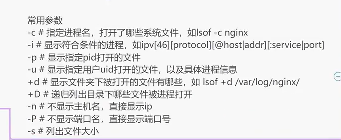


开启一个nginx，不小心把访问日志删掉了，只要进程没结束就可以恢复

1. ps -ef | grep nginx 找到主进程id
2. 然后ls  -l  /proc/主进程id/fd/*
3. cat   /proc/主进程id/fd/*  >  重新生成

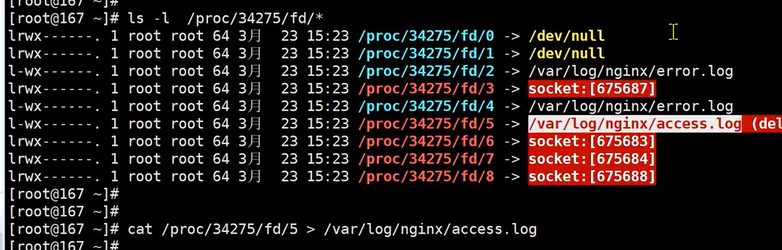


**进程杀死**

* kill
  * kill -15 默认就是这个
  * kill -9 强制终止，有一定危险
  * kill -1 重载信号，修改了配置文件后，重载进程

pkill 和 killall 不建议用

***

##### linux进程

程序就是配置文件，二进制文件，数据三合一

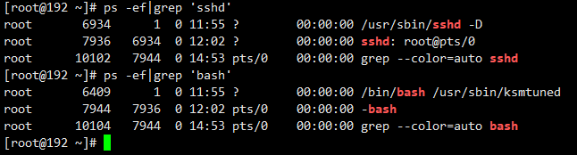

流程：1号进程 > sshd服务 > ssh连接这个服务 > /bin/bash > 最后敲的所有命令

***

##### 孤儿进程

1. 当父亲进程挂了，导致儿子进程变成了孤儿，甚至是一个或者多个孤儿进程
2. 孤儿进程会被系统的1号进程收养，并且由1号进程来回收，处理这些孤儿进程
3. 孤儿进程就像是失去了原本父亲的进程，1号进程就好比是孤儿院，专门处理孤儿进程的善后工作，因此孤儿进程不会对系统产生什么危害
4. 孤儿进程释放后，双方执行的相关文件，数据，以及进程id号（系统id号是有固定数量的）

***

##### 僵尸进程

儿子进程挂掉了，但是父进程不知道，无法释放资源，有一定危害

通俗理解，办了手机号，有天不用这个手机号了，但是没有去注销掉这个号码，就导致这个号码被占用，浪费了资源。

***

##### 补充 进程后台运行

* 前台运行
  * 程序如果运行在当前终端，会占用终端无法使用
  * 如果终端异常关闭，会导致程序自动退出
* 后台运行
  * 不会占用终端，程序系统后台跑着，该干嘛干嘛，终端关了，程序也继续运行

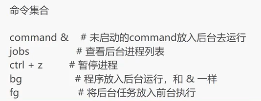

& 只是帮助进场在当前ssh会话中在后台运行，如果ssh会话断开，进程依然丢失

**nohup**

nohup	要执行的命令	&

***

##### linux数据流和重定向

* stdin
  * 标准输入，代码为0
* stdout
  * 标准输出，代码为1
* stderr
  * 标准错误输出，代码为2

***

###### 标准输入重定向

可以把指令（可执行程序）的标准输入重定向到指定文件，即输入可以不来自终端，来自于文件

```shell
cat < /etc/passwd
```

###### 标准输出重定向

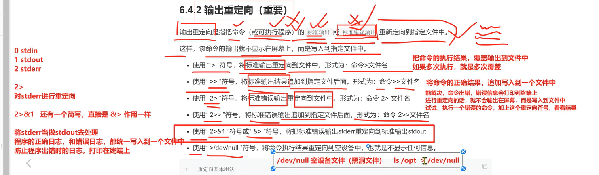

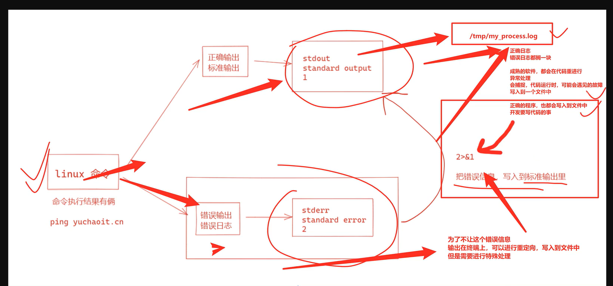


****

#### 内存资源管理

```shell
# free 查看内存使用情况
free -m
free -h
```

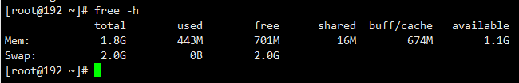


##### buffer和cache

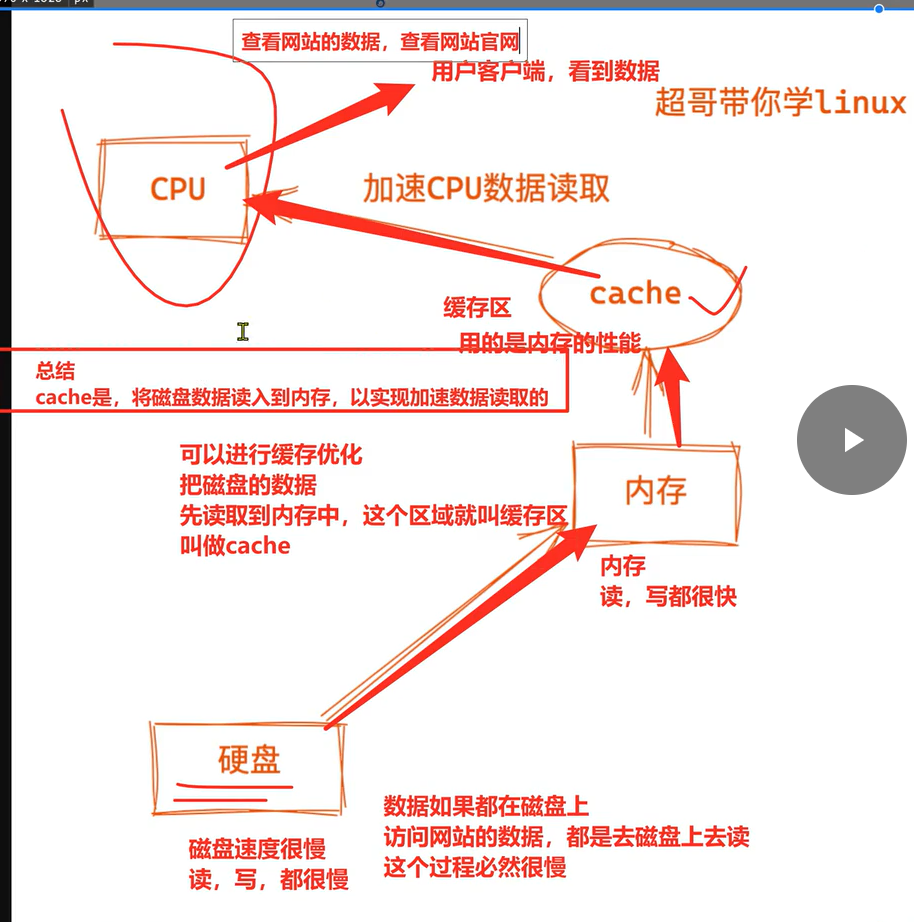


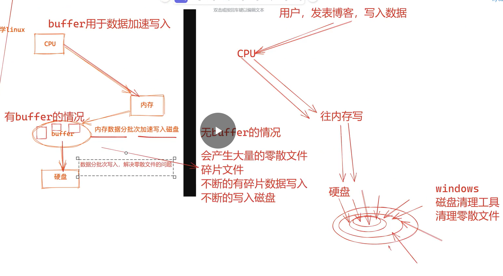


***

#### CPU压力负载

负载压力

```shell
uptime 命令查看cpu压力

# 查看当前机器cpu
lscpu
# 查看当前cpu是几核的
lscpu | grep -i '^cpu(s)'

# cpu信息文件 
/proc/cpuinfo

# 压力测试工具
yum install stress -y

stress --cpu 1 --timeout 600
```

1. stress 命令去进行压力测试
2. top去试试查看资源动态
3. 也可用uptime看状态快照

***

#### 磁盘资源管理

```shell
# df 查看磁盘空间
df -h

# iotop
yum install iotop -y

iotop -k
```

***

#### 网络资源管理

##### 端口

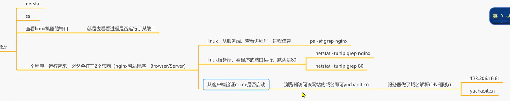

* ip地址，对应了tcp/ip协议的ip地址号
* 端口号，对应了应用层的 如80（伴随着http协议的服务，如nginx这样的网站服务）端口

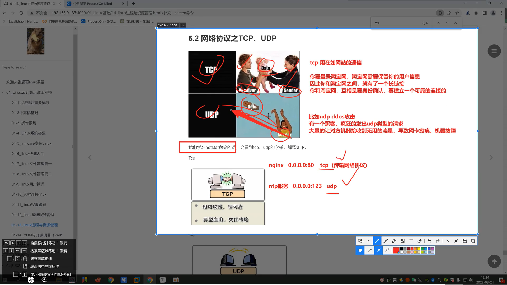

***


**netstat**

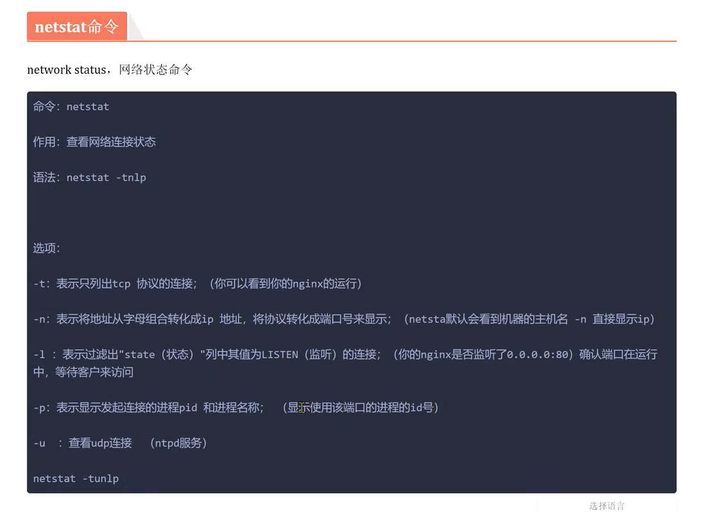

***


**ss**

命令与netstat一摸一样

ss -tunlp

备注：在高并发场景下，也就是机器的链接数特别多的时候，ss性能更优

***


**iftop**

 yum install iftop -y

和iotop差不多

***


### 软件包管理


```shell
# golang
yum install golang -y

vim hello.go

package main

import "fmt"

func main(){
	fmt.Printlb("我爱你亲爱的姑娘")
}


# 直接运行，需要存在golang编译器，不生成文件
go run hello.go 

# 编译后生一个二进制文件，无需golang编译器环境可直接运行
go build hello.go 


#python
yum install python3 python3-devel -y

python3 hello.py

```


***

#### rpm包安装管理命令

rpm 安装需要解决依赖问题

##### 下载流程

**查找**

```shell
# 在线下载rpm包，例如nginx

https://nginx.org/packages/

https://nginx.org/packages/centos/7/x86_64/RPMS/nginx-1.10.0-1.el7.ngx.x86_64.rpm

```

**下载安装**

```shell
# 下载
wget https://nginx.org/packages/centos/7/x86_64/RPMS/nginx-1.10.0-1.el7.ngx.x86_64.rpm
# 安装
rpm -ivh nginx-1.10.0-1.el7.ngx.x86_64.rpm 
```

***

##### 光盘下载流程

lsblk

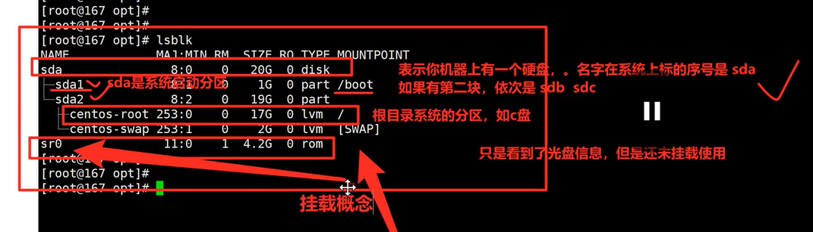


1. 光盘插入服务器光驱
2. 在系统中找到光盘信息
3. 挂载操作，读取到光盘内容

```shell
mount /dev/sr0 /mnt

umount /mnt
```

**光盘安装vim**

```shell
yum remove vim -y 

ls /挂载目录

rpm -ivh 软件包  全部安装
要解决依赖关系

```

***

##### rpm命令

**查询**

```shell
rpm -qa  查询机器上安装的所有软件
rpm -qi  q查询，i显示详细信息query，install

rpm -qa nginx
rpm -qi nginx
```

**卸载**

```shell
rpm -e nginx  不建议用，建议用yum remove nginx
```

**升级**

```shell
rpm -Uvh 
```

**查询文件**

```shell
rpm -qf 文件名 ———— 根据文件名查询属于那个软件包
rpm -ql 软件包名 ———— 列出该软件包都生成了什么文件
```

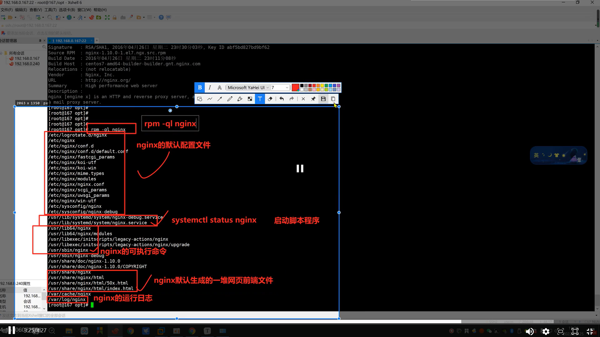

***

#### 源码包安装管理命令

**创建**

```shell
# 一、源代码安装nginx，编译安装淘宝nginx

wget https://tengine.taobao.org/download/tengine-3.1.0.tar.gz

# 二、解准备编译环境
如果编译安装go语言的代码
yum install golang -y


# 三、解压缩，进行编译安装

tar -zxvf tengine-3.1.0.tar.gz

cd tengine-3.1.0/
ls

# 四、开始编译，且安装，注意编译参数的配置

给nginx添加支持https证书的功能，需进行如下操作，nginx默认不支持https证书功能
只能在编译的时候添加这个功能

# 1. 需要linux系统支持https的模块，就是安装openssl模块

yum -y install openssl openssl-devel pcre-devel zlib zlib-devel

# 2. 执行编译参数，让nginx的安装可以拓展更多功能
./configure --prefix=/opt/my_nginx/ --with-http_ssl_module

# 3. 开始编译安装执行如下命令完事
make && make install  
当你make命令执行成功后，自动执行make install
只有make install执行成功后，才会生成你指定的路径/opt/my_nginx/

# 4. 检查你安装的nginx是否生成，
cd /opt/my_nginx

# 5. 可以用该目录下的二进制nginx命令去启动淘宝nginx
/opt/my_nginx/sbin/nginx
查看 nginx是否启动成功
netstat -tunlp|grep 80

启动命令做好优化，添加到PATH变量中，永久生效
vim /etc/profile
PATH=/opt/my_nginx/sbin/:$PATH


# 5. 可以用浏览器发出http请求，访问你的nginx网站
iptables -F
还有个命令
curl -I ip地址
curl -I 192.168.142.130


```

**查询**

ls /opt/my_nginx

**升级**

删除旧的，冲洗编译新的

**删除**

编译的软件，删除动作就是直接干掉这个目录即可

清楚PATH变量信息

***

#### yum自动化软件管理命令

**创建**

```shell
# 使用yum工具，配置yum源，阿里巴巴镜像站

# 一、备份默认yum仓库配置文件
cd /etc/yum.repos.d/
mkdir bak_repo
mv *.repo bak_repo

# 二、配置
wget -O /etc/yum.repos.d/CentOS-Base.repo https://mirrors.aliyun.com/repo/Centos-7.repo

wget -O /etc/yum.repos.d/epel.repo https://mirrors.aliyun.com/repo/epel-7.repo

```

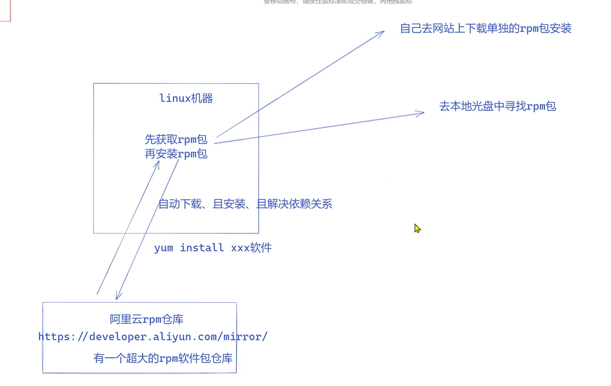


```shell
yum clean all
yum makecache

yum install 软件包
yum remove 软件包
```

通过yum安装的程序，可以通过systemctl去管理操作

***

#### 安装注意事项

* rpm手动安装
  * 手动解决所有依赖，难用
    * rpm -ql nginx
    * rpm-e nginx
    * 手动rm删除软件日志和配置文件即可
* yum自动安装
  * yum就是去管理rpm包的
  * 自动解决依赖关系
* 源码编译安装
  * 软件都撞到了一个目录下，管理该目录即可，无法用yum管理
* 注意他们的安装路径，以管理脚本是否有冲突

***

### yum工具精讲

**概念**


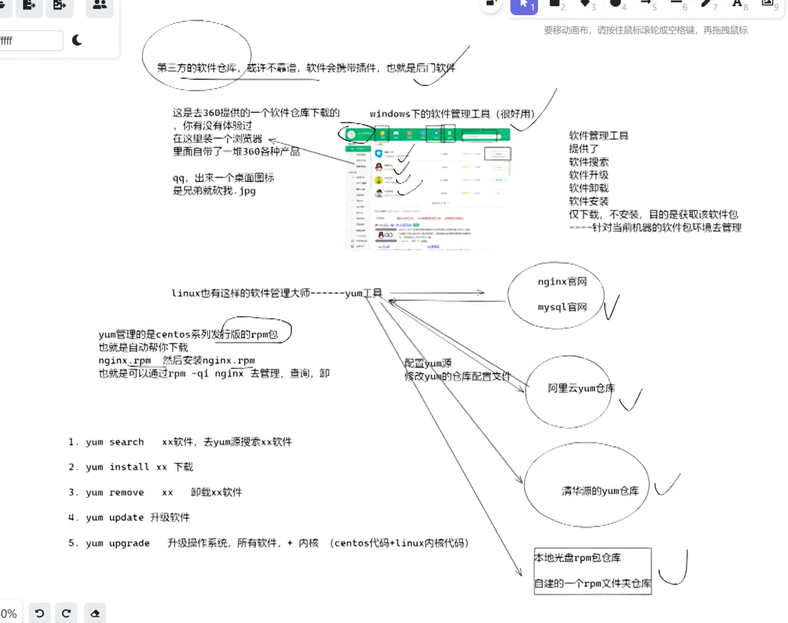

***

#### yum实践操作

##### yum仓库目录语法

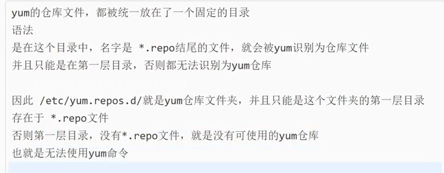


/etc/yum.repos.d


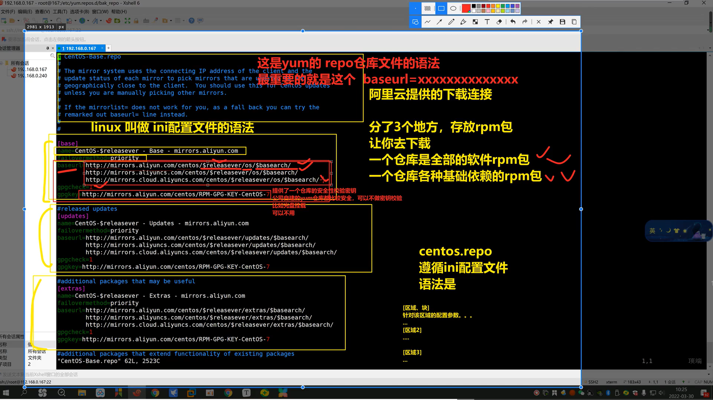


***

##### **创建yum仓库（本地镜像）**

```shell
# 挂载镜像
lsblk


mkdir  /mnt/my_centos
mount /dev/sr0 /mnt/my_centos/

# 创建仓库
此时光盘数据在本地目录/mnt/my_centos/
如果rpm包是通过互联网获取，语法是http://aliyun.com/xxxx
如果rpm是系统中找，语法是file://路径

vim /etc/yum.repos.d/my_cdrom.repo

[base]
name=linux-learn
baseurl=file:///mnt/my_centos/
enabled=1
gpgcheck=0

此时有了yum仓库

别用rpm -e 只是删除了软件，没有删除依赖
用yum remove nginx -y
yum clean all
rm -rf /var/cache/yum/
yum makecache

# 查兰当前yum仓库，都有哪些rpm包
yum list

yum安装火狐浏览器
yum list | grep -i firefox

```


yum支持这两种用法

1. 只下载不安装
2. 下载，安装，并且保留rpm包，方便下次离线安装

man yum

然后/download,然后按n下一个

***

##### 自建yum仓库（本地目录rpm包）

```shell
1. 创建一个软件目录
mkdir /tmp/software

2.准备软件所有rpm包，以及所有依赖包
yum install --downloadonly --downloaddir=/tmp/software vim

3.使用命令，让该目录成为可识别的yum仓库
yum install createrepo -y

4.使用该命令，创建本地仓库
createrepo /tmp/software

5.此时创建repo文件，指向这个目录即可，就是一个本地仓库目录
得先移除其他的repo文件，让yum别识别到
rename repo xxxx *.repo

cat >> /etc/yum.repos.d/my_dir.repo <<EOF
[base]
name=linux-learn
baseurl=file:///tmp/software/
enabled=1
gpgcheck=0
EOF

有vim用vim

6.此时yum本地仓库就好使了
```

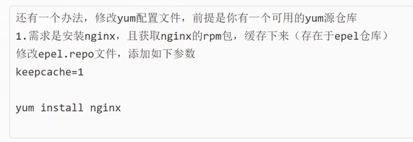

**修改yum优先级**

只需要在对应的repo仓库文件中，针对仓库的区域设置，添加一个参数即可

priority=1


**自建yum仓库（更新）**离线安装

1. 下载所有rpm包，存放在一个目录下

cd /opt/

mkdir base_rpm

2. 使用createrepo命令，将这个目录改造为yum可识别的一个仓库目录，他会生成repodata文件

createrepo  /opt/base_rpm

3. 创建本地yum仓库文件，去找这些yum包，找本地yum仓库文件夹

在/etc/yum.repos.d/下创建

cat local_dir.repo


name=aaa

baseurl=file:///opt/base_rpm

enable=1

gpgcheck=0


4. 清空yum缓存

内存缓存

yum clean all

持久化存储的缓存，已经写入磁盘了

rm -rf /var/cache/yum

***


### 编译LAMP

#### 编译环境准备

```shell
1. 准备一个干净的机器，可以初始化vm
wget -O /etc/yum.repos.d/epel.repo https://mirrors.aliyun.com/repo/epel-7.repo

wget -O /etc/yum.repos.d/epel.repo https://mirrors.aliyun.com/repo/epel-7.repo

yum clean all

rm -rf /var/cache/yum

看selinux关闭，还要关firewalld
getenforce
grep -i 'selinux' /etc/selinux/config

SELINUX=disabled

systemctl stop firewalld
systemctl disable firewalld

基础软件包

yum install gcc patch libffi-devel python-devel zlib-devel bzip2-devel openssl-devel ncurses-devel sqlite-devel readline-devel tk-devel gdbm-devel db4-devel libpcap-devel xz-devel net-tools vim -y

yum install cmake make pcre-devel ncurses-devel openssl-devel libcurl-devel -y

yum install libxml2-devel  libjpeg-devel libpng-devel freetype-devel  libcurl-devel wget -y

```

***

#### 开始编译mysql安装

```shell
1. 安装要求
安装需求

软件版本	安装目录	数据目录	端口
mysql-5.6.31	/usr/local/mysql	/usr/local/mysql/data	3306


3.创建一个指定源码路径，并下载软件
cd /usr/local ; mkdir software-mysql;cd software-mysql
wget -c https://repo.huaweicloud.com/mysql/Downloads/MySQL-5.6/mysql-5.6.50.tar.gz

解压缩
tar -zxvf mysql-5.6.50.tar.gz 

4.进行编译配置，安装定制化操作
cat cmake.sh 
cmake . \
-DCMAKE_INSTALL_PREFIX=/usr/local/mysql/ \
-DMYSQL_DATADIR=/usr/local/mysql/data \
-DENABLED_LOCAL_INFILE=1 \
-DWITH_INNOBASE_STORAGE_ENGINE=1 \
-DMYSQL_TCP_PORT=3306 \
-DDEFAULT_CHARSET=utf8mb4 \
-DDEFAULT_COLLATION=utf8mb4_general_ci \
-DWITH_EXTRA_CHARSETS=all \
-DMYSQL_USER=mysql


执行脚本
./cmake.sh

5.执行编译且安装
make && make install

6.配置mysql的PATH环境变量


```


***

### 磁盘管理

***

#### **实战目标**

* 使用fdisk命令管理磁盘分区
* 格式化分区文件系统
* 磁盘分区挂载（手动，开机启动，自动挂载）
* 理解lvm原理
  * 物理卷，卷组，逻辑卷
  * 创建物理卷
  * 创建卷组
  * 创建逻辑卷
* 熟练掌握lvm命令

***

1. 硬盘分区

fdisk  /dev/sdb

然后按照步骤分区

lsblk

可以查看

2. 格式化文件系统

可以用 mkfs  +  tab 查看类型

mkfs.xfs   -f   /dev/sdb1

检查文件系统

lsblk  -f

3. 挂在一个目录到这个分区，即可使用这个分区了

mkdir   /opt/my_sdb

mount   /dev/sdb1  /opt/my_sdb

查看挂载情况

mount -l | grep sdb1

4. 设置永久挂载

vim /etc/fstab

照上边添加就行

***

**分区类型转换**

mbr >>>>>>>>gpt

parted  /dev/sdb1

mktable gpt

mklabel  gpt


gpt>>>>>>>>>>mbr

parted  /dev/sdb1

mktable msdos

mklabel  msdos


man parted 用法查看

fdisk -l  /dev/sdb1

***

#### 磁盘后期管理命令

**df**  查看磁盘挂载情况，以及分区使用率

**lsblk**

​		列出所有的硬盘以及分区

**fdisk**

​		给硬盘添加，修改，删除分区的

**blkid**

xfs_info  查看xfs文件系统的信息

​		xfs_info  /dev/srb1  查看这个sdb1分区分配了多少个block，以及inode数量

**xfs_growfs**

​		学了lvm技术后，动态调整分区容量

​				/dev/sdb1   当前是20G + 10G = 30G，不影响当前磁盘的运行

​				你想调整分区的容量，必须告诉文件系统也跟着调整，才能用

​	xfs文件系统扩容后，动态增加其文件系统的容量


***

partx  查看磁盘分区信息，磁盘是必须有分区才可用

partx  /dev/sdb1

使用这个命令也可更新系统分区表的变化

partprobe

***


#### inode，block，硬链接

***

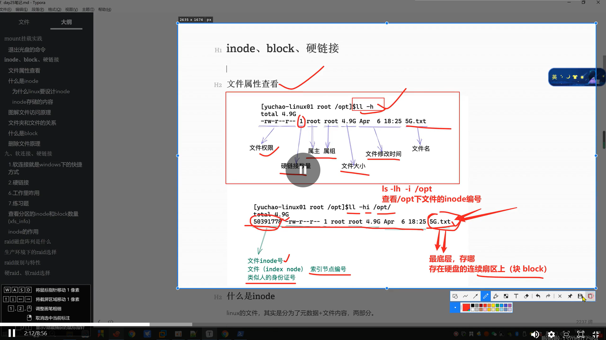


元数据，也就是文件的属性信息，可以通过stat命令查看到

一个新的磁盘，格式化文件系统后，就有了2个存储空间，一个叫做
inode存储空间，存储设备上，所有文件名，对应的元数据信息（文件的属性信息）
一个叫做block存储空间（存储设备上，所有的文件的内容，数据都在这）

存储元数据信息的空间，被称之为Inode

存储文件数据的空间，被称之为block

linux读取文件内容，其实是 以  文件名 > inode编号 > block 的顺序来读取

***

#### 软连接

软连接就是window下的快捷方式

软连接文件存储的是源文件的

```shell
创建软连接 ln -s参数去创建软连接
↓
当你访问软连接文件，其实是
↓
访问到源文件的路径，源文件的文件名
↓
访问源文件的inode编号  ls -i filename
↓
inode找到block，访问到数据

```

```shell
软连接特点
1.软连接文件的inode号和源文件不同，作用是存储源文件的路径
2.命令ln -s创建
3.删除普通软连接，不影响源文件
4.删除源文件，软连接找不到目标，报错提示。
```

#### 硬链接

硬链接，就是一个数据（block）被多个`相同inode号`的文件指向。

就好比超市有好多个大门，但是都能进入到这个超市。。。

**注意，大坑，硬链接，不得跨分区设置（inode号，是基于分区来创建）**

```shell
[root@192 test1]# ln /test1/冲冲冲 /tmp/冲1
[root@192 test1]# ln /test1/冲冲冲 /tmp/冲2
[root@192 test1]# ln /test1/冲冲冲 /tmp/冲3
[root@192 test1]# ll -i /test1/
total 4
74556 -rw-r--r--. 4 root root 32 Mar 26 21:17 冲冲冲
[root@192 test1]# ls /test1/
冲冲冲
[root@192 test1]# ls -i /test1/冲冲冲 
74556 /test1/冲冲冲
[root@192 test1]# ls -i /tmp/冲1
74556 /tmp/冲1
[root@192 test1]# ls -i /tmp/冲2
74556 /tmp/冲2
[root@192 test1]# ls -i /tmp/冲3
74556 /tmp/冲3
```

```she
硬链接特点
1.可以对已存在的文件做硬链接，该文件的硬链接数，至少是1，为0就表示文件不存在
2.硬链接的文件，inode相同，属性一致
3.只能在同一个磁盘分区下，同一个文件系统下创建硬链接
4.不能对文件夹创建硬链接，只有文件可以
5.删除一个硬链接，不影响其他相同inode号的文件
6.文件夹的硬链接，默认是2个，以及是2+（第一层子目录总数）=文件夹的硬链接数量
7.可以用任意一个硬链接作为入口，操作文件（修改的其实是block中的数据）
8.当文件的硬链接数为0时，文件真的被删除
```

***

**查看分区的inode和block数量(xfs_info)**

inode和block的数量，是在你mkfs创建文件系统的时候，就已经确定好了

ext4的文件系统，查看文件系统信息的命令，dumpe2fs

xfs文件系统,查看文件系统信息的命令,xfs_info

**inode的作用**

```shell
df -h
查看磁盘block空间的使用情况，如果看到分区快满了，可以去删除大容量的文件


df -i 
inode存储文件属性的
当你机器上有大量的无用的小文件，空文件，白白消耗inode数量

查看磁盘分区inode空间的使用情况，如果可用的不多的，删除大量的4kb小文件即可，因为它们真用了太多的无效inode编号，应该留给别人用。

明明 df -h看到磁盘还是有空间，但是写入数据，系统提示你
no space for disk，你虽然还有block空间可以存数据
但是你的inode数量肯定是没了

touch 创建新文件，想分配inode编号，发现不够用了
```

***


### lvm逻辑卷

***

#### **为什么学lvm**

```shell
250GB

虚拟机


试想，企业里的生产服务器，一开始没有规划好磁盘容量，随着用户增长，磁盘可能会逐渐填满
这时候你只能添加新硬盘，新分区
但是旧的数据还在旧的磁盘分区上，你就只能停止业务进行数据迁移了。

lvm也是吧多个磁盘，化成一个大硬盘，但是特点是，后期可以继续加入新硬盘，这个逻辑卷组的容量就扩大了，等于这个大硬盘容量更大
使用这个逻辑卷组（500G+100G=600G）（大硬盘500G）
↓
获取部分的容量，化为一个逻辑卷（分区）
↓
逻辑卷进行格式化（分区进行格式化）
↓
挂载使用


但是如果你用了lvm，你可以将多个物理分区、抽象为一个逻辑卷组，并且这个逻辑卷组是可以动态扩容、缩容的。
当逻辑卷组容量不够了，只需要买新硬盘，通过命令再添加到这个指定的逻辑卷组中，可以在不停机的情况下，立即实现扩容，且被linux识别，那可是太巴适了。
```

#### **lvm重点**

```she
普通磁盘
↓
格式化文件系统、block=4KB ，有N个block
↓
挂载分区使用


lvm磁盘
↓
磁盘、格式化为PV（磁盘的容量被分为N个PE） ，PE默认单位是4MB，等于1024个block
↓
PV加入卷组VG（动态伸缩的大磁盘）
↓
创建逻辑卷LV（等于创建了分区）
↓
格式化文件系统xfs （sdb sdc sdd），逻辑卷
↓
挂载使用

```


#### lvm工作流程

1. 物理磁盘
2. 命令创建pv
3. 创建卷组vg
4. 创建逻辑卷lv
5. 格式化lv文件系统
6. 挂载使用

1. 物理分区阶段：将物理磁盘`fdisk`格式化修改System ID为LVM标记（8e）
2. PV阶段：通过`pvcreate`、`pvdisplay`将Linux分区处理为物理卷PV
3. VG阶段：接下来通过`vgcreate`、`vgdisplay`将创建好的物理卷PV处理为卷组VG
4. LV阶段：通过`lvcreate`将卷组分成若干个逻辑卷LV
5. 开始使用：通过`mkfs`对LV格式化，最后挂载LV使用


**创建lvm**

```shell
1.先pv动作，生成物理卷
pvcreate /dev/sdb /dev/sdc
2.生成vg，名为vg01
vgcreate vg01 /dev/sdb /dev/sdc
查看命令
vgs
vgscan
vgdisplay
删除命令
vgremove vg01
3.创建lv，容量为vg01的一半
lvcreate -n lv01 -l 50%VG vg01
删除lv
lvremove /dev/vg01/lv01
指定逻辑卷大小创建lv
lvcreate -n lv02 -L 20G vg01

```

**清空环境**

```shell
1.清除lv
lvremove /dev/vg01/lv02
2.清除vg
vgremove vg01
3.清除pv
pvremove /dev/sdb /dev/sdc

lvs
vgs
pvs
```

***


#### lvm创建流程

***

要求

- 使用2块硬盘，容量分别是30G，30G
- 创建卷组，名字是vg0224

- 创建3个lv，名字依次是0224-lv1,0224-lv2,0224-lv3，容量分别是10G，15G，25G
- 3个逻辑卷，挂载点分别是/test1 /test2 /test3，文件系统分别是xfs、xfs、ext4
- 要求分别查看3个逻辑卷的文件系统信息
- 要求扩容0224-lv1，扩大到30G容量

```shell
1.安装lvm
yum install lvm2 -y

2.查看pv
pvs

3.创建pv
[root@client-242 ~]# pvcreate /dev/sdb /dev/sdc


4.查看创建后的pv
[root@client-242 ~]# pvs
  PV         VG     Fmt  Attr PSize   PFree 
  /dev/sda2  centos lvm2 a--  <19.00g     0 
  /dev/sdb          lvm2 ---   40.00g 40.00g
  /dev/sdc          lvm2 ---   20.00g 20.00g


5.查看vg
[root@client-242 ~]# vgs
  VG     #PV #LV #SN Attr   VSize   VFree
  centos   1   2   0 wz--n- <19.00g    0 


6.创建vg sdb sdc创建为卷组，名字是 vg1-0224
注意语法

[root@client-242 ~]# vgcreate vg1-0224  /dev/sdb /dev/sdc
  Volume group "vg1-0224" successfully created
[root@client-242 ~]# 
[root@client-242 ~]# 


7.查看创建后的vg

[root@client-242 ~]# vgs
  VG       #PV #LV #SN Attr   VSize   VFree 
  centos     1   2   0 wz--n- <19.00g     0 
  vg1-0224   2   0   0 wz--n-  59.99g 59.99g


8.查看lv
lvs


9.创建lv（创建分区）
一个lv1  20G
lv2  15G 

[root@client-242 ~]# lvcreate -n lv1  -L 20G  vg1-0224
  Logical volume "lv1" created.
[root@client-242 ~]# 
[root@client-242 ~]# 
[root@client-242 ~]# lvcreate -n lv2  -L 10G  vg1-0224
  Logical volume "lv2" created.
[root@client-242 ~]# 
[root@client-242 ~]# 
[root@client-242 ~]# lvs
  LV   VG       Attr       LSize   Pool Origin Data%  Meta%  Move Log Cpy%Sync Convert
  root centos   -wi-ao---- <17.00g                                                    
  swap centos   -wi-ao----   2.00g                                                    
  lv1  vg1-0224 -wi-a-----  20.00g                                                    
  lv2  vg1-0224 -wi-a-----  10.00g                                                    
[root@client-242 ~]# 
[root@client-242 ~]# 
[root@client-242 ~]# ls /dev/vg1-0224/
lv1  lv2


10.查看lv
lvs


11.查看磁盘设备信息
通过如下命令，查看lvm设备的信息

[root@client-242 ~]# blkid |grep 'sd[bc]'
/dev/sdb: UUID="O5ueJC-Tbd2-qab2-kx6U-Z2dD-y4od-tjosy3" TYPE="LVM2_member" 
/dev/sdc: UUID="uygL2d-owAr-NCoC-j6Ml-dHrT-QbSh-DjABxZ" TYPE="LVM2_member" 


查看/dev/卷组/

ls /dev/vg1-0224/


12.给lv格式化文件系统
lv1  20G ---xfs
lv2  15G  ----ext4

[root@client-242 ~]# mkfs.xfs /dev/vg1-0224/lv1

[root@client-242 ~]# mkfs.ext4 /dev/vg1-0224/lv2


13.挂载lv
mount 设备名   挂载点

[root@client-242 ~]# mount /dev/vg1-0224/lv1 /t1
[root@client-242 ~]# 
[root@client-242 ~]# 
[root@client-242 ~]# 
[root@client-242 ~]# mount /dev/vg1-0224/lv2 /t2


14.查看挂载

[root@client-242 ~]# mount -l |grep t1
/dev/mapper/vg1--0224-lv1 on /t1 type xfs (rw,relatime,attr2,inode64,noquota)
[root@client-242 ~]# mount -l |grep t2
/dev/mapper/vg1--0224-lv2 on /t2 type ext4 (rw,relatime,data=ordered)

[root@client-242 ~]# df -h
Filesystem                 Size  Used Avail Use% Mounted on
/dev/mapper/centos-root     17G  1.5G   16G   9% /
devtmpfs                   899M     0  899M   0% /dev
tmpfs                      911M     0  911M   0% /dev/shm
tmpfs                      911M  9.6M  902M   2% /run
tmpfs                      911M     0  911M   0% /sys/fs/cgroup
/dev/sda1                 1014M  142M  873M  14% /boot
tmpfs                      183M     0  183M   0% /run/user/0
/dev/mapper/vg1--0224-lv1   20G   33M   20G   1% /t1
/dev/mapper/vg1--0224-lv2  9.8G   37M  9.2G   1% /t2


[root@client-242 ~]# lsblk 
NAME            MAJ:MIN RM  SIZE RO TYPE MOUNTPOINT
sda               8:0    0   20G  0 disk 
├─sda1            8:1    0    1G  0 part /boot
└─sda2            8:2    0   19G  0 part 
  ├─centos-root 253:0    0   17G  0 lvm  /
  └─centos-swap 253:1    0    2G  0 lvm  [SWAP]
sdb               8:16   0   40G  0 disk 
├─vg1--0224-lv1 253:2    0   20G  0 lvm  /t1
└─vg1--0224-lv2 253:3    0   10G  0 lvm  /t2
sdc               8:32   0   20G  0 disk 
sr0              11:0    1  4.2G  0 rom  

尝试写入数据

[root@client-242 ~]# touch /t1/今天也是美好的一天
[root@client-242 ~]# touch /t2/明天更是美好的一天
[root@client-242 ~]# 
[root@client-242 ~]# 
[root@client-242 ~]# ls /t1
今天也是美好的一天
[root@client-242 ~]# ls /t2
lost+found  明天更是美好的一天


15.开机自动挂载
一定切记，如果你的设备发生了变化，一定要去修改/etc/fstab
否则系统开机，读取该fstab文件，找不到设备，无法正确挂载就会报错
进入紧急模式，直到你再次修复fstab文件
重启即可

把t1 t2设置为开机自动挂载
[root@client-242 ~]# tail -2 /etc/fstab 
UUID="04fda700-511c-43d4-ae9a-d87d72ee7175"  /t1  xfs  defaults 0 0 
/dev/mapper/vg1--0224-lv2 /t2  ext4  defaults 0 0 


16.重启
reboot


```

***

#### lvm扩容


***


### 通配符

***

|          |                                                              |                                                              |
| -------- | ------------------------------------------------------------ | ------------------------------------------------------------ |
| **字符** | **说明**                                                     | **示例**                                                     |
| *        | 匹配任意字符数。 您可以在字符串中使用星号 (*****)。          | “**wh\***”将找到 what、white 和 why，但找不到 awhile 或 watch。 |
| ?        | 在特定位置中匹配单个字母。                                   | “**b?ll** ”可以找到 ball、bell 和 bill。                     |
| [ ]      | 匹配方括号中的字符。                                         | “**b[ae]ll**”将找到 ball 和 bell，但找不到 bill。            |
| !        | 在方括号中排除字符。                                         | “**b[!ae]ll**”将找到 bill 和 bull，但找不到 ball 或 bell。“**Like “[!a]\*”**”将找到不以字母 a 开头的所有项目。 |
| -        | 匹配一个范围内的字符。 记住以升序指定字符（A 到 Z，而不是 Z 到 A）。 | “**b[a-c]d**”将找到 bad、bbd 和 bcd。                        |
|          |                                                              |                                                              |
| ^        | 同感叹号、在方括号中排除字符                                 | `b[^ae]ll`，找不到ball,找不到bell，能找到bcll                |
|          |                                                              |                                                              |


### 正则表达式

***


### Sed

***

#### **Sed 语法**

```shell
sed [选项] [sed内置命令字符] [输入文件]

说明:
1.注意 sed 软件及后面选项,sed 命令和输入文件,每个元素之间都至少有一个空格

2.为了避免混淆,文本称呼sed为sed软件.sed-commands(sed命令)是sed软件内置的一些命令选项,为了和前面的 options(选项)区分,故称为sed命令.

3.sed-commands 既可以是单个sed 命令,也可以是多个sed命令组合.

4.input-file(输入文件)是可选项,sed 还能够从标准输入或管道获取输入


语法
sed替换字符数据
s替换指令
#替换前的数据(正则)#替换后的数据#

sed   's#替换前的数据#替换后的数据#'   file.txt
```

#### Sed 参数

```shell
sed默认修改的是模式空间内的数据
（简单大白话，sed读取了一行文本数据，放入到内存里进行修改，修改的结果默认不会写入到文件中，只是在内存里修改，且打印让你看到修改的结果）
吧修改的结果写入到文件


就得借助参数的功能
-i 把sed处理的结果，写入到文件，且不在终端打印了
sed -i  's#替换前的数据#替换后的数据#'   file.txt


options[选项]
解释说明
-n    取消默认的 sed 软件的输出,常与 sed 命令的 p 连用
-e    一行命令语句可以执行多条 sed 命令
-f    选项后面可以接 sed 脚本的文件名
-r    使用正则拓展表达式,默认情况 sed 只识别基本正则表达式
-i    直接修改文件内容,而不是输出终端,如果不使用-i 选项 sed 软件只是修改在 内存中的数据,并不影响磁盘上的文件
```

#### Sed 命令

```shell
sed软件

sed提供了很多功能的指令
在某一行插入数据
替换字符数据

sed-commands[sed 命令]
解释说明
a 追加,在指定行后添加一行或多行文本
c 取代指定的行
d 删除指定的行
D 删除模式空间的部分内容,直到遇到换行符\n 结束操作,与多行模式相关
i 插入,在指定的行前添加一行或多行文本
h 把模式空间的内容复制到保持空间
H 把模式空间的内容追加到保持空间
g 把保持空间的内容复制到模式空间
G 把保持空间的内容追加到模式空间
x 交换模式空间和保持空间的内容
l 打印不可见的字符
n 清空模式空间,并读取下一行数据并追加到模式空间
N 不清空模式空间,并读取下一行数据并追加到模式空间
p 打印模式空间的内容,通常 p 会与选项-n 一起使用
P(大写) 打印模式空间的内容,直到遇到换行符\你结束操作
q 退出 sed
r 从指定文件读取数据
s 取代,s#old#new#g==>这里 g 是 s 命令的替代标志,注意和 g 命令区分
w 另存,把模式空间的内容保存到文件中
y 根据对应位置转换字符
:label  定义一个标签
t 如果前面的命令执行成功,那么就跳转到 t 指定的标签处,继续往下执行后 续命令,否则,仍然继续正常的执行流程
```

#### Sed 工作流程

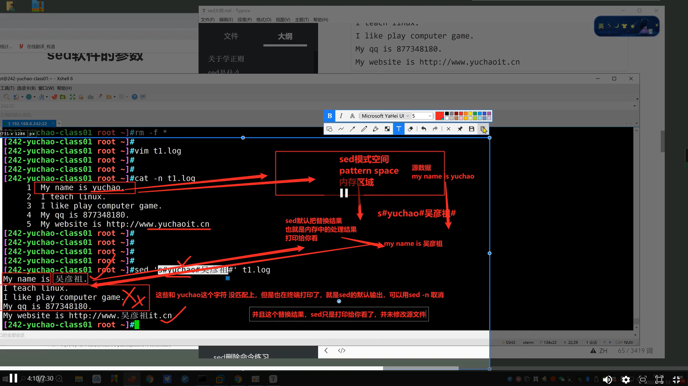


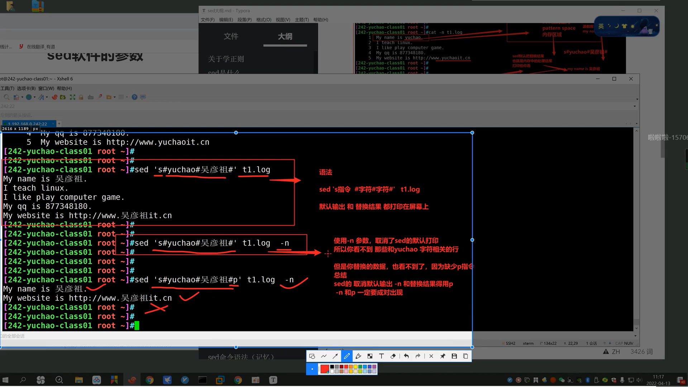


#### Sed 增删改查

##### 

##### Sed增加一行

语法

```shell
sed '行号 sed指令   你想添加的字符数据' 源文件
```

sed增加数据的命令

```shell
a 追加,在指定行后添加一行或多行文本

i 插入,在指定的行前添加一行或多行文本
```

实践

```shell
# 在文件第二行后，插入数据，"今天又是美好的一天"

sed '2a "今天又是美好的一天"' t1.log 

My name is yuchao.
I teach linux.
"今天又是美好的一天"
I like play computer game.
My qq is 877348180.
My website is http://www.yuchaoit.cn

# 第二行前加入 今天天气很好

sed '2i  今天天气很好' t1.log 

```


##### sed多行增加

**cat实现多行文本增加**

```shell
cat >>my.log<<EOF
你好
我好
他也好
EOF
```


**echo 追加多行数据**

```shell
1.多次追加
echo "你好" >> tt.log

2.使用换行符，一次添加多行数据

echo 'hello\nworld\n你好\n我也好' > hello.log

hello
world
你好
我也好


用法如下
[242-yuchao-class01 root ~]#echo -e "hello\nworld\n你好\n我也好" > hello.log
[242-yuchao-class01 root ~]#cat hello.log 
hello
world
你好
我也好
```


**sed追加多行文本**

无论是cat、还是echo，都只能往文件末尾追加内容。

而sed是按行处理文本，可以指定要处理的行，也就是在指定行插入字符数据。

使用\n添加多行数据

```shell
给t1.log 开头，添加两行数据
加油
奥力给

[242-yuchao-class01 root ~]#sed -i '1 i 加油\n奥力给'  t1.log
[242-yuchao-class01 root ~]#
[242-yuchao-class01 root ~]#
[242-yuchao-class01 root ~]#
[242-yuchao-class01 root ~]#cat -n t1.log 
     1	加油
     2	奥力给
     3	My name is yuchao.
     4	I teach linux.
     5	I like play computer game.
     6	My qq is 877348180.
     7	My website is http://www.yuchaoit.cn

```


**修改sshd_config实战**

```
[242-yuchao-class01 root ~]## 远程连接服务 sshd 
[242-yuchao-class01 root ~]#ls /etc/ssh/sshd_config
```

例如我们在系统初始化优化时，需要修改sshd服务端设置，需要加入如下多行配置

```
Port 25515                                   # 改端口
PermitRootLogin no                   # 不允许root登录
PerminEmptyPasswords no         # 不允许空密码
UseDNS no                                    # 不做主机名解析，加速ssh连接
GSSAPIAuthentication no            # 不做主机名解析，加速ssh连接
```

修改配置之前先备份源文件 

```
源文件 /etc/ssh/sshd_config
备份，添加ori后缀

cp /etc/ssh/sshd_config{,.ori}

```

sed写入多行配置

```
sed -i '1 i Port 25515\nPermitRootLogin no\nPerminEmptyPasswords no\nUseDNS no\nGSSAPIAuthentication no'   /etc/ssh/sshd_config
```


##### sed删除字符数据

sed删除1到4行

```
sed '1,4d' t1.log
```


| sed命令语法                     | 作用                                              |
| ------------------------------- | ------------------------------------------------- |
| 3{sed-commands}                 | 操作第三行                                        |
| 3,6{sed-commands}               | 操作3~6行，包括3和6行                             |
| 3,+5{sed-commands}              | 操作3到3+5(8)行，包括3,8行                        |
| 1~2{sed-commands}               | 步长为2，操作1,3,5,7..行                          |
| 3,${sed-commands}               | 对3到末尾行操作，包括3行                          |
| /yuchao/{sed-commands}          | 对匹配字符yuchao的该行操作                        |
| /yuchao/,/chaoge/{sed-commands} | 对匹配字符yuchao到chaoge的行操作                  |
| /yuchao/,${sed-commands}        | 对匹配字符yuchao到结尾的行操作                    |
| /yuchao/,+2{sed-commands}       | '/yuchao/,+2p'，打印匹配到yuchao的行，包括其后2行 |

```shell
删除第三行数据
sed '3 d'  t1.log
删除文件的3到6行
sed '3,6 d' t1.log

删除第三行开始，向下2行
sed '3,+2 d'  t1.log

删除奇数行 1,3,5,7,9

sed '1~2 d' t1.log

删除偶数行 2,4,6,8
sed '2~2 d' t1.log

保留前三行
[242-yuchao-class01 root ~]#sed -e  '4,$  d'  t1.log 
加油
奥力给
My name is yuchao.


找到game那一行，且删掉
[242-yuchao-class01 root ~]#sed '/game/ d' t1.log
加油
奥力给
My name is yuchao.
I teach linux.
My qq is 877348180.
My website is http://www.yuchaoit.cn

删除game这一行到结尾
[242-yuchao-class01 root ~]#sed '/game/,$ d'  t1.log 
加油
奥力给
My name is yuchao.
I teach linux.

删除文件中所有包含game的行，以及它下一行
[242-yuchao-class01 root ~]#sed '/game/,+1 d' t1.log 
加油
奥力给
My name is yuchao.
I teach linux.
My website is http://www.yuchaoit.cn

```


**打印行范围练习**

sed提供打印的命令是p

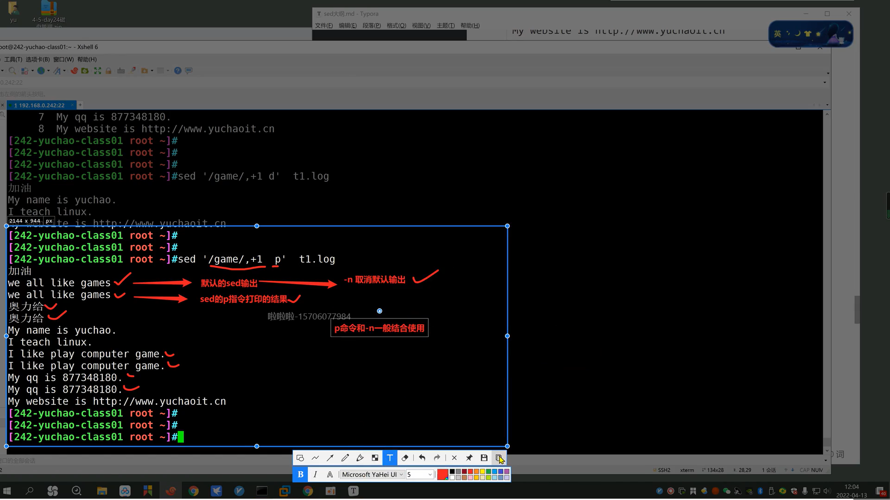

```shell
sed '/game/,+1  p'  t1.log -n
```


##### **sed修改数据**


**替换整行命令（c）**

```shell
sed '3c 元气满满的一天' t1.log
```

**替换字符（s）**

```shell
sed替换的命令解释
这个分隔符，常见有如下形式
sed 's/old_string/new_string/'
sed 's#old_string#new_string#'
sed 's@old_string@new_string@'

强烈建议用# 
sed 's#old_string#new_string#'


替换一次
sed 's/替换前字符/替换后字符/' file

全局替换，global 全局替换
sed 's/替换前字符/替换后字符/g' file

s 将每一行第一处匹配的字符替换 
s/old_string/new_string/

sed 's#i#I#'  t1.log


g 全局替换global，每一行，每一处匹配的字符都替换  
s/old_string/new_string/

sed 's#i#I#g'  t1.log

sed 's/i/I/g'  t1.log


-i 选项、参数，直接修改文件

sed默认是修改内存中的模式空间数据，不会修改源文件，使用-i会修改源文件，修改磁盘上的文件数据。
```

##### **sed查询**

sed的修改，删除最重要的学完了

接下来看看sed的查询，也是比较实用的，比起cat、more要方便的多。

```
sed打印命令p 打印sed正则处理后的数据

并且sed默认打印模式空间，可以用-n取消

文本，10数据  > sed 一行一行的读取，编辑 >> 打印

固定用法，只要使用到了p打印些数据，就是想输出指定数据
必然用-n取消默认打印，目的是，只看到你想p打印的那些数据
```

**打印第二行**

```
sed '2 p ' t1.log
```


**打印前三行**

```
[242-yuchao-class01 root ~]#sed '1,3p' t1.log -n
My name is yuchao. you can call me yuchao.
I teach linux.
I like play computer game.

```

**只显示qq号那一行**

```
[242-yuchao-class01 root ~]#sed -r '/[0-9]{9}/p' t1.log -n
My qq is 877348180. my num is 1555555555.


```

**找出http和linux的行**

```
-e 多次编辑
[242-yuchao-class01 root ~]#sed -e '/http/p'  -e '/linux/p' t1.log -n
I teach linux.
My website is http://www.yuchaoit.cn , and another website is https://www.yuchao.top/

[242-yuchao-class01 root ~]#sed '/http/p;/linux/p' -n t1.log 
I teach linux.
My website is http://www.yuchaoit.cn , and another website is https://www.yuchao.top/


```

##### sed其他命令

**w命令**

作用是将sed操作结果，写入到指定文件中

```
语法

sed '/模式/w new_file' old_file

必须，找出computer这一行，数据写入到game2.log文件中
[242-yuchao-class01 root ~]#sed '/computer/w  game2.log' t1.log  -n
[242-yuchao-class01 root ~]#
[242-yuchao-class01 root ~]#
[242-yuchao-class01 root ~]#cat game2.log 
I like play computer game.

```

替换文件中所有的yuchao为老于，新数据写入 yu.log

```
[242-yuchao-class01 root ~]#sed 's#yuchao#老于#gw yu.log' t1.log -n

```

**-e选项**

-e选项用于接上sed多个命令

sed提取ip地址

提取1,2,4行信息

```
语法
sed -e 'sed命令' -e 'sed命令'  -e 'sed命令'

sed -e '1p' -e '2p'  -e '4p' t1.log -n 

换成分号
```


**分号**

分号也用于执行多条命令，和linux基础命令一样支持这种写法。

单独提取出1,2,4行信息

```
sed '1p;2p;4p'  t1.log -n
```

```
[242-yuchao-class01 root ~]#sed -e '1p' -e '2p'  -e '4p' t1.log -n 
My name is yuchao. you can call me yuchao.
I teach linux.
My qq is 877348180. my num is 1555555555.
[242-yuchao-class01 root ~]#
[242-yuchao-class01 root ~]#
[242-yuchao-class01 root ~]#sed '1p;2p;4p'  t1.log -n
My name is yuchao. you can call me yuchao.
I teach linux.
My qq is 877348180. my num is 1555555555.

```


### Awk


**三剑客**

- grep，擅长单纯的查找或匹配文本内容
- sed，更适合编辑、处理匹配到的文本内容
- awk，更适合格式化文本内容，对文本进行复杂处理后、更友好的显示

三个命令称之为Linux的三剑客


**如何学习awk**

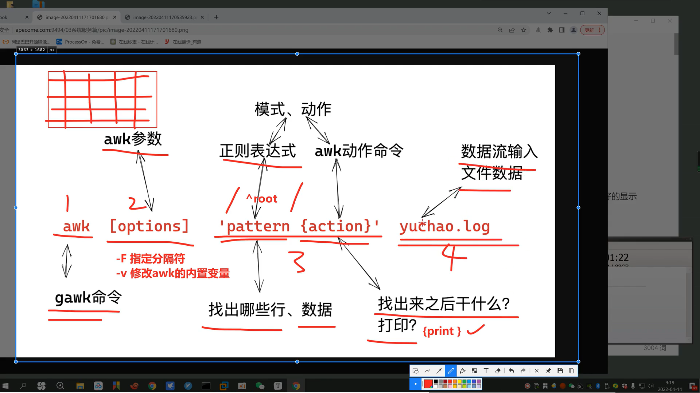


#### **awk模式、动作**

- 模式，是指，要操作哪些行
- 动作，是指，找到这些行之后，干什么，如何处理
- 

```shell
生成测试数据
[242-yuchao-class01 root ~]#echo cc{01..50} | xargs -n 5
cc01 cc02 cc03 cc04 cc05
cc06 cc07 cc08 cc09 cc10
cc11 cc12 cc13 cc14 cc15
cc16 cc17 cc18 cc19 cc20
cc21 cc22 cc23 cc24 cc25
cc26 cc27 cc28 cc29 cc30
cc31 cc32 cc33 cc34 cc35
cc36 cc37 cc38 cc39 cc40
cc41 cc42 cc43 cc44 cc45
cc46 cc47 cc48 cc49 cc50

写入文件，生成测试数据文件
echo cc{01..50} | xargs -n 5 > test_awk.log
```


##### **无模式、只有动作**

不写模式、默认处理每一行

```shell
1. 直接输出源文件，所有内容
动作是 {print $0}  这个$0是表示列的数据，默认是表示一整行数据
关于字段的取值语法
是
$0 表示所有字段数据
$1 第一列数据
$2 第二列数据
依次类推
。。。


[242-yuchao-class01 root ~]#awk '{print $0}' test_awk.log 
cc01 cc02 cc03 cc04 cc05
cc06 cc07 cc08 cc09 cc10
cc11 cc12 cc13 cc14 cc15
cc16 cc17 cc18 cc19 cc20
cc21 cc22 cc23 cc24 cc25
cc26 cc27 cc28 cc29 cc30
cc31 cc32 cc33 cc34 cc35
cc36 cc37 cc38 cc39 cc40
cc41 cc42 cc43 cc44 cc45
cc46 cc47 cc48 cc49 cc50


2.输出每一行数据，但是只要第一列的数据
awk '{print $1}' test_awk.log

3. 输出每一行数据，只要第二列的数据
awk '{print $2}' test_awk.log

4. 输出每一行数据，只要第一列和 第三列的数据
awk '{print $1,$3 }' test_awk.log

[242-yuchao-class01 root ~]#awk '{print $1,$3 }' test_awk.log
cc01 cc03
cc06 cc08
cc11 cc13
cc16 cc18
cc21 cc23
cc26 cc28
cc31 cc33
cc36 cc38
cc41 cc43
cc46 cc48

```


##### 行变量NR、匹配范围语法

- 刚才是没指定处理那一行，默认是所有行
- 可以指定对某一行处理了


```
语法说明，内置变量NR，表示awk处理的每一行
number of record   （记录，行的意思）
NR ============== 行号


#格式说明
NR      行  
直接打印这个内置变量，表示取当前行的号码
在开头显示行号
[242-yuchao-class01 root ~]#awk '{print NR,$0}' test_awk.log 
在结尾显示行号
[242-yuchao-class01 root ~]#awk '{print $0,NR}' test_awk.log 


NR==    等于行 

打印第二行的所有字段数据
awk  'NR==2{print $0}'    test_awk.log
打印第二行的，第1列，和第四列数据
awk 'NR==2{print $1,$4}' test_awk.log
cc06 cc09


NR>=    大于等于行
NR<=    小于等于
NR>=N && NR<=M   从N行到M行
|| 或的用法

这是关于awk对行处理的 语法

```


##### 列变量NF、每一列的字段

```
number of field  (字段的数量) =====NF====等于列的总数

直接写NF变量表示每一行字段的总数
查看每一行有多少个字段
awk '{print $0,NF}' test_awk.log


输出列：
#位置变量说明

直接写NF变量表示每一行字段的总数
查看每一行有多少个字段====
这个NF，默认表示，字段的总数
awk '{print $0,NF}' test_awk.log

$1,$2,$3
,         输出分隔符，默认逗号，awk输出每一列的分隔符是，空格
$0      输出所有字段
$1      输出第一列 
$2      输出第二列的数据 
$3      输出第三类的数据
... 依次类推


$NF     输出最后一列
awk '{print $NF}' test_awk.log 


$(NF-1)    输出倒数第2列 

```


##### 指定行（模式）、打印动作

```shell
awk '模式 {打印动作} '


# 提取出第二行的数据

NR 行变量

awk 'NR==2{print $0}'  test_awk.log


# 提取出第二行到第五行

awk 'NR>=2&&NR<=5{print $0}'  test_awk.log

```

##### 指定行（模式）、打印某一列（动作）

```shell
# 提取出第二行到第五行，并且只打印**前三列**的数据

awk 'NR>=2&&NR<=5{print $1,$2,$3}'  test_awk.log

```


##### 图解awk

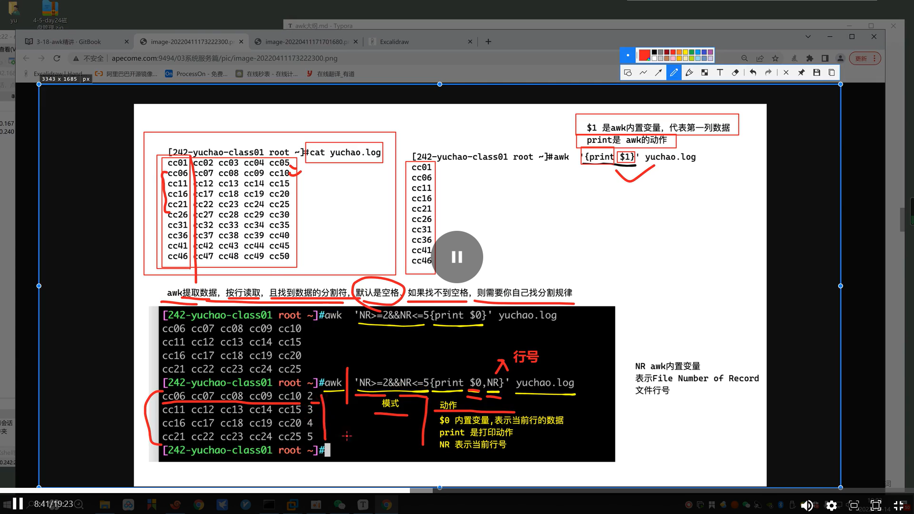


#### awk其他内置变量（翻译）

参考国外awk网址

https://www.thegeekstuff.com/2010/01/8-powerful-awk-built-in-variables-fs-ofs-rs-ors-nr-nf-filename-fnr/

```
NR=======行号
NF========字段数量

FS===========数据输入的字段分隔符，默认是    【空格】
（awk读取的这个数据，以什么分隔符去读，去分割它的数据）

RS============record separator 行分隔符，默认是【换行符】

```


```shell
awk的其他内置变量如下。

FILENAME：当前文件名

===================awk在数据输入时，的一个分隔符===================
FS：字段分隔符，默认是空格和制表符。
Input field separator variable.输入字段分隔符变量。

RS：行分隔符，用于分割每一行，默认是换行符。
Record Separator variable，行分隔符变量


===================awk处理完毕后，打印的数据格式，分隔符=================
OFS：输出字段的分隔符，用于打印时分隔字段，默认为空格。
Output Field Separator Variable，输出字段分隔符变量

ORS：输出记录的分隔符，用于打印时分隔记录，默认为换行符。
Output Record Separator Variable，输出记录分隔符变量

OFMT：数字输出的格式，默认为％.6g。

```


##### 修改RS变量

```shell
这个写法，等于awk默认的行分隔符，现在是指定看效果是 \n
awk -v RS='\n'  '{print $0}' test_awk.log 

这里是修改RS行分隔符为空格
awk看到空格就认为是新的一行数据
awk -v RS=' '  '{print $0}' test_awk.log 

```


##### 修改ORS变量

```shell
awk给这个默认打印的结果，结尾加上的是 换行符

你可以修改这个，awk的输出行分隔符，默认是   换行符

把awk输出的行分隔符，改为 @@
修改 ORS变量为@@

awk -v ORS='@@'  '{print $0}' test_awk.log 

```


#### 面试题，统计单词出现频率

- 并且统计出现最多的前5个

```
[242-yuchao-class01 root ~]#cat english.log 
I have a dog, it is lovely, it is called Mimi. Every time I go home from school, Mimi always cruising around me, I will go to the kitchen to get a piece of meat to it, it lay on the floor to eat. My legs and then jump to bark "Wang "called, so I picked up Mimi, it is the opportunity to lick my hand, making me laugh.I like Mimi, like puppies.


1.将一整行的数据，改为，每一个单词，就是一行
2.改为这样后，就可以交给sort去排序了
3.再去uniq 去重 -c 统计重复的次数


```

##### 代码思路

- 先让所有单词合并为1列，注意是一列、排成一队、然后排序，合并重复的，且统计重复次数
- 主要是对空格转换


```
这道题，核心就在于
1.单行的多个单词，替换为，每一个单词成为一行
 - 简单处理，找到空格就改为换行，修改RS，数据输入换行符，改为RS=' '
 - 复杂处理，找到非连续的大小写字母，就换行

2. 排序

3.去重

4.排序统计 最多的前五个
```


##### sed答题

```shell


sed -r 's#[^a-zA-Z]#\n#g' english.log | sort | uniq -c | sort -r -n  | head -5
```


##### **tr答题**

```shell
tr命令就是将字符替换的作用

基本语法

echo 'hello world' | tr 'll' 'LL'
heLLo worLd

思路就是
将文本中的空格，换为 \n ，就实现了每一个单词，作为新的一行

cat english.log |tr ' '  '\n' | sort | uniq -c | sort -r -n  | head -5
      6 to
      4 it
      4 I
      3 the
      3 is


```


##### grep答题

```shell

grep -E '[a-zA-Z]+' english.log -o | sort | uniq -c | sort -r -n  | head -5

```


##### awk答题

```
简单考虑，直接考虑输入的行分隔符，改为 空格
1.将一整行的数据，改为，每一个单词，就是一行
awk -v RS=' ' '{print $0}' english.log

2.改为这样后，就可以交给sort去排序了，将子母一样的，搁一块
awk -v RS=' ' '{print $0}' english.log | sort 


3.再去uniq 去重 -c 统计重复的次数
awk -v RS=' ' '{print $0}' english.log | sort  |uniq

4.并且统计出现最多的前5个
awk -v RS=' ' '{print $0}' english.log | sort  |uniq -c  | sort -r | head -5

就是用正则，提取，大小写字母


复杂考虑
[242-yuchao-class01 root ~]#awk -v RS='[^a-zA-z]+' '{print $0}' english.log | sort | uniq -c | sort -r -n  | head -5
      6 to
      5 it
      5 I
      4 Mimi
      3 the

```


### NTP时间同步


```shell
# 更改系统时间
timedatectl ste-time '2021-11-11 10:12:22'

# 查看系统时间
timedatectl

# 重启ntpd服务
systemctl restart ntpd

# 查看同步状态
systemctl restart ntpd

# 不知道
ntpq -p

下载
↓
改配置文件
↓
启动


nptd服务的配置文件
/etc/ntp.conf


ntpd的服务脚本文件
/usr/lib/systemd/system/ntpd.service


```


### 配置文件

查找一个服务的配置文件

rpm -ql ntp|grep conf


查找一个服务的准确名字，在下边路径

/usr/lib/systemd/system

ls /usr/lib/systemd/system | grep "ntp"


systemctl管理服务脚本目录

/usr/lib/systemd/system/


网卡配置文件

/etc/sysconfig/network-scripts/

静态ip

BOOTPROTO=static
IPADDR="10.96.0.77"
NETMASK="255.255.255.0"
GATEWAY="10.96.0.2"
DNS1="114.114.114.114"
DNS2="115.115.115.115"
